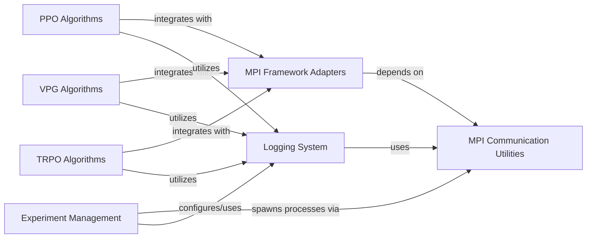

## Component Details

This system provides a comprehensive framework for distributed reinforcement learning experiments. It encompasses core MPI communication utilities, framework-specific adapters for PyTorch and TensorFlow to leverage MPI, a robust logging system for experiment data, and components implementing various reinforcement learning algorithms (PPO, VPG, TRPO). The experiment management component orchestrates the setup and execution of these distributed experiments, ensuring proper logging and MPI integration.

### MPI Communication Utilities
Provides fundamental MPI (Message Passing Interface) functionalities for inter-process communication, including process ID retrieval, process counting, broadcasting, and various reduction operations like sum, average, and statistical calculations across processes. It also includes `mpi_fork` for re-launching scripts with MPI workers.

**Related Classes/Methods**:

- <a href="https://github.com/openai/spinningup/blob/master/spinup/utils/mpi_tools.py#L42-L44" target="_blank" rel="noopener noreferrer">`spinup.utils.mpi_tools.proc_id` (42:44)</a>
- <a href="https://github.com/openai/spinningup/blob/master/spinup/utils/mpi_tools.py#L49-L51" target="_blank" rel="noopener noreferrer">`spinup.utils.mpi_tools.num_procs` (49:51)</a>
- <a href="https://github.com/openai/spinningup/blob/master/spinup/utils/mpi_tools.py#L53-L54" target="_blank" rel="noopener noreferrer">`spinup.utils.mpi_tools.broadcast` (53:54)</a>
- <a href="https://github.com/openai/spinningup/blob/master/spinup/utils/mpi_tools.py#L56-L61" target="_blank" rel="noopener noreferrer">`spinup.utils.mpi_tools.mpi_op` (56:61)</a>
- <a href="https://github.com/openai/spinningup/blob/master/spinup/utils/mpi_tools.py#L63-L64" target="_blank" rel="noopener noreferrer">`spinup.utils.mpi_tools.mpi_sum` (63:64)</a>
- <a href="https://github.com/openai/spinningup/blob/master/spinup/utils/mpi_tools.py#L66-L68" target="_blank" rel="noopener noreferrer">`spinup.utils.mpi_tools.mpi_avg` (66:68)</a>
- <a href="https://github.com/openai/spinningup/blob/master/spinup/utils/mpi_tools.py#L70-L92" target="_blank" rel="noopener noreferrer">`spinup.utils.mpi_tools.mpi_statistics_scalar` (70:92)</a>
- <a href="https://github.com/openai/spinningup/blob/master/spinup/utils/mpi_tools.py#L6-L36" target="_blank" rel="noopener noreferrer">`spinup.utils.mpi_tools.mpi_fork` (6:36)</a>
- <a href="https://github.com/openai/spinningup/blob/master/spinup/utils/mpi_tools.py#L46-L47" target="_blank" rel="noopener noreferrer">`spinup.utils.mpi_tools.allreduce` (46:47)</a>

### MPI Framework Adapters
Offers utilities for integrating MPI with specific deep learning frameworks like PyTorch and TensorFlow. This includes functions for setting up MPI for PyTorch, synchronizing parameters, averaging gradients across processes, and a specialized TensorFlow Adam optimizer for distributed training.

**Related Classes/Methods**:

- <a href="https://github.com/openai/spinningup/blob/master/spinup/utils/mpi_pytorch.py#L8-L17" target="_blank" rel="noopener noreferrer">`spinup.utils.mpi_pytorch.setup_pytorch_for_mpi` (8:17)</a>
- <a href="https://github.com/openai/spinningup/blob/master/spinup/utils/mpi_pytorch.py#L20-L27" target="_blank" rel="noopener noreferrer">`spinup.utils.mpi_pytorch.mpi_avg_grads` (20:27)</a>
- <a href="https://github.com/openai/spinningup/blob/master/spinup/utils/mpi_pytorch.py#L29-L35" target="_blank" rel="noopener noreferrer">`spinup.utils.mpi_pytorch.sync_params` (29:35)</a>
- <a href="https://github.com/openai/spinningup/blob/master/spinup/utils/mpi_tf.py#L16-L22" target="_blank" rel="noopener noreferrer">`spinup.utils.mpi_tf.sync_params` (16:22)</a>
- <a href="https://github.com/openai/spinningup/blob/master/spinup/utils/mpi_tf.py#L24-L26" target="_blank" rel="noopener noreferrer">`spinup.utils.mpi_tf.sync_all_params` (24:26)</a>
- <a href="https://github.com/openai/spinningup/blob/master/spinup/utils/mpi_tf.py#L29-L78" target="_blank" rel="noopener noreferrer">`spinup.utils.mpi_tf.MpiAdamOptimizer` (29:78)</a>

### Logging System
Manages the logging of experiment data, configurations, and model states. It provides functionalities for initializing loggers, saving various types of data (including TensorFlow and PyTorch models), and dumping tabular results, often with consideration for MPI process IDs to ensure proper logging in distributed environments.

**Related Classes/Methods**:

- <a href="https://github.com/openai/spinningup/blob/master/spinup/utils/logx.py#L79-L113" target="_blank" rel="noopener noreferrer">`spinup.utils.logx.Logger:__init__` (79:113)</a>
- <a href="https://github.com/openai/spinningup/blob/master/spinup/utils/logx.py#L115-L118" target="_blank" rel="noopener noreferrer">`spinup.utils.logx.Logger:log` (115:118)</a>
- <a href="https://github.com/openai/spinningup/blob/master/spinup/utils/logx.py#L120-L134" target="_blank" rel="noopener noreferrer">`spinup.utils.logx.Logger:log_tabular` (120:134)</a>
- <a href="https://github.com/openai/spinningup/blob/master/spinup/utils/logx.py#L136-L160" target="_blank" rel="noopener noreferrer">`spinup.utils.logx.Logger:save_config` (136:160)</a>
- <a href="https://github.com/openai/spinningup/blob/master/spinup/utils/logx.py#L162-L192" target="_blank" rel="noopener noreferrer">`spinup.utils.logx.Logger:save_state` (162:192)</a>
- <a href="https://github.com/openai/spinningup/blob/master/spinup/utils/logx.py#L216-L231" target="_blank" rel="noopener noreferrer">`spinup.utils.logx.Logger:_tf_simple_save` (216:231)</a>
- <a href="https://github.com/openai/spinningup/blob/master/spinup/utils/logx.py#L250-L272" target="_blank" rel="noopener noreferrer">`spinup.utils.logx.Logger:_pytorch_simple_save` (250:272)</a>
- <a href="https://github.com/openai/spinningup/blob/master/spinup/utils/logx.py#L275-L301" target="_blank" rel="noopener noreferrer">`spinup.utils.logx.Logger:dump_tabular` (275:301)</a>
- <a href="https://github.com/openai/spinningup/blob/master/spinup/utils/logx.py#L344-L375" target="_blank" rel="noopener noreferrer">`spinup.utils.logx.EpochLogger:log_tabular` (344:375)</a>
- <a href="https://github.com/openai/spinningup/blob/master/spinup/utils/logx.py#L377-L383" target="_blank" rel="noopener noreferrer">`spinup.utils.logx.EpochLogger:get_stats` (377:383)</a>

### PPO Algorithms
Implements the Proximal Policy Optimization (PPO) algorithm for both PyTorch and TensorFlow 1.x. This component includes the core PPO training loop and buffer management for collecting and retrieving experience data.

**Related Classes/Methods**:

- <a href="https://github.com/openai/spinningup/blob/master/spinup/algos/pytorch/ppo/ppo.py#L71-L84" target="_blank" rel="noopener noreferrer">`spinup.algos.pytorch.ppo.ppo.PPOBuffer:get` (71:84)</a>
- <a href="https://github.com/openai/spinningup/blob/master/spinup/algos/pytorch/ppo/ppo.py#L88-L354" target="_blank" rel="noopener noreferrer">`spinup.algos.pytorch.ppo.ppo:ppo` (88:354)</a>
- <a href="https://github.com/openai/spinningup/blob/master/spinup/algos/tf1/ppo/ppo.py#L70-L82" target="_blank" rel="noopener noreferrer">`spinup.algos.tf1.ppo.ppo.PPOBuffer:get` (70:82)</a>
- <a href="https://github.com/openai/spinningup/blob/master/spinup/algos/tf1/ppo/ppo.py#L86-L301" target="_blank" rel="noopener noreferrer">`spinup.algos.tf1.ppo.ppo:ppo` (86:301)</a>

### VPG Algorithms
Implements the Vanilla Policy Gradient (VPG) algorithm for both PyTorch and TensorFlow 1.x. This component includes the core VPG training loop and buffer management for collecting and retrieving experience data.

**Related Classes/Methods**:

- <a href="https://github.com/openai/spinningup/blob/master/spinup/algos/pytorch/vpg/vpg.py#L71-L84" target="_blank" rel="noopener noreferrer">`spinup.algos.pytorch.vpg.vpg.VPGBuffer:get` (71:84)</a>
- <a href="https://github.com/openai/spinningup/blob/master/spinup/algos/pytorch/vpg/vpg.py#L88-L326" target="_blank" rel="noopener noreferrer">`spinup.algos.pytorch.vpg.vpg:vpg` (88:326)</a>
- <a href="https://github.com/openai/spinningup/blob/master/spinup/algos/tf1/vpg/vpg.py#L70-L82" target="_blank" rel="noopener noreferrer">`spinup.algos.tf1.vpg.vpg.VPGBuffer:get` (70:82)</a>
- <a href="https://github.com/openai/spinningup/blob/master/spinup/algos/tf1/vpg/vpg.py#L86-L276" target="_blank" rel="noopener noreferrer">`spinup.algos.tf1.vpg.vpg:vpg` (86:276)</a>

### TRPO Algorithms
Implements the Trust Region Policy Optimization (TRPO) algorithm for TensorFlow 1.x. This component includes the core TRPO training loop and buffer management for collecting and retrieving experience data.

**Related Classes/Methods**:

- <a href="https://github.com/openai/spinningup/blob/master/spinup/algos/tf1/trpo/trpo.py#L76-L88" target="_blank" rel="noopener noreferrer">`spinup.algos.tf1.trpo.trpo.GAEBuffer:get` (76:88)</a>
- <a href="https://github.com/openai/spinningup/blob/master/spinup/algos/tf1/trpo/trpo.py#L92-L379" target="_blank" rel="noopener noreferrer">`spinup.algos.tf1.trpo.trpo:trpo` (92:379)</a>

### Experiment Management
Provides utilities for managing and running experiments, including setting up logger configurations, handling hyperparameter grids, and launching experiments in potentially distributed environments using MPI.

**Related Classes/Methods**:

- <a href="https://github.com/openai/spinningup/blob/master/spinup/utils/run_utils.py#L25-L86" target="_blank" rel="noopener noreferrer">`spinup.utils.run_utils.setup_logger_kwargs` (25:86)</a>
- <a href="https://github.com/openai/spinningup/blob/master/spinup/utils/run_utils.py#L89-L211" target="_blank" rel="noopener noreferrer">`spinup.utils.run_utils.call_experiment` (89:211)</a>
- <a href="https://github.com/openai/spinningup/blob/master/spinup/utils/run_utils.py#L240-L546" target="_blank" rel="noopener noreferrer">`spinup.utils.run_utils.ExperimentGrid` (240:546)</a>

### [FAQ](https://github.com/CodeBoarding/GeneratedOnBoardings/tree/main?tab=readme-ov-file#faq)