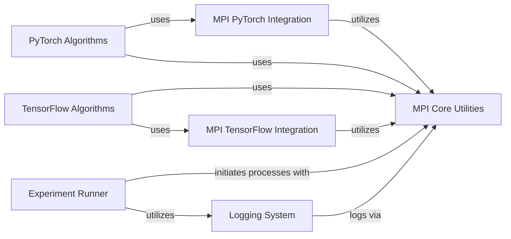

## Component Details

This graph illustrates the structure and interactions within the MPI Utilities subsystem, which is crucial for enabling distributed training in reinforcement learning algorithms. The core functionality revolves around inter-process communication provided by `MPI Core Utilities`. This core is then integrated with specific deep learning frameworks through `MPI PyTorch Integration` and `MPI TensorFlow Integration`. Reinforcement learning algorithms, categorized as `PyTorch Algorithms` and `TensorFlow Algorithms`, leverage these MPI integrations for parallel execution and distributed training. A `Logging System` is in place to record experiment progress, often utilizing MPI for consistent logging across processes. Finally, the `Experiment Runner` orchestrates the execution of these distributed experiments, initiating processes and managing the overall flow.

### MPI Core Utilities
This component provides fundamental MPI (Message Passing Interface) functionalities for distributed computing. It includes methods for getting process IDs, counting processes, performing all-reduce operations, calculating sums and averages across processes, broadcasting data, and forking new MPI processes. It serves as the backbone for inter-process communication within the Spinning Up framework.

**Related Classes/Methods**:

- <a href="https://github.com/openai/spinningup/blob/master/spinup/utils/mpi_tools.py#L42-L44" target="_blank" rel="noopener noreferrer">`spinup.utils.mpi_tools.proc_id` (42:44)</a>
- <a href="https://github.com/openai/spinningup/blob/master/spinup/utils/mpi_tools.py#L49-L51" target="_blank" rel="noopener noreferrer">`spinup.utils.mpi_tools.num_procs` (49:51)</a>
- <a href="https://github.com/openai/spinningup/blob/master/spinup/utils/mpi_tools.py#L56-L61" target="_blank" rel="noopener noreferrer">`spinup.utils.mpi_tools.mpi_op` (56:61)</a>
- <a href="https://github.com/openai/spinningup/blob/master/spinup/utils/mpi_tools.py#L63-L64" target="_blank" rel="noopener noreferrer">`spinup.utils.mpi_tools.mpi_sum` (63:64)</a>
- <a href="https://github.com/openai/spinningup/blob/master/spinup/utils/mpi_tools.py#L66-L68" target="_blank" rel="noopener noreferrer">`spinup.utils.mpi_tools.mpi_avg` (66:68)</a>
- <a href="https://github.com/openai/spinningup/blob/master/spinup/utils/mpi_tools.py#L70-L92" target="_blank" rel="noopener noreferrer">`spinup.utils.mpi_tools.mpi_statistics_scalar` (70:92)</a>
- <a href="https://github.com/openai/spinningup/blob/master/spinup/utils/mpi_tools.py#L53-L54" target="_blank" rel="noopener noreferrer">`spinup.utils.mpi_tools.broadcast` (53:54)</a>
- <a href="https://github.com/openai/spinningup/blob/master/spinup/utils/mpi_tools.py#L6-L36" target="_blank" rel="noopener noreferrer">`spinup.utils.mpi_tools.mpi_fork` (6:36)</a>

### MPI PyTorch Integration
This component facilitates the integration of MPI with PyTorch models. It provides utilities for setting up PyTorch for MPI, synchronizing model parameters across processes, and averaging gradients in a distributed manner. It ensures that PyTorch-based algorithms can leverage MPI for parallel execution and distributed training.

**Related Classes/Methods**:

- <a href="https://github.com/openai/spinningup/blob/master/spinup/utils/mpi_pytorch.py#L8-L17" target="_blank" rel="noopener noreferrer">`spinup.utils.mpi_pytorch.setup_pytorch_for_mpi` (8:17)</a>
- <a href="https://github.com/openai/spinningup/blob/master/spinup/utils/mpi_pytorch.py#L29-L35" target="_blank" rel="noopener noreferrer">`spinup.utils.mpi_pytorch.sync_params` (29:35)</a>
- <a href="https://github.com/openai/spinningup/blob/master/spinup/utils/mpi_pytorch.py#L20-L27" target="_blank" rel="noopener noreferrer">`spinup.utils.mpi_pytorch.mpi_avg_grads` (20:27)</a>

### MPI TensorFlow Integration
This component provides functionalities for integrating MPI with TensorFlow models. Its primary role is to synchronize TensorFlow model parameters across different MPI processes, enabling distributed training for TensorFlow-based algorithms.

**Related Classes/Methods**:

- <a href="https://github.com/openai/spinningup/blob/master/spinup/utils/mpi_tf.py#L16-L22" target="_blank" rel="noopener noreferrer">`spinup.utils.mpi_tf.sync_params` (16:22)</a>

### Logging System
This component is responsible for logging experiment data, configurations, and training progress. It includes a Logger class for general logging and an EpochLogger for logging statistics per epoch, often interacting with MPI utilities to ensure consistent logging across distributed processes.

**Related Classes/Methods**:

- <a href="https://github.com/openai/spinningup/blob/master/spinup/utils/logx.py#L71-L301" target="_blank" rel="noopener noreferrer">`spinup.utils.logx.Logger` (71:301)</a>
- <a href="https://github.com/openai/spinningup/blob/master/spinup/utils/logx.py#L303-L383" target="_blank" rel="noopener noreferrer">`spinup.utils.logx.EpochLogger` (303:383)</a>

### PyTorch Algorithms
This component encompasses the reinforcement learning algorithms implemented using PyTorch. These algorithms, such as PPO and VPG, utilize MPI for distributed training, interacting with MPI PyTorch Integration for parameter synchronization and MPI Core Utilities for general distributed operations and data aggregation.

**Related Classes/Methods**:

- <a href="https://github.com/openai/spinningup/blob/master/spinup/algos/pytorch/ppo/ppo.py#L12-L84" target="_blank" rel="noopener noreferrer">`spinup.algos.pytorch.ppo.ppo.PPOBuffer` (12:84)</a>
- <a href="https://github.com/openai/spinningup/blob/master/spinup/algos/pytorch/ppo/ppo.py#L88-L354" target="_blank" rel="noopener noreferrer">`spinup.algos.pytorch.ppo.ppo.ppo` (88:354)</a>
- <a href="https://github.com/openai/spinningup/blob/master/spinup/algos/pytorch/vpg/vpg.py#L12-L84" target="_blank" rel="noopener noreferrer">`spinup.algos.pytorch.vpg.vpg.VPGBuffer` (12:84)</a>
- <a href="https://github.com/openai/spinningup/blob/master/spinup/algos/pytorch/vpg/vpg.py#L88-L326" target="_blank" rel="noopener noreferrer">`spinup.algos.pytorch.vpg.vpg.vpg` (88:326)</a>

### TensorFlow Algorithms
This component includes reinforcement learning algorithms implemented with TensorFlow. Algorithms like PPO, TRPO, and VPG leverage MPI for distributed training, interacting with MPI Core Utilities for distributed data handling and potentially MPI TensorFlow Integration for parameter synchronization.

**Related Classes/Methods**:

- <a href="https://github.com/openai/spinningup/blob/master/spinup/algos/tf1/ppo/ppo.py#L11-L82" target="_blank" rel="noopener noreferrer">`spinup.algos.tf1.ppo.ppo.PPOBuffer` (11:82)</a>
- <a href="https://github.com/openai/spinningup/blob/master/spinup/algos/tf1/ppo/ppo.py#L86-L301" target="_blank" rel="noopener noreferrer">`spinup.algos.tf1.ppo.ppo.ppo` (86:301)</a>
- <a href="https://github.com/openai/spinningup/blob/master/spinup/algos/tf1/trpo/trpo.py#L13-L88" target="_blank" rel="noopener noreferrer">`spinup.algos.tf1.trpo.trpo.GAEBuffer` (13:88)</a>
- <a href="https://github.com/openai/spinningup/blob/master/spinup/algos/tf1/trpo/trpo.py#L92-L379" target="_blank" rel="noopener noreferrer">`spinup.algos.tf1.trpo.trpo.trpo` (92:379)</a>
- <a href="https://github.com/openai/spinningup/blob/master/spinup/algos/tf1/vpg/vpg.py#L11-L82" target="_blank" rel="noopener noreferrer">`spinup.algos.tf1.vpg.vpg.VPGBuffer` (11:82)</a>
- <a href="https://github.com/openai/spinningup/blob/master/spinup/algos/tf1/vpg/vpg.py#L86-L276" target="_blank" rel="noopener noreferrer">`spinup.algos.tf1.vpg.vpg.vpg` (86:276)</a>

### Experiment Runner
This component is responsible for initiating and managing experiments. It includes functionalities to fork new processes using MPI for distributed experiment execution, ensuring that experiments can be run across multiple machines or cores.

**Related Classes/Methods**:

- <a href="https://github.com/openai/spinningup/blob/master/spinup/utils/run_utils.py#L89-L211" target="_blank" rel="noopener noreferrer">`spinup.utils.run_utils.call_experiment` (89:211)</a>

### [FAQ](https://github.com/CodeBoarding/GeneratedOnBoardings/tree/main?tab=readme-ov-file#faq)