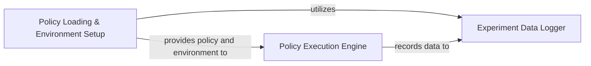

## Component Details

This subsystem provides a comprehensive framework for evaluating and analyzing trained reinforcement learning policies. It encompasses functionalities for loading policies and their environments, executing these policies in simulated settings, and logging detailed performance metrics for post-hoc analysis.

### Policy Loading & Environment Setup
Manages the loading of pre-trained reinforcement learning policies (TensorFlow or PyTorch) and their associated environments from saved experiment directories. It abstracts the backend-specific loading mechanisms and prepares the necessary components for policy execution.

**Related Classes/Methods**:

- <a href="https://github.com/openai/spinningup/blob/master/spinup/utils/test_policy.py#L11-L64" target="_blank" rel="noopener noreferrer">`spinup.utils.test_policy:load_policy_and_env` (11:64)</a>
- <a href="https://github.com/openai/spinningup/blob/master/spinup/utils/test_policy.py#L67-L89" target="_blank" rel="noopener noreferrer">`spinup.utils.test_policy:load_tf_policy` (67:89)</a>
- <a href="https://github.com/openai/spinningup/blob/master/spinup/utils/test_policy.py#L92-L107" target="_blank" rel="noopener noreferrer">`spinup.utils.test_policy:load_pytorch_policy` (92:107)</a>
- <a href="https://github.com/openai/spinningup/blob/master/spinup/utils/logx.py#L44-L69" target="_blank" rel="noopener noreferrer">`spinup.utils.logx:restore_tf_graph` (44:69)</a>

### Policy Execution Engine
Responsible for running a loaded policy within a simulated environment for a specified number of episodes. It handles environment interaction, action selection based on the policy, and manages the flow of episodes, including rendering and termination conditions.

**Related Classes/Methods**:

- <a href="https://github.com/openai/spinningup/blob/master/spinup/utils/test_policy.py#L110-L137" target="_blank" rel="noopener noreferrer">`spinup.utils.test_policy:run_policy` (110:137)</a>

### Experiment Data Logger
Provides a robust logging framework for reinforcement learning experiments, enabling the storage, aggregation, and output of performance metrics and configuration details to files and the console. It supports both general logging and epoch-specific statistics.

**Related Classes/Methods**:

- <a href="https://github.com/openai/spinningup/blob/master/spinup/utils/logx.py#L71-L301" target="_blank" rel="noopener noreferrer">`spinup.utils.logx:Logger` (71:301)</a>
- <a href="https://github.com/openai/spinningup/blob/master/spinup/utils/logx.py#L303-L383" target="_blank" rel="noopener noreferrer">`spinup.utils.logx:EpochLogger` (303:383)</a>
- <a href="https://github.com/openai/spinningup/blob/master/spinup/utils/logx.py#L332-L342" target="_blank" rel="noopener noreferrer">`spinup.utils.logx.EpochLogger.store` (332:342)</a>
- <a href="https://github.com/openai/spinningup/blob/master/spinup/utils/logx.py#L344-L375" target="_blank" rel="noopener noreferrer">`spinup.utils.logx.EpochLogger.log_tabular` (344:375)</a>
- <a href="https://github.com/openai/spinningup/blob/master/spinup/utils/logx.py#L275-L301" target="_blank" rel="noopener noreferrer">`spinup.utils.logx.Logger.dump_tabular` (275:301)</a>

### [FAQ](https://github.com/CodeBoarding/GeneratedOnBoardings/tree/main?tab=readme-ov-file#faq)