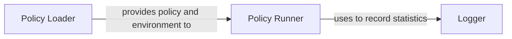

## Component Details

This graph represents the Policy Evaluation subsystem, which focuses on loading and executing trained reinforcement learning policies within simulated environments. The main flow involves loading a policy and its associated environment, then running the policy to observe agent behavior and collect performance statistics.

### Policy Loader
Responsible for loading pre-trained reinforcement learning policies and their associated environments, supporting both TensorFlow and PyTorch backends. It determines the correct backend and the specific policy iteration to load.

**Related Classes/Methods**:

- <a href="https://github.com/openai/spinningup/blob/master/spinup/utils/test_policy.py#L11-L64" target="_blank" rel="noopener noreferrer">`spinup.utils.test_policy.load_policy_and_env` (11:64)</a>
- <a href="https://github.com/openai/spinningup/blob/master/spinup/utils/test_policy.py#L67-L89" target="_blank" rel="noopener noreferrer">`spinup.utils.test_policy.load_tf_policy` (67:89)</a>
- <a href="https://github.com/openai/spinningup/blob/master/spinup/utils/test_policy.py#L92-L107" target="_blank" rel="noopener noreferrer">`spinup.utils.test_policy.load_pytorch_policy` (92:107)</a>
- <a href="https://github.com/openai/spinningup/blob/master/spinup/utils/logx.py#L44-L69" target="_blank" rel="noopener noreferrer">`spinup.utils.logx.restore_tf_graph` (44:69)</a>

### Policy Runner
Executes a loaded policy within a given environment for a specified number of episodes, simulating agent behavior. It interacts with the environment, obtains actions from the policy, and records episode statistics.

**Related Classes/Methods**:

- <a href="https://github.com/openai/spinningup/blob/master/spinup/utils/test_policy.py#L110-L137" target="_blank" rel="noopener noreferrer">`spinup.utils.test_policy.run_policy` (110:137)</a>

### Logger
Provides utilities for logging and storing experiment data, including episode returns and lengths. It supports tabular logging and dumping of collected statistics.

**Related Classes/Methods**:

- <a href="https://github.com/openai/spinningup/blob/master/spinup/utils/logx.py#L303-L383" target="_blank" rel="noopener noreferrer">`spinup.utils.logx.EpochLogger` (303:383)</a>
- <a href="https://github.com/openai/spinningup/blob/master/spinup/utils/logx.py#L332-L342" target="_blank" rel="noopener noreferrer">`spinup.utils.logx.EpochLogger.store` (332:342)</a>
- <a href="https://github.com/openai/spinningup/blob/master/spinup/utils/logx.py#L344-L375" target="_blank" rel="noopener noreferrer">`spinup.utils.logx.EpochLogger.log_tabular` (344:375)</a>
- <a href="https://github.com/openai/spinningup/blob/master/spinup/utils/logx.py#L275-L301" target="_blank" rel="noopener noreferrer">`spinup.utils.logx.Logger.dump_tabular` (275:301)</a>

### [FAQ](https://github.com/CodeBoarding/GeneratedOnBoardings/tree/main?tab=readme-ov-file#faq)