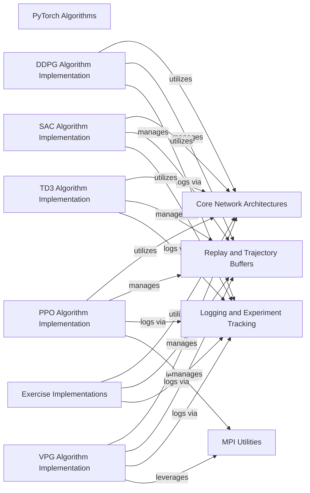

## Component Details

This graph illustrates the architecture of the PyTorch-based reinforcement learning algorithms within the `spinup` project. It details the core components, including various algorithm implementations (DDPG, PPO, SAC, TD3, VPG), shared neural network architectures, replay and trajectory buffers, and supporting utilities for logging and distributed training. The main flow involves the interaction of these algorithm implementations with the core network architectures for policy and value functions, and with the buffers for experience management. Logging and MPI utilities provide essential support for experiment tracking and distributed execution.

### PyTorch Algorithms
Implements various reinforcement learning algorithms (DDPG, PPO, SAC, TD3, VPG) using the PyTorch framework, including their training loops, replay buffers, and policy/value function updates.

**Related Classes/Methods**:

- <a href="https://github.com/openai/spinningup/blob/master/spinup/algos/pytorch/ddpg/ddpg.py#L44-L307" target="_blank" rel="noopener noreferrer">`spinup.algos.pytorch.ddpg.ddpg` (44:307)</a>
- <a href="https://github.com/openai/spinningup/blob/master/spinup/algos/pytorch/ddpg/ddpg.py#L11-L40" target="_blank" rel="noopener noreferrer">`spinup.algos.pytorch.ddpg.ddpg.ReplayBuffer` (11:40)</a>
- <a href="https://github.com/openai/spinningup/blob/master/spinup/algos/pytorch/ppo/ppo.py#L88-L354" target="_blank" rel="noopener noreferrer">`spinup.algos.pytorch.ppo.ppo` (88:354)</a>
- <a href="https://github.com/openai/spinningup/blob/master/spinup/algos/pytorch/ppo/ppo.py#L12-L84" target="_blank" rel="noopener noreferrer">`spinup.algos.pytorch.ppo.ppo.PPOBuffer` (12:84)</a>
- <a href="https://github.com/openai/spinningup/blob/master/spinup/algos/pytorch/sac/sac.py#L45-L348" target="_blank" rel="noopener noreferrer">`spinup.algos.pytorch.sac.sac` (45:348)</a>
- <a href="https://github.com/openai/spinningup/blob/master/spinup/algos/pytorch/sac/sac.py#L12-L41" target="_blank" rel="noopener noreferrer">`spinup.algos.pytorch.sac.sac.ReplayBuffer` (12:41)</a>
- <a href="https://github.com/openai/spinningup/blob/master/spinup/algos/pytorch/td3/td3.py#L45-L348" target="_blank" rel="noopener noreferrer">`spinup.algos.pytorch.td3.td3` (45:348)</a>
- <a href="https://github.com/openai/spinningup/blob/master/spinup/algos/pytorch/td3/td3.py#L12-L41" target="_blank" rel="noopener noreferrer">`spinup.algos.pytorch.td3.td3.ReplayBuffer` (12:41)</a>
- <a href="https://github.com/openai/spinningup/blob/master/spinup/algos/pytorch/vpg/vpg.py#L88-L326" target="_blank" rel="noopener noreferrer">`spinup.algos.pytorch.vpg.vpg` (88:326)</a>
- <a href="https://github.com/openai/spinningup/blob/master/spinup/algos/pytorch/vpg/vpg.py#L12-L84" target="_blank" rel="noopener noreferrer">`spinup.algos.pytorch.vpg.vpg.VPGBuffer` (12:84)</a>

### Core Network Architectures
Provides the fundamental building blocks for actor and critic neural networks, including MLP-based actors (Gaussian, Categorical, Squashed Gaussian) and Q-functions/Critics, which are shared across various reinforcement learning algorithms.

**Related Classes/Methods**:

- <a href="https://github.com/openai/spinningup/blob/master/spinup/algos/pytorch/ddpg/core.py#L23-L33" target="_blank" rel="noopener noreferrer">`spinup.algos.pytorch.ddpg.core.MLPActor` (23:33)</a>
- <a href="https://github.com/openai/spinningup/blob/master/spinup/algos/pytorch/ddpg/core.py#L35-L43" target="_blank" rel="noopener noreferrer">`spinup.algos.pytorch.ddpg.core.MLPQFunction` (35:43)</a>
- <a href="https://github.com/openai/spinningup/blob/master/spinup/algos/pytorch/ddpg/core.py#L45-L61" target="_blank" rel="noopener noreferrer">`spinup.algos.pytorch.ddpg.core.MLPActorCritic` (45:61)</a>
- <a href="https://github.com/openai/spinningup/blob/master/spinup/algos/pytorch/ppo/core.py#L47-L63" target="_blank" rel="noopener noreferrer">`spinup.algos.pytorch.ppo.core.Actor` (47:63)</a>
- <a href="https://github.com/openai/spinningup/blob/master/spinup/algos/pytorch/ppo/core.py#L66-L77" target="_blank" rel="noopener noreferrer">`spinup.algos.pytorch.ppo.core.MLPCategoricalActor` (66:77)</a>
- <a href="https://github.com/openai/spinningup/blob/master/spinup/algos/pytorch/ppo/core.py#L80-L94" target="_blank" rel="noopener noreferrer">`spinup.algos.pytorch.ppo.core.MLPGaussianActor` (80:94)</a>
- <a href="https://github.com/openai/spinningup/blob/master/spinup/algos/pytorch/ppo/core.py#L97-L104" target="_blank" rel="noopener noreferrer">`spinup.algos.pytorch.ppo.core.MLPCritic` (97:104)</a>
- <a href="https://github.com/openai/spinningup/blob/master/spinup/algos/pytorch/ppo/core.py#L108-L135" target="_blank" rel="noopener noreferrer">`spinup.algos.pytorch.ppo.core.MLPActorCritic` (108:135)</a>
- <a href="https://github.com/openai/spinningup/blob/master/spinup/algos/pytorch/sac/core.py#L29-L67" target="_blank" rel="noopener noreferrer">`spinup.algos.pytorch.sac.core.SquashedGaussianMLPActor` (29:67)</a>
- <a href="https://github.com/openai/spinningup/blob/master/spinup/algos/pytorch/sac/core.py#L70-L78" target="_blank" rel="noopener noreferrer">`spinup.algos.pytorch.sac.core.MLPQFunction` (70:78)</a>
- <a href="https://github.com/openai/spinningup/blob/master/spinup/algos/pytorch/sac/core.py#L80-L98" target="_blank" rel="noopener noreferrer">`spinup.algos.pytorch.sac.core.MLPActorCritic` (80:98)</a>
- <a href="https://github.com/openai/spinningup/blob/master/spinup/algos/pytorch/td3/core.py#L23-L33" target="_blank" rel="noopener noreferrer">`spinup.algos.pytorch.td3.core.MLPActor` (23:33)</a>
- <a href="https://github.com/openai/spinningup/blob/master/spinup/algos/pytorch/td3/core.py#L35-L43" target="_blank" rel="noopener noreferrer">`spinup.algos.pytorch.td3.core.MLPQFunction` (35:43)</a>
- <a href="https://github.com/openai/spinningup/blob/master/spinup/algos/pytorch/td3/core.py#L45-L62" target="_blank" rel="noopener noreferrer">`spinup.algos.pytorch.td3.core.MLPActorCritic` (45:62)</a>
- <a href="https://github.com/openai/spinningup/blob/master/spinup/algos/pytorch/vpg/core.py#L47-L63" target="_blank" rel="noopener noreferrer">`spinup.algos.pytorch.vpg.core.Actor` (47:63)</a>
- <a href="https://github.com/openai/spinningup/blob/master/spinup/algos/pytorch/vpg/core.py#L66-L77" target="_blank" rel="noopener noreferrer">`spinup.algos.pytorch.vpg.core.MLPCategoricalActor` (66:77)</a>
- <a href="https://github.com/openai/spinningup/blob/master/spinup/algos/pytorch/vpg/core.py#L80-L94" target="_blank" rel="noopener noreferrer">`spinup.algos.pytorch.vpg.core.MLPGaussianActor` (80:94)</a>
- <a href="https://github.com/openai/spinningup/blob/master/spinup/algos/pytorch/vpg/core.py#L97-L104" target="_blank" rel="noopener noreferrer">`spinup.algos.pytorch.vpg.core.MLPCritic` (97:104)</a>
- <a href="https://github.com/openai/spinningup/blob/master/spinup/algos/pytorch/vpg/core.py#L108-L135" target="_blank" rel="noopener noreferrer">`spinup.algos.pytorch.vpg.core.MLPActorCritic` (108:135)</a>

### Replay and Trajectory Buffers
Manages the storage and sampling of experience transitions (state, action, reward, next state, done) for off-policy algorithms (ReplayBuffer) and stores trajectories for on-policy algorithms (PPOBuffer, VPGBuffer).

**Related Classes/Methods**:

- <a href="https://github.com/openai/spinningup/blob/master/spinup/algos/pytorch/ddpg/ddpg.py#L11-L40" target="_blank" rel="noopener noreferrer">`spinup.algos.pytorch.ddpg.ddpg.ReplayBuffer` (11:40)</a>
- <a href="https://github.com/openai/spinningup/blob/master/spinup/algos/pytorch/ppo/ppo.py#L12-L84" target="_blank" rel="noopener noreferrer">`spinup.algos.pytorch.ppo.ppo.PPOBuffer` (12:84)</a>
- <a href="https://github.com/openai/spinningup/blob/master/spinup/algos/pytorch/sac/sac.py#L12-L41" target="_blank" rel="noopener noreferrer">`spinup.algos.pytorch.sac.sac.ReplayBuffer` (12:41)</a>
- <a href="https://github.com/openai/spinningup/blob/master/spinup/algos/pytorch/td3/td3.py#L12-L41" target="_blank" rel="noopener noreferrer">`spinup.algos.pytorch.td3.td3.ReplayBuffer` (12:41)</a>
- <a href="https://github.com/openai/spinningup/blob/master/spinup/algos/pytorch/vpg/vpg.py#L12-L84" target="_blank" rel="noopener noreferrer">`spinup.algos.pytorch.vpg.vpg.VPGBuffer` (12:84)</a>
- <a href="https://github.com/openai/spinningup/blob/master/spinup/exercises/pytorch/problem_set_1/exercise1_3.py#L27-L56" target="_blank" rel="noopener noreferrer">`spinup.exercises.pytorch.problem_set_1.exercise1_3.ReplayBuffer` (27:56)</a>

### DDPG Algorithm Implementation
Contains the main training loop and logic specific to the Deep Deterministic Policy Gradient (DDPG) algorithm, orchestrating interactions between the actor-critic networks and the replay buffer.

**Related Classes/Methods**:

- <a href="https://github.com/openai/spinningup/blob/master/spinup/algos/pytorch/ddpg/ddpg.py#L44-L307" target="_blank" rel="noopener noreferrer">`spinup.algos.pytorch.ddpg.ddpg:ddpg` (44:307)</a>
- <a href="https://github.com/openai/spinningup/blob/master/spinup/algos/pytorch/ddpg/ddpg.py#L162-L178" target="_blank" rel="noopener noreferrer">`spinup.algos.pytorch.ddpg.ddpg:compute_loss_q` (162:178)</a>
- <a href="https://github.com/openai/spinningup/blob/master/spinup/algos/pytorch/ddpg/ddpg.py#L181-L184" target="_blank" rel="noopener noreferrer">`spinup.algos.pytorch.ddpg.ddpg:compute_loss_pi` (181:184)</a>
- <a href="https://github.com/openai/spinningup/blob/master/spinup/algos/pytorch/ddpg/ddpg.py#L226-L229" target="_blank" rel="noopener noreferrer">`spinup.algos.pytorch.ddpg.ddpg:get_action` (226:229)</a>
- <a href="https://github.com/openai/spinningup/blob/master/spinup/algos/pytorch/ddpg/ddpg.py#L193-L224" target="_blank" rel="noopener noreferrer">`spinup.algos.pytorch.ddpg.ddpg:update` (193:224)</a>
- <a href="https://github.com/openai/spinningup/blob/master/spinup/algos/pytorch/ddpg/ddpg.py#L231-L239" target="_blank" rel="noopener noreferrer">`spinup.algos.pytorch.ddpg.ddpg:test_agent` (231:239)</a>

### PPO Algorithm Implementation
Encapsulates the training process for the Proximal Policy Optimization (PPO) algorithm, managing data collection, loss computation, and policy/value network updates.

**Related Classes/Methods**:

- <a href="https://github.com/openai/spinningup/blob/master/spinup/algos/pytorch/ppo/ppo.py#L88-L354" target="_blank" rel="noopener noreferrer">`spinup.algos.pytorch.ppo.ppo:ppo` (88:354)</a>
- <a href="https://github.com/openai/spinningup/blob/master/spinup/algos/pytorch/ppo/ppo.py#L227-L243" target="_blank" rel="noopener noreferrer">`spinup.algos.pytorch.ppo.ppo:compute_loss_pi` (227:243)</a>
- <a href="https://github.com/openai/spinningup/blob/master/spinup/algos/pytorch/ppo/ppo.py#L246-L248" target="_blank" rel="noopener noreferrer">`spinup.algos.pytorch.ppo.ppo:compute_loss_v` (246:248)</a>
- <a href="https://github.com/openai/spinningup/blob/master/spinup/algos/pytorch/ppo/ppo.py#L257-L291" target="_blank" rel="noopener noreferrer">`spinup.algos.pytorch.ppo.ppo:update` (257:291)</a>

### SAC Algorithm Implementation
Implements the Soft Actor-Critic (SAC) algorithm's training loop, including entropy regularization, Q-function updates, and policy updates.

**Related Classes/Methods**:

- <a href="https://github.com/openai/spinningup/blob/master/spinup/algos/pytorch/sac/sac.py#L45-L348" target="_blank" rel="noopener noreferrer">`spinup.algos.pytorch.sac.sac:sac` (45:348)</a>
- <a href="https://github.com/openai/spinningup/blob/master/spinup/algos/pytorch/sac/sac.py#L179-L205" target="_blank" rel="noopener noreferrer">`spinup.algos.pytorch.sac.sac:compute_loss_q` (179:205)</a>
- <a href="https://github.com/openai/spinningup/blob/master/spinup/algos/pytorch/sac/sac.py#L208-L221" target="_blank" rel="noopener noreferrer">`spinup.algos.pytorch.sac.sac:compute_loss_pi` (208:221)</a>
- <a href="https://github.com/openai/spinningup/blob/master/spinup/algos/pytorch/sac/sac.py#L266-L268" target="_blank" rel="noopener noreferrer">`spinup.algos.pytorch.sac.sac:get_action` (266:268)</a>
- <a href="https://github.com/openai/spinningup/blob/master/spinup/algos/pytorch/sac/sac.py#L230-L264" target="_blank" rel="noopener noreferrer">`spinup.algos.pytorch.sac.sac:update` (230:264)</a>
- <a href="https://github.com/openai/spinningup/blob/master/spinup/algos/pytorch/sac/sac.py#L270-L278" target="_blank" rel="noopener noreferrer">`spinup.algos.pytorch.sac.sac:test_agent` (270:278)</a>

### TD3 Algorithm Implementation
Manages the training process for the Twin Delayed DDPG (TD3) algorithm, featuring delayed policy updates and clipped double Q-learning.

**Related Classes/Methods**:

- <a href="https://github.com/openai/spinningup/blob/master/spinup/algos/pytorch/td3/td3.py#L45-L348" target="_blank" rel="noopener noreferrer">`spinup.algos.pytorch.td3.td3:td3` (45:348)</a>
- <a href="https://github.com/openai/spinningup/blob/master/spinup/algos/pytorch/td3/td3.py#L181-L212" target="_blank" rel="noopener noreferrer">`spinup.algos.pytorch.td3.td3:compute_loss_q` (181:212)</a>
- <a href="https://github.com/openai/spinningup/blob/master/spinup/algos/pytorch/td3/td3.py#L215-L218" target="_blank" rel="noopener noreferrer">`spinup.algos.pytorch.td3.td3:compute_loss_pi` (215:218)</a>
- <a href="https://github.com/openai/spinningup/blob/master/spinup/algos/pytorch/td3/td3.py#L266-L269" target="_blank" rel="noopener noreferrer">`spinup.algos.pytorch.td3.td3:get_action` (266:269)</a>
- <a href="https://github.com/openai/spinningup/blob/master/spinup/algos/pytorch/td3/td3.py#L227-L264" target="_blank" rel="noopener noreferrer">`spinup.algos.pytorch.td3.td3:update` (227:264)</a>
- <a href="https://github.com/openai/spinningup/blob/master/spinup/algos/pytorch/td3/td3.py#L271-L279" target="_blank" rel="noopener noreferrer">`spinup.algos.pytorch.td3.td3:test_agent` (271:279)</a>

### VPG Algorithm Implementation
Contains the training logic for the Vanilla Policy Gradient (VPG) algorithm, including advantage estimation and policy/value function optimization.

**Related Classes/Methods**:

- <a href="https://github.com/openai/spinningup/blob/master/spinup/algos/pytorch/vpg/vpg.py#L88-L326" target="_blank" rel="noopener noreferrer">`spinup.algos.pytorch.vpg.vpg:vpg` (88:326)</a>
- <a href="https://github.com/openai/spinningup/blob/master/spinup/algos/pytorch/vpg/vpg.py#L211-L223" target="_blank" rel="noopener noreferrer">`spinup.algos.pytorch.vpg.vpg:compute_loss_pi` (211:223)</a>
- <a href="https://github.com/openai/spinningup/blob/master/spinup/algos/pytorch/vpg/vpg.py#L226-L228" target="_blank" rel="noopener noreferrer">`spinup.algos.pytorch.vpg.vpg:compute_loss_v` (226:228)</a>
- <a href="https://github.com/openai/spinningup/blob/master/spinup/algos/pytorch/vpg/vpg.py#L237-L265" target="_blank" rel="noopener noreferrer">`spinup.algos.pytorch.vpg.vpg:update` (237:265)</a>

### Logging and Experiment Tracking
Provides utilities for logging experiment data, saving configurations, and managing tabular output for reinforcement learning training runs.

**Related Classes/Methods**:

- <a href="https://github.com/openai/spinningup/blob/master/spinup/utils/logx.py#L303-L383" target="_blank" rel="noopener noreferrer">`spinup.utils.logx.EpochLogger` (303:383)</a>
- <a href="https://github.com/openai/spinningup/blob/master/spinup/utils/logx.py#L71-L301" target="_blank" rel="noopener noreferrer">`spinup.utils.logx.Logger` (71:301)</a>

### MPI Utilities
Offers functionalities for Message Passing Interface (MPI) operations, including process ID retrieval, number of processes, broadcasting, and averaging statistics and gradients across multiple processes, crucial for distributed training.

**Related Classes/Methods**:

- `spinup.utils.mpi_tools` (full file reference)
- `spinup.utils.mpi_pytorch` (full file reference)

### Exercise Implementations
Contains various exercise implementations, including custom actor-critic architectures and modified TD3 algorithms, used for learning and debugging purposes.

**Related Classes/Methods**:

- <a href="https://github.com/openai/spinningup/blob/master/spinup/exercises/pytorch/problem_set_1/exercise1_2.py#L71-L99" target="_blank" rel="noopener noreferrer">`spinup.exercises.pytorch.problem_set_1.exercise1_2.MLPGaussianActor` (71:99)</a>
- <a href="https://github.com/openai/spinningup/blob/master/spinup/exercises/pytorch/problem_set_1/exercise1_2_auxiliary.py#L25-L32" target="_blank" rel="noopener noreferrer">`spinup.exercises.pytorch.problem_set_1.exercise1_2_auxiliary.MLPCritic` (25:32)</a>
- <a href="https://github.com/openai/spinningup/blob/master/spinup/exercises/pytorch/problem_set_1/exercise1_2_auxiliary.py#L35-L54" target="_blank" rel="noopener noreferrer">`spinup.exercises.pytorch.problem_set_1.exercise1_2_auxiliary.ExerciseActorCritic` (35:54)</a>
- <a href="https://github.com/openai/spinningup/blob/master/spinup/exercises/pytorch/problem_set_1/exercise1_3.py#L60-L389" target="_blank" rel="noopener noreferrer">`spinup.exercises.pytorch.problem_set_1.exercise1_3:td3` (60:389)</a>
- <a href="https://github.com/openai/spinningup/blob/master/spinup/exercises/pytorch/problem_set_1_solutions/exercise1_2_soln.py#L19-L32" target="_blank" rel="noopener noreferrer">`spinup.exercises.pytorch.problem_set_1_solutions.exercise1_2_soln.DiagonalGaussianDistribution` (19:32)</a>
- <a href="https://github.com/openai/spinningup/blob/master/spinup/exercises/pytorch/problem_set_1_solutions/exercise1_2_soln.py#L35-L49" target="_blank" rel="noopener noreferrer">`spinup.exercises.pytorch.problem_set_1_solutions.exercise1_2_soln.MLPGaussianActor` (35:49)</a>
- <a href="https://github.com/openai/spinningup/blob/master/spinup/exercises/pytorch/problem_set_2/exercise2_2.py#L45-L61" target="_blank" rel="noopener noreferrer">`spinup.exercises.pytorch.problem_set_2.exercise2_2.BuggedMLPActorCritic` (45:61)</a>

### [FAQ](https://github.com/CodeBoarding/GeneratedOnBoardings/tree/main?tab=readme-ov-file#faq)