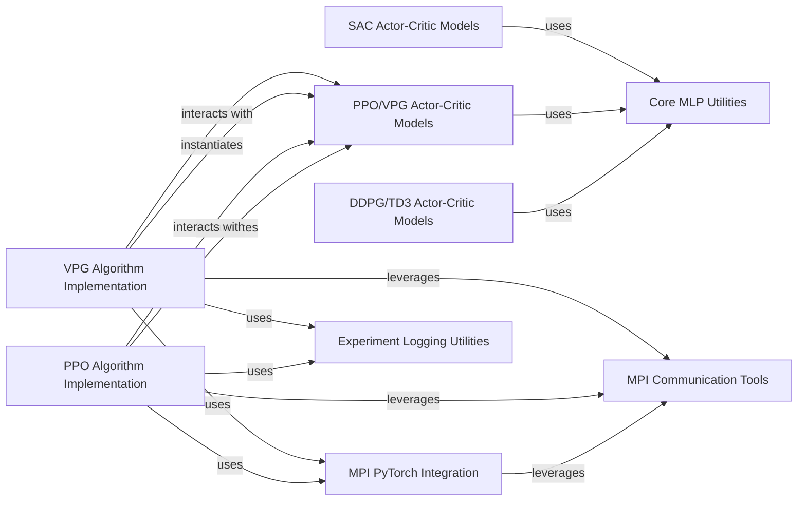

## Component Details

This subsystem provides core utilities for integrating PyTorch with MPI for distributed training and defines common neural network architectures (actors and critics) used in PyTorch-based reinforcement learning algorithms. It encompasses specialized actor-critic models for DDPG/TD3, PPO/VPG, and SAC algorithms, foundational MLP utilities, and implementations of PPO and VPG algorithms. Additionally, it includes components for MPI-PyTorch integration, general MPI communication tools, and comprehensive experiment logging functionalities.

### DDPG/TD3 Actor-Critic Models
This component encapsulates the neural network architectures for the DDPG and TD3 algorithms, specifically the Multi-Layer Perceptron (MLP) based actor and Q-function networks, and their combined actor-critic models.

**Related Classes/Methods**:

- <a href="https://github.com/openai/spinningup/blob/master/spinup/algos/pytorch/ddpg/core.py#L23-L33" target="_blank" rel="noopener noreferrer">`spinup.algos.pytorch.ddpg.core.MLPActor` (23:33)</a>
- <a href="https://github.com/openai/spinningup/blob/master/spinup/algos/pytorch/ddpg/core.py#L35-L43" target="_blank" rel="noopener noreferrer">`spinup.algos.pytorch.ddpg.core.MLPQFunction` (35:43)</a>
- <a href="https://github.com/openai/spinningup/blob/master/spinup/algos/pytorch/ddpg/core.py#L45-L61" target="_blank" rel="noopener noreferrer">`spinup.algos.pytorch.ddpg.core.MLPActorCritic` (45:61)</a>
- <a href="https://github.com/openai/spinningup/blob/master/spinup/algos/pytorch/td3/core.py#L23-L33" target="_blank" rel="noopener noreferrer">`spinup.algos.pytorch.td3.core.MLPActor` (23:33)</a>
- <a href="https://github.com/openai/spinningup/blob/master/spinup/algos/pytorch/td3/core.py#L35-L43" target="_blank" rel="noopener noreferrer">`spinup.algos.pytorch.td3.core.MLPQFunction` (35:43)</a>
- <a href="https://github.com/openai/spinningup/blob/master/spinup/algos/pytorch/td3/core.py#L45-L62" target="_blank" rel="noopener noreferrer">`spinup.algos.pytorch.td3.core.MLPActorCritic` (45:62)</a>

### PPO/VPG Actor-Critic Models
This component defines the neural network structures for the PPO and VPG algorithms, including various MLP-based actor types (Categorical and Gaussian) and a critic network, combined into a unified actor-critic model.

**Related Classes/Methods**:

- <a href="https://github.com/openai/spinningup/blob/master/spinup/algos/pytorch/ppo/core.py#L47-L63" target="_blank" rel="noopener noreferrer">`spinup.algos.pytorch.ppo.core.Actor` (47:63)</a>
- <a href="https://github.com/openai/spinningup/blob/master/spinup/algos/pytorch/ppo/core.py#L66-L77" target="_blank" rel="noopener noreferrer">`spinup.algos.pytorch.ppo.core.MLPCategoricalActor` (66:77)</a>
- <a href="https://github.com/openai/spinningup/blob/master/spinup/algos/pytorch/ppo/core.py#L80-L94" target="_blank" rel="noopener noreferrer">`spinup.algos.pytorch.ppo.core.MLPGaussianActor` (80:94)</a>
- <a href="https://github.com/openai/spinningup/blob/master/spinup/algos/pytorch/ppo/core.py#L97-L104" target="_blank" rel="noopener noreferrer">`spinup.algos.pytorch.ppo.core.MLPCritic` (97:104)</a>
- <a href="https://github.com/openai/spinningup/blob/master/spinup/algos/pytorch/ppo/core.py#L108-L135" target="_blank" rel="noopener noreferrer">`spinup.algos.pytorch.ppo.core.MLPActorCritic` (108:135)</a>
- <a href="https://github.com/openai/spinningup/blob/master/spinup/algos/pytorch/vpg/core.py#L47-L63" target="_blank" rel="noopener noreferrer">`spinup.algos.pytorch.vpg.core.Actor` (47:63)</a>
- <a href="https://github.com/openai/spinningup/blob/master/spinup/algos/pytorch/vpg/core.py#L66-L77" target="_blank" rel="noopener noreferrer">`spinup.algos.pytorch.vpg.core.MLPCategoricalActor` (66:77)</a>
- <a href="https://github.com/openai/spinningup/blob/master/spinup/algos/pytorch/vpg/core.py#L80-L94" target="_blank" rel="noopener noreferrer">`spinup.algos.pytorch.vpg.core.MLPGaussianActor` (80:94)</a>
- <a href="https://github.com/openai/spinningup/blob/master/spinup/algos/pytorch/vpg/core.py#L97-L104" target="_blank" rel="noopener noreferrer">`spinup.algos.pytorch.vpg.core.MLPCritic` (97:104)</a>
- <a href="https://github.com/openai/spinningup/blob/master/spinup/algos/pytorch/vpg/core.py#L108-L135" target="_blank" rel="noopener noreferrer">`spinup.algos.pytorch.vpg.core.MLPActorCritic` (108:135)</a>

### SAC Actor-Critic Models
This component provides the neural network models for the Soft Actor-Critic (SAC) algorithm, specifically the squashed Gaussian MLP actor and the MLP Q-function networks, integrated into an actor-critic structure.

**Related Classes/Methods**:

- <a href="https://github.com/openai/spinningup/blob/master/spinup/algos/pytorch/sac/core.py#L29-L67" target="_blank" rel="noopener noreferrer">`spinup.algos.pytorch.sac.core.SquashedGaussianMLPActor` (29:67)</a>
- <a href="https://github.com/openai/spinningup/blob/master/spinup/algos/pytorch/sac/core.py#L70-L78" target="_blank" rel="noopener noreferrer">`spinup.algos.pytorch.sac.core.MLPQFunction` (70:78)</a>
- <a href="https://github.com/openai/spinningup/blob/master/spinup/algos/pytorch/sac/core.py#L80-L98" target="_blank" rel="noopener noreferrer">`spinup.algos.pytorch.sac.core.MLPActorCritic` (80:98)</a>

### Core MLP Utilities
This component represents the foundational Multi-Layer Perceptron (MLP) utility functions or base classes used across various actor and critic network implementations within different reinforcement learning algorithms.

**Related Classes/Methods**:

- <a href="https://github.com/openai/spinningup/blob/master/spinup/algos/pytorch/ddpg/core.py#L13-L18" target="_blank" rel="noopener noreferrer">`spinup.algos.pytorch.ddpg.core.mlp` (13:18)</a>
- <a href="https://github.com/openai/spinningup/blob/master/spinup/algos/pytorch/ppo/core.py#L17-L22" target="_blank" rel="noopener noreferrer">`spinup.algos.pytorch.ppo.core.mlp` (17:22)</a>
- <a href="https://github.com/openai/spinningup/blob/master/spinup/algos/pytorch/sac/core.py#L15-L20" target="_blank" rel="noopener noreferrer">`spinup.algos.pytorch.sac.core.mlp` (15:20)</a>
- <a href="https://github.com/openai/spinningup/blob/master/spinup/algos/pytorch/td3/core.py#L13-L18" target="_blank" rel="noopener noreferrer">`spinup.algos.pytorch.td3.core.mlp` (13:18)</a>
- <a href="https://github.com/openai/spinningup/blob/master/spinup/algos/pytorch/vpg/core.py#L17-L22" target="_blank" rel="noopener noreferrer">`spinup.algos.pytorch.vpg.core.mlp` (17:22)</a>

### PPO Algorithm Implementation
This component contains the core logic for the Proximal Policy Optimization (PPO) algorithm, including its main training loop, buffer management for experience replay, and loss computation functions for policy and value networks.

**Related Classes/Methods**:

- <a href="https://github.com/openai/spinningup/blob/master/spinup/algos/pytorch/ppo/ppo.py#L88-L354" target="_blank" rel="noopener noreferrer">`spinup.algos.pytorch.ppo.ppo` (88:354)</a>
- <a href="https://github.com/openai/spinningup/blob/master/spinup/algos/pytorch/ppo/ppo.py#L12-L84" target="_blank" rel="noopener noreferrer">`spinup.algos.pytorch.ppo.ppo.PPOBuffer` (12:84)</a>
- <a href="https://github.com/openai/spinningup/blob/master/spinup/algos/pytorch/ppo/ppo.py#L227-L243" target="_blank" rel="noopener noreferrer">`spinup.algos.pytorch.ppo.ppo.compute_loss_pi` (227:243)</a>
- <a href="https://github.com/openai/spinningup/blob/master/spinup/algos/pytorch/ppo/ppo.py#L246-L248" target="_blank" rel="noopener noreferrer">`spinup.algos.pytorch.ppo.ppo.compute_loss_v` (246:248)</a>
- <a href="https://github.com/openai/spinningup/blob/master/spinup/algos/pytorch/ppo/ppo.py#L257-L291" target="_blank" rel="noopener noreferrer">`spinup.algos.pytorch.ppo.ppo.update` (257:291)</a>

### VPG Algorithm Implementation
This component implements the Vanilla Policy Gradient (VPG) algorithm, encompassing its main training routine, the buffer for storing trajectories, and the functions responsible for calculating policy and value losses.

**Related Classes/Methods**:

- <a href="https://github.com/openai/spinningup/blob/master/spinup/algos/pytorch/vpg/vpg.py#L88-L326" target="_blank" rel="noopener noreferrer">`spinup.algos.pytorch.vpg.vpg` (88:326)</a>
- <a href="https://github.com/openai/spinningup/blob/master/spinup/algos/pytorch/vpg/vpg.py#L12-L84" target="_blank" rel="noopener noreferrer">`spinup.algos.pytorch.vpg.vpg.VPGBuffer` (12:84)</a>
- <a href="https://github.com/openai/spinningup/blob/master/spinup/algos/pytorch/vpg/vpg.py#L211-L223" target="_blank" rel="noopener noreferrer">`spinup.algos.pytorch.vpg.vpg.compute_loss_pi` (211:223)</a>
- <a href="https://github.com/openai/spinningup/blob/master/spinup/algos/pytorch/vpg/vpg.py#L226-L228" target="_blank" rel="noopener noreferrer">`spinup.algos.pytorch.vpg.vpg.compute_loss_v` (226:228)</a>
- <a href="https://github.com/openai/spinningup/blob/master/spinup/algos/pytorch/vpg/vpg.py#L237-L265" target="_blank" rel="noopener noreferrer">`spinup.algos.pytorch.vpg.vpg.update` (237:265)</a>

### MPI PyTorch Integration
This component provides utilities for integrating PyTorch with Message Passing Interface (MPI), enabling distributed training by setting up PyTorch for MPI, synchronizing model parameters, and averaging gradients across multiple processes.

**Related Classes/Methods**:

- <a href="https://github.com/openai/spinningup/blob/master/spinup/utils/mpi_pytorch.py#L8-L17" target="_blank" rel="noopener noreferrer">`spinup.utils.mpi_pytorch.setup_pytorch_for_mpi` (8:17)</a>
- <a href="https://github.com/openai/spinningup/blob/master/spinup/utils/mpi_pytorch.py#L20-L27" target="_blank" rel="noopener noreferrer">`spinup.utils.mpi_pytorch.mpi_avg_grads` (20:27)</a>
- <a href="https://github.com/openai/spinningup/blob/master/spinup/utils/mpi_pytorch.py#L29-L35" target="_blank" rel="noopener noreferrer">`spinup.utils.mpi_pytorch.sync_params` (29:35)</a>

### MPI Communication Tools
This component offers fundamental MPI functionalities for inter-process communication, including obtaining process IDs, determining the number of processes, averaging values, broadcasting data, and computing scalar statistics across distributed processes.

**Related Classes/Methods**:

- <a href="https://github.com/openai/spinningup/blob/master/spinup/utils/mpi_tools.py#L42-L44" target="_blank" rel="noopener noreferrer">`spinup.utils.mpi_tools.proc_id` (42:44)</a>
- <a href="https://github.com/openai/spinningup/blob/master/spinup/utils/mpi_tools.py#L49-L51" target="_blank" rel="noopener noreferrer">`spinup.utils.mpi_tools.num_procs` (49:51)</a>
- <a href="https://github.com/openai/spinningup/blob/master/spinup/utils/mpi_tools.py#L66-L68" target="_blank" rel="noopener noreferrer">`spinup.utils.mpi_tools.mpi_avg` (66:68)</a>
- <a href="https://github.com/openai/spinningup/blob/master/spinup/utils/mpi_tools.py#L53-L54" target="_blank" rel="noopener noreferrer">`spinup.utils.mpi_tools.broadcast` (53:54)</a>
- <a href="https://github.com/openai/spinningup/blob/master/spinup/utils/mpi_tools.py#L70-L92" target="_blank" rel="noopener noreferrer">`spinup.utils.mpi_tools.mpi_statistics_scalar` (70:92)</a>
- <a href="https://github.com/openai/spinningup/blob/master/spinup/utils/mpi_tools.py#L6-L36" target="_blank" rel="noopener noreferrer">`spinup.utils.mpi_tools.mpi_fork` (6:36)</a>

### Experiment Logging Utilities
This component provides a comprehensive set of utilities for logging experiment data, including epoch-based logging, saving configuration parameters, storing various metrics, and dumping tabular summaries of training progress.

**Related Classes/Methods**:

- <a href="https://github.com/openai/spinningup/blob/master/spinup/utils/logx.py#L303-L383" target="_blank" rel="noopener noreferrer">`spinup.utils.logx.EpochLogger` (303:383)</a>
- <a href="https://github.com/openai/spinningup/blob/master/spinup/utils/logx.py#L136-L160" target="_blank" rel="noopener noreferrer">`spinup.utils.logx.Logger.save_config` (136:160)</a>
- <a href="https://github.com/openai/spinningup/blob/master/spinup/utils/logx.py#L115-L118" target="_blank" rel="noopener noreferrer">`spinup.utils.logx.Logger.log` (115:118)</a>
- <a href="https://github.com/openai/spinningup/blob/master/spinup/utils/logx.py#L234-L248" target="_blank" rel="noopener noreferrer">`spinup.utils.logx.Logger.setup_pytorch_saver` (234:248)</a>
- <a href="https://github.com/openai/spinningup/blob/master/spinup/utils/logx.py#L332-L342" target="_blank" rel="noopener noreferrer">`spinup.utils.logx.EpochLogger.store` (332:342)</a>
- <a href="https://github.com/openai/spinningup/blob/master/spinup/utils/logx.py#L162-L192" target="_blank" rel="noopener noreferrer">`spinup.utils.logx.Logger.save_state` (162:192)</a>
- <a href="https://github.com/openai/spinningup/blob/master/spinup/utils/logx.py#L344-L375" target="_blank" rel="noopener noreferrer">`spinup.utils.logx.EpochLogger.log_tabular` (344:375)</a>
- <a href="https://github.com/openai/spinningup/blob/master/spinup/utils/logx.py#L275-L301" target="_blank" rel="noopener noreferrer">`spinup.utils.logx.Logger.dump_tabular` (275:301)</a>

### [FAQ](https://github.com/CodeBoarding/GeneratedOnBoardings/tree/main?tab=readme-ov-file#faq)