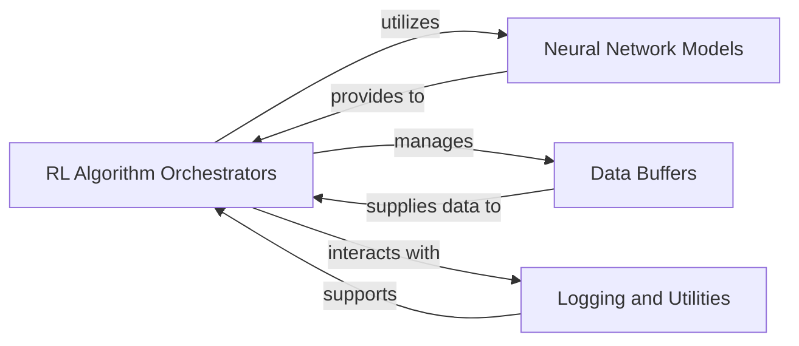

## Component Details

Provides the core utilities and implementations for various reinforcement learning algorithms (DDPG, PPO, SAC, TD3, VPG) using the PyTorch deep learning framework, including neural network architectures, training loops, and data buffers. It also integrates with MPI for distributed training.

### RL Algorithm Orchestrators
This component encompasses the top-level functions that implement and manage the training process for various reinforcement learning algorithms, including Deep Deterministic Policy Gradient (DDPG), Proximal Policy Optimization (PPO), Soft Actor-Critic (SAC), Twin Delayed DDPG (TD3), and Vanilla Policy Gradient (VPG). These orchestrators handle environment interaction, data collection, and coordinate the optimization of neural networks.

**Related Classes/Methods**:

- <a href="https://github.com/openai/spinningup/blob/master/spinup/algos/pytorch/ddpg/ddpg.py#L44-L307" target="_blank" rel="noopener noreferrer">`spinup.algos.pytorch.ddpg.ddpg` (44:307)</a>
- <a href="https://github.com/openai/spinningup/blob/master/spinup/algos/pytorch/ppo/ppo.py#L88-L354" target="_blank" rel="noopener noreferrer">`spinup.algos.pytorch.ppo.ppo` (88:354)</a>
- <a href="https://github.com/openai/spinningup/blob/master/spinup/algos/pytorch/sac/sac.py#L45-L348" target="_blank" rel="noopener noreferrer">`spinup.algos.pytorch.sac.sac` (45:348)</a>
- <a href="https://github.com/openai/spinningup/blob/master/spinup/algos/pytorch/td3/td3.py#L45-L348" target="_blank" rel="noopener noreferrer">`spinup.algos.pytorch.td3.td3` (45:348)</a>
- <a href="https://github.com/openai/spinningup/blob/master/spinup/algos/pytorch/vpg/vpg.py#L88-L326" target="_blank" rel="noopener noreferrer">`spinup.algos.pytorch.vpg.vpg` (88:326)</a>

### Neural Network Models
This component defines the core neural network architectures used as policies (actors) and value/Q-functions (critics) across different reinforcement learning algorithms. It includes generic Multi-Layer Perceptron (MLP) building blocks and specialized network classes tailored for specific algorithm requirements and action spaces.

**Related Classes/Methods**:

- <a href="https://github.com/openai/spinningup/blob/master/spinup/algos/pytorch/ddpg/core.py#L23-L33" target="_blank" rel="noopener noreferrer">`spinup.algos.pytorch.ddpg.core.MLPActor` (23:33)</a>
- <a href="https://github.com/openai/spinningup/blob/master/spinup/algos/pytorch/ddpg/core.py#L35-L43" target="_blank" rel="noopener noreferrer">`spinup.algos.pytorch.ddpg.core.MLPQFunction` (35:43)</a>
- <a href="https://github.com/openai/spinningup/blob/master/spinup/algos/pytorch/ddpg/core.py#L45-L61" target="_blank" rel="noopener noreferrer">`spinup.algos.pytorch.ddpg.core.MLPActorCritic` (45:61)</a>
- <a href="https://github.com/openai/spinningup/blob/master/spinup/algos/pytorch/ppo/core.py#L47-L63" target="_blank" rel="noopener noreferrer">`spinup.algos.pytorch.ppo.core.Actor` (47:63)</a>
- <a href="https://github.com/openai/spinningup/blob/master/spinup/algos/pytorch/ppo/core.py#L66-L77" target="_blank" rel="noopener noreferrer">`spinup.algos.pytorch.ppo.core.MLPCategoricalActor` (66:77)</a>
- <a href="https://github.com/openai/spinningup/blob/master/spinup/algos/pytorch/ppo/core.py#L80-L94" target="_blank" rel="noopener noreferrer">`spinup.algos.pytorch.ppo.core.MLPGaussianActor` (80:94)</a>
- <a href="https://github.com/openai/spinningup/blob/master/spinup/algos/pytorch/ppo/core.py#L97-L104" target="_blank" rel="noopener noreferrer">`spinup.algos.pytorch.ppo.core.MLPCritic` (97:104)</a>
- <a href="https://github.com/openai/spinningup/blob/master/spinup/algos/pytorch/ppo/core.py#L108-L135" target="_blank" rel="noopener noreferrer">`spinup.algos.pytorch.ppo.core.MLPActorCritic` (108:135)</a>
- <a href="https://github.com/openai/spinningup/blob/master/spinup/algos/pytorch/sac/core.py#L29-L67" target="_blank" rel="noopener noreferrer">`spinup.algos.pytorch.sac.core.SquashedGaussianMLPActor` (29:67)</a>
- <a href="https://github.com/openai/spinningup/blob/master/spinup/algos/pytorch/sac/core.py#L70-L78" target="_blank" rel="noopener noreferrer">`spinup.algos.pytorch.sac.core.MLPQFunction` (70:78)</a>
- <a href="https://github.com/openai/spinningup/blob/master/spinup/algos/pytorch/sac/core.py#L80-L98" target="_blank" rel="noopener noreferrer">`spinup.algos.pytorch.sac.core.MLPActorCritic` (80:98)</a>
- <a href="https://github.com/openai/spinningup/blob/master/spinup/algos/pytorch/td3/core.py#L23-L33" target="_blank" rel="noopener noreferrer">`spinup.algos.pytorch.td3.core.MLPActor` (23:33)</a>
- <a href="https://github.com/openai/spinningup/blob/master/spinup/algos/pytorch/td3/core.py#L35-L43" target="_blank" rel="noopener noreferrer">`spinup.algos.pytorch.td3.core.MLPQFunction` (35:43)</a>
- <a href="https://github.com/openai/spinningup/blob/master/spinup/algos/pytorch/td3/core.py#L45-L62" target="_blank" rel="noopener noreferrer">`spinup.algos.pytorch.td3.core.MLPActorCritic` (45:62)</a>
- <a href="https://github.com/openai/spinningup/blob/master/spinup/algos/pytorch/vpg/core.py#L47-L63" target="_blank" rel="noopener noreferrer">`spinup.algos.pytorch.vpg.core.Actor` (47:63)</a>
- <a href="https://github.com/openai/spinningup/blob/master/spinup/algos/pytorch/vpg/core.py#L66-L77" target="_blank" rel="noopener noreferrer">`spinup.algos.pytorch.vpg.core.MLPCategoricalActor` (66:77)</a>
- <a href="https://github.com/openai/spinningup/blob/master/spinup/algos/pytorch/vpg/core.py#L80-L94" target="_blank" rel="noopener noreferrer">`spinup.algos.pytorch.vpg.core.MLPGaussianActor` (80:94)</a>
- <a href="https://github.com/openai/spinningup/blob/master/spinup/algos/pytorch/vpg/core.py#L97-L104" target="_blank" rel="noopener noreferrer">`spinup.algos.pytorch.vpg.core.MLPCritic` (97:104)</a>
- <a href="https://github.com/openai/spinningup/blob/master/spinup/algos/pytorch/vpg/core.py#L108-L135" target="_blank" rel="noopener noreferrer">`spinup.algos.pytorch.vpg.core.MLPActorCritic` (108:135)</a>

### Data Buffers
This component provides data structures for efficiently storing and sampling past experiences or trajectories. These buffers are crucial for both on-policy algorithms, which collect data for a single policy update, and off-policy algorithms, which reuse past experiences for learning.

**Related Classes/Methods**:

- <a href="https://github.com/openai/spinningup/blob/master/spinup/algos/pytorch/ddpg/ddpg.py#L11-L40" target="_blank" rel="noopener noreferrer">`spinup.algos.pytorch.ddpg.ddpg.ReplayBuffer` (11:40)</a>
- <a href="https://github.com/openai/spinningup/blob/master/spinup/algos/pytorch/ppo/ppo.py#L12-L84" target="_blank" rel="noopener noreferrer">`spinup.algos.pytorch.ppo.ppo.PPOBuffer` (12:84)</a>
- <a href="https://github.com/openai/spinningup/blob/master/spinup/algos/pytorch/sac/sac.py#L12-L41" target="_blank" rel="noopener noreferrer">`spinup.algos.pytorch.sac.sac.ReplayBuffer` (12:41)</a>
- <a href="https://github.com/openai/spinningup/blob/master/spinup/algos/pytorch/td3/td3.py#L12-L41" target="_blank" rel="noopener noreferrer">`spinup.algos.pytorch.td3.td3.ReplayBuffer` (12:41)</a>
- <a href="https://github.com/openai/spinningup/blob/master/spinup/algos/pytorch/vpg/vpg.py#L12-L84" target="_blank" rel="noopener noreferrer">`spinup.algos.pytorch.vpg.vpg.VPGBuffer` (12:84)</a>

### Logging and Utilities
This comprehensive component handles all aspects of experiment logging, including recording training metrics, saving configurations, and managing model checkpoints. It also integrates general utility functions for distributed training (MPI tools) and policy evaluation, providing essential support services for the reinforcement learning framework.

**Related Classes/Methods**:

- <a href="https://github.com/openai/spinningup/blob/master/spinup/utils/mpi_pytorch.py#L8-L17" target="_blank" rel="noopener noreferrer">`spinup.utils.mpi_pytorch.setup_pytorch_for_mpi` (8:17)</a>
- <a href="https://github.com/openai/spinningup/blob/master/spinup/utils/mpi_pytorch.py#L20-L27" target="_blank" rel="noopener noreferrer">`spinup.utils.mpi_pytorch.mpi_avg_grads` (20:27)</a>
- <a href="https://github.com/openai/spinningup/blob/master/spinup/utils/mpi_pytorch.py#L29-L35" target="_blank" rel="noopener noreferrer">`spinup.utils.mpi_pytorch.sync_params` (29:35)</a>

### [FAQ](https://github.com/CodeBoarding/GeneratedOnBoardings/tree/main?tab=readme-ov-file#faq)