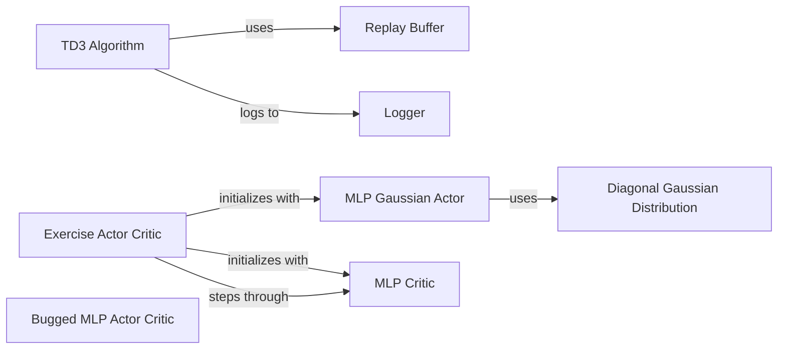

## Component Details

This component, 'Reinforcement Learning Exercises', contains problem sets and their solutions for learning and practicing reinforcement learning concepts, implemented in both PyTorch and TensorFlow. It serves as a tutorial and educational resource, demonstrating various algorithms and fundamental building blocks like actor-critic networks, replay buffers, and logging utilities.

### TD3 Algorithm
This component implements the Twin Delayed Deep Deterministic Policy Gradient (TD3) algorithm. It orchestrates the overall training loop, including interaction with the environment, experience collection, model updates for actor and critic networks, and logging of training progress. It utilizes a replay buffer for off-policy learning.

**Related Classes/Methods**:

- <a href="https://github.com/openai/spinningup/blob/master/spinup/exercises/pytorch/problem_set_1/exercise1_3.py#L60-L389" target="_blank" rel="noopener noreferrer">`spinup.exercises.pytorch.problem_set_1.exercise1_3.td3` (60:389)</a>
- <a href="https://github.com/openai/spinningup/blob/master/spinup/exercises/tf1/problem_set_1/exercise1_3.py#L58-L367" target="_blank" rel="noopener noreferrer">`spinup.exercises.tf1.problem_set_1.exercise1_3.td3` (58:367)</a>

### Replay Buffer
This component provides a simple FIFO experience replay buffer. It is responsible for storing transitions (observations, actions, rewards, next observations, and done signals) and efficiently sampling batches of these experiences for training reinforcement learning agents, particularly for off-policy algorithms like TD3.

**Related Classes/Methods**:

- <a href="https://github.com/openai/spinningup/blob/master/spinup/exercises/pytorch/problem_set_1/exercise1_3.py#L27-L56" target="_blank" rel="noopener noreferrer">`spinup.exercises.pytorch.problem_set_1.exercise1_3.ReplayBuffer` (27:56)</a>
- <a href="https://github.com/openai/spinningup/blob/master/spinup/exercises/pytorch/problem_set_1/exercise1_3.py#L40-L47" target="_blank" rel="noopener noreferrer">`spinup.exercises.pytorch.problem_set_1.exercise1_3.ReplayBuffer.store` (40:47)</a>
- <a href="https://github.com/openai/spinningup/blob/master/spinup/exercises/pytorch/problem_set_1/exercise1_3.py#L49-L56" target="_blank" rel="noopener noreferrer">`spinup.exercises.pytorch.problem_set_1.exercise1_3.ReplayBuffer.sample_batch` (49:56)</a>
- <a href="https://github.com/openai/spinningup/blob/master/spinup/exercises/tf1/problem_set_1/exercise1_3.py#L25-L53" target="_blank" rel="noopener noreferrer">`spinup.exercises.tf1.problem_set_1.exercise1_3.ReplayBuffer` (25:53)</a>
- <a href="https://github.com/openai/spinningup/blob/master/spinup/exercises/tf1/problem_set_1/exercise1_3.py#L38-L45" target="_blank" rel="noopener noreferrer">`spinup.exercises.tf1.problem_set_1.exercise1_3.ReplayBuffer.store` (38:45)</a>
- <a href="https://github.com/openai/spinningup/blob/master/spinup/exercises/tf1/problem_set_1/exercise1_3.py#L47-L53" target="_blank" rel="noopener noreferrer">`spinup.exercises.tf1.problem_set_1.exercise1_3.ReplayBuffer.sample_batch` (47:53)</a>

### Logger
This component provides comprehensive logging capabilities for reinforcement learning experiments. It handles saving diagnostics, hyperparameter configurations, and the state of training runs, including model checkpoints for both TensorFlow and PyTorch. It facilitates tracking and analyzing experiment results.

**Related Classes/Methods**:

- <a href="https://github.com/openai/spinningup/blob/master/spinup/utils/logx.py#L303-L383" target="_blank" rel="noopener noreferrer">`spinup.utils.logx.EpochLogger` (303:383)</a>
- <a href="https://github.com/openai/spinningup/blob/master/spinup/utils/logx.py#L136-L160" target="_blank" rel="noopener noreferrer">`spinup.utils.logx.Logger.save_config` (136:160)</a>
- <a href="https://github.com/openai/spinningup/blob/master/spinup/utils/logx.py#L115-L118" target="_blank" rel="noopener noreferrer">`spinup.utils.logx.Logger.log` (115:118)</a>
- <a href="https://github.com/openai/spinningup/blob/master/spinup/utils/logx.py#L234-L248" target="_blank" rel="noopener noreferrer">`spinup.utils.logx.Logger.setup_pytorch_saver` (234:248)</a>
- <a href="https://github.com/openai/spinningup/blob/master/spinup/utils/logx.py#L162-L192" target="_blank" rel="noopener noreferrer">`spinup.utils.logx.Logger.save_state` (162:192)</a>
- <a href="https://github.com/openai/spinningup/blob/master/spinup/utils/logx.py#L332-L342" target="_blank" rel="noopener noreferrer">`spinup.utils.logx.EpochLogger.store` (332:342)</a>
- <a href="https://github.com/openai/spinningup/blob/master/spinup/utils/logx.py#L344-L375" target="_blank" rel="noopener noreferrer">`spinup.utils.logx.EpochLogger.log_tabular` (344:375)</a>
- <a href="https://github.com/openai/spinningup/blob/master/spinup/utils/logx.py#L275-L301" target="_blank" rel="noopener noreferrer">`spinup.utils.logx.Logger.dump_tabular` (275:301)</a>
- <a href="https://github.com/openai/spinningup/blob/master/spinup/utils/logx.py#L194-L214" target="_blank" rel="noopener noreferrer">`spinup.utils.logx.Logger.setup_tf_saver` (194:214)</a>

### MLP Gaussian Actor
This component implements a Multi-Layer Perceptron (MLP) based diagonal Gaussian policy. It defines the neural network architecture for the actor, which outputs the mean of a Gaussian distribution, and manages the `log_std` parameter to define the variance, enabling the policy to sample continuous actions.

**Related Classes/Methods**:

- <a href="https://github.com/openai/spinningup/blob/master/spinup/exercises/pytorch/problem_set_1/exercise1_2.py#L71-L99" target="_blank" rel="noopener noreferrer">`spinup.exercises.pytorch.problem_set_1.exercise1_2.MLPGaussianActor` (71:99)</a>
- <a href="https://github.com/openai/spinningup/blob/master/spinup/exercises/pytorch/problem_set_1_solutions/exercise1_2_soln.py#L35-L49" target="_blank" rel="noopener noreferrer">`spinup.exercises.pytorch.problem_set_1_solutions.exercise1_2_soln.MLPGaussianActor` (35:49)</a>
- <a href="https://github.com/openai/spinningup/blob/master/spinup/exercises/tf1/problem_set_1_solutions/exercise1_2_soln.py#L16-L24" target="_blank" rel="noopener noreferrer">`spinup.exercises.tf1.problem_set_1_solutions.exercise1_2_soln.mlp_gaussian_policy` (16:24)</a>

### Diagonal Gaussian Distribution
This component represents a diagonal Gaussian distribution, a common choice for continuous action spaces in reinforcement learning. It provides methods for sampling actions from the distribution and computing the log probability of given actions, which are crucial for policy gradient methods.

**Related Classes/Methods**:

- <a href="https://github.com/openai/spinningup/blob/master/spinup/exercises/pytorch/problem_set_1/exercise1_2.py#L43-L67" target="_blank" rel="noopener noreferrer">`spinup.exercises.pytorch.problem_set_1.exercise1_2.DiagonalGaussianDistribution` (43:67)</a>
- <a href="https://github.com/openai/spinningup/blob/master/spinup/exercises/pytorch/problem_set_1/exercise1_2.py#L63-L64" target="_blank" rel="noopener noreferrer">`spinup.exercises.pytorch.problem_set_1.exercise1_2.DiagonalGaussianDistribution.log_prob` (63:64)</a>
- <a href="https://github.com/openai/spinningup/blob/master/spinup/exercises/pytorch/problem_set_1_solutions/exercise1_2_soln.py#L19-L32" target="_blank" rel="noopener noreferrer">`spinup.exercises.pytorch.problem_set_1_solutions.exercise1_2_soln.DiagonalGaussianDistribution` (19:32)</a>
- <a href="https://github.com/openai/spinningup/blob/master/spinup/exercises/pytorch/problem_set_1_solutions/exercise1_2_soln.py#L28-L29" target="_blank" rel="noopener noreferrer">`spinup.exercises.pytorch.problem_set_1_solutions.exercise1_2_soln.DiagonalGaussianDistribution.log_prob` (28:29)</a>

### MLP Critic
This component implements an MLP-based critic network, which is used to estimate value functions (e.g., Q-values or state-values) in reinforcement learning algorithms. It takes observations and potentially actions as input and outputs a single value representing the estimated value.

**Related Classes/Methods**:

- <a href="https://github.com/openai/spinningup/blob/master/spinup/exercises/pytorch/problem_set_1/exercise1_2_auxiliary.py#L25-L32" target="_blank" rel="noopener noreferrer">`spinup.exercises.pytorch.problem_set_1.exercise1_2_auxiliary.MLPCritic` (25:32)</a>

### Exercise Actor Critic
This component combines an actor and a critic network into a single structure for reinforcement learning exercises. It provides methods for interacting with the environment, such as stepping through and acting based on the current policy, facilitating the training and evaluation of actor-critic algorithms.

**Related Classes/Methods**:

- <a href="https://github.com/openai/spinningup/blob/master/spinup/exercises/pytorch/problem_set_1/exercise1_2_auxiliary.py#L35-L54" target="_blank" rel="noopener noreferrer">`spinup.exercises.pytorch.problem_set_1.exercise1_2_auxiliary.ExerciseActorCritic` (35:54)</a>
- <a href="https://github.com/openai/spinningup/blob/master/spinup/exercises/pytorch/problem_set_1/exercise1_2_auxiliary.py#L45-L51" target="_blank" rel="noopener noreferrer">`spinup.exercises.pytorch.problem_set_1.exercise1_2_auxiliary.ExerciseActorCritic.step` (45:51)</a>
- <a href="https://github.com/openai/spinningup/blob/master/spinup/exercises/pytorch/problem_set_1/exercise1_2_auxiliary.py#L53-L54" target="_blank" rel="noopener noreferrer">`spinup.exercises.pytorch.problem_set_1.exercise1_2_auxiliary.ExerciseActorCritic.act` (53:54)</a>

### Bugged MLP Actor Critic
This component represents a potentially bugged or intentionally flawed MLP Actor-Critic implementation, likely designed for debugging or problem-solving exercises within the reinforcement learning curriculum. It combines a `BuggedMLPActor` and `BuggedMLPQFunction` to simulate common errors or challenges.

**Related Classes/Methods**:

- <a href="https://github.com/openai/spinningup/blob/master/spinup/exercises/pytorch/problem_set_2/exercise2_2.py#L45-L61" target="_blank" rel="noopener noreferrer">`spinup.exercises.pytorch.problem_set_2.exercise2_2.BuggedMLPActorCritic` (45:61)</a>
- <a href="https://github.com/openai/spinningup/blob/master/spinup/exercises/pytorch/problem_set_2/exercise2_2.py#L59-L61" target="_blank" rel="noopener noreferrer">`spinup.exercises.pytorch.problem_set_2.exercise2_2.BuggedMLPActorCritic.act` (59:61)</a>

### [FAQ](https://github.com/CodeBoarding/GeneratedOnBoardings/tree/main?tab=readme-ov-file#faq)