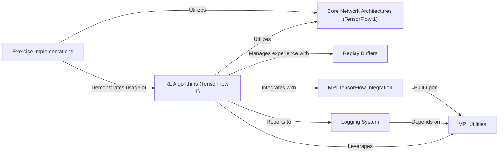

## Component Details

This graph provides an overview of the TensorFlow 1.x Algorithms subsystem, which implements various reinforcement learning algorithms. The main flow involves the RL Algorithms component orchestrating training loops, interacting with environments, managing experience through Replay Buffers, and updating policies/value functions using Core Network Architectures. The Logging System records progress, while MPI Utilities and MPI TensorFlow Integration support distributed training. Exercise Implementations demonstrate the usage of these core components.

### RL Algorithms (TensorFlow 1)
This component encapsulates the main training loops for various reinforcement learning algorithms implemented using TensorFlow 1. It orchestrates the interaction with the environment, manages experience collection, performs policy and value function updates, and handles logging and model saving.

**Related Classes/Methods**:

- <a href="https://github.com/openai/spinningup/blob/master/spinup/algos/tf1/ddpg/ddpg.py#L42-L287" target="_blank" rel="noopener noreferrer">`spinup.algos.tf1.ddpg.ddpg` (42:287)</a>
- <a href="https://github.com/openai/spinningup/blob/master/spinup/algos/tf1/ppo/ppo.py#L86-L301" target="_blank" rel="noopener noreferrer">`spinup.algos.tf1.ppo.ppo` (86:301)</a>
- <a href="https://github.com/openai/spinningup/blob/master/spinup/algos/tf1/sac/sac.py#L42-L313" target="_blank" rel="noopener noreferrer">`spinup.algos.tf1.sac.sac` (42:313)</a>
- <a href="https://github.com/openai/spinningup/blob/master/spinup/algos/tf1/td3/td3.py#L42-L313" target="_blank" rel="noopener noreferrer">`spinup.algos.tf1.td3.td3` (42:313)</a>
- <a href="https://github.com/openai/spinningup/blob/master/spinup/algos/tf1/trpo/trpo.py#L92-L379" target="_blank" rel="noopener noreferrer">`spinup.algos.tf1.trpo.trpo` (92:379)</a>
- <a href="https://github.com/openai/spinningup/blob/master/spinup/algos/tf1/vpg/vpg.py#L86-L276" target="_blank" rel="noopener noreferrer">`spinup.algos.tf1.vpg.vpg` (86:276)</a>

### Core Network Architectures (TensorFlow 1)
This component provides the fundamental building blocks for constructing neural networks used as policies and value functions within the TensorFlow 1 algorithms. It includes functions for creating placeholders, multi-layer perceptrons (MLPs), and specific actor-critic network configurations.

**Related Classes/Methods**:

- <a href="https://github.com/openai/spinningup/blob/master/spinup/algos/tf1/ddpg/core.py#L8-L9" target="_blank" rel="noopener noreferrer">`spinup.algos.tf1.ddpg.core:placeholders` (8:9)</a>
- <a href="https://github.com/openai/spinningup/blob/master/spinup/algos/tf1/ddpg/core.py#L19-L21" target="_blank" rel="noopener noreferrer">`spinup.algos.tf1.ddpg.core:count_vars` (19:21)</a>
- <a href="https://github.com/openai/spinningup/blob/master/spinup/algos/tf1/ddpg/core.py#L26-L36" target="_blank" rel="noopener noreferrer">`spinup.algos.tf1.ddpg.core:mlp_actor_critic` (26:36)</a>
- <a href="https://github.com/openai/spinningup/blob/master/spinup/algos/tf1/ddpg/core.py#L11-L14" target="_blank" rel="noopener noreferrer">`spinup.algos.tf1.ddpg.core:mlp` (11:14)</a>
- <a href="https://github.com/openai/spinningup/blob/master/spinup/algos/tf1/ddpg/core.py#L16-L17" target="_blank" rel="noopener noreferrer">`spinup.algos.tf1.ddpg.core:get_vars` (16:17)</a>
- <a href="https://github.com/openai/spinningup/blob/master/spinup/algos/tf1/ppo/core.py#L13-L14" target="_blank" rel="noopener noreferrer">`spinup.algos.tf1.ppo.core:placeholder` (13:14)</a>
- <a href="https://github.com/openai/spinningup/blob/master/spinup/algos/tf1/ppo/core.py#L16-L17" target="_blank" rel="noopener noreferrer">`spinup.algos.tf1.ppo.core:placeholders` (16:17)</a>
- <a href="https://github.com/openai/spinningup/blob/master/spinup/algos/tf1/ppo/core.py#L19-L24" target="_blank" rel="noopener noreferrer">`spinup.algos.tf1.ppo.core:placeholder_from_space` (19:24)</a>
- <a href="https://github.com/openai/spinningup/blob/master/spinup/algos/tf1/ppo/core.py#L26-L27" target="_blank" rel="noopener noreferrer">`spinup.algos.tf1.ppo.core:placeholders_from_spaces` (26:27)</a>
- <a href="https://github.com/openai/spinningup/blob/master/spinup/algos/tf1/ppo/core.py#L37-L39" target="_blank" rel="noopener noreferrer">`spinup.algos.tf1.ppo.core:count_vars` (37:39)</a>
- <a href="https://github.com/openai/spinningup/blob/master/spinup/algos/tf1/ppo/core.py#L67-L74" target="_blank" rel="noopener noreferrer">`spinup.algos.tf1.ppo.core:mlp_categorical_policy` (67:74)</a>
- <a href="https://github.com/openai/spinningup/blob/master/spinup/algos/tf1/ppo/core.py#L77-L85" target="_blank" rel="noopener noreferrer">`spinup.algos.tf1.ppo.core:mlp_gaussian_policy` (77:85)</a>
- <a href="https://github.com/openai/spinningup/blob/master/spinup/algos/tf1/ppo/core.py#L91-L104" target="_blank" rel="noopener noreferrer">`spinup.algos.tf1.ppo.core:mlp_actor_critic` (91:104)</a>
- <a href="https://github.com/openai/spinningup/blob/master/spinup/algos/tf1/ppo/core.py#L29-L32" target="_blank" rel="noopener noreferrer">`spinup.algos.tf1.ppo.core:mlp` (29:32)</a>
- <a href="https://github.com/openai/spinningup/blob/master/spinup/algos/tf1/ppo/core.py#L34-L35" target="_blank" rel="noopener noreferrer">`spinup.algos.tf1.ppo.core:get_vars` (34:35)</a>
- <a href="https://github.com/openai/spinningup/blob/master/spinup/algos/tf1/ppo/core.py#L8-L11" target="_blank" rel="noopener noreferrer">`spinup.algos.tf1.ppo.core:combined_shape` (8:11)</a>
- <a href="https://github.com/openai/spinningup/blob/master/spinup/algos/tf1/ppo/core.py#L41-L43" target="_blank" rel="noopener noreferrer">`spinup.algos.tf1.ppo.core:gaussian_likelihood` (41:43)</a>
- <a href="https://github.com/openai/spinningup/blob/master/spinup/algos/tf1/sac/core.py#L9-L10" target="_blank" rel="noopener noreferrer">`spinup.algos.tf1.sac.core:placeholders` (9:10)</a>
- <a href="https://github.com/openai/spinningup/blob/master/spinup/algos/tf1/sac/core.py#L20-L22" target="_blank" rel="noopener noreferrer">`spinup.algos.tf1.sac.core:count_vars` (20:22)</a>
- <a href="https://github.com/openai/spinningup/blob/master/spinup/algos/tf1/sac/core.py#L36-L46" target="_blank" rel="noopener noreferrer">`spinup.algos.tf1.sac.core:mlp_gaussian_policy` (36:46)</a>
- <a href="https://github.com/openai/spinningup/blob/master/spinup/algos/tf1/sac/core.py#L64-L82" target="_blank" rel="noopener noreferrer">`spinup.algos.tf1.sac.core:mlp_actor_critic` (64:82)</a>
- <a href="https://github.com/openai/spinningup/blob/master/spinup/algos/tf1/sac/core.py#L6-L7" target="_blank" rel="noopener noreferrer">`spinup.algos.tf1.sac.core:placeholder` (6:7)</a>
- <a href="https://github.com/openai/spinningup/blob/master/spinup/algos/tf1/sac/core.py#L12-L15" target="_blank" rel="noopener noreferrer">`spinup.algos.tf1.sac.core:mlp` (12:15)</a>
- <a href="https://github.com/openai/spinningup/blob/master/spinup/algos/tf1/sac/core.py#L17-L18" target="_blank" rel="noopener noreferrer">`spinup.algos.tf1.sac.core:get_vars` (17:18)</a>
- <a href="https://github.com/openai/spinningup/blob/master/spinup/algos/tf1/sac/core.py#L24-L26" target="_blank" rel="noopener noreferrer">`spinup.algos.tf1.sac.core:gaussian_likelihood` (24:26)</a>
- <a href="https://github.com/openai/spinningup/blob/master/spinup/algos/tf1/sac/core.py#L48-L59" target="_blank" rel="noopener noreferrer">`spinup.algos.tf1.sac.core:apply_squashing_func` (48:59)</a>
- <a href="https://github.com/openai/spinningup/blob/master/spinup/algos/tf1/td3/core.py#L8-L9" target="_blank" rel="noopener noreferrer">`spinup.algos.tf1.td3.core:placeholders` (8:9)</a>
- <a href="https://github.com/openai/spinningup/blob/master/spinup/algos/tf1/td3/core.py#L19-L21" target="_blank" rel="noopener noreferrer">`spinup.algos.tf1.td3.core:count_vars` (19:21)</a>
- <a href="https://github.com/openai/spinningup/blob/master/spinup/algos/tf1/td3/core.py#L26-L38" target="_blank" rel="noopener noreferrer">`spinup.algos.tf1.td3.core:mlp_actor_critic` (26:38)</a>
- <a href="https://github.com/openai/spinningup/blob/master/spinup/algos/tf1/td3/core.py#L5-L6" target="_blank" rel="noopener noreferrer">`spinup.algos.tf1.td3.core:placeholder` (5:6)</a>
- <a href="https://github.com/openai/spinningup/blob/master/spinup/algos/tf1/td3/core.py#L11-L14" target="_blank" rel="noopener noreferrer">`spinup.algos.tf1.td3.core:mlp` (11:14)</a>
- <a href="https://github.com/openai/spinningup/blob/master/spinup/algos/tf1/td3/core.py#L16-L17" target="_blank" rel="noopener noreferrer">`spinup.algos.tf1.td3.core:get_vars` (16:17)</a>
- <a href="https://github.com/openai/spinningup/blob/master/spinup/algos/tf1/trpo/core.py#L16-L17" target="_blank" rel="noopener noreferrer">`spinup.algos.tf1.trpo.core:values_as_sorted_list` (16:17)</a>
- <a href="https://github.com/openai/spinningup/blob/master/spinup/algos/tf1/trpo/core.py#L19-L20" target="_blank" rel="noopener noreferrer">`spinup.algos.tf1.trpo.core:placeholder` (19:20)</a>
- <a href="https://github.com/openai/spinningup/blob/master/spinup/algos/tf1/trpo/core.py#L22-L23" target="_blank" rel="noopener noreferrer">`spinup.algos.tf1.trpo.core:placeholders` (22:23)</a>
- <a href="https://github.com/openai/spinningup/blob/master/spinup/algos/tf1/trpo/core.py#L25-L30" target="_blank" rel="noopener noreferrer">`spinup.algos.tf1.trpo.core:placeholder_from_space` (25:30)</a>
- <a href="https://github.com/openai/spinningup/blob/master/spinup/algos/tf1/trpo/core.py#L32-L33" target="_blank" rel="noopener noreferrer">`spinup.algos.tf1.trpo.core:placeholders_from_spaces` (32:33)</a>
- <a href="https://github.com/openai/spinningup/blob/master/spinup/algos/tf1/trpo/core.py#L43-L45" target="_blank" rel="noopener noreferrer">`spinup.algos.tf1.trpo.core:count_vars` (43:45)</a>
- <a href="https://github.com/openai/spinningup/blob/master/spinup/algos/tf1/trpo/core.py#L73-L74" target="_blank" rel="noopener noreferrer">`spinup.algos.tf1.trpo.core:flat_grad` (73:74)</a>
- <a href="https://github.com/openai/spinningup/blob/master/spinup/algos/tf1/trpo/core.py#L76-L80" target="_blank" rel="noopener noreferrer">`spinup.algos.tf1.trpo.core:hessian_vector_product` (76:80)</a>
- <a href="https://github.com/openai/spinningup/blob/master/spinup/algos/tf1/trpo/core.py#L82-L86" target="_blank" rel="noopener noreferrer">`spinup.algos.tf1.trpo.core:assign_params_from_flat` (82:86)</a>
- <a href="https://github.com/openai/spinningup/blob/master/spinup/algos/tf1/trpo/core.py#L109-L123" target="_blank" rel="noopener noreferrer">`spinup.algos.tf1.trpo.core:mlp_categorical_policy` (109:123)</a>
- <a href="https://github.com/openai/spinningup/blob/master/spinup/algos/tf1/trpo/core.py#L126-L141" target="_blank" rel="noopener noreferrer">`spinup.algos.tf1.trpo.core:mlp_gaussian_policy` (126:141)</a>
- <a href="https://github.com/openai/spinningup/blob/master/spinup/algos/tf1/trpo/core.py#L147-L161" target="_blank" rel="noopener noreferrer">`spinup.algos.tf1.trpo.core:mlp_actor_critic` (147:161)</a>
- <a href="https://github.com/openai/spinningup/blob/master/spinup/algos/tf1/trpo/core.py#L13-L14" target="_blank" rel="noopener noreferrer">`spinup.algos.tf1.trpo.core:keys_as_sorted_list` (13:14)</a>
- <a href="https://github.com/openai/spinningup/blob/master/spinup/algos/tf1/trpo/core.py#L8-L11" target="_blank" rel="noopener noreferrer">`spinup.algos.tf1.trpo.core:combined_shape` (8:11)</a>
- <a href="https://github.com/openai/spinningup/blob/master/spinup/algos/tf1/trpo/core.py#L35-L38" target="_blank" rel="noopener noreferrer">`spinup.algos.tf1.trpo.core:mlp` (35:38)</a>
- <a href="https://github.com/openai/spinningup/blob/master/spinup/algos/tf1/trpo/core.py#L40-L41" target="_blank" rel="noopener noreferrer">`spinup.algos.tf1.trpo.core:get_vars` (40:41)</a>
- <a href="https://github.com/openai/spinningup/blob/master/spinup/algos/tf1/trpo/core.py#L70-L71" target="_blank" rel="noopener noreferrer">`spinup.algos.tf1.trpo.core:flat_concat` (70:71)</a>
- <a href="https://github.com/openai/spinningup/blob/master/spinup/algos/tf1/trpo/core.py#L62-L68" target="_blank" rel="noopener noreferrer">`spinup.algos.tf1.trpo.core:categorical_kl` (62:68)</a>
- <a href="https://github.com/openai/spinningup/blob/master/spinup/algos/tf1/trpo/core.py#L47-L49" target="_blank" rel="noopener noreferrer">`spinup.algos.tf1.trpo.core:gaussian_likelihood` (47:49)</a>
- <a href="https://github.com/openai/spinningup/blob/master/spinup/algos/tf1/trpo/core.py#L51-L60" target="_blank" rel="noopener noreferrer">`spinup.algos.tf1.trpo.core:diagonal_gaussian_kl` (51:60)</a>
- <a href="https://github.com/openai/spinningup/blob/master/spinup/algos/tf1/vpg/core.py#L13-L14" target="_blank" rel="noopener noreferrer">`spinup.algos.tf1.vpg.core:placeholder` (13:14)</a>
- <a href="https://github.com/openai/spinningup/blob/master/spinup/algos/tf1/vpg/core.py#L16-L17" target="_blank" rel="noopener noreferrer">`spinup.algos.tf1.vpg.core:placeholders` (16:17)</a>
- <a href="https://github.com/openai/spinningup/blob/master/spinup/algos/tf1/vpg/core.py#L19-L24" target="_blank" rel="noopener noreferrer">`spinup.algos.tf1.vpg.core:placeholder_from_space` (19:24)</a>
- <a href="https://github.com/openai/spinningup/blob/master/spinup/algos/tf1/vpg/core.py#L26-L27" target="_blank" rel="noopener noreferrer">`spinup.algos.tf1.vpg.core:placeholders_from_spaces` (26:27)</a>
- <a href="https://github.com/openai/spinningup/blob/master/spinup/algos/tf1/vpg/core.py#L37-L39" target="_blank" rel="noopener noreferrer">`spinup.algos.tf1.vpg.core:count_vars` (37:39)</a>
- <a href="https://github.com/openai/spinningup/blob/master/spinup/algos/tf1/vpg/core.py#L67-L74" target="_blank" rel="noopener noreferrer">`spinup.algos.tf1.vpg.core:mlp_categorical_policy` (67:74)</a>
- <a href="https://github.com/openai/spinningup/blob/master/spinup/algos/tf1/vpg/core.py#L77-L85" target="_blank" rel="noopener noreferrer">`spinup.algos.tf1.vpg.core:mlp_gaussian_policy` (77:85)</a>
- <a href="https://github.com/openai/spinningup/blob/master/spinup/algos/tf1/vpg/core.py#L91-L104" target="_blank" rel="noopener noreferrer">`spinup.algos.tf1.vpg.core:mlp_actor_critic` (91:104)</a>
- <a href="https://github.com/openai/spinningup/blob/master/spinup/algos/tf1/vpg/core.py#L8-L11" target="_blank" rel="noopener noreferrer">`spinup.algos.tf1.vpg.core:combined_shape` (8:11)</a>
- <a href="https://github.com/openai/spinningup/blob/master/spinup/algos/tf1/vpg/core.py#L29-L32" target="_blank" rel="noopener noreferrer">`spinup.algos.tf1.vpg.core:mlp` (29:32)</a>
- <a href="https://github.com/openai/spinningup/blob/master/spinup/algos/tf1/vpg/core.py#L34-L35" target="_blank" rel="noopener noreferrer">`spinup.algos.tf1.vpg.core:get_vars` (34:35)</a>
- <a href="https://github.com/openai/spinningup/blob/master/spinup/algos/tf1/vpg/core.py#L41-L43" target="_blank" rel="noopener noreferrer">`spinup.algos.tf1.vpg.core:gaussian_likelihood` (41:43)</a>

### Replay Buffers
This component provides data structures for storing and sampling experience transitions (observations, actions, rewards, next observations, done flags). It is crucial for off-policy reinforcement learning algorithms and also used in on-policy methods for batching.

**Related Classes/Methods**:

- <a href="https://github.com/openai/spinningup/blob/master/spinup/algos/tf1/ddpg/ddpg.py#L10-L38" target="_blank" rel="noopener noreferrer">`spinup.algos.tf1.ddpg.ddpg.ReplayBuffer` (10:38)</a>
- <a href="https://github.com/openai/spinningup/blob/master/spinup/algos/tf1/sac/sac.py#L10-L38" target="_blank" rel="noopener noreferrer">`spinup.algos.tf1.sac.sac.ReplayBuffer` (10:38)</a>
- <a href="https://github.com/openai/spinningup/blob/master/spinup/algos/tf1/td3/td3.py#L10-L38" target="_blank" rel="noopener noreferrer">`spinup.algos.tf1.td3.td3.ReplayBuffer` (10:38)</a>
- <a href="https://github.com/openai/spinningup/blob/master/spinup/algos/tf1/ppo/ppo.py#L11-L82" target="_blank" rel="noopener noreferrer">`spinup.algos.tf1.ppo.ppo.PPOBuffer` (11:82)</a>
- <a href="https://github.com/openai/spinningup/blob/master/spinup/algos/tf1/trpo/trpo.py#L13-L88" target="_blank" rel="noopener noreferrer">`spinup.algos.tf1.trpo.trpo.GAEBuffer` (13:88)</a>
- <a href="https://github.com/openai/spinningup/blob/master/spinup/algos/tf1/vpg/vpg.py#L11-L82" target="_blank" rel="noopener noreferrer">`spinup.algos.tf1.vpg.vpg.VPGBuffer` (11:82)</a>

### Logging System
This component is responsible for recording and reporting experiment progress, hyperparameters, and performance metrics. It provides functionalities for saving configurations, setting up TensorFlow savers, storing episodic data, and printing tabular logs to console and file.

**Related Classes/Methods**:

- <a href="https://github.com/openai/spinningup/blob/master/spinup/utils/logx.py#L303-L383" target="_blank" rel="noopener noreferrer">`spinup.utils.logx.EpochLogger` (303:383)</a>
- <a href="https://github.com/openai/spinningup/blob/master/spinup/utils/logx.py#L71-L301" target="_blank" rel="noopener noreferrer">`spinup.utils.logx.Logger` (71:301)</a>
- <a href="https://github.com/openai/spinningup/blob/master/spinup/utils/logx.py#L136-L160" target="_blank" rel="noopener noreferrer">`spinup.utils.logx.Logger.save_config` (136:160)</a>
- <a href="https://github.com/openai/spinningup/blob/master/spinup/utils/logx.py#L194-L214" target="_blank" rel="noopener noreferrer">`spinup.utils.logx.Logger.setup_tf_saver` (194:214)</a>
- <a href="https://github.com/openai/spinningup/blob/master/spinup/utils/logx.py#L162-L192" target="_blank" rel="noopener noreferrer">`spinup.utils.logx.Logger.save_state` (162:192)</a>
- <a href="https://github.com/openai/spinningup/blob/master/spinup/utils/logx.py#L332-L342" target="_blank" rel="noopener noreferrer">`spinup.utils.logx.EpochLogger.store` (332:342)</a>
- <a href="https://github.com/openai/spinningup/blob/master/spinup/utils/logx.py#L344-L375" target="_blank" rel="noopener noreferrer">`spinup.utils.logx.EpochLogger.log_tabular` (344:375)</a>
- <a href="https://github.com/openai/spinningup/blob/master/spinup/utils/logx.py#L275-L301" target="_blank" rel="noopener noreferrer">`spinup.utils.logx.Logger.dump_tabular` (275:301)</a>

### MPI Utilities
This component provides helper functions for managing MPI (Message Passing Interface) processes, including obtaining process ranks, counting active processes, and performing collective communication operations like summing and averaging values across all processes.

**Related Classes/Methods**:

- <a href="https://github.com/openai/spinningup/blob/master/spinup/utils/mpi_tools.py#L42-L44" target="_blank" rel="noopener noreferrer">`spinup.utils.mpi_tools.proc_id` (42:44)</a>
- <a href="https://github.com/openai/spinningup/blob/master/spinup/utils/mpi_tools.py#L49-L51" target="_blank" rel="noopener noreferrer">`spinup.utils.mpi_tools.num_procs` (49:51)</a>
- <a href="https://github.com/openai/spinningup/blob/master/spinup/utils/mpi_tools.py#L70-L92" target="_blank" rel="noopener noreferrer">`spinup.utils.mpi_tools.mpi_statistics_scalar` (70:92)</a>
- <a href="https://github.com/openai/spinningup/blob/master/spinup/utils/mpi_tools.py#L66-L68" target="_blank" rel="noopener noreferrer">`spinup.utils.mpi_tools.mpi_avg` (66:68)</a>

### MPI TensorFlow Integration
This component extends TensorFlow's capabilities to work seamlessly in an MPI distributed environment. It includes an Adam optimizer that averages gradients across MPI processes and functions for synchronizing TensorFlow variables across all participating processes.

**Related Classes/Methods**:

- <a href="https://github.com/openai/spinningup/blob/master/spinup/utils/mpi_tf.py#L29-L78" target="_blank" rel="noopener noreferrer">`spinup.utils.mpi_tf.MpiAdamOptimizer` (29:78)</a>
- <a href="https://github.com/openai/spinningup/blob/master/spinup/utils/mpi_tf.py#L24-L26" target="_blank" rel="noopener noreferrer">`spinup.utils.mpi_tf.sync_all_params` (24:26)</a>
- <a href="https://github.com/openai/spinningup/blob/master/spinup/utils/mpi_tf.py#L7-L8" target="_blank" rel="noopener noreferrer">`spinup.utils.mpi_tf.flat_concat` (7:8)</a>
- <a href="https://github.com/openai/spinningup/blob/master/spinup/utils/mpi_tf.py#L10-L14" target="_blank" rel="noopener noreferrer">`spinup.utils.mpi_tf.assign_params_from_flat` (10:14)</a>

### Exercise Implementations
This component contains specific implementations of reinforcement learning algorithms or parts of them, designed as exercises or solutions to problem sets within the Spinning Up educational framework. They demonstrate how to utilize the core components to build functional RL agents.

**Related Classes/Methods**:

- <a href="https://github.com/openai/spinningup/blob/master/spinup/exercises/tf1/problem_set_1/exercise1_3.py#L58-L367" target="_blank" rel="noopener noreferrer">`spinup.exercises.tf1.problem_set_1.exercise1_3:td3` (58:367)</a>
- <a href="https://github.com/openai/spinningup/blob/master/spinup/exercises/tf1/problem_set_1_solutions/exercise1_2_soln.py#L16-L24" target="_blank" rel="noopener noreferrer">`spinup.exercises.tf1.problem_set_1_solutions.exercise1_2_soln:mlp_gaussian_policy` (16:24)</a>

### [FAQ](https://github.com/CodeBoarding/GeneratedOnBoardings/tree/main?tab=readme-ov-file#faq)