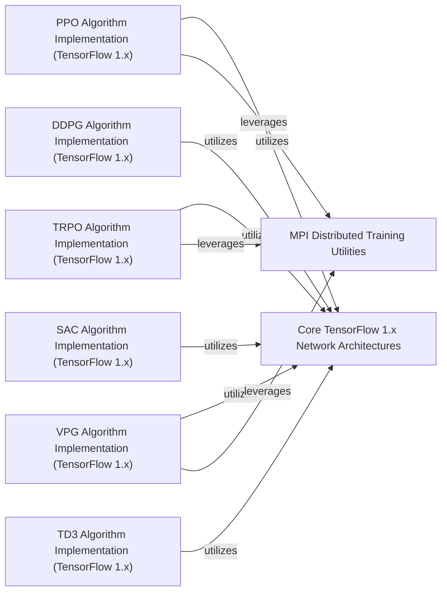

## Component Details

This system provides a comprehensive set of utilities and implementations for various reinforcement learning algorithms built on TensorFlow 1.x. It includes core neural network architectures, utilities for distributed training using MPI, and specific implementations of algorithms such as PPO, TRPO, VPG, DDPG, SAC, and TD3. The main flow involves agents interacting with environments, storing experiences, and updating their policies and value functions using the defined network architectures and optimization techniques, with some algorithms supporting distributed training via MPI.

### MPI Distributed Training Utilities
This component provides essential utilities for distributed computation using Message Passing Interface (MPI) for TensorFlow 1.x. It handles the synchronization of parameters across multiple processes, averages gradients, and offers an MPI-aware Adam optimizer.

**Related Classes/Methods**:

- <a href="https://github.com/openai/spinningup/blob/master/spinup/utils/mpi_tf.py#L10-L14" target="_blank" rel="noopener noreferrer">`spinup.utils.mpi_tf.assign_params_from_flat` (10:14)</a>
- <a href="https://github.com/openai/spinningup/blob/master/spinup/utils/mpi_tf.py#L16-L22" target="_blank" rel="noopener noreferrer">`spinup.utils.mpi_tf.sync_params` (16:22)</a>
- <a href="https://github.com/openai/spinningup/blob/master/spinup/utils/mpi_tf.py#L24-L26" target="_blank" rel="noopener noreferrer">`spinup.utils.mpi_tf.sync_all_params` (24:26)</a>
- <a href="https://github.com/openai/spinningup/blob/master/spinup/utils/mpi_tf.py#L29-L78" target="_blank" rel="noopener noreferrer">`spinup.utils.mpi_tf.MpiAdamOptimizer` (29:78)</a>

### Core TensorFlow 1.x Network Architectures
This component provides foundational neural network structures and utility functions specifically for TensorFlow 1.x, used to build actor and critic networks in various reinforcement learning algorithms. It includes functions for creating placeholders, defining multi-layer perceptrons (MLPs), counting variables, and handling probability distributions.

**Related Classes/Methods**:

- <a href="https://github.com/openai/spinningup/blob/master/spinup/algos/tf1/ddpg/core.py#L8-L9" target="_blank" rel="noopener noreferrer">`spinup.algos.tf1.ddpg.core.placeholders` (8:9)</a>
- <a href="https://github.com/openai/spinningup/blob/master/spinup/algos/tf1/ddpg/core.py#L19-L21" target="_blank" rel="noopener noreferrer">`spinup.algos.tf1.ddpg.core.count_vars` (19:21)</a>
- <a href="https://github.com/openai/spinningup/blob/master/spinup/algos/tf1/ddpg/core.py#L26-L36" target="_blank" rel="noopener noreferrer">`spinup.algos.tf1.ddpg.core.mlp_actor_critic` (26:36)</a>
- <a href="https://github.com/openai/spinningup/blob/master/spinup/algos/tf1/ppo/core.py#L13-L14" target="_blank" rel="noopener noreferrer">`spinup.algos.tf1.ppo.core.placeholder` (13:14)</a>
- <a href="https://github.com/openai/spinningup/blob/master/spinup/algos/tf1/ppo/core.py#L16-L17" target="_blank" rel="noopener noreferrer">`spinup.algos.tf1.ppo.core.placeholders` (16:17)</a>
- <a href="https://github.com/openai/spinningup/blob/master/spinup/algos/tf1/ppo/core.py#L19-L24" target="_blank" rel="noopener noreferrer">`spinup.algos.tf1.ppo.core.placeholder_from_space` (19:24)</a>
- <a href="https://github.com/openai/spinningup/blob/master/spinup/algos/tf1/ppo/core.py#L26-L27" target="_blank" rel="noopener noreferrer">`spinup.algos.tf1.ppo.core.placeholders_from_spaces` (26:27)</a>
- <a href="https://github.com/openai/spinningup/blob/master/spinup/algos/tf1/ppo/core.py#L37-L39" target="_blank" rel="noopener noreferrer">`spinup.algos.tf1.ppo.core.count_vars` (37:39)</a>
- <a href="https://github.com/openai/spinningup/blob/master/spinup/algos/tf1/ppo/core.py#L67-L74" target="_blank" rel="noopener noreferrer">`spinup.algos.tf1.ppo.core.mlp_categorical_policy` (67:74)</a>
- <a href="https://github.com/openai/spinningup/blob/master/spinup/algos/tf1/ppo/core.py#L77-L85" target="_blank" rel="noopener noreferrer">`spinup.algos.tf1.ppo.core.mlp_gaussian_policy` (77:85)</a>
- <a href="https://github.com/openai/spinningup/blob/master/spinup/algos/tf1/ppo/core.py#L91-L104" target="_blank" rel="noopener noreferrer">`spinup.algos.tf1.ppo.core.mlp_actor_critic` (91:104)</a>
- <a href="https://github.com/openai/spinningup/blob/master/spinup/algos/tf1/sac/core.py#L9-L10" target="_blank" rel="noopener noreferrer">`spinup.algos.tf1.sac.core.placeholders` (9:10)</a>
- <a href="https://github.com/openai/spinningup/blob/master/spinup/algos/tf1/sac/core.py#L20-L22" target="_blank" rel="noopener noreferrer">`spinup.algos.tf1.sac.core.count_vars` (20:22)</a>
- <a href="https://github.com/openai/spinningup/blob/master/spinup/algos/tf1/sac/core.py#L36-L46" target="_blank" rel="noopener noreferrer">`spinup.algos.tf1.sac.core.mlp_gaussian_policy` (36:46)</a>
- <a href="https://github.com/openai/spinningup/blob/master/spinup/algos/tf1/sac/core.py#L64-L82" target="_blank" rel="noopener noreferrer">`spinup.algos.tf1.sac.core.mlp_actor_critic` (64:82)</a>
- <a href="https://github.com/openai/spinningup/blob/master/spinup/algos/tf1/td3/core.py#L8-L9" target="_blank" rel="noopener noreferrer">`spinup.algos.tf1.td3.core.placeholders` (8:9)</a>
- <a href="https://github.com/openai/spinningup/blob/master/spinup/algos/tf1/td3/core.py#L19-L21" target="_blank" rel="noopener noreferrer">`spinup.algos.tf1.td3.core.count_vars` (19:21)</a>
- <a href="https://github.com/openai/spinningup/blob/master/spinup/algos/tf1/td3/core.py#L26-L38" target="_blank" rel="noopener noreferrer">`spinup.algos.tf1.td3.core.mlp_actor_critic` (26:38)</a>
- <a href="https://github.com/openai/spinningup/blob/master/spinup/algos/tf1/trpo/core.py#L16-L17" target="_blank" rel="noopener noreferrer">`spinup.algos.tf1.trpo.core.values_as_sorted_list` (16:17)</a>
- <a href="https://github.com/openai/spinningup/blob/master/spinup/algos/tf1/trpo/core.py#L19-L20" target="_blank" rel="noopener noreferrer">`spinup.algos.tf1.trpo.core.placeholder` (19:20)</a>
- <a href="https://github.com/openai/spinningup/blob/master/spinup/algos/tf1/trpo/core.py#L22-L23" target="_blank" rel="noopener noreferrer">`spinup.algos.tf1.trpo.core.placeholders` (22:23)</a>
- <a href="https://github.com/openai/spinningup/blob/master/spinup/algos/tf1/trpo/core.py#L25-L30" target="_blank" rel="noopener noreferrer">`spinup.algos.tf1.trpo.core.placeholder_from_space` (25:30)</a>
- <a href="https://github.com/openai/spinningup/blob/master/spinup/algos/tf1/trpo/core.py#L32-L33" target="_blank" rel="noopener noreferrer">`spinup.algos.tf1.trpo.core.placeholders_from_spaces` (32:33)</a>
- <a href="https://github.com/openai/spinningup/blob/master/spinup/algos/tf1/trpo/core.py#L43-L45" target="_blank" rel="noopener noreferrer">`spinup.algos.tf1.trpo.core.count_vars` (43:45)</a>
- <a href="https://github.com/openai/spinningup/blob/master/spinup/algos/tf1/trpo/core.py#L73-L74" target="_blank" rel="noopener noreferrer">`spinup.algos.tf1.trpo.core.flat_grad` (73:74)</a>
- <a href="https://github.com/openai/spinningup/blob/master/spinup/algos/tf1/trpo/core.py#L76-L80" target="_blank" rel="noopener noreferrer">`spinup.algos.tf1.trpo.core.hessian_vector_product` (76:80)</a>
- <a href="https://github.com/openai/spinningup/blob/master/spinup/algos/tf1/trpo/core.py#L82-L86" target="_blank" rel="noopener noreferrer">`spinup.algos.tf1.trpo.core.assign_params_from_flat` (82:86)</a>
- <a href="https://github.com/openai/spinningup/blob/master/spinup/algos/tf1/trpo/core.py#L109-L123" target="_blank" rel="noopener noreferrer">`spinup.algos.tf1.trpo.core.mlp_categorical_policy` (109:123)</a>
- <a href="https://github.com/openai/spinningup/blob/master/spinup/algos/tf1/trpo/core.py#L126-L141" target="_blank" rel="noopener noreferrer">`spinup.algos.tf1.trpo.core.mlp_gaussian_policy` (126:141)</a>
- <a href="https://github.com/openai/spinningup/blob/master/spinup/algos/tf1/trpo/core.py#L147-L161" target="_blank" rel="noopener noreferrer">`spinup.algos.tf1.trpo.core.mlp_actor_critic` (147:161)</a>
- <a href="https://github.com/openai/spinningup/blob/master/spinup/algos/tf1/vpg/core.py#L13-L14" target="_blank" rel="noopener noreferrer">`spinup.algos.tf1.vpg.core.placeholder` (13:14)</a>
- <a href="https://github.com/openai/spinningup/blob/master/spinup/algos/tf1/vpg/core.py#L16-L17" target="_blank" rel="noopener noreferrer">`spinup.algos.tf1.vpg.core.placeholders` (16:17)</a>
- <a href="https://github.com/openai/spinningup/blob/master/spinup/algos/tf1/vpg/core.py#L19-L24" target="_blank" rel="noopener noreferrer">`spinup.algos.tf1.vpg.core.placeholder_from_space` (19:24)</a>
- <a href="https://github.com/openai/spinningup/blob/master/spinup/algos/tf1/vpg/core.py#L26-L27" target="_blank" rel="noopener noreferrer">`spinup.algos.tf1.vpg.core.placeholders_from_spaces` (26:27)</a>
- <a href="https://github.com/openai/spinningup/blob/master/spinup/algos/tf1/vpg/core.py#L37-L39" target="_blank" rel="noopener noreferrer">`spinup.algos.tf1.vpg.core.count_vars` (37:39)</a>
- <a href="https://github.com/openai/spinningup/blob/master/spinup/algos/tf1/vpg/core.py#L67-L74" target="_blank" rel="noopener noreferrer">`spinup.algos.tf1.vpg.core.mlp_categorical_policy` (67:74)</a>
- <a href="https://github.com/openai/spinningup/blob/master/spinup/algos/tf1/vpg/core.py#L77-L85" target="_blank" rel="noopener noreferrer">`spinup.algos.tf1.vpg.core.mlp_gaussian_policy` (77:85)</a>
- <a href="https://github.com/openai/spinningup/blob/master/spinup/algos/tf1/vpg/core.py#L91-L104" target="_blank" rel="noopener noreferrer">`spinup.algos.tf1.vpg.core.mlp_actor_critic` (91:104)</a>

### PPO Algorithm Implementation (TensorFlow 1.x)
This component encapsulates the specific implementation of the Proximal Policy Optimization (PPO) algorithm using TensorFlow 1.x. It defines the PPO training loop, manages the experience buffer (PPOBuffer), calculates policy and value losses, and integrates with MPI utilities for distributed training.

**Related Classes/Methods**:

- <a href="https://github.com/openai/spinningup/blob/master/spinup/algos/tf1/ppo/ppo.py#L86-L301" target="_blank" rel="noopener noreferrer">`spinup.algos.tf1.ppo.ppo` (86:301)</a>
- <a href="https://github.com/openai/spinningup/blob/master/spinup/algos/tf1/ppo/ppo.py#L11-L82" target="_blank" rel="noopener noreferrer">`spinup.algos.tf1.ppo.ppo:PPOBuffer` (11:82)</a>
- <a href="https://github.com/openai/spinningup/blob/master/spinup/algos/tf1/ppo/ppo.py#L86-L301" target="_blank" rel="noopener noreferrer">`spinup.algos.tf1.ppo.ppo:ppo` (86:301)</a>

### TRPO Algorithm Implementation (TensorFlow 1.x)
This component implements the Trust Region Policy Optimization (TRPO) algorithm using TensorFlow 1.x, which involves more complex policy updates using conjugate gradient and Hessian-vector products to ensure policy improvements within a trust region.

**Related Classes/Methods**:

- <a href="https://github.com/openai/spinningup/blob/master/spinup/algos/tf1/trpo/trpo.py#L92-L379" target="_blank" rel="noopener noreferrer">`spinup.algos.tf1.trpo.trpo` (92:379)</a>
- <a href="https://github.com/openai/spinningup/blob/master/spinup/algos/tf1/trpo/trpo.py#L92-L379" target="_blank" rel="noopener noreferrer">`spinup.algos.tf1.trpo.trpo:trpo` (92:379)</a>

### VPG Algorithm Implementation (TensorFlow 1.x)
This component provides the implementation for the Vanilla Policy Gradient (VPG) algorithm using TensorFlow 1.x, a fundamental policy gradient method.

**Related Classes/Methods**:

- <a href="https://github.com/openai/spinningup/blob/master/spinup/algos/tf1/vpg/vpg.py#L86-L276" target="_blank" rel="noopener noreferrer">`spinup.algos.tf1.vpg.vpg` (86:276)</a>
- <a href="https://github.com/openai/spinningup/blob/master/spinup/algos/tf1/vpg/vpg.py#L86-L276" target="_blank" rel="noopener noreferrer">`spinup.algos.tf1.vpg.vpg:vpg` (86:276)</a>

### DDPG Algorithm Implementation (TensorFlow 1.x)
This component implements the Deep Deterministic Policy Gradient (DDPG) algorithm using TensorFlow 1.x.

**Related Classes/Methods**:

- <a href="https://github.com/openai/spinningup/blob/master/spinup/algos/tf1/ddpg/ddpg.py#L42-L287" target="_blank" rel="noopener noreferrer">`spinup.algos.tf1.ddpg.ddpg` (42:287)</a>
- <a href="https://github.com/openai/spinningup/blob/master/spinup/algos/tf1/ddpg/ddpg.py#L42-L287" target="_blank" rel="noopener noreferrer">`spinup.algos.tf1.ddpg.ddpg:ddpg` (42:287)</a>

### SAC Algorithm Implementation (TensorFlow 1.x)
This component implements the Soft Actor-Critic (SAC) algorithm using TensorFlow 1.x.

**Related Classes/Methods**:

- <a href="https://github.com/openai/spinningup/blob/master/spinup/algos/tf1/sac/sac.py#L42-L313" target="_blank" rel="noopener noreferrer">`spinup.algos.tf1.sac.sac` (42:313)</a>
- <a href="https://github.com/openai/spinningup/blob/master/spinup/algos/tf1/sac/sac.py#L42-L313" target="_blank" rel="noopener noreferrer">`spinup.algos.tf1.sac.sac:sac` (42:313)</a>

### TD3 Algorithm Implementation (TensorFlow 1.x)
This component implements the Twin Delayed DDPG (TD3) algorithm using TensorFlow 1.x.

**Related Classes/Methods**:

- <a href="https://github.com/openai/spinningup/blob/master/spinup/algos/tf1/td3/td3.py#L42-L313" target="_blank" rel="noopener noreferrer">`spinup.algos.tf1.td3.td3` (42:313)</a>
- <a href="https://github.com/openai/spinningup/blob/master/spinup/algos/tf1/td3/td3.py#L42-L313" target="_blank" rel="noopener noreferrer">`spinup.algos.tf1.td3.td3:td3` (42:313)</a>

### [FAQ](https://github.com/CodeBoarding/GeneratedOnBoardings/tree/main?tab=readme-ov-file#faq)