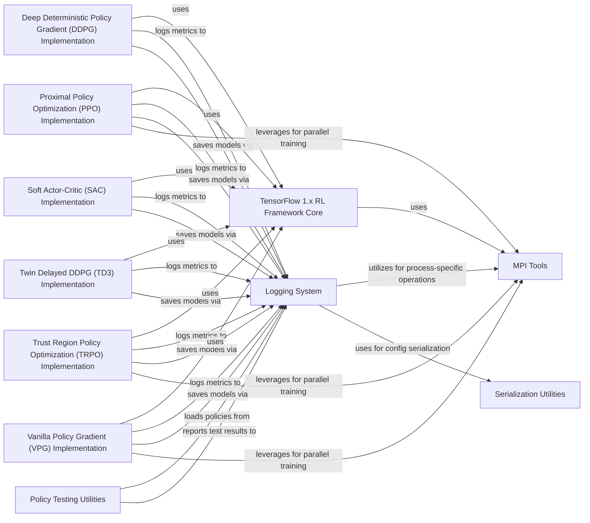

## Component Details

This framework provides a comprehensive suite of reinforcement learning algorithms implemented in TensorFlow 1.x. It includes core utilities for building neural network architectures, managing training processes, and handling data buffers. The framework supports distributed training through MPI and offers robust logging and serialization capabilities for experiment management and policy evaluation.

### TensorFlow 1.x RL Framework Core
Provides core utilities and implementations for various reinforcement learning algorithms using the TensorFlow 1.x deep learning framework, including neural network architectures, training loops, and data buffers. It also integrates with MPI for distributed training.

**Related Classes/Methods**:

- <a href="https://github.com/openai/spinningup/blob/master/spinup/utils/mpi_tf.py#L10-L14" target="_blank" rel="noopener noreferrer">`spinup.utils.mpi_tf.assign_params_from_flat` (10:14)</a>
- <a href="https://github.com/openai/spinningup/blob/master/spinup/utils/mpi_tf.py#L16-L22" target="_blank" rel="noopener noreferrer">`spinup.utils.mpi_tf.sync_params` (16:22)</a>
- <a href="https://github.com/openai/spinningup/blob/master/spinup/utils/mpi_tf.py#L24-L26" target="_blank" rel="noopener noreferrer">`spinup.utils.mpi_tf.sync_all_params` (24:26)</a>
- <a href="https://github.com/openai/spinningup/blob/master/spinup/utils/mpi_tf.py#L29-L78" target="_blank" rel="noopener noreferrer">`spinup.utils.mpi_tf.MpiAdamOptimizer` (29:78)</a>
- <a href="https://github.com/openai/spinningup/blob/master/spinup/algos/tf1/ddpg/core.py#L8-L9" target="_blank" rel="noopener noreferrer">`spinup.algos.tf1.ddpg.core.placeholders` (8:9)</a>
- <a href="https://github.com/openai/spinningup/blob/master/spinup/algos/tf1/ddpg/core.py#L19-L21" target="_blank" rel="noopener noreferrer">`spinup.algos.tf1.ddpg.core.count_vars` (19:21)</a>
- <a href="https://github.com/openai/spinningup/blob/master/spinup/algos/tf1/ddpg/core.py#L26-L36" target="_blank" rel="noopener noreferrer">`spinup.algos.tf1.ddpg.core.mlp_actor_critic` (26:36)</a>
- <a href="https://github.com/openai/spinningup/blob/master/spinup/algos/tf1/ppo/core.py#L13-L14" target="_blank" rel="noopener noreferrer">`spinup.algos.tf1.ppo.core.placeholder` (13:14)</a>
- <a href="https://github.com/openai/spinningup/blob/master/spinup/algos/tf1/ppo/core.py#L16-L17" target="_blank" rel="noopener noreferrer">`spinup.algos.tf1.ppo.core.placeholders` (16:17)</a>
- <a href="https://github.com/openai/spinningup/blob/master/spinup/algos/tf1/ppo/core.py#L19-L24" target="_blank" rel="noopener noreferrer">`spinup.algos.tf1.ppo.core.placeholder_from_space` (19:24)</a>
- <a href="https://github.com/openai/spinningup/blob/master/spinup/algos/tf1/ppo/core.py#L26-L27" target="_blank" rel="noopener noreferrer">`spinup.algos.tf1.ppo.core.placeholders_from_spaces` (26:27)</a>
- <a href="https://github.com/openai/spinningup/blob/master/spinup/algos/tf1/ppo/core.py#L37-L39" target="_blank" rel="noopener noreferrer">`spinup.algos.tf1.ppo.core.count_vars` (37:39)</a>
- <a href="https://github.com/openai/spinningup/blob/master/spinup/algos/tf1/ppo/core.py#L67-L74" target="_blank" rel="noopener noreferrer">`spinup.algos.tf1.ppo.core.mlp_categorical_policy` (67:74)</a>
- <a href="https://github.com/openai/spinningup/blob/master/spinup/algos/tf1/ppo/core.py#L77-L85" target="_blank" rel="noopener noreferrer">`spinup.algos.tf1.ppo.core.mlp_gaussian_policy` (77:85)</a>
- <a href="https://github.com/openai/spinningup/blob/master/spinup/algos/tf1/ppo/core.py#L91-L104" target="_blank" rel="noopener noreferrer">`spinup.algos.tf1.ppo.core.mlp_actor_critic` (91:104)</a>
- <a href="https://github.com/openai/spinningup/blob/master/spinup/algos/tf1/sac/core.py#L9-L10" target="_blank" rel="noopener noreferrer">`spinup.algos.tf1.sac.core.placeholders` (9:10)</a>
- <a href="https://github.com/openai/spinningup/blob/master/spinup/algos/tf1/sac/core.py#L20-L22" target="_blank" rel="noopener noreferrer">`spinup.algos.tf1.sac.core.count_vars` (20:22)</a>
- <a href="https://github.com/openai/spinningup/blob/master/spinup/algos/tf1/sac/core.py#L36-L46" target="_blank" rel="noopener noreferrer">`spinup.algos.tf1.sac.core.mlp_gaussian_policy` (36:46)</a>
- <a href="https://github.com/openai/spinningup/blob/master/spinup/algos/tf1/sac/core.py#L64-L82" target="_blank" rel="noopener noreferrer">`spinup.algos.tf1.sac.core.mlp_actor_critic` (64:82)</a>
- <a href="https://github.com/openai/spinningup/blob/master/spinup/algos/tf1/td3/core.py#L8-L9" target="_blank" rel="noopener noreferrer">`spinup.algos.tf1.td3.core.placeholders` (8:9)</a>
- <a href="https://github.com/openai/spinningup/blob/master/spinup/algos/tf1/td3/core.py#L19-L21" target="_blank" rel="noopener noreferrer">`spinup.algos.tf1.td3.core.count_vars` (19:21)</a>
- <a href="https://github.com/openai/spinningup/blob/master/spinup/algos/tf1/td3/core.py#L26-L38" target="_blank" rel="noopener noreferrer">`spinup.algos.tf1.td3.core.mlp_actor_critic` (26:38)</a>
- <a href="https://github.com/openai/spinningup/blob/master/spinup/algos/tf1/trpo/core.py#L16-L17" target="_blank" rel="noopener noreferrer">`spinup.algos.tf1.trpo.core.values_as_sorted_list` (16:17)</a>
- <a href="https://github.com/openai/spinningup/blob/master/spinup/algos/tf1/trpo/core.py#L19-L20" target="_blank" rel="noopener noreferrer">`spinup.algos.tf1.trpo.core.placeholder` (19:20)</a>
- <a href="https://github.com/openai/spinningup/blob/master/spinup/algos/tf1/trpo/core.py#L22-L23" target="_blank" rel="noopener noreferrer">`spinup.algos.tf1.trpo.core.placeholders` (22:23)</a>
- <a href="https://github.com/openai/spinningup/blob/master/spinup/algos/tf1/trpo/core.py#L25-L30" target="_blank" rel="noopener noreferrer">`spinup.algos.tf1.trpo.core.placeholder_from_space` (25:30)</a>
- <a href="https://github.com/openai/spinningup/blob/master/spinup/algos/tf1/trpo/core.py#L32-L33" target="_blank" rel="noopener noreferrer">`spinup.algos.tf1.trpo.core.placeholders_from_spaces` (32:33)</a>
- <a href="https://github.com/openai/spinningup/blob/master/spinup/algos/tf1/trpo/core.py#L43-L45" target="_blank" rel="noopener noreferrer">`spinup.algos.tf1.trpo.core.count_vars` (43:45)</a>
- <a href="https://github.com/openai/spinningup/blob/master/spinup/algos/tf1/trpo/core.py#L73-L74" target="_blank" rel="noopener noreferrer">`spinup.algos.tf1.trpo.core.flat_grad` (73:74)</a>
- <a href="https://github.com/openai/spinningup/blob/master/spinup/algos/tf1/trpo/core.py#L76-L80" target="_blank" rel="noopener noreferrer">`spinup.algos.tf1.trpo.core.hessian_vector_product` (76:80)</a>
- <a href="https://github.com/openai/spinningup/blob/master/spinup/algos/tf1/trpo/core.py#L82-L86" target="_blank" rel="noopener noreferrer">`spinup.algos.tf1.trpo.core.assign_params_from_flat` (82:86)</a>
- <a href="https://github.com/openai/spinningup/blob/master/spinup/algos/tf1/trpo/core.py#L109-L123" target="_blank" rel="noopener noreferrer">`spinup.algos.tf1.trpo.core.mlp_categorical_policy` (109:123)</a>
- <a href="https://github.com/openai/spinningup/blob/master/spinup/algos/tf1/trpo/core.py#L126-L141" target="_blank" rel="noopener noreferrer">`spinup.algos.tf1.trpo.core.mlp_gaussian_policy` (126:141)</a>
- <a href="https://github.com/openai/spinningup/blob/master/spinup/algos/tf1/trpo/core.py#L147-L161" target="_blank" rel="noopener noreferrer">`spinup.algos.tf1.trpo.core.mlp_actor_critic` (147:161)</a>
- <a href="https://github.com/openai/spinningup/blob/master/spinup/algos/tf1/vpg/core.py#L13-L14" target="_blank" rel="noopener noreferrer">`spinup.algos.tf1.vpg.core.placeholder` (13:14)</a>
- <a href="https://github.com/openai/spinningup/blob/master/spinup/algos/tf1/vpg/core.py#L16-L17" target="_blank" rel="noopener noreferrer">`spinup.algos.tf1.vpg.core.placeholders` (16:17)</a>
- <a href="https://github.com/openai/spinningup/blob/master/spinup/algos/tf1/vpg/core.py#L19-L24" target="_blank" rel="noopener noreferrer">`spinup.algos.tf1.vpg.core.placeholder_from_space` (19:24)</a>
- <a href="https://github.com/openai/spinningup/blob/master/spinup/algos/tf1/vpg/core.py#L26-L27" target="_blank" rel="noopener noreferrer">`spinup.algos.tf1.vpg.core.placeholders_from_spaces` (26:27)</a>
- <a href="https://github.com/openai/spinningup/blob/master/spinup/algos/tf1/vpg/core.py#L37-L39" target="_blank" rel="noopener noreferrer">`spinup.algos.tf1.vpg.core.count_vars` (37:39)</a>
- <a href="https://github.com/openai/spinningup/blob/master/spinup/algos/tf1/vpg/core.py#L67-L74" target="_blank" rel="noopener noreferrer">`spinup.algos.tf1.vpg.core.mlp_categorical_policy` (67:74)</a>
- <a href="https://github.com/openai/spinningup/blob/master/spinup/algos/tf1/vpg/core.py#L77-L85" target="_blank" rel="noopener noreferrer">`spinup.algos.tf1.vpg.core.mlp_gaussian_policy` (77:85)</a>
- <a href="https://github.com/openai/spinningup/blob/master/spinup/algos/tf1/vpg/core.py#L91-L104" target="_blank" rel="noopener noreferrer">`spinup.algos.tf1.vpg.core.mlp_actor_critic` (91:104)</a>

### Deep Deterministic Policy Gradient (DDPG) Implementation
Implements the DDPG algorithm, an off-policy, model-free actor-critic method for continuous action spaces. It utilizes a replay buffer for experience storage and target networks for stable learning.

**Related Classes/Methods**:

- <a href="https://github.com/openai/spinningup/blob/master/spinup/algos/tf1/ddpg/ddpg.py#L42-L287" target="_blank" rel="noopener noreferrer">`spinup.algos.tf1.ddpg.ddpg` (42:287)</a>
- <a href="https://github.com/openai/spinningup/blob/master/spinup/algos/tf1/ddpg/ddpg.py#L10-L38" target="_blank" rel="noopener noreferrer">`spinup.algos.tf1.ddpg.ddpg.ReplayBuffer` (10:38)</a>

### Proximal Policy Optimization (PPO) Implementation
Implements the PPO algorithm, an on-policy, model-free algorithm that optimizes a clipped surrogate objective function. It uses a specialized buffer for trajectory storage and generalized advantage estimation.

**Related Classes/Methods**:

- <a href="https://github.com/openai/spinningup/blob/master/spinup/algos/tf1/ppo/ppo.py#L86-L301" target="_blank" rel="noopener noreferrer">`spinup.algos.tf1.ppo.ppo` (86:301)</a>
- <a href="https://github.com/openai/spinningup/blob/master/spinup/algos/tf1/ppo/ppo.py#L11-L82" target="_blank" rel="noopener noreferrer">`spinup.algos.tf1.ppo.ppo.PPOBuffer` (11:82)</a>

### Soft Actor-Critic (SAC) Implementation
Implements the SAC algorithm, an off-policy actor-critic algorithm that optimizes a stochastic policy with an entropy regularization term. It uses a replay buffer and multiple Q-networks for robust learning.

**Related Classes/Methods**:

- <a href="https://github.com/openai/spinningup/blob/master/spinup/algos/tf1/sac/sac.py#L42-L313" target="_blank" rel="noopener noreferrer">`spinup.algos.tf1.sac.sac` (42:313)</a>
- <a href="https://github.com/openai/spinningup/blob/master/spinup/algos/tf1/sac/sac.py#L10-L38" target="_blank" rel="noopener noreferrer">`spinup.algos.tf1.sac.sac.ReplayBuffer` (10:38)</a>

### Twin Delayed DDPG (TD3) Implementation
Implements the TD3 algorithm, an extension of DDPG that addresses overestimation bias in Q-learning by using twin Q-networks, delayed policy updates, and target policy smoothing.

**Related Classes/Methods**:

- <a href="https://github.com/openai/spinningup/blob/master/spinup/algos/tf1/td3/td3.py#L42-L313" target="_blank" rel="noopener noreferrer">`spinup.algos.tf1.td3.td3` (42:313)</a>
- <a href="https://github.com/openai/spinningup/blob/master/spinup/algos/tf1/td3/td3.py#L10-L38" target="_blank" rel="noopener noreferrer">`spinup.algos.tf1.td3.td3.ReplayBuffer` (10:38)</a>

### Trust Region Policy Optimization (TRPO) Implementation
Implements the TRPO algorithm, an on-policy method that enforces a trust region constraint on policy updates to ensure monotonic improvement. It uses conjugate gradient and a line search for optimization.

**Related Classes/Methods**:

- <a href="https://github.com/openai/spinningup/blob/master/spinup/algos/tf1/trpo/trpo.py#L92-L379" target="_blank" rel="noopener noreferrer">`spinup.algos.tf1.trpo.trpo` (92:379)</a>
- <a href="https://github.com/openai/spinningup/blob/master/spinup/algos/tf1/trpo/trpo.py#L13-L88" target="_blank" rel="noopener noreferrer">`spinup.algos.tf1.trpo.trpo.GAEBuffer` (13:88)</a>

### Vanilla Policy Gradient (VPG) Implementation
Implements the VPG algorithm, a foundational on-policy reinforcement learning method that directly optimizes the policy using gradient ascent. It incorporates Generalized Advantage Estimation (GAE) for improved variance reduction.

**Related Classes/Methods**:

- <a href="https://github.com/openai/spinningup/blob/master/spinup/algos/tf1/vpg/vpg.py#L86-L276" target="_blank" rel="noopener noreferrer">`spinup.algos.tf1.vpg.vpg` (86:276)</a>
- <a href="https://github.com/openai/spinningup/blob/master/spinup/algos/tf1/vpg/vpg.py#L11-L82" target="_blank" rel="noopener noreferrer">`spinup.algos.tf1.vpg.vpg.VPGBuffer` (11:82)</a>

### Logging System
This component provides comprehensive logging capabilities for tracking experiment progress, saving configuration parameters, and managing model checkpoints. It supports both general-purpose logging and epoch-specific aggregation of metrics.

**Related Classes/Methods**:

- <a href="https://github.com/openai/spinningup/blob/master/spinup/utils/logx.py#L71-L301" target="_blank" rel="noopener noreferrer">`spinup.utils.logx.Logger` (71:301)</a>
- <a href="https://github.com/openai/spinningup/blob/master/spinup/utils/logx.py#L303-L383" target="_blank" rel="noopener noreferrer">`spinup.utils.logx.EpochLogger` (303:383)</a>

### MPI Tools
This component facilitates parallel processing and inter-process communication using MPI. It includes tools for process identification and collective operations like allreduce.

**Related Classes/Methods**:

- `spinup.utils.mpi_tools` (full file reference)

### Policy Testing Utilities
This component provides functionalities for loading and running trained policies in an environment, allowing for evaluation and visualization of agent performance.

**Related Classes/Methods**:

- `spinup.utils.test_policy` (full file reference)

### Serialization Utilities
This component offers helper functions for serializing Python objects, particularly for converting data structures into JSON format, which is used for saving experiment configurations.

**Related Classes/Methods**:

- <a href="https://github.com/openai/spinningup/blob/master/spinup/utils/serialization_utils.py#L3-L26" target="_blank" rel="noopener noreferrer">`spinup.utils.serialization_utils.convert_json` (3:26)</a>

### [FAQ](https://github.com/CodeBoarding/GeneratedOnBoardings/tree/main?tab=readme-ov-file#faq)