```mermaid
graph LR
    Experiment_Management["Experiment Management"]
    MPI_Utilities["MPI Utilities"]
    PyTorch_Backend_Utilities["PyTorch Backend Utilities"]
    TensorFlow_1_x_Backend_Utilities["TensorFlow 1.x Backend Utilities"]
    PyTorch_Algorithms["PyTorch Algorithms"]
    TensorFlow_1_x_Algorithms["TensorFlow 1.x Algorithms"]
    Policy_Evaluation["Policy Evaluation"]
    Experiment_Visualization["Experiment Visualization"]
    Reinforcement_Learning_Exercises["Reinforcement Learning Exercises"]
    Experiment_Management -- "initiates" --> PyTorch_Algorithms
    Experiment_Management -- "manages data for" --> PyTorch_Algorithms
    Experiment_Management -- "initiates" --> TensorFlow_1_x_Algorithms
    Experiment_Management -- "manages data for" --> TensorFlow_1_x_Algorithms
    Experiment_Management -- "leverages" --> MPI_Utilities
    PyTorch_Algorithms -- "utilizes" --> PyTorch_Backend_Utilities
    PyTorch_Algorithms -- "logs to" --> Experiment_Management
    PyTorch_Algorithms -- "communicates via" --> MPI_Utilities
    TensorFlow_1_x_Algorithms -- "utilizes" --> TensorFlow_1_x_Backend_Utilities
    TensorFlow_1_x_Algorithms -- "logs to" --> Experiment_Management
    TensorFlow_1_x_Algorithms -- "communicates via" --> MPI_Utilities
    PyTorch_Backend_Utilities -- "depends on" --> MPI_Utilities
    TensorFlow_1_x_Backend_Utilities -- "depends on" --> MPI_Utilities
    Policy_Evaluation -- "loads from" --> PyTorch_Algorithms
    Policy_Evaluation -- "loads from" --> TensorFlow_1_x_Algorithms
    Policy_Evaluation -- "reports to" --> Experiment_Management
    Experiment_Visualization -- "processes data from" --> Experiment_Management
    Reinforcement_Learning_Exercises -- "demonstrates" --> PyTorch_Backend_Utilities
    Reinforcement_Learning_Exercises -- "demonstrates" --> TensorFlow_1_x_Backend_Utilities
    click Experiment_Management href "https://github.com/CodeBoarding/GeneratedOnBoardings/blob/main//spinningup/Experiment Management.md" "Details"
    click MPI_Utilities href "https://github.com/CodeBoarding/GeneratedOnBoardings/blob/main//spinningup/MPI Utilities.md" "Details"
    click PyTorch_Backend_Utilities href "https://github.com/CodeBoarding/GeneratedOnBoardings/blob/main//spinningup/PyTorch Backend Utilities.md" "Details"
    click TensorFlow_1_x_Backend_Utilities href "https://github.com/CodeBoarding/GeneratedOnBoardings/blob/main//spinningup/TensorFlow 1.x Backend Utilities.md" "Details"
    click PyTorch_Algorithms href "https://github.com/CodeBoarding/GeneratedOnBoardings/blob/main//spinningup/PyTorch Algorithms.md" "Details"
    click TensorFlow_1_x_Algorithms href "https://github.com/CodeBoarding/GeneratedOnBoardings/blob/main//spinningup/TensorFlow 1.x Algorithms.md" "Details"
    click Policy_Evaluation href "https://github.com/CodeBoarding/GeneratedOnBoardings/blob/main//spinningup/Policy Evaluation.md" "Details"
    click Experiment_Visualization href "https://github.com/CodeBoarding/GeneratedOnBoardings/blob/main//spinningup/Experiment Visualization.md" "Details"
    click Reinforcement_Learning_Exercises href "https://github.com/CodeBoarding/GeneratedOnBoardings/blob/main//spinningup/Reinforcement Learning Exercises.md" "Details"
```

## Component Details

The `spinningup` project provides a comprehensive suite for developing and experimenting with reinforcement learning algorithms. Its core functionality revolves around an `Experiment Management` system that orchestrates training runs, handles configuration, and manages logging and data. This system leverages `MPI Utilities` for distributed training, enabling parallel execution of various `PyTorch Algorithms` and `TensorFlow 1.x Algorithms`. Both algorithm sets rely on their respective `Backend Utilities` for neural network architectures and framework-specific MPI integration. Post-training, `Policy Evaluation` allows for testing trained agents, while `Experiment Visualization` aids in analyzing results. Additionally, `Reinforcement Learning Exercises` serve as an educational resource, demonstrating the practical application of the backend utilities.

### Experiment Management
Manages the overall execution of reinforcement learning experiments, including parsing command-line arguments, setting up experiment grids, initiating training runs, and handling experiment configuration, logging, and data serialization.

**Related Classes/Methods**:

- <a href="https://github.com/openai/spinningup/blob/master/spinup/run.py#L48-L180" target="_blank" rel="noopener noreferrer">`spinup.run.parse_and_execute_grid_search` (48:180)</a>
- <a href="https://github.com/openai/spinningup/blob/master/spinup/utils/run_utils.py#L240-L546" target="_blank" rel="noopener noreferrer">`spinup.utils.run_utils.ExperimentGrid` (240:546)</a>
- <a href="https://github.com/openai/spinningup/blob/master/spinup/utils/run_utils.py#L89-L211" target="_blank" rel="noopener noreferrer">`spinup.utils.run_utils.call_experiment` (89:211)</a>
- <a href="https://github.com/openai/spinningup/blob/master/spinup/utils/logx.py#L71-L301" target="_blank" rel="noopener noreferrer">`spinup.utils.logx.Logger` (71:301)</a>
- <a href="https://github.com/openai/spinningup/blob/master/spinup/utils/logx.py#L303-L383" target="_blank" rel="noopener noreferrer">`spinup.utils.logx.EpochLogger` (303:383)</a>
- <a href="https://github.com/openai/spinningup/blob/master/spinup/utils/serialization_utils.py#L3-L26" target="_blank" rel="noopener noreferrer">`spinup.utils.serialization_utils.convert_json` (3:26)</a>

### MPI Utilities
Provides fundamental utilities for inter-process communication in distributed training environments, enabling parallel execution of reinforcement learning algorithms.

**Related Classes/Methods**:

- <a href="https://github.com/openai/spinningup/blob/master/spinup/utils/mpi_tools.py#L42-L44" target="_blank" rel="noopener noreferrer">`spinup.utils.mpi_tools.proc_id` (42:44)</a>
- <a href="https://github.com/openai/spinningup/blob/master/spinup/utils/mpi_tools.py#L49-L51" target="_blank" rel="noopener noreferrer">`spinup.utils.mpi_tools.num_procs` (49:51)</a>
- <a href="https://github.com/openai/spinningup/blob/master/spinup/utils/mpi_tools.py#L56-L61" target="_blank" rel="noopener noreferrer">`spinup.utils.mpi_tools.mpi_op` (56:61)</a>
- <a href="https://github.com/openai/spinningup/blob/master/spinup/utils/mpi_tools.py#L63-L64" target="_blank" rel="noopener noreferrer">`spinup.utils.mpi_tools.mpi_sum` (63:64)</a>
- <a href="https://github.com/openai/spinningup/blob/master/spinup/utils/mpi_tools.py#L66-L68" target="_blank" rel="noopener noreferrer">`spinup.utils.mpi_tools.mpi_avg` (66:68)</a>
- <a href="https://github.com/openai/spinningup/blob/master/spinup/utils/mpi_tools.py#L70-L92" target="_blank" rel="noopener noreferrer">`spinup.utils.mpi_tools.mpi_statistics_scalar` (70:92)</a>
- <a href="https://github.com/openai/spinningup/blob/master/spinup/utils/mpi_tools.py#L53-L54" target="_blank" rel="noopener noreferrer">`spinup.utils.mpi_tools.broadcast` (53:54)</a>
- <a href="https://github.com/openai/spinningup/blob/master/spinup/utils/mpi_tools.py#L6-L36" target="_blank" rel="noopener noreferrer">`spinup.utils.mpi_tools.mpi_fork` (6:36)</a>

### PyTorch Backend Utilities
Contains utilities for integrating PyTorch with MPI for distributed training and defines common neural network architectures (actors and critics) used in PyTorch-based reinforcement learning algorithms.

**Related Classes/Methods**:

- <a href="https://github.com/openai/spinningup/blob/master/spinup/utils/mpi_pytorch.py#L8-L17" target="_blank" rel="noopener noreferrer">`spinup.utils.mpi_pytorch.setup_pytorch_for_mpi` (8:17)</a>
- <a href="https://github.com/openai/spinningup/blob/master/spinup/utils/mpi_pytorch.py#L20-L27" target="_blank" rel="noopener noreferrer">`spinup.utils.mpi_pytorch.mpi_avg_grads` (20:27)</a>
- <a href="https://github.com/openai/spinningup/blob/master/spinup/utils/mpi_pytorch.py#L29-L35" target="_blank" rel="noopener noreferrer">`spinup.utils.mpi_pytorch.sync_params` (29:35)</a>
- <a href="https://github.com/openai/spinningup/blob/master/spinup/algos/pytorch/ddpg/core.py#L23-L33" target="_blank" rel="noopener noreferrer">`spinup.algos.pytorch.ddpg.core.MLPActor` (23:33)</a>
- <a href="https://github.com/openai/spinningup/blob/master/spinup/algos/pytorch/ddpg/core.py#L35-L43" target="_blank" rel="noopener noreferrer">`spinup.algos.pytorch.ddpg.core.MLPQFunction` (35:43)</a>
- <a href="https://github.com/openai/spinningup/blob/master/spinup/algos/pytorch/ddpg/core.py#L45-L61" target="_blank" rel="noopener noreferrer">`spinup.algos.pytorch.ddpg.core.MLPActorCritic` (45:61)</a>
- <a href="https://github.com/openai/spinningup/blob/master/spinup/algos/pytorch/ppo/core.py#L47-L63" target="_blank" rel="noopener noreferrer">`spinup.algos.pytorch.ppo.core.Actor` (47:63)</a>
- <a href="https://github.com/openai/spinningup/blob/master/spinup/algos/pytorch/ppo/core.py#L66-L77" target="_blank" rel="noopener noreferrer">`spinup.algos.pytorch.ppo.core.MLPCategoricalActor` (66:77)</a>
- <a href="https://github.com/openai/spinningup/blob/master/spinup/algos/pytorch/ppo/core.py#L80-L94" target="_blank" rel="noopener noreferrer">`spinup.algos.pytorch.ppo.core.MLPGaussianActor` (80:94)</a>
- <a href="https://github.com/openai/spinningup/blob/master/spinup/algos/pytorch/ppo/core.py#L97-L104" target="_blank" rel="noopener noreferrer">`spinup.algos.pytorch.ppo.core.MLPCritic` (97:104)</a>
- <a href="https://github.com/openai/spinningup/blob/master/spinup/algos/pytorch/ppo/core.py#L108-L135" target="_blank" rel="noopener noreferrer">`spinup.algos.pytorch.ppo.core.MLPActorCritic` (108:135)</a>
- <a href="https://github.com/openai/spinningup/blob/master/spinup/algos/pytorch/sac/core.py#L29-L67" target="_blank" rel="noopener noreferrer">`spinup.algos.pytorch.sac.core.SquashedGaussianMLPActor` (29:67)</a>
- <a href="https://github.com/openai/spinningup/blob/master/spinup/algos/pytorch/sac/core.py#L70-L78" target="_blank" rel="noopener noreferrer">`spinup.algos.pytorch.sac.core.MLPQFunction` (70:78)</a>
- <a href="https://github.com/openai/spinningup/blob/master/spinup/algos/pytorch/sac/core.py#L80-L98" target="_blank" rel="noopener noreferrer">`spinup.algos.pytorch.sac.core.MLPActorCritic` (80:98)</a>
- <a href="https://github.com/openai/spinningup/blob/master/spinup/algos/pytorch/td3/core.py#L23-L33" target="_blank" rel="noopener noreferrer">`spinup.algos.pytorch.td3.core.MLPActor` (23:33)</a>
- <a href="https://github.com/openai/spinningup/blob/master/spinup/algos/pytorch/td3/core.py#L35-L43" target="_blank" rel="noopener noreferrer">`spinup.algos.pytorch.td3.core.MLPQFunction` (35:43)</a>
- <a href="https://github.com/openai/spinningup/blob/master/spinup/algos/pytorch/td3/core.py#L45-L62" target="_blank" rel="noopener noreferrer">`spinup.algos.pytorch.td3.core.MLPActorCritic` (45:62)</a>
- <a href="https://github.com/openai/spinningup/blob/master/spinup/algos/pytorch/vpg/core.py#L47-L63" target="_blank" rel="noopener noreferrer">`spinup.algos.pytorch.vpg.core.Actor` (47:63)</a>
- <a href="https://github.com/openai/spinningup/blob/master/spinup/algos/pytorch/vpg/core.py#L66-L77" target="_blank" rel="noopener noreferrer">`spinup.algos.pytorch.vpg.core.MLPCategoricalActor` (66:77)</a>
- <a href="https://github.com/openai/spinningup/blob/master/spinup/algos/pytorch/vpg/core.py#L80-L94" target="_blank" rel="noopener noreferrer">`spinup.algos.pytorch.vpg.core.MLPGaussianActor` (80:94)</a>
- <a href="https://github.com/openai/spinningup/blob/master/spinup/algos/pytorch/vpg/core.py#L97-L104" target="_blank" rel="noopener noreferrer">`spinup.algos.pytorch.vpg.core.MLPCritic` (97:104)</a>
- <a href="https://github.com/openai/spinningup/blob/master/spinup/algos/pytorch/vpg/core.py#L108-L135" target="_blank" rel="noopener noreferrer">`spinup.algos.pytorch.vpg.core.MLPActorCritic` (108:135)</a>

### TensorFlow 1.x Backend Utilities
Contains utilities for integrating TensorFlow 1.x with MPI for distributed training and defines common neural network architectures (actors and critics) used in TensorFlow 1.x-based reinforcement learning algorithms.

**Related Classes/Methods**:

- <a href="https://github.com/openai/spinningup/blob/master/spinup/utils/mpi_tf.py#L10-L14" target="_blank" rel="noopener noreferrer">`spinup.utils.mpi_tf.assign_params_from_flat` (10:14)</a>
- <a href="https://github.com/openai/spinningup/blob/master/spinup/utils/mpi_tf.py#L16-L22" target="_blank" rel="noopener noreferrer">`spinup.utils.mpi_tf.sync_params` (16:22)</a>
- <a href="https://github.com/openai/spinningup/blob/master/spinup/utils/mpi_tf.py#L24-L26" target="_blank" rel="noopener noreferrer">`spinup.utils.mpi_tf.sync_all_params` (24:26)</a>
- <a href="https://github.com/openai/spinningup/blob/master/spinup/utils/mpi_tf.py#L29-L78" target="_blank" rel="noopener noreferrer">`spinup.utils.mpi_tf.MpiAdamOptimizer` (29:78)</a>
- <a href="https://github.com/openai/spinningup/blob/master/spinup/algos/tf1/ddpg/core.py#L8-L9" target="_blank" rel="noopener noreferrer">`spinup.algos.tf1.ddpg.core.placeholders` (8:9)</a>
- <a href="https://github.com/openai/spinningup/blob/master/spinup/algos/tf1/ddpg/core.py#L19-L21" target="_blank" rel="noopener noreferrer">`spinup.algos.tf1.ddpg.core.count_vars` (19:21)</a>
- <a href="https://github.com/openai/spinningup/blob/master/spinup/algos/tf1/ddpg/core.py#L26-L36" target="_blank" rel="noopener noreferrer">`spinup.algos.tf1.ddpg.core.mlp_actor_critic` (26:36)</a>
- <a href="https://github.com/openai/spinningup/blob/master/spinup/algos/tf1/ppo/core.py#L13-L14" target="_blank" rel="noopener noreferrer">`spinup.algos.tf1.ppo.core.placeholder` (13:14)</a>
- <a href="https://github.com/openai/spinningup/blob/master/spinup/algos/tf1/ppo/core.py#L16-L17" target="_blank" rel="noopener noreferrer">`spinup.algos.tf1.ppo.core.placeholders` (16:17)</a>
- <a href="https://github.com/openai/spinningup/blob/master/spinup/algos/tf1/ppo/core.py#L19-L24" target="_blank" rel="noopener noreferrer">`spinup.algos.tf1.ppo.core.placeholder_from_space` (19:24)</a>
- <a href="https://github.com/openai/spinningup/blob/master/spinup/algos/tf1/ppo/core.py#L26-L27" target="_blank" rel="noopener noreferrer">`spinup.algos.tf1.ppo.core.placeholders_from_spaces` (26:27)</a>
- <a href="https://github.com/openai/spinningup/blob/master/spinup/algos/tf1/ppo/core.py#L37-L39" target="_blank" rel="noopener noreferrer">`spinup.algos.tf1.ppo.core.count_vars` (37:39)</a>
- <a href="https://github.com/openai/spinningup/blob/master/spinup/algos/tf1/ppo/core.py#L67-L74" target="_blank" rel="noopener noreferrer">`spinup.algos.tf1.ppo.core.mlp_categorical_policy` (67:74)</a>
- <a href="https://github.com/openai/spinningup/blob/master/spinup/algos/tf1/ppo/core.py#L77-L85" target="_blank" rel="noopener noreferrer">`spinup.algos.tf1.ppo.core.mlp_gaussian_policy` (77:85)</a>
- <a href="https://github.com/openai/spinningup/blob/master/spinup/algos/tf1/ppo/core.py#L91-L104" target="_blank" rel="noopener noreferrer">`spinup.algos.tf1.ppo.core.mlp_actor_critic` (91:104)</a>
- <a href="https://github.com/openai/spinningup/blob/master/spinup/algos/tf1/sac/core.py#L9-L10" target="_blank" rel="noopener noreferrer">`spinup.algos.tf1.sac.core.placeholders` (9:10)</a>
- <a href="https://github.com/openai/spinningup/blob/master/spinup/algos/tf1/sac/core.py#L20-L22" target="_blank" rel="noopener noreferrer">`spinup.algos.tf1.sac.core.count_vars` (20:22)</a>
- <a href="https://github.com/openai/spinningup/blob/master/spinup/algos/tf1/sac/core.py#L36-L46" target="_blank" rel="noopener noreferrer">`spinup.algos.tf1.sac.core.mlp_gaussian_policy` (36:46)</a>
- <a href="https://github.com/openai/spinningup/blob/master/spinup/algos/tf1/sac/core.py#L64-L82" target="_blank" rel="noopener noreferrer">`spinup.algos.tf1.sac.core.mlp_actor_critic` (64:82)</a>
- <a href="https://github.com/openai/spinningup/blob/master/spinup/algos/tf1/td3/core.py#L8-L9" target="_blank" rel="noopener noreferrer">`spinup.algos.tf1.td3.core.placeholders` (8:9)</a>
- <a href="https://github.com/openai/spinningup/blob/master/spinup/algos/tf1/td3/core.py#L19-L21" target="_blank" rel="noopener noreferrer">`spinup.algos.tf1.td3.core.count_vars` (19:21)</a>
- <a href="https://github.com/openai/spinningup/blob/master/spinup/algos/tf1/td3/core.py#L26-L38" target="_blank" rel="noopener noreferrer">`spinup.algos.tf1.td3.core.mlp_actor_critic` (26:38)</a>
- <a href="https://github.com/openai/spinningup/blob/master/spinup/algos/tf1/trpo/core.py#L16-L17" target="_blank" rel="noopener noreferrer">`spinup.algos.tf1.trpo.core.values_as_sorted_list` (16:17)</a>
- <a href="https://github.com/openai/spinningup/blob/master/spinup/algos/tf1/trpo/core.py#L19-L20" target="_blank" rel="noopener noreferrer">`spinup.algos.tf1.trpo.core.placeholder` (19:20)</a>
- <a href="https://github.com/openai/spinningup/blob/master/spinup/algos/tf1/trpo/core.py#L22-L23" target="_blank" rel="noopener noreferrer">`spinup.algos.tf1.trpo.core.placeholders` (22:23)</a>
- <a href="https://github.com/openai/spinningup/blob/master/spinup/algos/tf1/trpo/core.py#L25-L30" target="_blank" rel="noopener noreferrer">`spinup.algos.tf1.trpo.core.placeholder_from_space` (25:30)</a>
- <a href="https://github.com/openai/spinningup/blob/master/spinup/algos/tf1/trpo/core.py#L32-L33" target="_blank" rel="noopener noreferrer">`spinup.algos.tf1.trpo.core.placeholders_from_spaces` (32:33)</a>
- <a href="https://github.com/openai/spinningup/blob/master/spinup/algos/tf1/trpo/core.py#L43-L45" target="_blank" rel="noopener noreferrer">`spinup.algos.tf1.trpo.core.count_vars` (43:45)</a>
- <a href="https://github.com/openai/spinningup/blob/master/spinup/algos/tf1/trpo/core.py#L73-L74" target="_blank" rel="noopener noreferrer">`spinup.algos.tf1.trpo.core.flat_grad` (73:74)</a>
- <a href="https://github.com/openai/spinningup/blob/master/spinup/algos/tf1/trpo/core.py#L76-L80" target="_blank" rel="noopener noreferrer">`spinup.algos.tf1.trpo.core.hessian_vector_product` (76:80)</a>
- <a href="https://github.com/openai/spinningup/blob/master/spinup/algos/tf1/trpo/core.py#L82-L86" target="_blank" rel="noopener noreferrer">`spinup.algos.tf1.trpo.core.assign_params_from_flat` (82:86)</a>
- <a href="https://github.com/openai/spinningup/blob/master/spinup/algos/tf1/trpo/core.py#L109-L123" target="_blank" rel="noopener noreferrer">`spinup.algos.tf1.trpo.core.mlp_categorical_policy` (109:123)</a>
- <a href="https://github.com/openai/spinningup/blob/master/spinup/algos/tf1/trpo/core.py#L126-L141" target="_blank" rel="noopener noreferrer">`spinup.algos.tf1.trpo.core.mlp_gaussian_policy` (126:141)</a>
- <a href="https://github.com/openai/spinningup/blob/master/spinup/algos/tf1/trpo/core.py#L147-L161" target="_blank" rel="noopener noreferrer">`spinup.algos.tf1.trpo.core.mlp_actor_critic` (147:161)</a>
- <a href="https://github.com/openai/spinningup/blob/master/spinup/algos/tf1/vpg/core.py#L13-L14" target="_blank" rel="noopener noreferrer">`spinup.algos.tf1.vpg.core.placeholder` (13:14)</a>
- <a href="https://github.com/openai/spinningup/blob/master/spinup/algos/tf1/vpg/core.py#L16-L17" target="_blank" rel="noopener noreferrer">`spinup.algos.tf1.vpg.core.placeholders` (16:17)</a>
- <a href="https://github.com/openai/spinningup/blob/master/spinup/algos/tf1/vpg/core.py#L19-L24" target="_blank" rel="noopener noreferrer">`spinup.algos.tf1.vpg.core.placeholder_from_space` (19:24)</a>
- <a href="https://github.com/openai/spinningup/blob/master/spinup/algos/tf1/vpg/core.py#L26-L27" target="_blank" rel="noopener noreferrer">`spinup.algos.tf1.vpg.core.placeholders_from_spaces` (26:27)</a>
- <a href="https://github.com/openai/spinningup/blob/master/spinup/algos/tf1/vpg/core.py#L37-L39" target="_blank" rel="noopener noreferrer">`spinup.algos.tf1.vpg.core.count_vars` (37:39)</a>
- <a href="https://github.com/openai/spinningup/blob/master/spinup/algos/tf1/vpg/core.py#L67-L74" target="_blank" rel="noopener noreferrer">`spinup.algos.tf1.vpg.core.mlp_categorical_policy` (67:74)</a>
- <a href="https://github.com/openai/spinningup/blob/master/spinup/algos/tf1/vpg/core.py#L77-L85" target="_blank" rel="noopener noreferrer">`spinup.algos.tf1.vpg.core.mlp_gaussian_policy` (77:85)</a>
- <a href="https://github.com/openai/spinningup/blob/master/spinup/algos/tf1/vpg/core.py#L91-L104" target="_blank" rel="noopener noreferrer">`spinup.algos.tf1.vpg.core.mlp_actor_critic` (91:104)</a>

### PyTorch Algorithms
Implements various reinforcement learning algorithms (DDPG, PPO, SAC, TD3, VPG) using the PyTorch framework, including their training loops, replay buffers, and policy/value function updates.

**Related Classes/Methods**:

- <a href="https://github.com/openai/spinningup/blob/master/spinup/algos/pytorch/ddpg/ddpg.py#L44-L307" target="_blank" rel="noopener noreferrer">`spinup.algos.pytorch.ddpg.ddpg` (44:307)</a>
- <a href="https://github.com/openai/spinningup/blob/master/spinup/algos/pytorch/ddpg/ddpg.py#L11-L40" target="_blank" rel="noopener noreferrer">`spinup.algos.pytorch.ddpg.ddpg.ReplayBuffer` (11:40)</a>
- <a href="https://github.com/openai/spinningup/blob/master/spinup/algos/pytorch/ppo/ppo.py#L88-L354" target="_blank" rel="noopener noreferrer">`spinup.algos.pytorch.ppo.ppo` (88:354)</a>
- <a href="https://github.com/openai/spinningup/blob/master/spinup/algos/pytorch/ppo/ppo.py#L12-L84" target="_blank" rel="noopener noreferrer">`spinup.algos.pytorch.ppo.ppo.PPOBuffer` (12:84)</a>
- <a href="https://github.com/openai/spinningup/blob/master/spinup/algos/pytorch/sac/sac.py#L45-L348" target="_blank" rel="noopener noreferrer">`spinup.algos.pytorch.sac.sac` (45:348)</a>
- <a href="https://github.com/openai/spinningup/blob/master/spinup/algos/pytorch/sac/sac.py#L12-L41" target="_blank" rel="noopener noreferrer">`spinup.algos.pytorch.sac.sac.ReplayBuffer` (12:41)</a>
- <a href="https://github.com/openai/spinningup/blob/master/spinup/algos/pytorch/td3/td3.py#L45-L348" target="_blank" rel="noopener noreferrer">`spinup.algos.pytorch.td3.td3` (45:348)</a>
- <a href="https://github.com/openai/spinningup/blob/master/spinup/algos/pytorch/td3/td3.py#L12-L41" target="_blank" rel="noopener noreferrer">`spinup.algos.pytorch.td3.td3.ReplayBuffer` (12:41)</a>
- <a href="https://github.com/openai/spinningup/blob/master/spinup/algos/pytorch/vpg/vpg.py#L88-L326" target="_blank" rel="noopener noreferrer">`spinup.algos.pytorch.vpg.vpg` (88:326)</a>
- <a href="https://github.com/openai/spinningup/blob/master/spinup/algos/pytorch/vpg/vpg.py#L12-L84" target="_blank" rel="noopener noreferrer">`spinup.algos.pytorch.vpg.vpg.VPGBuffer` (12:84)</a>

### TensorFlow 1.x Algorithms
Implements various reinforcement learning algorithms (DDPG, PPO, SAC, TD3, TRPO, VPG) using the TensorFlow 1.x framework, including their training loops, replay buffers, and policy/value function updates.

**Related Classes/Methods**:

- <a href="https://github.com/openai/spinningup/blob/master/spinup/algos/tf1/ddpg/ddpg.py#L42-L287" target="_blank" rel="noopener noreferrer">`spinup.algos.tf1.ddpg.ddpg` (42:287)</a>
- <a href="https://github.com/openai/spinningup/blob/master/spinup/algos/tf1/ddpg/ddpg.py#L10-L38" target="_blank" rel="noopener noreferrer">`spinup.algos.tf1.ddpg.ddpg.ReplayBuffer` (10:38)</a>
- <a href="https://github.com/openai/spinningup/blob/master/spinup/algos/tf1/ppo/ppo.py#L86-L301" target="_blank" rel="noopener noreferrer">`spinup.algos.tf1.ppo.ppo` (86:301)</a>
- <a href="https://github.com/openai/spinningup/blob/master/spinup/algos/tf1/ppo/ppo.py#L11-L82" target="_blank" rel="noopener noreferrer">`spinup.algos.tf1.ppo.ppo.PPOBuffer` (11:82)</a>
- <a href="https://github.com/openai/spinningup/blob/master/spinup/algos/tf1/sac/sac.py#L42-L313" target="_blank" rel="noopener noreferrer">`spinup.algos.tf1.sac.sac` (42:313)</a>
- <a href="https://github.com/openai/spinningup/blob/master/spinup/algos/tf1/sac/sac.py#L10-L38" target="_blank" rel="noopener noreferrer">`spinup.algos.tf1.sac.sac.ReplayBuffer` (10:38)</a>
- <a href="https://github.com/openai/spinningup/blob/master/spinup/algos/tf1/td3/td3.py#L42-L313" target="_blank" rel="noopener noreferrer">`spinup.algos.tf1.td3.td3` (42:313)</a>
- <a href="https://github.com/openai/spinningup/blob/master/spinup/algos/tf1/td3/td3.py#L10-L38" target="_blank" rel="noopener noreferrer">`spinup.algos.tf1.td3.td3.ReplayBuffer` (10:38)</a>
- <a href="https://github.com/openai/spinningup/blob/master/spinup/algos/tf1/trpo/trpo.py#L92-L379" target="_blank" rel="noopener noreferrer">`spinup.algos.tf1.trpo.trpo` (92:379)</a>
- <a href="https://github.com/openai/spinningup/blob/master/spinup/algos/tf1/trpo/trpo.py#L13-L88" target="_blank" rel="noopener noreferrer">`spinup.algos.tf1.trpo.trpo.GAEBuffer` (13:88)</a>
- <a href="https://github.com/openai/spinningup/blob/master/spinup/algos/tf1/vpg/vpg.py#L86-L276" target="_blank" rel="noopener noreferrer">`spinup.algos.tf1.vpg.vpg` (86:276)</a>
- <a href="https://github.com/openai/spinningup/blob/master/spinup/algos/tf1/vpg/vpg.py#L11-L82" target="_blank" rel="noopener noreferrer">`spinup.algos.tf1.vpg.vpg.VPGBuffer` (11:82)</a>

### Policy Evaluation
Provides tools for loading and evaluating trained reinforcement learning policies in simulated environments, allowing users to observe agent behavior.

**Related Classes/Methods**:

- <a href="https://github.com/openai/spinningup/blob/master/spinup/utils/test_policy.py#L11-L64" target="_blank" rel="noopener noreferrer">`spinup.utils.test_policy.load_policy_and_env` (11:64)</a>
- <a href="https://github.com/openai/spinningup/blob/master/spinup/utils/test_policy.py#L67-L89" target="_blank" rel="noopener noreferrer">`spinup.utils.test_policy.load_tf_policy` (67:89)</a>
- <a href="https://github.com/openai/spinningup/blob/master/spinup/utils/test_policy.py#L110-L137" target="_blank" rel="noopener noreferrer">`spinup.utils.test_policy.run_policy` (110:137)</a>

### Experiment Visualization
Offers functionalities for generating plots and visualizations from experiment data, aiding in the analysis and understanding of training results.

**Related Classes/Methods**:

- <a href="https://github.com/openai/spinningup/blob/master/spinup/utils/plot.py#L103-L151" target="_blank" rel="noopener noreferrer">`spinup.utils.plot.get_all_datasets` (103:151)</a>
- <a href="https://github.com/openai/spinningup/blob/master/spinup/utils/plot.py#L154-L163" target="_blank" rel="noopener noreferrer">`spinup.utils.plot.make_plots` (154:163)</a>
- <a href="https://github.com/openai/spinningup/blob/master/spinup/utils/plot.py#L166-L230" target="_blank" rel="noopener noreferrer">`spinup.utils.plot.main` (166:230)</a>

### Reinforcement Learning Exercises
Contains problem sets and their solutions for learning and practicing reinforcement learning concepts, implemented in both PyTorch and TensorFlow. This component serves as a tutorial and educational resource.

**Related Classes/Methods**:

- <a href="https://github.com/openai/spinningup/blob/master/spinup/exercises/pytorch/problem_set_1/exercise1_2.py#L71-L99" target="_blank" rel="noopener noreferrer">`spinup.exercises.pytorch.problem_set_1.exercise1_2.MLPGaussianActor` (71:99)</a>
- <a href="https://github.com/openai/spinningup/blob/master/spinup/exercises/pytorch/problem_set_1/exercise1_2_auxiliary.py#L25-L32" target="_blank" rel="noopener noreferrer">`spinup.exercises.pytorch.problem_set_1.exercise1_2_auxiliary.MLPCritic` (25:32)</a>
- <a href="https://github.com/openai/spinningup/blob/master/spinup/exercises/pytorch/problem_set_1/exercise1_2_auxiliary.py#L35-L54" target="_blank" rel="noopener noreferrer">`spinup.exercises.pytorch.problem_set_1.exercise1_2_auxiliary.ExerciseActorCritic` (35:54)</a>
- <a href="https://github.com/openai/spinningup/blob/master/spinup/exercises/pytorch/problem_set_1/exercise1_3.py#L60-L389" target="_blank" rel="noopener noreferrer">`spinup.exercises.pytorch.problem_set_1.exercise1_3.td3` (60:389)</a>
- <a href="https://github.com/openai/spinningup/blob/master/spinup/exercises/pytorch/problem_set_1_solutions/exercise1_2_soln.py#L19-L32" target="_blank" rel="noopener noreferrer">`spinup.exercises.pytorch.problem_set_1_solutions.exercise1_2_soln.DiagonalGaussianDistribution` (19:32)</a>
- <a href="https://github.com/openai/spinningup/blob/master/spinup/exercises/pytorch/problem_set_1_solutions/exercise1_2_soln.py#L35-L49" target="_blank" rel="noopener noreferrer">`spinup.exercises.pytorch.problem_set_1_solutions.exercise1_2_soln.MLPGaussianActor` (35:49)</a>
- <a href="https://github.com/openai/spinningup/blob/master/spinup/exercises/pytorch/problem_set_2/exercise2_2.py#L45-L61" target="_blank" rel="noopener noreferrer">`spinup.exercises.pytorch.problem_set_2.exercise2_2.BuggedMLPActorCritic` (45:61)</a>
- <a href="https://github.com/openai/spinningup/blob/master/spinup/exercises/tf1/problem_set_1/exercise1_3.py#L58-L367" target="_blank" rel="noopener noreferrer">`spinup.exercises.tf1.problem_set_1.exercise1_3.td3` (58:367)</a>
- <a href="https://github.com/openai/spinningup/blob/master/spinup/exercises/tf1/problem_set_1_solutions/exercise1_2_soln.py#L16-L24" target="_blank" rel="noopener noreferrer">`spinup.exercises.tf1.problem_set_1_solutions.exercise1_2_soln.mlp_gaussian_policy` (16:24)</a>

### [FAQ](https://github.com/CodeBoarding/GeneratedOnBoardings/tree/main?tab=readme-ov-file#faq)