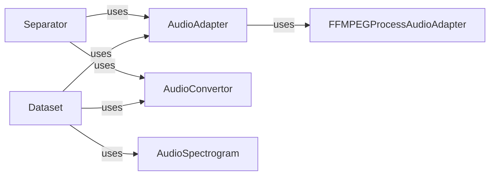

## Component Details

The `Audio Processing Utilities` component in Spleeter provides a robust set of tools for handling, transforming, and augmenting audio data. It is fundamental to Spleeter's operation as it underpins all audio input, output, and manipulation required for source separation and dataset preparation.

### AudioAdapter
This abstract component defines the interface for loading and saving audio waveforms. It provides methods for converting audio descriptors into usable waveform data and manages the default audio adapter instance, which is typically `FFMPEGProcessAudioAdapter`. It also includes error handling for audio loading operations.

**Related Classes/Methods**:

- <a href="https://github.com/deezer/spleeter/blob/master/spleeter/audio/adapter.py#L29-L199" target="_blank" rel="noopener noreferrer">`spleeter.audio.adapter.AudioAdapter` (29:199)</a>

### FFMPEGProcessAudioAdapter
A concrete implementation of the `AudioAdapter` that leverages FFmpeg for efficient audio loading and saving. It handles the actual interaction with the FFmpeg process to perform audio conversions and manipulations.

**Related Classes/Methods**:

- <a href="https://github.com/deezer/spleeter/blob/master/spleeter/audio/ffmpeg.py#L34-L184" target="_blank" rel="noopener noreferrer">`spleeter.audio.ffmpeg.FFMPEGProcessAudioAdapter` (34:184)</a>

### AudioConvertor
This component specializes in converting audio properties, specifically between decibels (dB) and gain. It offers utilities for transforming spectrogram data into a decibel representation and vice-versa, which is essential for audio normalization, dynamic range compression, and other signal processing tasks.

**Related Classes/Methods**:

- <a href="https://github.com/deezer/spleeter/blob/master/spleeter/audio/convertor.py#L1-L1" target="_blank" rel="noopener noreferrer">`spleeter.audio.convertor.AudioConvertor` (1:1)</a>

### AudioSpectrogram
This component focuses on transformations related to audio spectrograms, primarily for data augmentation purposes. It includes functionalities like time stretching and pitch shifting, which are vital for generating diverse training data for machine learning models, thereby improving model robustness and generalization.

**Related Classes/Methods**:

- <a href="https://github.com/deezer/spleeter/blob/master/spleeter/audio/spectrogram.py#L1-L1" target="_blank" rel="noopener noreferrer">`spleeter.audio.spectrogram.AudioSpectrogram` (1:1)</a>

### [FAQ](https://github.com/CodeBoarding/GeneratedOnBoardings/tree/main?tab=readme-ov-file#faq)