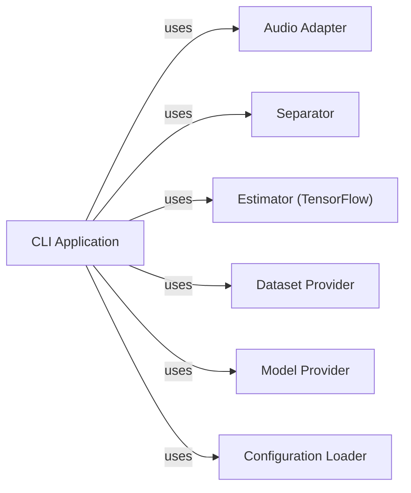

## Component Details

The `CLI Application` in Spleeter serves as the primary user interface, orchestrating various core functionalities based on user commands. It acts as a dispatcher, delegating tasks to specialized components for audio processing, model training, and separation.

### CLI Application
The main entry point for Spleeter, responsible for parsing command-line arguments (`train`, `separate`, `evaluate`) and coordinating the overall workflow. It initializes and invokes other core components to fulfill user requests.

**Related Classes/Methods**:

- <a href="https://github.com/deezer/spleeter/blob/master/spleeter/__main__.py#L1-L1" target="_blank" rel="noopener noreferrer">`spleeter.__main__` (1:1)</a>

### Audio Adapter
Provides a unified interface for handling audio input and output operations. It abstracts the underlying audio processing backend, allowing Spleeter to load audio from various sources and save separated tracks in different formats.

**Related Classes/Methods**:

- <a href="https://github.com/deezer/spleeter/blob/master/spleeter/audio/adapter.py#L1-L1" target="_blank" rel="noopener noreferrer">`spleeter.audio.adapter` (1:1)</a>

### Separator
Encapsulates the logic for performing audio source separation. It initializes the necessary machine learning model (Estimator) and uses the Audio Adapter to process input audio and save the separated output tracks.

**Related Classes/Methods**:

- <a href="https://github.com/deezer/spleeter/blob/master/spleeter/separator.py#L1-L1" target="_blank" rel="noopener noreferrer">`spleeter.separator` (1:1)</a>

### Estimator (TensorFlow)
Represents the underlying machine learning model, specifically a TensorFlow Estimator, responsible for the actual source separation or model training. It processes audio features and generates the separated audio streams or updates model parameters during training.

**Related Classes/Methods**:

- <a href="https://github.com/deezer/spleeter/blob/master/spleeter/model/functions/unet.py#L198-L202" target="_blank" rel="noopener noreferrer">`spleeter.model.functions.unet` (198:202)</a>
- `tensorflow.estimator.Estimator` (1:1)

### Dataset Provider
Manages the preparation and provision of datasets for model training and validation. It handles the loading and preprocessing of audio data into a format suitable for the Estimator.

**Related Classes/Methods**:

- <a href="https://github.com/deezer/spleeter/blob/master/spleeter/dataset.py#L1-L1" target="_blank" rel="noopener noreferrer">`spleeter.dataset` (1:1)</a>

### Model Provider
Handles operations related to the management of trained models, such as writing probe files to indicate model availability or status.

**Related Classes/Methods**:

- <a href="https://github.com/deezer/spleeter/blob/master/spleeter/model/provider/github.py#L1-L1" target="_blank" rel="noopener noreferrer">`spleeter.model.provider.github` (1:1)</a>

### Configuration Loader
Responsible for loading and parsing configuration files, particularly those defining model parameters and other operational settings for Spleeter.

**Related Classes/Methods**:

- <a href="https://github.com/deezer/spleeter/blob/master/spleeter/utils/configuration.py#L1-L1" target="_blank" rel="noopener noreferrer">`spleeter.utils.configuration` (1:1)</a>

### [FAQ](https://github.com/CodeBoarding/GeneratedOnBoardings/tree/main?tab=readme-ov-file#faq)