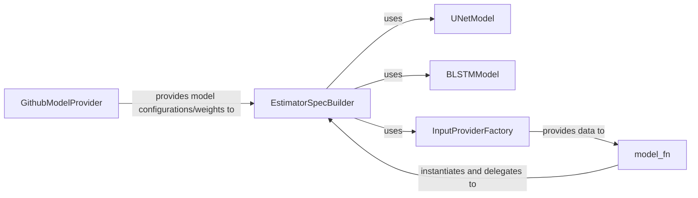

## Component Details

The `Core ML Model` subsystem in Spleeter is central to its functionality, encapsulating the machine learning logic for audio source separation. It defines the TensorFlow model graph and manages its behavior across prediction, evaluation, and training modes. This subsystem integrates neural network architectures like BLSTM and U-Net, which are the backbone of Spleeter's separation capabilities.

### EstimatorSpecBuilder
This class is the architect of the TensorFlow `EstimatorSpec`, which comprehensively defines the model's graph. It orchestrates the entire data flow from feature engineering (STFT, spectrograms) to applying the core separation models (U-Net or BLSTM), computing masks, performing inverse STFT, and setting up loss functions and optimizers based on the operational mode (predict, train, eval). Its fundamental role lies in unifying all model-related computations into a coherent TensorFlow graph.

**Related Classes/Methods**:

- `EstimatorSpecBuilder` (0:0)

### model_fn
Serving as the primary entry point for a TensorFlow `Estimator`, `model_fn` acts as a high-level orchestrator. It instantiates the `EstimatorSpecBuilder` and delegates the actual model construction based on the `tf.estimator.ModeKeys` (PREDICT, EVAL, TRAIN). This function is fundamental because it's the direct interface for TensorFlow's Estimator API, enabling the Spleeter model to be trained, evaluated, and used for predictions within the TensorFlow ecosystem.

**Related Classes/Methods**:

- `model_fn` (0:0)

### UNetModel
This component embodies the U-Net neural network architecture, a deep learning model adapted for spectrogram-based audio source separation. The `apply_unet` function applies this architecture to input spectrograms, performing the core separation task. It's fundamental as it represents one of the primary neural network models responsible for the actual separation of audio sources.

**Related Classes/Methods**:

- `apply_unet` (0:0)

### BLSTMModel
This component represents the Bidirectional Long Short-Term Memory (BLSTM) neural network architecture, another common choice for sequence modeling tasks, applied here for audio source separation. The `apply_blstm` function applies this architecture to input spectrograms. It's fundamental as it offers an alternative or complementary core neural network model for the separation task, providing flexibility in model choice.

**Related Classes/Methods**:

- `apply_blstm` (0:0)

### InputProviderFactory
This factory class is responsible for generating and providing input data (e.g., audio waveforms, spectrograms) to the model during training, evaluation, or prediction. It handles the initial data preparation and feeding mechanism for the model, ensuring that the model receives data in the correct format and flow.

**Related Classes/Methods**:

- `InputProviderFactory` (0:0)

### GithubModelProvider
This component is a concrete implementation of a `ModelProvider` that specifically handles the downloading and management of pre-trained models from GitHub. It includes crucial functionality like checksum verification to ensure model integrity. It's fundamental as it provides the means to load pre-trained weights, which are essential for using Spleeter without training from scratch and for ensuring reproducibility.

**Related Classes/Methods**:

- `GithubModelProvider` (0:0)

### [FAQ](https://github.com/CodeBoarding/GeneratedOnBoardings/tree/main?tab=readme-ov-file#faq)