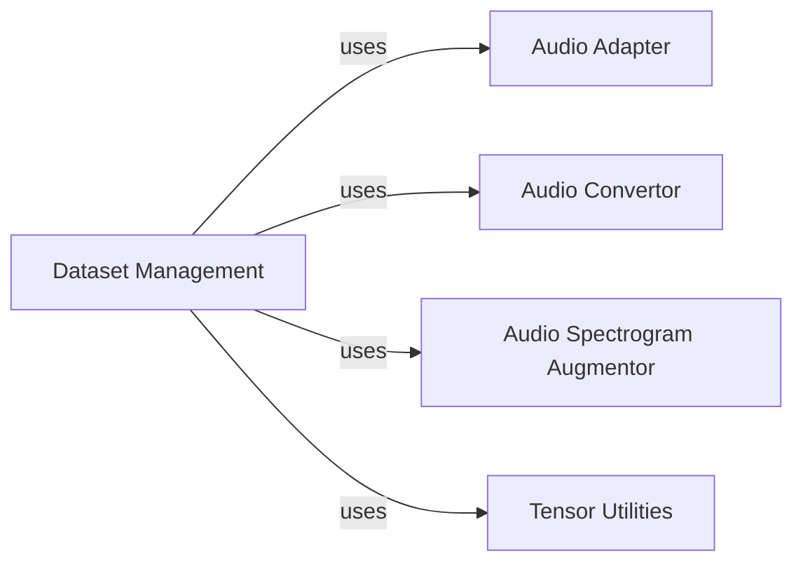

## Component Details

These components are fundamental because they collectively form the backbone of the data preparation pipeline for audio separation models. Dataset Management is the orchestrator; without it, there's no structured way to feed data to the models. It defines the entire data flow. Audio Adapter is the gateway to raw audio. Without it, Dataset Management cannot access or load any audio files, making the entire process impossible. Audio Convertor ensures data consistency and proper scaling. Spectrograms need to be in a suitable format (e.g., decibels) for model training, and this component handles that crucial transformation. Audio Spectrogram Augmentor is vital for model robustness and generalization. By artificially increasing the diversity of the training data, it prevents overfitting and improves the model's performance on unseen audio. It also provides the core spectrogram computation. Tensor Utilities are essential for efficient data handling within the TensorFlow framework. They provide the necessary tools to build, manage, and optimize the data pipelines, ensuring that data is presented to the model in the correct format and efficiently. Together, these components ensure that the audio data is correctly loaded, preprocessed, augmented, and formatted, making them indispensable for the training and validation of audio separation models.

### Dataset Management
This component, primarily implemented in `spleeter/dataset.py`, is the central orchestrator for preparing audio datasets for machine learning models. It manages the entire lifecycle from raw audio input to augmented, model-ready data. Its responsibilities include loading audio, applying various preprocessing steps like spectrogram conversion and decibel normalization, and performing data augmentation techniques such as time stretching and pitch shifting. It leverages TensorFlow's data API to build efficient and scalable data pipelines for training and validation. This component is crucial for generating diverse and robust datasets essential for training and validating audio separation models.

**Related Classes/Methods**:

- <a href="https://github.com/deezer/spleeter/blob/master/spleeter/dataset.py#L0-L0" target="_blank" rel="noopener noreferrer">`spleeter.dataset` (0:0)</a>

### Audio Adapter
This component, found in `spleeter/audio/adapter.py`, provides a standardized interface for interacting with audio files. Its primary purpose is to abstract the complexities of loading and saving audio waveforms, converting raw audio descriptors into a usable waveform format. It also manages the default audio processing backend (e.g., FFMPEG) and includes robust error handling for audio loading failures. `Dataset Management` relies on this component to load audio data from disk.

**Related Classes/Methods**:

- <a href="https://github.com/deezer/spleeter/blob/master/spleeter/audio/adapter.py#L0-L0" target="_blank" rel="noopener noreferrer">`spleeter.audio.adapter` (0:0)</a>

### Audio Convertor
This component, located in `spleeter/audio/convertor.py`, specializes in the transformation of audio properties, particularly focusing on conversions between decibels (dB) and gain. It offers utilities to convert spectrogram data into a decibel representation and vice-versa. These conversions are vital for audio normalization, consistent processing, and ensuring that audio levels are appropriately handled before being fed into machine learning models. `Dataset Management` uses its functions for normalizing spectrograms.

**Related Classes/Methods**:

- <a href="https://github.com/deezer/spleeter/blob/master/spleeter/audio/convertor.py#L0-L0" target="_blank" rel="noopener noreferrer">`spleeter.audio.convertor` (0:0)</a>

### Audio Spectrogram Augmentor
This component, implemented in `spleeter/audio/spectrogram.py`, is dedicated to data augmentation techniques applied to audio spectrograms. It implements operations such as time stretching and pitch shifting, which are crucial for generating variations of existing audio data. It also provides the core functionality for computing spectrograms from audio waveforms. By augmenting the dataset, this component helps improve the generalization capabilities and robustness of machine learning models, preventing overfitting and enhancing performance on diverse audio inputs. `Dataset Management` heavily relies on this component for spectrogram computation and data augmentation.

**Related Classes/Methods**:

- <a href="https://github.com/deezer/spleeter/blob/master/spleeter/audio/spectrogram.py#L0-L0" target="_blank" rel="noopener noreferrer">`spleeter.audio.spectrogram` (0:0)</a>

### Tensor Utilities
This component, located in `spleeter/utils/tensor.py`, provides a collection of utility functions specifically designed for TensorFlow tensor operations and dataset manipulation. These utilities include functions for checking and setting tensor shapes, creating datasets from CSV files, and applying synchronous operations to tensors. `Dataset Management` uses these utilities to build and manage its TensorFlow data pipelines efficiently.

**Related Classes/Methods**:

- <a href="https://github.com/deezer/spleeter/blob/master/spleeter/utils/tensor.py#L0-L0" target="_blank" rel="noopener noreferrer">`spleeter.utils.tensor` (0:0)</a>

### [FAQ](https://github.com/CodeBoarding/GeneratedOnBoardings/tree/main?tab=readme-ov-file#faq)