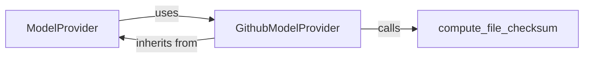

## Component Details

The `Model Provisioning` subsystem in Spleeter is responsible for the discovery, download, and local management of pre-trained Spleeter models and their configurations. It provides an abstraction layer that allows other components to easily obtain necessary model assets, ensuring integrity and availability.

### ModelProvider
This is an abstract base class that defines the standardized interface for any model provider within Spleeter. Its primary purpose is to ensure consistency in how models are retrieved and managed, regardless of their origin. It mandates the implementation of a `download` method for concrete providers and offers a `get` method that handles the logic of checking for local model availability, downloading if necessary, and marking the model directory with a probe file.

**Related Classes/Methods**:

- `ModelProvider:download` (-1:-1)
- `ModelProvider:get` (-1:-1)
- `ModelProvider:default` (-1:-1)

### GithubModelProvider
This is a concrete implementation of the `ModelProvider` abstract base class, specifically designed to fetch models hosted on GitHub. It manages the intricacies of interacting with GitHub repositories, including constructing download URLs, retrieving checksums for validation, and handling the actual download and extraction of model archives. It leverages the `compute_file_checksum` utility to ensure the integrity of downloaded files.

**Related Classes/Methods**:

- `GithubModelProvider:download` (-1:-1)

### compute_file_checksum
This is a utility function responsible for calculating the SHA256 checksum of a given file. It reads the file in chunks and updates the hash, returning the final hexadecimal digest.

**Related Classes/Methods**:

- `compute_file_checksum` (-1:-1)

### [FAQ](https://github.com/CodeBoarding/GeneratedOnBoardings/tree/main?tab=readme-ov-file#faq)