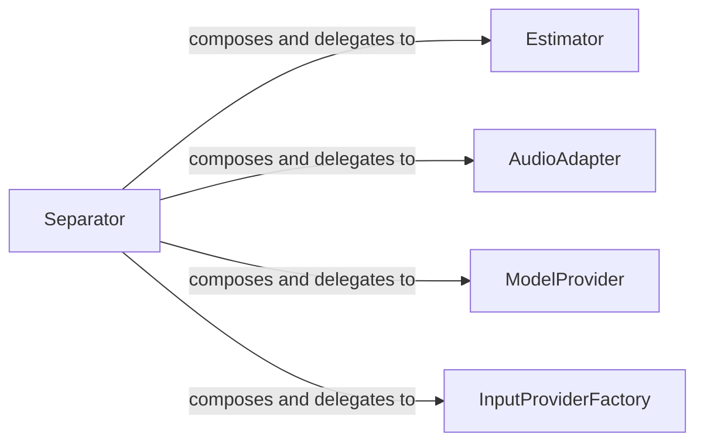

## Component Details

Abstract Components Overview of Spleeter

### Separator
The `Separator` class is the core component for performing audio source separation. It initializes and manages a TensorFlow `Estimator` for model inference, handles loading model configurations and weights, and provides methods for separating audio waveforms. It abstracts the complexities of the underlying machine learning model and its execution, offering a high-level interface for users to perform separation. It can also leverage multiprocessing for concurrent separation tasks.

**Related Classes/Methods**:

- <a href="https://github.com/deezer/spleeter/blob/master/spleeter/separator.py#L72-L347" target="_blank" rel="noopener noreferrer">`spleeter.separator.Separator` (72:347)</a>

### AudioAdapter
The `AudioAdapter` component is responsible for abstracting audio input/output operations. It provides methods to load audio waveforms from various sources (e.g., files) and save separated audio tracks to specified destinations with different codecs and bitrates.

**Related Classes/Methods**:

- <a href="https://github.com/deezer/spleeter/blob/master/spleeter/audio/adapter.py#L29-L199" target="_blank" rel="noopener noreferrer">`spleeter.audio.adapter.AudioAdapter` (29:199)</a>

### ModelProvider
The `ModelProvider` component is responsible for locating and providing access to the pre-trained TensorFlow models used for separation. It ensures that the `Separator` can find and load the necessary model checkpoints from their respective storage locations.

**Related Classes/Methods**:

- <a href="https://github.com/deezer/spleeter/blob/master/spleeter/model/provider/github.py#L0-L0" target="_blank" rel="noopener noreferrer">`spleeter.model.provider.github.ModelProvider` (0:0)</a>

### Estimator
The TensorFlow `Estimator` is a high-level TensorFlow API that simplifies machine learning programming. In Spleeter, it's used by the `Separator` to perform the actual inference (prediction) of separated audio sources based on the loaded model. It manages the TensorFlow graph and session for execution.

**Related Classes/Methods**:

- `tensorflow.estimator.Estimator` (0:0)

### InputProviderFactory
The `InputProviderFactory` is responsible for creating an `InputProvider` instance, which prepares the input data (waveforms) into a format suitable for the TensorFlow `Estimator`. This involves handling audio descriptors and converting them into a dictionary of features that the model expects.

**Related Classes/Methods**:

- <a href="https://github.com/deezer/spleeter/blob/master/spleeter/dataset.py#L0-L0" target="_blank" rel="noopener noreferrer">`spleeter.dataset.InputProviderFactory` (0:0)</a>

### [FAQ](https://github.com/CodeBoarding/GeneratedOnBoardings/tree/main?tab=readme-ov-file#faq)