```mermaid
graph LR
    CLI_Application["CLI Application"]
    Separator_Core["Separator Core"]
    Dataset_Management["Dataset Management"]
    Audio_Processing_Utilities["Audio Processing Utilities"]
    Core_ML_Model["Core ML Model"]
    Model_Provisioning["Model Provisioning"]
    CLI_Application -- "initiates separation" --> Separator_Core
    CLI_Application -- "initiates dataset preparation" --> Dataset_Management
    Separator_Core -- "orchestrates inference" --> Core_ML_Model
    Separator_Core -- "receives predictions" --> Core_ML_Model
    Separator_Core -- "requests audio processing" --> Audio_Processing_Utilities
    Separator_Core -- "receives processed audio" --> Audio_Processing_Utilities
    Separator_Core -- "requests model" --> Model_Provisioning
    Separator_Core -- "receives model" --> Model_Provisioning
    Dataset_Management -- "provides training data" --> Core_ML_Model
    Dataset_Management -- "requests audio processing" --> Audio_Processing_Utilities
    Dataset_Management -- "receives processed audio" --> Audio_Processing_Utilities
    Audio_Processing_Utilities -- "provides feature engineering" --> Core_ML_Model
    Core_ML_Model -- "requests configuration" --> Model_Provisioning
    Core_ML_Model -- "receives configuration" --> Model_Provisioning
    click CLI_Application href "https://github.com/CodeBoarding/GeneratedOnBoardings/blob/main//spleeter/CLI_Application.md" "Details"
    click Separator_Core href "https://github.com/CodeBoarding/GeneratedOnBoardings/blob/main//spleeter/Separator_Core.md" "Details"
    click Dataset_Management href "https://github.com/CodeBoarding/GeneratedOnBoardings/blob/main//spleeter/Dataset_Management.md" "Details"
    click Audio_Processing_Utilities href "https://github.com/CodeBoarding/GeneratedOnBoardings/blob/main//spleeter/Audio_Processing_Utilities.md" "Details"
    click Core_ML_Model href "https://github.com/CodeBoarding/GeneratedOnBoardings/blob/main//spleeter/Core_ML_Model.md" "Details"
    click Model_Provisioning href "https://github.com/CodeBoarding/GeneratedOnBoardings/blob/main//spleeter/Model_Provisioning.md" "Details"
```

## Component Details

The architecture of `spleeter` is designed around a clear separation of concerns, enabling efficient audio source separation and model management. The analysis consolidates the initial CFG and source code insights into six fundamental components, each playing a critical role in the system's operation.

### CLI Application
The primary command-line interface for Spleeter, serving as the user's entry point. It parses user commands (e.g., `separate`, `evaluate`) and orchestrates the high-level flow by delegating tasks to the appropriate core components.

**Related Classes/Methods**:

- <a href="https://github.com/deezer/spleeter/blob/master/spleeter/__main__.py#L1-L1" target="_blank" rel="noopener noreferrer">`spleeter.__main__` (1:1)</a>

### Separator Core
The central component responsible for executing the audio source separation process. It manages the TensorFlow model inference, handles input/output audio streams, and saves the separated tracks, abstracting the complexities of the underlying machine learning model.

**Related Classes/Methods**:

- <a href="https://github.com/deezer/spleeter/blob/master/spleeter/separator.py#L1-L1" target="_blank" rel="noopener noreferrer">`spleeter.separator` (1:1)</a>

### Dataset Management
Manages the creation, preprocessing, and augmentation of audio datasets. This component is crucial for training and validating separation models, handling tasks such as audio segmentation, spectrogram harmonization, and data caching.

**Related Classes/Methods**:

- <a href="https://github.com/deezer/spleeter/blob/master/spleeter/dataset.py#L1-L1" target="_blank" rel="noopener noreferrer">`spleeter.dataset` (1:1)</a>

### Audio Processing Utilities
A consolidated component providing a comprehensive set of utilities for handling and transforming audio data. This includes loading audio waveforms from various sources, converting between different audio representations (e.g., spectrograms to decibels), and performing data augmentation on spectrograms.

**Related Classes/Methods**:

- <a href="https://github.com/deezer/spleeter/blob/master/spleeter/audio/adapter.py#L1-L1" target="_blank" rel="noopener noreferrer">`spleeter.audio.adapter` (1:1)</a>
- <a href="https://github.com/deezer/spleeter/blob/master/spleeter/audio/convertor.py#L1-L1" target="_blank" rel="noopener noreferrer">`spleeter.audio.convertor` (1:1)</a>
- <a href="https://github.com/deezer/spleeter/blob/master/spleeter/audio/spectrogram.py#L1-L1" target="_blank" rel="noopener noreferrer">`spleeter.audio.spectrogram` (1:1)</a>

### Core ML Model
Encapsulates the core machine learning logic, including the definition of the TensorFlow model graph and its various modes (prediction, evaluation, training). It integrates the neural network architectures (like BLSTM and U-Net) that form the backbone of the Spleeter separation model, performing the actual computation.

**Related Classes/Methods**:

- `spleeter.model` (1:1)
- <a href="https://github.com/deezer/spleeter/blob/master/spleeter/model/functions/blstm.py#L93-L97" target="_blank" rel="noopener noreferrer">`spleeter.model.functions.blstm` (93:97)</a>
- <a href="https://github.com/deezer/spleeter/blob/master/spleeter/model/functions/unet.py#L198-L202" target="_blank" rel="noopener noreferrer">`spleeter.model.functions.unet` (198:202)</a>

### Model Provisioning
Manages the discovery, download, and provision of pre-trained Spleeter models and their configurations. It acts as an abstraction layer for accessing model weights and configurations, ensuring that other components can easily obtain the necessary model assets.

**Related Classes/Methods**:

- `spleeter.model.provider` (1:1)
- <a href="https://github.com/deezer/spleeter/blob/master/spleeter/model/provider/github.py#L1-L1" target="_blank" rel="noopener noreferrer">`spleeter.model.provider.github` (1:1)</a>

### [FAQ](https://github.com/CodeBoarding/GeneratedOnBoardings/tree/main?tab=readme-ov-file#faq)