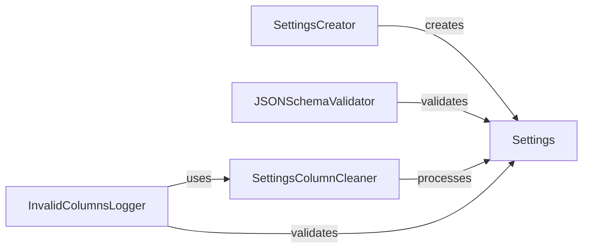

## Details

The `Settings` object serves as the core configuration for the Splink linkage process. The `SettingsCreator` initiates this process by constructing the `Settings` object from various inputs. Once created, the `Settings` object undergoes validation by the `JSONSchemaValidator` to ensure its structural and data type integrity against a predefined schema. Subsequently, the `SettingsColumnCleaner` refines the `Settings` by validating and cleaning column names against actual input dataframes, ensuring data schema consistency. Finally, the `InvalidColumnsLogger` identifies and reports any remaining issues with column references within SQL expressions defined in the `Settings`, often leveraging the cleaned column information from `SettingsColumnCleaner` to provide detailed feedback for debugging. This sequential flow ensures a robust and validated configuration for the linkage operations.

### Settings
Serves as the central, immutable data model that encapsulates all linkage configuration, including blocking rules, comparison levels, and model parameters. It acts as the single source of truth for the entire linkage process. Its fundamental importance lies in providing a standardized, consistent representation of the user's linkage intent.

**Related Classes/Methods**:

- <a href="https://github.com/moj-analytical-services/splink/blob/master/splink/internals/settings.py#L183-L696" target="_blank" rel="noopener noreferrer">`splink.internals.settings.Settings`:183-696</a>

### SettingsCreator
Responsible for parsing raw input (e.g., dictionaries, JSON files) and instantiating the `Settings` object. It prepares the initial configuration for subsequent validation steps. This component is crucial as it bridges the gap between user-defined input and the internal data model.

**Related Classes/Methods**:

- <a href="https://github.com/moj-analytical-services/splink/blob/master/splink/internals/settings_creator.py#L17-L137" target="_blank" rel="noopener noreferrer">`splink.internals.settings_creator.SettingsCreator`:17-137</a>

### JSONSchemaValidator
Enforces the structural and data type correctness of the `Settings` object by validating it against a predefined JSON schema. This ensures adherence to expected formats and prevents malformed configurations, acting as the first line of defense for configuration integrity.

**Related Classes/Methods**:

- <a href="https://github.com/moj-analytical-services/splink/blob/master/splink/internals/validate_jsonschema.py#L1-L100" target="_blank" rel="noopener noreferrer">`splink.internals.validate_jsonschema.JSONSchemaValidator`:1-100</a>

### SettingsColumnCleaner
Focuses specifically on validating and cleaning column names referenced within the `Settings` object (e.g., unique IDs, columns used in blocking rules and comparison levels) against the actual input dataframes. It ensures that all referenced columns exist and are correctly specified, which is vital for preventing runtime errors related to data schema mismatches.

**Related Classes/Methods**:

- <a href="https://github.com/moj-analytical-services/splink/blob/master/splink/internals/settings_validation/settings_column_cleaner.py#L119-L155" target="_blank" rel="noopener noreferrer">`splink.internals.settings_validation.settings_column_cleaner.SettingsColumnCleaner`:119-155</a>

### InvalidColumnsLogger
Identifies and logs specific issues related to missing or invalid columns within SQL expressions defined in blocking rules and comparison levels. It provides detailed, actionable feedback on configuration errors, aiding in debugging. This component is essential for user experience and efficient problem resolution.

**Related Classes/Methods**:

- <a href="https://github.com/moj-analytical-services/splink/blob/master/splink/internals/settings_validation/log_invalid_columns.py#L181-L253" target="_blank" rel="noopener noreferrer">`splink.internals.settings_validation.log_invalid_columns.InvalidColumnsLogger`:181-253</a>

### [FAQ](https://github.com/CodeBoarding/GeneratedOnBoardings/tree/main?tab=readme-ov-file#faq)