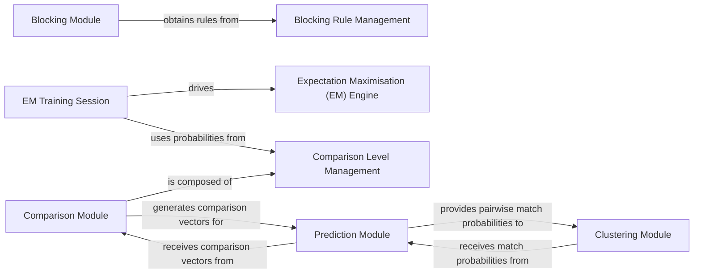

## Details

The Core Linkage Processing Engine subsystem is responsible for executing the main record linkage pipeline, encompassing candidate pair generation (blocking), attribute comparison, statistical model training (EM algorithm), match probability prediction, and record clustering.

### Blocking Module
Efficiently reduces the number of record pairs to be compared by applying user-defined blocking rules.

**Related Classes/Methods**:

- <a href="https://github.com/moj-analytical-services/splink/blob/master/splink/internals/blocking.py" target="_blank" rel="noopener noreferrer">`splink.internals.blocking`</a>

### Blocking Rule Management
Provides a structured and extensible way to define, create, and retrieve blocking rules, including generating their SQL representations.

**Related Classes/Methods**:

- <a href="https://github.com/moj-analytical-services/splink/blob/master/splink/internals/blocking_rule_creator.py" target="_blank" rel="noopener noreferrer">`splink.internals.blocking_rule_creator`</a>
- <a href="https://github.com/moj-analytical-services/splink/blob/master/splink/internals/blocking_rule_library.py" target="_blank" rel="noopener noreferrer">`splink.internals.blocking_rule_library`</a>
- <a href="https://github.com/moj-analytical-services/splink/blob/master/splink/internals/blocking_analysis.py" target="_blank" rel="noopener noreferrer">`splink.internals.blocking_analysis`</a>

### Comparison Module
Defines how individual attributes are compared between records and how these comparisons contribute to a comparison vector.

**Related Classes/Methods**:

- <a href="https://github.com/moj-analytical-services/splink/blob/master/splink/internals/comparison.py" target="_blank" rel="noopener noreferrer">`splink.internals.comparison`</a>

### Comparison Level Management
Specifies the conditions for different levels of agreement/disagreement for an attribute, along with their associated m and u probabilities.

**Related Classes/Methods**:

- <a href="https://github.com/moj-analytical-services/splink/blob/master/splink/internals/comparison_creator.py" target="_blank" rel="noopener noreferrer">`splink.internals.comparison_creator`</a>
- <a href="https://github.com/moj-analytical-services/splink/blob/master/splink/internals/comparison_level.py" target="_blank" rel="noopener noreferrer">`splink.internals.comparison_level`</a>
- <a href="https://github.com/moj-analytical-services/splink/blob/master/splink/internals/comparison_level_library.py" target="_blank" rel="noopener noreferrer">`splink.internals.comparison_level_library`</a>

### EM Training Session
Manages the entire EM training process, including fetching data, running iterations, checking for convergence, and logging progress.

**Related Classes/Methods**:

- <a href="https://github.com/moj-analytical-services/splink/blob/master/splink/internals/em_training_session.py" target="_blank" rel="noopener noreferrer">`splink.internals.em_training_session`</a>

### Expectation Maximisation (EM) Engine
The core statistical engine that iteratively estimates the m and u probabilities for each comparison level and the overall probability of two random records matching.

**Related Classes/Methods**:

- <a href="https://github.com/moj-analytical-services/splink/blob/master/splink/internals/expectation_maximisation.py" target="_blank" rel="noopener noreferrer">`splink.internals.expectation_maximisation`</a>
- <a href="https://github.com/moj-analytical-services/splink/blob/master/splink/internals/estimate_u.py" target="_blank" rel="noopener noreferrer">`splink.internals.estimate_u`</a>
- <a href="https://github.com/moj-analytical-services/splink/blob/master/splink/internals/m_u_records_to_parameters.py" target="_blank" rel="noopener noreferrer">`splink.internals.m_u_records_to_parameters`</a>

### Prediction Module
Computes the final match probability for each record pair based on their comparison vector and the trained m and u probabilities.

**Related Classes/Methods**:

- <a href="https://github.com/moj-analytical-services/splink/blob/master/splink/internals/predict.py" target="_blank" rel="noopener noreferrer">`splink.internals.predict`</a>

### Clustering Module
Groups records into clusters, where each cluster represents a linked entity, based on the predicted match probabilities.

**Related Classes/Methods**:

- <a href="https://github.com/moj-analytical-services/splink/blob/master/splink/internals/clustering.py" target="_blank" rel="noopener noreferrer">`splink.internals.clustering`</a>
- <a href="https://github.com/moj-analytical-services/splink/blob/master/splink/internals/one_to_one_clustering.py" target="_blank" rel="noopener noreferrer">`splink.internals.one_to_one_clustering`</a>
- <a href="https://github.com/moj-analytical-services/splink/blob/master/splink/internals/connected_components.py" target="_blank" rel="noopener noreferrer">`splink.internals.connected_components`</a>
- <a href="https://github.com/moj-analytical-services/splink/blob/master/splink/internals/edge_metrics.py" target="_blank" rel="noopener noreferrer">`splink.internals.edge_metrics`</a>

### [FAQ](https://github.com/CodeBoarding/GeneratedOnBoardings/tree/main?tab=readme-ov-file#faq)