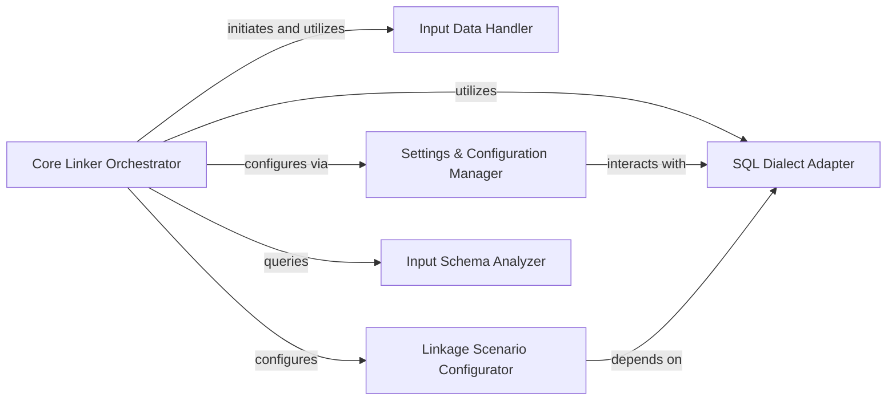

## Details

The Core Linker Orchestrator subsystem encompasses the Linker class and its closely associated internal components responsible for managing the overall record linkage workflow. This includes handling input data, managing settings, adapting to different SQL dialects, configuring linkage scenarios, and analyzing input schemas.

### Core Linker Orchestrator [[Expand]](./Core_Linker_Orchestrator.md)
Acts as the central control unit for the entire record linkage workflow. It orchestrates the initialization, configuration, and validation steps, and coordinates the execution of the core pipeline stages (blocking, comparison, training, prediction, clustering). It manages the overall data flow and ensures the correct application of settings and backend adaptations.

**Related Classes/Methods**:

- <a href="https://github.com/moj-analytical-services/splink/blob/master/splink/internals/linker.py#L63-L779" target="_blank" rel="noopener noreferrer">`splink.internals.linker.Linker`:63-779</a>

### Input Data Handler
Manages the registration, preparation, and validation of input dataframes, ensuring they conform to expected structures before processing.

**Related Classes/Methods**:

- <a href="https://github.com/moj-analytical-services/splink/blob/master/splink/internals/linker.py#L316-L334" target="_blank" rel="noopener noreferrer">`splink.internals.linker._register_input_tables`:316-334</a>
- <a href="https://github.com/moj-analytical-services/splink/blob/master/splink/internals/linker.py#L409-L423" target="_blank" rel="noopener noreferrer">`splink.internals.linker._validate_input_dfs`:409-423</a>

### Settings & Configuration Manager
Validates and manages user-defined linkage settings, ensuring their consistency and correctness. It also handles debug mode configuration and retrieves SQL dialect-specific string representations.

**Related Classes/Methods**:

- <a href="https://github.com/moj-analytical-services/splink/blob/master/splink/internals/linker.py#L340-L358" target="_blank" rel="noopener noreferrer">`splink.internals.linker._validate_settings`:340-358</a>
- <a href="https://github.com/moj-analytical-services/splink/blob/master/splink/internals/linker.py#L336-L338" target="_blank" rel="noopener noreferrer">`splink.internals.linker._check_for_valid_settings`:336-338</a>
- <a href="https://github.com/moj-analytical-services/splink/blob/master/splink/internals/linker.py#L297-L299" target="_blank" rel="noopener noreferrer">`splink.internals.linker._sql_dialect_str`:297-299</a>
- <a href="https://github.com/moj-analytical-services/splink/blob/master/splink/internals/linker.py#L292-L294" target="_blank" rel="noopener noreferrer">`splink.internals.linker._debug_mode`:292-294</a>

### SQL Dialect Adapter
Provides an abstraction layer for generating dialect-specific SQL expressions and managing database-specific constructs (e.g., infinity expressions, random sampling SQL). This allows Splink to operate across different data processing backends.

**Related Classes/Methods**:

- <a href="https://github.com/moj-analytical-services/splink/blob/master/splink/internals/linker.py#L301-L303" target="_blank" rel="noopener noreferrer">`splink.internals.linker._sql_dialect`:301-303</a>
- <a href="https://github.com/moj-analytical-services/splink/blob/master/splink/internals/linker.py#L305-L307" target="_blank" rel="noopener noreferrer">`splink.internals.linker._infinity_expression`:305-307</a>
- <a href="https://github.com/moj-analytical-services/splink/blob/master/splink/internals/linker.py#L309-L314" target="_blank" rel="noopener noreferrer">`splink.internals.linker._random_sample_sql`:309-314</a>

### Linkage Scenario Configurator
Configures the linker specifically for self-linkage scenarios, adapting the internal state and SQL generation based on whether a dataset is being linked against itself.

**Related Classes/Methods**:

- <a href="https://github.com/moj-analytical-services/splink/blob/master/splink/internals/linker.py#L535-L595" target="_blank" rel="noopener noreferrer">`splink.internals.linker._self_link`:535-595</a>

### Input Schema Analyzer
Analyzes the columns present in the input datasets to provide metadata necessary for subsequent processing steps, such as identifying existing source dataset columns.

**Related Classes/Methods**:

- <a href="https://github.com/moj-analytical-services/splink/blob/master/splink/internals/linker.py#L186-L246" target="_blank" rel="noopener noreferrer">`splink.internals.linker._input_columns`:186-246</a>

### [FAQ](https://github.com/CodeBoarding/GeneratedOnBoardings/tree/main?tab=readme-ov-file#faq)