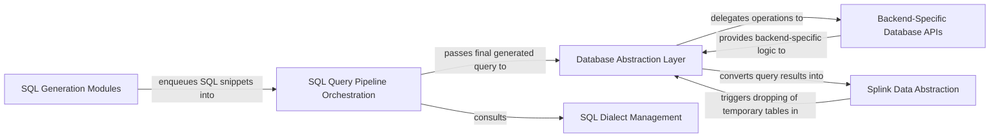

## Details

The `Data I/O & Backend Abstraction` subsystem in Splink is responsible for providing a unified interface for data loading, managing data representations, and abstracting interactions with various database backends (DuckDB, Spark, Postgres, etc.) through SQL generation and execution. It acts as the pluggable data access layer, decoupling the core Splink logic from the underlying data storage and processing engines.

### Database Abstraction Layer
Provides a unified, high-level interface for all database operations. It orchestrates SQL execution, manages table registration and deletion, and handles query result caching. It acts as the primary entry point for data interaction from other parts of the Splink library.

**Related Classes/Methods**:

- <a href="https://github.com/moj-analytical-services/splink/blob/master/splink/internals/database_api.py" target="_blank" rel="noopener noreferrer">`splink.internals.database_api`</a>

### Splink Data Abstraction
Offers a consistent, abstract representation of data within Splink, decoupling the library's logic from specific underlying data storage (e.g., Pandas DataFrames, Spark DataFrames, database tables). It manages the lifecycle of the underlying physical table, including its eventual dropping.

**Related Classes/Methods**:

- <a href="https://github.com/moj-analytical-services/splink/blob/master/splink/internals/splink_dataframe.py" target="_blank" rel="noopener noreferrer">`splink.internals.splink_dataframe`</a>

### Backend-Specific Database APIs
Implement concrete database operations for specific backends. They handle backend-specific SQL execution, table creation/deletion, and initialization tasks like registering User-Defined Functions (UDFs) relevant to their respective database systems. This embodies the Strategy Pattern for pluggable backends.

**Related Classes/Methods**:

- <a href="https://github.com/moj-analytical-services/splink/blob/master/splink/internals/athena/database_api.py" target="_blank" rel="noopener noreferrer">`splink.internals.athena.database_api`</a>
- <a href="https://github.com/moj-analytical-services/splink/blob/master/splink/internals/duckdb/database_api.py" target="_blank" rel="noopener noreferrer">`splink.internals.duckdb.database_api`</a>
- <a href="https://github.com/moj-analytical-services/splink/blob/master/splink/internals/postgres/database_api.py" target="_blank" rel="noopener noreferrer">`splink.internals.postgres.database_api`</a>
- <a href="https://github.com/moj-analytical-services/splink/blob/master/splink/internals/spark/database_api.py" target="_blank" rel="noopener noreferrer">`splink.internals.spark.database_api`</a>
- <a href="https://github.com/moj-analytical-services/splink/blob/master/splink/internals/sqlite/database_api.py" target="_blank" rel="noopener noreferrer">`splink.internals.sqlite.database_api`</a>

### SQL Query Pipeline Orchestration
Manages the construction and flow of complex SQL queries, typically composed of multiple Common Table Expressions (CTEs). It allows for enqueuing SQL statements from various modules and generating the final, executable SQL query.

**Related Classes/Methods**:

- <a href="https://github.com/moj-analytical-services/splink/blob/master/splink/internals/pipeline.py" target="_blank" rel="noopener noreferrer">`splink.internals.pipeline`</a>

### SQL Dialect Management
Provides functions and expressions specific to different SQL dialects. Its role is to ensure that the generated SQL is compatible with the target database backend by handling variations in function names, syntax, and available features.

**Related Classes/Methods**:

- <a href="https://github.com/moj-analytical-services/splink/blob/master/splink/internals/dialects.py" target="_blank" rel="noopener noreferrer">`splink.internals.dialects`</a>

### SQL Generation Modules
These modules are responsible for generating specific SQL snippets required for various data transformations within the Splink pipeline, such as computing term frequencies for comparisons or performing vertical concatenation of datasets.

**Related Classes/Methods**:

- <a href="https://github.com/moj-analytical-services/splink/blob/master/splink/internals/term_frequencies.py" target="_blank" rel="noopener noreferrer">`splink.internals.term_frequencies`</a>
- <a href="https://github.com/moj-analytical-services/splink/blob/master/splink/internals/vertically_concatenate.py" target="_blank" rel="noopener noreferrer">`splink.internals.vertically_concatenate`</a>
- <a href="https://github.com/moj-analytical-services/splink/blob/master/splink/internals/sql_transform.py" target="_blank" rel="noopener noreferrer">`splink.internals.sql_transform`</a>

### [FAQ](https://github.com/CodeBoarding/GeneratedOnBoardings/tree/main?tab=readme-ov-file#faq)