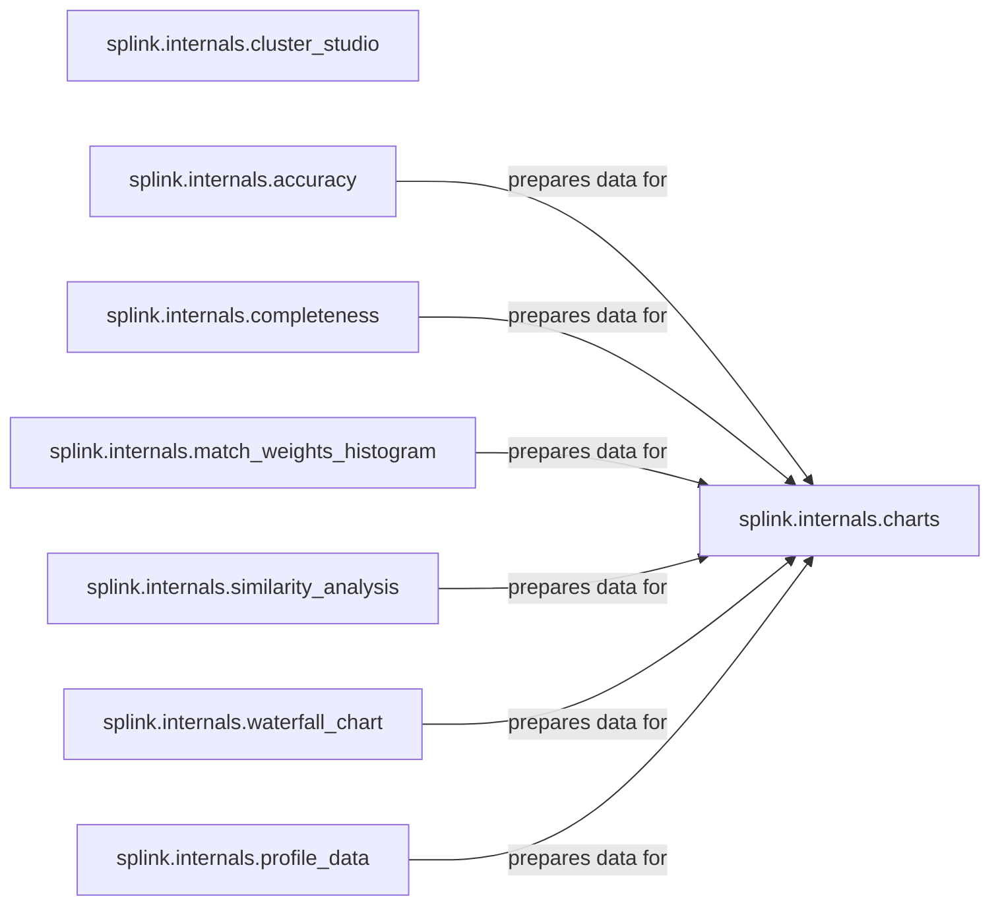

## Details

The Reporting & Visualization subsystem is responsible for generating, preparing, and presenting analytical insights and visual representations of the linkage process and its outcomes. It follows a data preparation-then-visualization pattern, where components process and prepare specific types of data or metrics, and a generic visualization engine consumes this prepared data to render various interactive plots. A specialized visualization component is also included for cluster analysis.

### splink.internals.charts
Acts as the primary rendering engine, providing a high-level API for generating diverse interactive charts (e.g., histograms, line charts, bar charts) to visualize linkage outcomes, model performance, and data characteristics. It consumes pre-processed data from other components.

**Related Classes/Methods**:

- <a href="https://github.com/moj-analytical-services/splink/blob/master/splink/internals/charts.py" target="_blank" rel="noopener noreferrer">`splink.internals.charts`</a>

### splink.internals.cluster_studio
A specialized visualization component that generates a rich, interactive HTML interface for exploring linked clusters, including their internal structure (nodes and edges).

**Related Classes/Methods**:

- <a href="https://github.com/moj-analytical-services/splink/blob/master/splink/internals/cluster_studio.py" target="_blank" rel="noopener noreferrer">`splink.internals.cluster_studio`</a>

### splink.internals.accuracy
Responsible for computing and preparing data related to the accuracy of the linkage model, such as truth space tables and prediction errors, for subsequent visualization.

**Related Classes/Methods**:

- <a href="https://github.com/moj-analytical-services/splink/blob/master/splink/internals/accuracy.py" target="_blank" rel="noopener noreferrer">`splink.internals.accuracy`</a>

### splink.internals.completeness
Calculates and prepares data concerning the completeness of the linked dataset, indicating how many records were successfully linked, making it ready for reporting.

**Related Classes/Methods**:

- <a href="https://github.com/moj-analytical-services/splink/blob/master/splink/internals/completeness.py" target="_blank" rel="noopener noreferrer">`splink.internals.completeness`</a>

### splink.internals.match_weights_histogram
Generates binned data specifically suitable for plotting histograms of match weights, illustrating the distribution of linkage probabilities.

**Related Classes/Methods**:

- <a href="https://github.com/moj-analytical-services/splink/blob/master/splink/internals/match_weights_histogram.py" target="_blank" rel="noopener noreferrer">`splink.internals.match_weights_histogram`</a>

### splink.internals.profile_data
Profiles input data columns to generate descriptive statistics (e.g., frequency distributions, percentiles). This component is crucial for understanding data quality and characteristics, and its outputs can be visualized.

**Related Classes/Methods**:

- <a href="https://github.com/moj-analytical-services/splink/blob/master/splink/internals/profile_data.py" target="_blank" rel="noopener noreferrer">`splink.internals.profile_data`</a>

### splink.internals.similarity_analysis
Analyzes and prepares data for visualizing similarity scores between records and phonetic matches, providing insights into comparison outcomes.

**Related Classes/Methods**:

- <a href="https://github.com/moj-analytical-services/splink/blob/master/splink/internals/similarity_analysis.py" target="_blank" rel="noopener noreferrer">`splink.internals.similarity_analysis`</a>

### splink.internals.waterfall_chart
Transforms raw record comparison data into a structured format specifically for rendering a waterfall chart, which visually breaks down the contribution of each comparison level to the final match weight.

**Related Classes/Methods**:

- <a href="https://github.com/moj-analytical-services/splink/blob/master/splink/internals/waterfall_chart.py" target="_blank" rel="noopener noreferrer">`splink.internals.waterfall_chart`</a>

### [FAQ](https://github.com/CodeBoarding/GeneratedOnBoardings/tree/main?tab=readme-ov-file#faq)