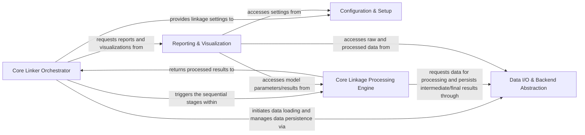

## Details

The `splink` project implements a robust data processing pipeline for record linkage, characterized by its modularity and pluggable backend architecture. At its core, the **Core Linker Orchestrator** directs the entire workflow, from initial data ingestion and configuration to the final output of linked records and analytical visualizations. Raw data is managed and accessed through the **Data I/O & Backend Abstraction** layer, which provides a unified interface to various data sources and database engines (e.g., DuckDB, Spark, PostgreSQL) by dynamically generating and executing SQL queries. User-defined linkage parameters are meticulously handled by the **Configuration & Setup** component, ensuring valid and consistent settings for the linkage process. The heart of the system is the **Core Linkage Processing Engine**, which encapsulates the sequential steps of blocking, comparison, statistical model training (EM), prediction, and clustering, transforming raw input into linked entities. Finally, the **Reporting & Visualization** component offers comprehensive tools for analyzing the linkage outcomes, model performance, and data characteristics, providing critical insights to users. This design emphasizes a clear, sequential data flow, with distinct component boundaries that facilitate both understanding and visual representation in a flow graph diagram.

### Core Linker Orchestrator [[Expand]](./Core_Linker_Orchestrator.md)
The central control unit managing the entire record linkage workflow, coordinating the execution and data flow between all other components.

**Related Classes/Methods**:

- <a href="https://github.com/moj-analytical-services/splink/blob/master/splink/internals/linker.py" target="_blank" rel="noopener noreferrer">`splink.internals.linker`</a>

### Data I/O & Backend Abstraction [[Expand]](./Data_I_O_Backend_Abstraction.md)
Manages data loading from various sources (e.g., Pandas, Spark DataFrames, database tables) and abstracts interactions with different database backends (DuckDB, Spark, Postgres, etc.) through SQL generation and execution. It serves as the pluggable data access layer.

**Related Classes/Methods**:

- <a href="https://github.com/moj-analytical-services/splink/blob/master/splink/internals/database_api.py" target="_blank" rel="noopener noreferrer">`splink.internals.database_api`</a>
- <a href="https://github.com/moj-analytical-services/splink/blob/master/splink/internals/splink_dataframe.py" target="_blank" rel="noopener noreferrer">`splink.internals.splink_dataframe`</a>
- <a href="https://github.com/moj-analytical-services/splink/blob/master/splink/internals/athena/database_api.py" target="_blank" rel="noopener noreferrer">`splink.internals.athena.database_api`</a>
- <a href="https://github.com/moj-analytical-services/splink/blob/master/splink/internals/duckdb/database_api.py" target="_blank" rel="noopener noreferrer">`splink.internals.duckdb.database_api`</a>
- <a href="https://github.com/moj-analytical-services/splink/blob/master/splink/internals/postgres/database_api.py" target="_blank" rel="noopener noreferrer">`splink.internals.postgres.database_api`</a>
- <a href="https://github.com/moj-analytical-services/splink/blob/master/splink/internals/spark/database_api.py" target="_blank" rel="noopener noreferrer">`splink.internals.spark.database_api`</a>
- <a href="https://github.com/moj-analytical-services/splink/blob/master/splink/internals/sqlite/database_api.py" target="_blank" rel="noopener noreferrer">`splink.internals.sqlite.database_api`</a>
- <a href="https://github.com/moj-analytical-services/splink/blob/master/splink/internals/pipeline.py" target="_blank" rel="noopener noreferrer">`splink.internals.pipeline`</a>
- <a href="https://github.com/moj-analytical-services/splink/blob/master/splink/internals/dialects.py" target="_blank" rel="noopener noreferrer">`splink.internals.dialects`</a>
- <a href="https://github.com/moj-analytical-services/splink/blob/master/splink/internals/sql_transform.py" target="_blank" rel="noopener noreferrer">`splink.internals.sql_transform`</a>
- <a href="https://github.com/moj-analytical-services/splink/blob/master/splink/internals/term_frequencies.py" target="_blank" rel="noopener noreferrer">`splink.internals.term_frequencies`</a>
- <a href="https://github.com/moj-analytical-services/splink/blob/master/splink/internals/vertically_concatenate.py" target="_blank" rel="noopener noreferrer">`splink.internals.vertically_concatenate`</a>

### Configuration & Setup [[Expand]](./Configuration_Setup.md)
Handles the definition, parsing, and validation of all linkage settings, including blocking rules, comparison levels, and model parameters, ensuring consistency and validity before pipeline execution.

**Related Classes/Methods**:

- <a href="https://github.com/moj-analytical-services/splink/blob/master/splink/internals/settings.py" target="_blank" rel="noopener noreferrer">`splink.internals.settings`</a>
- <a href="https://github.com/moj-analytical-services/splink/blob/master/splink/internals/settings_creator.py" target="_blank" rel="noopener noreferrer">`splink.internals.settings_creator`</a>
- <a href="https://github.com/moj-analytical-services/splink/blob/master/splink/internals/validate_jsonschema.py" target="_blank" rel="noopener noreferrer">`splink.internals.validate_jsonschema`</a>
- <a href="https://github.com/moj-analytical-services/splink/blob/master/splink/internals/settings_validation" target="_blank" rel="noopener noreferrer">`splink.internals.settings_validation`</a>

### Core Linkage Processing Engine [[Expand]](./Core_Linkage_Processing_Engine.md)
Executes the main record linkage pipeline steps: generating candidate pairs (blocking), comparing attributes to create comparison vectors, training the statistical model (EM algorithm), predicting match probabilities, and clustering linked records.

**Related Classes/Methods**:

- <a href="https://github.com/moj-analytical-services/splink/blob/master/splink/internals/blocking.py" target="_blank" rel="noopener noreferrer">`splink.internals.blocking`</a>
- <a href="https://github.com/moj-analytical-services/splink/blob/master/splink/internals/blocking_rule_creator.py" target="_blank" rel="noopener noreferrer">`splink.internals.blocking_rule_creator`</a>
- <a href="https://github.com/moj-analytical-services/splink/blob/master/splink/internals/blocking_rule_library.py" target="_blank" rel="noopener noreferrer">`splink.internals.blocking_rule_library`</a>
- <a href="https://github.com/moj-analytical-services/splink/blob/master/splink/internals/blocking_analysis.py" target="_blank" rel="noopener noreferrer">`splink.internals.blocking_analysis`</a>
- <a href="https://github.com/moj-analytical-services/splink/blob/master/splink/internals/comparison.py" target="_blank" rel="noopener noreferrer">`splink.internals.comparison`</a>
- <a href="https://github.com/moj-analytical-services/splink/blob/master/splink/internals/comparison_creator.py" target="_blank" rel="noopener noreferrer">`splink.internals.comparison_creator`</a>
- <a href="https://github.com/moj-analytical-services/splink/blob/master/splink/internals/comparison_level.py" target="_blank" rel="noopener noreferrer">`splink.internals.comparison_level`</a>
- <a href="https://github.com/moj-analytical-services/splink/blob/master/splink/internals/comparison_level_library.py" target="_blank" rel="noopener noreferrer">`splink.internals.comparison_level_library`</a>
- <a href="https://github.com/moj-analytical-services/splink/blob/master/splink/internals/column_expression.py" target="_blank" rel="noopener noreferrer">`splink.internals.column_expression`</a>
- <a href="https://github.com/moj-analytical-services/splink/blob/master/splink/internals/input_column.py" target="_blank" rel="noopener noreferrer">`splink.internals.input_column`</a>
- <a href="https://github.com/moj-analytical-services/splink/blob/master/splink/internals/expectation_maximisation.py" target="_blank" rel="noopener noreferrer">`splink.internals.expectation_maximisation`</a>
- <a href="https://github.com/moj-analytical-services/splink/blob/master/splink/internals/em_training_session.py" target="_blank" rel="noopener noreferrer">`splink.internals.em_training_session`</a>
- <a href="https://github.com/moj-analytical-services/splink/blob/master/splink/internals/estimate_u.py" target="_blank" rel="noopener noreferrer">`splink.internals.estimate_u`</a>
- <a href="https://github.com/moj-analytical-services/splink/blob/master/splink/internals/m_u_records_to_parameters.py" target="_blank" rel="noopener noreferrer">`splink.internals.m_u_records_to_parameters`</a>
- <a href="https://github.com/moj-analytical-services/splink/blob/master/splink/internals/predict.py" target="_blank" rel="noopener noreferrer">`splink.internals.predict`</a>
- <a href="https://github.com/moj-analytical-services/splink/blob/master/splink/internals/misc.py" target="_blank" rel="noopener noreferrer">`splink.internals.misc`</a>
- <a href="https://github.com/moj-analytical-services/splink/blob/master/splink/internals/clustering.py" target="_blank" rel="noopener noreferrer">`splink.internals.clustering`</a>
- <a href="https://github.com/moj-analytical-services/splink/blob/master/splink/internals/one_to_one_clustering.py" target="_blank" rel="noopener noreferrer">`splink.internals.one_to_one_clustering`</a>
- <a href="https://github.com/moj-analytical-services/splink/blob/master/splink/internals/connected_components.py" target="_blank" rel="noopener noreferrer">`splink.internals.connected_components`</a>
- <a href="https://github.com/moj-analytical-services/splink/blob/master/splink/internals/edge_metrics.py" target="_blank" rel="noopener noreferrer">`splink.internals.edge_metrics`</a>

### Reporting & Visualization [[Expand]](./Reporting_Visualization.md)
Provides tools for generating interactive charts and reports to analyze the linkage process, model performance, and results, offering insights into data quality and linkage outcomes.

**Related Classes/Methods**:

- <a href="https://github.com/moj-analytical-services/splink/blob/master/splink/internals/charts.py" target="_blank" rel="noopener noreferrer">`splink.internals.charts`</a>
- <a href="https://github.com/moj-analytical-services/splink/blob/master/splink/internals/cluster_studio.py" target="_blank" rel="noopener noreferrer">`splink.internals.cluster_studio`</a>
- <a href="https://github.com/moj-analytical-services/splink/blob/master/splink/internals/waterfall_chart.py" target="_blank" rel="noopener noreferrer">`splink.internals.waterfall_chart`</a>
- <a href="https://github.com/moj-analytical-services/splink/blob/master/splink/internals/match_weights_histogram.py" target="_blank" rel="noopener noreferrer">`splink.internals.match_weights_histogram`</a>
- <a href="https://github.com/moj-analytical-services/splink/blob/master/splink/internals/completeness.py" target="_blank" rel="noopener noreferrer">`splink.internals.completeness`</a>
- <a href="https://github.com/moj-analytical-services/splink/blob/master/splink/internals/accuracy.py" target="_blank" rel="noopener noreferrer">`splink.internals.accuracy`</a>
- <a href="https://github.com/moj-analytical-services/splink/blob/master/splink/internals/similarity_analysis.py" target="_blank" rel="noopener noreferrer">`splink.internals.similarity_analysis`</a>
- <a href="https://github.com/moj-analytical-services/splink/blob/master/splink/internals/profile_data.py" target="_blank" rel="noopener noreferrer">`splink.internals.profile_data`</a>

### [FAQ](https://github.com/CodeBoarding/GeneratedOnBoardings/tree/main?tab=readme-ov-file#faq)