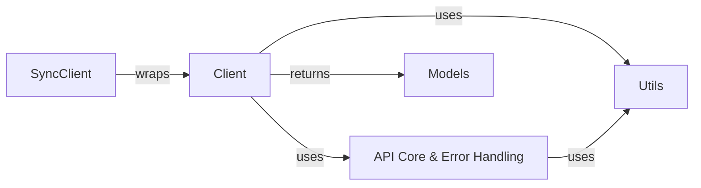

## Component Details

This graph illustrates the core components of the Spotify API wrapper. The `Client` component serves as the primary interface for developers, abstracting low-level HTTP interactions and providing structured data models. It relies on the `API Core & Error Handling` component for managing HTTP requests, responses, bearer tokens, and rate limits, as well as defining custom exceptions. The `Models` component defines the data structures for Spotify entities, which are returned by the `Client`. Helper functions for data manipulation are provided by the `Utils` component, used by both `Client` and `API Core & Error Handling`. Finally, the `SyncClient` provides a synchronous wrapper around the asynchronous `Client` for blocking API calls.

### API Core & Error Handling
Manages all low-level HTTP interactions with the Spotify API, including sending requests, receiving responses, managing bearer tokens, and handling rate limits. It also defines custom exceptions for specific API errors.

**Related Classes/Methods**:

- <a href="https://github.com/mental32/spotify.py/blob/master/spotify/http.py#L25-L700" target="_blank" rel="noopener noreferrer">`spotify.spotify.http.HTTPClient` (25:700)</a>
- <a href="https://github.com/mental32/spotify.py/blob/master/spotify/http.py#L89-L116" target="_blank" rel="noopener noreferrer">`spotify.spotify.http.HTTPClient:get_bearer_info` (89:116)</a>
- <a href="https://github.com/mental32/spotify.py/blob/master/spotify/http.py#L120-L209" target="_blank" rel="noopener noreferrer">`spotify.spotify.http.HTTPClient:request` (120:209)</a>
- `spotify.spotify.http.HTTPUserClient` (full file reference)
- `spotify.spotify.http.HTTPUserClient:__init__` (full file reference)
- `spotify.spotify.http.HTTPUserClient:get_bearer_info` (full file reference)
- <a href="https://github.com/mental32/spotify.py/blob/master/spotify/errors.py#L4-L5" target="_blank" rel="noopener noreferrer">`spotify.spotify.errors.SpotifyException` (4:5)</a>
- <a href="https://github.com/mental32/spotify.py/blob/master/spotify/errors.py#L8-L25" target="_blank" rel="noopener noreferrer">`spotify.spotify.errors.HTTPException` (8:25)</a>
- <a href="https://github.com/mental32/spotify.py/blob/master/spotify/errors.py#L36-L37" target="_blank" rel="noopener noreferrer">`spotify.spotify.errors.BearerTokenError` (36:37)</a>
- <a href="https://github.com/mental32/spotify.py/blob/master/spotify/errors.py#L28-L29" target="_blank" rel="noopener noreferrer">`spotify.spotify.errors.Forbidden` (28:29)</a>
- <a href="https://github.com/mental32/spotify.py/blob/master/spotify/errors.py#L32-L33" target="_blank" rel="noopener noreferrer">`spotify.spotify.errors.NotFound` (32:33)</a>
- <a href="https://github.com/mental32/spotify.py/blob/master/spotify/errors.py#L40-L41" target="_blank" rel="noopener noreferrer">`spotify.spotify.errors.RateLimitedException` (40:41)</a>

### Client
Serves as the primary asynchronous interface for developers to interact with the Spotify API. It abstracts away the underlying HTTP requests and directly provides methods for common Spotify operations, converting raw API responses into structured data models for easier consumption.

**Related Classes/Methods**:

- <a href="https://github.com/mental32/spotify.py/blob/master/spotify/client.py#L39-L389" target="_blank" rel="noopener noreferrer">`spotify.spotify.client.Client` (39:389)</a>
- <a href="https://github.com/mental32/spotify.py/blob/master/spotify/client.py#L65-L84" target="_blank" rel="noopener noreferrer">`spotify.spotify.client.Client:__init__` (65:84)</a>
- <a href="https://github.com/mental32/spotify.py/blob/master/spotify/client.py#L143-L145" target="_blank" rel="noopener noreferrer">`spotify.spotify.client.Client:close` (143:145)</a>
- <a href="https://github.com/mental32/spotify.py/blob/master/spotify/client.py#L166-L182" target="_blank" rel="noopener noreferrer">`spotify.spotify.client.Client:get_album` (166:182)</a>
- <a href="https://github.com/mental32/spotify.py/blob/master/spotify/client.py#L184-L198" target="_blank" rel="noopener noreferrer">`spotify.spotify.client.Client:get_artist` (184:198)</a>
- <a href="https://github.com/mental32/spotify.py/blob/master/spotify/client.py#L200-L214" target="_blank" rel="noopener noreferrer">`spotify.spotify.client.Client:get_track` (200:214)</a>
- <a href="https://github.com/mental32/spotify.py/blob/master/spotify/client.py#L216-L230" target="_blank" rel="noopener noreferrer">`spotify.spotify.client.Client:get_user` (216:230)</a>
- <a href="https://github.com/mental32/spotify.py/blob/master/spotify/client.py#L234-L252" target="_blank" rel="noopener noreferrer">`spotify.spotify.client.Client:get_albums` (234:252)</a>
- <a href="https://github.com/mental32/spotify.py/blob/master/spotify/client.py#L254-L268" target="_blank" rel="noopener noreferrer">`spotify.spotify.client.Client:get_artists` (254:268)</a>
- <a href="https://github.com/mental32/spotify.py/blob/master/spotify/client.py#L270-L348" target="_blank" rel="noopener noreferrer">`spotify.spotify.client.Client:search` (270:348)</a>
- <a href="https://github.com/mental32/spotify.py/blob/master/spotify/client.py#L350-L369" target="_blank" rel="noopener noreferrer">`spotify.spotify.client.Client:get_multiple_shows` (350:369)</a>
- <a href="https://github.com/mental32/spotify.py/blob/master/spotify/client.py#L371-L389" target="_blank" rel="noopener noreferrer">`spotify.spotify.client.Client:get_episode` (371:389)</a>

### Models
Defines the data structures that represent various entities returned by the Spotify API, such as albums, artists, tracks, users, shows, and episodes. These models provide a structured and object-oriented way to access and manipulate Spotify data within the application.

**Related Classes/Methods**:

- <a href="https://github.com/mental32/spotify.py/blob/master/spotify/models/album.py#L8-L125" target="_blank" rel="noopener noreferrer">`spotify.spotify.models.album.Album` (8:125)</a>
- <a href="https://github.com/mental32/spotify.py/blob/master/spotify/models/artist.py#L11-L186" target="_blank" rel="noopener noreferrer">`spotify.spotify.models.artist.Artist` (11:186)</a>
- <a href="https://github.com/mental32/spotify.py/blob/master/spotify/models/track.py#L14-L104" target="_blank" rel="noopener noreferrer">`spotify.spotify.models.track.Track` (14:104)</a>
- <a href="https://github.com/mental32/spotify.py/blob/master/spotify/models/user.py#L43-L592" target="_blank" rel="noopener noreferrer">`spotify.spotify.models.user.User` (43:592)</a>
- <a href="https://github.com/mental32/spotify.py/blob/master/spotify/models/podcast.py#L85-L167" target="_blank" rel="noopener noreferrer">`spotify.spotify.models.podcast.Show` (85:167)</a>
- <a href="https://github.com/mental32/spotify.py/blob/master/spotify/models/podcast.py#L9-L82" target="_blank" rel="noopener noreferrer">`spotify.spotify.models.podcast.Episode` (9:82)</a>

### Utils
Provides helper functions that assist in data manipulation and transformation within the Spotify subsystem. This includes functions like `to_id` for converting various Spotify identifiers to a standard ID format and `filter_items` for processing dictionary payloads.

**Related Classes/Methods**:

- <a href="https://github.com/mental32/spotify.py/blob/master/spotify/utils.py#L38-L60" target="_blank" rel="noopener noreferrer">`spotify.spotify.utils.to_id` (38:60)</a>
- <a href="https://github.com/mental32/spotify.py/blob/master/spotify/utils.py#L33-L35" target="_blank" rel="noopener noreferrer">`spotify.spotify.utils.filter_items` (33:35)</a>

### SyncClient
Provides a synchronous interface to the Spotify API, building upon the asynchronous Client. It uses a separate thread with an event loop to execute asynchronous operations in a blocking manner, allowing for synchronous API calls in applications that require it.

**Related Classes/Methods**:

- <a href="https://github.com/mental32/spotify.py/blob/master/spotify/sync/models.py#L75-L83" target="_blank" rel="noopener noreferrer">`spotify.spotify.sync.models.Client` (75:83)</a>
- <a href="https://github.com/mental32/spotify.py/blob/master/spotify/sync/thread.py#L6-L48" target="_blank" rel="noopener noreferrer">`spotify.spotify.sync.thread.EventLoopThread` (6:48)</a>

### [FAQ](https://github.com/CodeBoarding/GeneratedOnBoardings/tree/main?tab=readme-ov-file#faq)