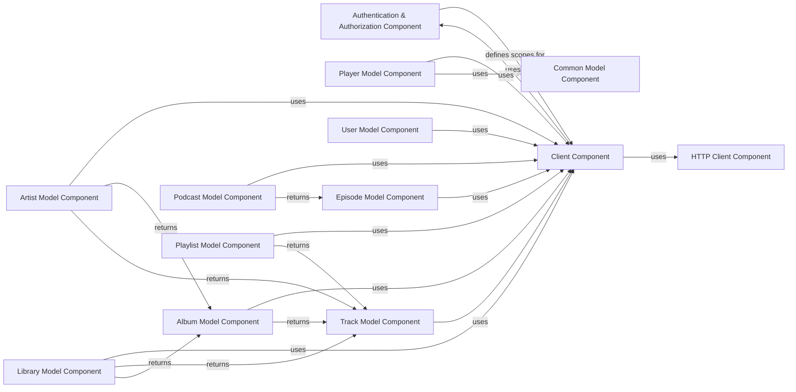

## Component Details

This system provides a comprehensive Spotify API client, managing OAuth2 authentication and authorization, handling low-level HTTP communication, and offering various model components for interacting with Spotify entities like artists, albums, tracks, playlists, and user libraries. The core functionality revolves around the Client Component, which orchestrates API calls, leveraging the Authentication & Authorization Component for secure access and the HTTP Client Component for network operations. Model components encapsulate specific Spotify data types and their associated operations, relying on the Client Component for data retrieval and manipulation.

### Authentication & Authorization Component
Manages the OAuth2 authentication flow, including generating authorization URLs, handling redirects, and acquiring/refreshing access tokens. It also defines and manages required API scopes for various Spotify API interactions.

**Related Classes/Methods**:

- <a href="https://github.com/mental32/spotify.py/blob/master/spotify/oauth.py#L71-L202" target="_blank" rel="noopener noreferrer">`spotify.oauth.OAuth2` (71:202)</a>
- <a href="https://github.com/mental32/spotify.py/blob/master/spotify/oauth.py#L107-L129" target="_blank" rel="noopener noreferrer">`spotify.oauth.OAuth2.__init__` (107:129)</a>
- <a href="https://github.com/mental32/spotify.py/blob/master/spotify/oauth.py#L140-L142" target="_blank" rel="noopener noreferrer">`spotify.oauth.OAuth2.from_client` (140:142)</a>
- <a href="https://github.com/mental32/spotify.py/blob/master/spotify/oauth.py#L145-L148" target="_blank" rel="noopener noreferrer">`spotify.oauth.OAuth2.url_only` (145:148)</a>
- <a href="https://github.com/mental32/spotify.py/blob/master/spotify/oauth.py#L32-L50" target="_blank" rel="noopener noreferrer">`spotify.oauth.set_required_scopes` (32:50)</a>
- <a href="https://github.com/mental32/spotify.py/blob/master/spotify/oauth.py#L53-L68" target="_blank" rel="noopener noreferrer">`spotify.oauth.get_required_scopes` (53:68)</a>
- <a href="https://github.com/mental32/spotify.py/blob/master/spotify/oauth.py#L4-L30" target="_blank" rel="noopener noreferrer">`spotify.oauth.VALID_SCOPES` (4:30)</a>
- <a href="https://github.com/mental32/spotify.py/blob/master/spotify/oauth.py#L184-L202" target="_blank" rel="noopener noreferrer">`spotify.oauth.OAuth2.set_scopes` (184:202)</a>

### Client Component
Represents the Spotify client application and serves as the primary interface for interacting with the Spotify API. It manages the underlying HTTP communication and provides methods for fetching various Spotify entities (albums, artists, tracks, users, etc.) and generating OAuth2 URLs.

**Related Classes/Methods**:

- <a href="https://github.com/mental32/spotify.py/blob/master/spotify/client.py#L39-L389" target="_blank" rel="noopener noreferrer">`spotify.client.Client` (39:389)</a>
- <a href="https://github.com/mental32/spotify.py/blob/master/spotify/client.py#L65-L84" target="_blank" rel="noopener noreferrer">`spotify.client.Client.__init__` (65:84)</a>
- <a href="https://github.com/mental32/spotify.py/blob/master/spotify/client.py#L109-L141" target="_blank" rel="noopener noreferrer">`spotify.client.Client.oauth2_url` (109:141)</a>
- <a href="https://github.com/mental32/spotify.py/blob/master/spotify/client.py#L143-L145" target="_blank" rel="noopener noreferrer">`spotify.client.Client.close` (143:145)</a>
- <a href="https://github.com/mental32/spotify.py/blob/master/spotify/client.py#L147-L164" target="_blank" rel="noopener noreferrer">`spotify.client.Client.user_from_token` (147:164)</a>
- <a href="https://github.com/mental32/spotify.py/blob/master/spotify/client.py#L166-L182" target="_blank" rel="noopener noreferrer">`spotify.client.Client.get_album` (166:182)</a>
- <a href="https://github.com/mental32/spotify.py/blob/master/spotify/client.py#L184-L198" target="_blank" rel="noopener noreferrer">`spotify.client.Client.get_artist` (184:198)</a>
- <a href="https://github.com/mental32/spotify.py/blob/master/spotify/client.py#L200-L214" target="_blank" rel="noopener noreferrer">`spotify.client.Client.get_track` (200:214)</a>
- <a href="https://github.com/mental32/spotify.py/blob/master/spotify/client.py#L216-L230" target="_blank" rel="noopener noreferrer">`spotify.client.Client.get_user` (216:230)</a>
- <a href="https://github.com/mental32/spotify.py/blob/master/spotify/client.py#L234-L252" target="_blank" rel="noopener noreferrer">`spotify.client.Client.get_albums` (234:252)</a>
- <a href="https://github.com/mental32/spotify.py/blob/master/spotify/client.py#L254-L268" target="_blank" rel="noopener noreferrer">`spotify.client.Client.get_artists` (254:268)</a>
- <a href="https://github.com/mental32/spotify.py/blob/master/spotify/client.py#L270-L348" target="_blank" rel="noopener noreferrer">`spotify.client.Client.search` (270:348)</a>
- <a href="https://github.com/mental32/spotify.py/blob/master/spotify/client.py#L350-L369" target="_blank" rel="noopener noreferrer">`spotify.client.Client.get_multiple_shows` (350:369)</a>
- <a href="https://github.com/mental32/spotify.py/blob/master/spotify/client.py#L371-L389" target="_blank" rel="noopener noreferrer">`spotify.client.Client.get_episode` (371:389)</a>

### HTTP Client Component
Handles the low-level HTTP requests and responses to the Spotify API. It manages authentication headers, token refreshing, and error handling for API calls.

**Related Classes/Methods**:

- `spotify.http.HTTPClient` (full file reference)
- `spotify.http.HTTPUserClient` (full file reference)

### Artist Model Component
Encapsulates operations related to Spotify artists, such as retrieving albums, top tracks, and related artists. It relies on the Client Component for API interactions and implicitly on the Authentication & Authorization Component for scope management.

**Related Classes/Methods**:

- <a href="https://github.com/mental32/spotify.py/blob/master/spotify/models/artist.py#L11-L186" target="_blank" rel="noopener noreferrer">`spotify.models.artist.Artist` (11:186)</a>
- <a href="https://github.com/mental32/spotify.py/blob/master/spotify/models/artist.py#L69-L104" target="_blank" rel="noopener noreferrer">`spotify.models.artist.Artist.get_albums` (69:104)</a>
- <a href="https://github.com/mental32/spotify.py/blob/master/spotify/models/artist.py#L107-L134" target="_blank" rel="noopener noreferrer">`spotify.models.artist.Artist.get_all_albums` (107:134)</a>
- <a href="https://github.com/mental32/spotify.py/blob/master/spotify/models/artist.py#L137-L153" target="_blank" rel="noopener noreferrer">`spotify.models.artist.Artist.total_albums` (137:153)</a>
- <a href="https://github.com/mental32/spotify.py/blob/master/spotify/models/artist.py#L156-L172" target="_blank" rel="noopener noreferrer">`spotify.models.artist.Artist.top_tracks` (156:172)</a>
- <a href="https://github.com/mental32/spotify.py/blob/master/spotify/models/artist.py#L175-L186" target="_blank" rel="noopener noreferrer">`spotify.models.artist.Artist.related_artists` (175:186)</a>

### Library Model Component
Manages a user's Spotify library, including checking for saved items, retrieving tracks and albums, and modifying the library. It interacts with the Client Component for API calls and implicitly with the Authentication & Authorization Component for scope validation.

**Related Classes/Methods**:

- <a href="https://github.com/mental32/spotify.py/blob/master/spotify/models/library.py#L10-L258" target="_blank" rel="noopener noreferrer">`spotify.models.library.Library` (10:258)</a>
- <a href="https://github.com/mental32/spotify.py/blob/master/spotify/models/library.py#L33-L42" target="_blank" rel="noopener noreferrer">`spotify.models.library.Library.contains_albums` (33:42)</a>
- <a href="https://github.com/mental32/spotify.py/blob/master/spotify/models/library.py#L45-L54" target="_blank" rel="noopener noreferrer">`spotify.models.library.Library.contains_tracks` (45:54)</a>
- <a href="https://github.com/mental32/spotify.py/blob/master/spotify/models/library.py#L57-L69" target="_blank" rel="noopener noreferrer">`spotify.models.library.Library.get_tracks` (57:69)</a>
- <a href="https://github.com/mental32/spotify.py/blob/master/spotify/models/library.py#L72-L98" target="_blank" rel="noopener noreferrer">`spotify.models.library.Library.get_all_tracks` (72:98)</a>
- <a href="https://github.com/mental32/spotify.py/blob/master/spotify/models/library.py#L101-L113" target="_blank" rel="noopener noreferrer">`spotify.models.library.Library.get_albums` (101:113)</a>
- <a href="https://github.com/mental32/spotify.py/blob/master/spotify/models/library.py#L116-L142" target="_blank" rel="noopener noreferrer">`spotify.models.library.Library.get_all_albums` (116:142)</a>
- <a href="https://github.com/mental32/spotify.py/blob/master/spotify/models/library.py#L145-L154" target="_blank" rel="noopener noreferrer">`spotify.models.library.Library.remove_albums` (145:154)</a>
- <a href="https://github.com/mental32/spotify.py/blob/master/spotify/models/library.py#L157-L166" target="_blank" rel="noopener noreferrer">`spotify.models.library.Library.remove_tracks` (157:166)</a>
- <a href="https://github.com/mental32/spotify.py/blob/master/spotify/models/library.py#L169-L178" target="_blank" rel="noopener noreferrer">`spotify.models.library.Library.save_albums` (169:178)</a>
- <a href="https://github.com/mental32/spotify.py/blob/master/spotify/models/library.py#L181-L190" target="_blank" rel="noopener noreferrer">`spotify.models.library.Library.save_tracks` (181:190)</a>
- <a href="https://github.com/mental32/spotify.py/blob/master/spotify/models/library.py#L193-L220" target="_blank" rel="noopener noreferrer">`spotify.models.library.Library.get_all_podcasts` (193:220)</a>
- <a href="https://github.com/mental32/spotify.py/blob/master/spotify/models/library.py#L223-L239" target="_blank" rel="noopener noreferrer">`spotify.models.library.Library.check_saved_shows` (223:239)</a>
- <a href="https://github.com/mental32/spotify.py/blob/master/spotify/models/library.py#L242-L258" target="_blank" rel="noopener noreferrer">`spotify.models.library.Library.remove_saved_shows` (242:258)</a>

### Player Model Component
Provides functionalities for controlling Spotify playback, such as pausing, resuming, seeking, setting volume, and managing the playback queue. It requires appropriate OAuth2 scopes and interacts with the Client Component for API calls.

**Related Classes/Methods**:

- <a href="https://github.com/mental32/spotify.py/blob/master/spotify/models/player.py#L11-L262" target="_blank" rel="noopener noreferrer">`spotify.models.player.Player` (11:262)</a>
- <a href="https://github.com/mental32/spotify.py/blob/master/spotify/models/player.py#L47-L57" target="_blank" rel="noopener noreferrer">`spotify.models.player.Player.pause` (47:57)</a>
- <a href="https://github.com/mental32/spotify.py/blob/master/spotify/models/player.py#L60-L70" target="_blank" rel="noopener noreferrer">`spotify.models.player.Player.resume` (60:70)</a>
- <a href="https://github.com/mental32/spotify.py/blob/master/spotify/models/player.py#L73-L87" target="_blank" rel="noopener noreferrer">`spotify.models.player.Player.seek` (73:87)</a>
- <a href="https://github.com/mental32/spotify.py/blob/master/spotify/models/player.py#L90-L102" target="_blank" rel="noopener noreferrer">`spotify.models.player.Player.set_repeat` (90:102)</a>
- <a href="https://github.com/mental32/spotify.py/blob/master/spotify/models/player.py#L105-L117" target="_blank" rel="noopener noreferrer">`spotify.models.player.Player.set_volume` (105:117)</a>
- <a href="https://github.com/mental32/spotify.py/blob/master/spotify/models/player.py#L120-L130" target="_blank" rel="noopener noreferrer">`spotify.models.player.Player.next` (120:130)</a>
- <a href="https://github.com/mental32/spotify.py/blob/master/spotify/models/player.py#L133-L146" target="_blank" rel="noopener noreferrer">`spotify.models.player.Player.previous` (133:146)</a>
- <a href="https://github.com/mental32/spotify.py/blob/master/spotify/models/player.py#L149-L172" target="_blank" rel="noopener noreferrer">`spotify.models.player.Player.enqueue` (149:172)</a>
- <a href="https://github.com/mental32/spotify.py/blob/master/spotify/models/player.py#L175-L229" target="_blank" rel="noopener noreferrer">`spotify.models.player.Player.play` (175:229)</a>
- <a href="https://github.com/mental32/spotify.py/blob/master/spotify/models/player.py#L232-L247" target="_blank" rel="noopener noreferrer">`spotify.models.player.Player.shuffle` (232:247)</a>
- <a href="https://github.com/mental32/spotify.py/blob/master/spotify/models/player.py#L250-L262" target="_blank" rel="noopener noreferrer">`spotify.models.player.Player.transfer` (250:262)</a>

### Track Model Component
Represents Spotify tracks and offers methods to retrieve audio analysis and audio features. These operations are dependent on the Client Component for API interactions and implicitly on the Authentication & Authorization Component for scope validation.

**Related Classes/Methods**:

- <a href="https://github.com/mental32/spotify.py/blob/master/spotify/models/track.py#L14-L104" target="_blank" rel="noopener noreferrer">`spotify.models.track.Track` (14:104)</a>
- <a href="https://github.com/mental32/spotify.py/blob/master/spotify/models/track.py#L97-L99" target="_blank" rel="noopener noreferrer">`spotify.models.track.Track.audio_analysis` (97:99)</a>
- <a href="https://github.com/mental32/spotify.py/blob/master/spotify/models/track.py#L102-L104" target="_blank" rel="noopener noreferrer">`spotify.models.track.Track.audio_features` (102:104)</a>

### Album Model Component
Handles operations related to Spotify albums, specifically retrieving tracks within an album. It utilizes the Client Component for API interactions and implicitly on the Authentication & Authorization Component for scope management.

**Related Classes/Methods**:

- <a href="https://github.com/mental32/spotify.py/blob/master/spotify/models/album.py#L8-L125" target="_blank" rel="noopener noreferrer">`spotify.models.album.Album` (8:125)</a>
- <a href="https://github.com/mental32/spotify.py/blob/master/spotify/models/album.py#L87-L107" target="_blank" rel="noopener noreferrer">`spotify.models.album.Album.get_tracks` (87:107)</a>
- <a href="https://github.com/mental32/spotify.py/blob/master/spotify/models/album.py#L110-L125" target="_blank" rel="noopener noreferrer">`spotify.models.album.Album.get_all_tracks` (110:125)</a>

### Podcast Model Component
Manages Spotify podcasts, allowing retrieval of all episodes for a given podcast. This functionality relies on the Client Component for API interactions and implicitly on the Authentication & Authorization Component for scope validation.

**Related Classes/Methods**:

- <a href="https://github.com/mental32/spotify.py/blob/master/spotify/models/podcast.py#L170-L230" target="_blank" rel="noopener noreferrer">`spotify.models.podcast.Podcast` (170:230)</a>
- <a href="https://github.com/mental32/spotify.py/blob/master/spotify/models/podcast.py#L205-L230" target="_blank" rel="noopener noreferrer">`spotify.models.podcast.Podcast.get_all_episodes` (205:230)</a>

### Playlist Model Component
Provides comprehensive functionalities for managing Spotify playlists, including adding, removing, replacing, reordering, and clearing tracks. It also supports copying, reversing, and sorting tracks within a playlist. All these operations require appropriate OAuth2 scopes and interact with the Client Component for API calls.

**Related Classes/Methods**:

- <a href="https://github.com/mental32/spotify.py/blob/master/spotify/models/playlist.py#L65-L538" target="_blank" rel="noopener noreferrer">`spotify.models.playlist.Playlist` (65:538)</a>
- <a href="https://github.com/mental32/spotify.py/blob/master/spotify/models/playlist.py#L195-L215" target="_blank" rel="noopener noreferrer">`spotify.models.playlist.Playlist.get_tracks` (195:215)</a>
- <a href="https://github.com/mental32/spotify.py/blob/master/spotify/models/playlist.py#L218-L243" target="_blank" rel="noopener noreferrer">`spotify.models.playlist.Playlist.get_all_tracks` (218:243)</a>
- <a href="https://github.com/mental32/spotify.py/blob/master/spotify/models/playlist.py#L250-L266" target="_blank" rel="noopener noreferrer">`spotify.models.playlist.Playlist.add_tracks` (250:266)</a>
- <a href="https://github.com/mental32/spotify.py/blob/master/spotify/models/playlist.py#L269-L316" target="_blank" rel="noopener noreferrer">`spotify.models.playlist.Playlist.remove_tracks` (269:316)</a>
- <a href="https://github.com/mental32/spotify.py/blob/master/spotify/models/playlist.py#L319-L349" target="_blank" rel="noopener noreferrer">`spotify.models.playlist.Playlist.replace_tracks` (319:349)</a>
- <a href="https://github.com/mental32/spotify.py/blob/master/spotify/models/playlist.py#L352-L381" target="_blank" rel="noopener noreferrer">`spotify.models.playlist.Playlist.reorder_tracks` (352:381)</a>
- <a href="https://github.com/mental32/spotify.py/blob/master/spotify/models/playlist.py#L386-L398" target="_blank" rel="noopener noreferrer">`spotify.models.playlist.Playlist.clear` (386:398)</a>
- <a href="https://github.com/mental32/spotify.py/blob/master/spotify/models/playlist.py#L401-L442" target="_blank" rel="noopener noreferrer">`spotify.models.playlist.Playlist.extend` (401:442)</a>
- <a href="https://github.com/mental32/spotify.py/blob/master/spotify/models/playlist.py#L445-L459" target="_blank" rel="noopener noreferrer">`spotify.models.playlist.Playlist.insert` (445:459)</a>
- <a href="https://github.com/mental32/spotify.py/blob/master/spotify/models/playlist.py#L462-L481" target="_blank" rel="noopener noreferrer">`spotify.models.playlist.Playlist.pop` (462:481)</a>
- <a href="https://github.com/mental32/spotify.py/blob/master/spotify/models/playlist.py#L484-L498" target="_blank" rel="noopener noreferrer">`spotify.models.playlist.Playlist.sort` (484:498)</a>
- <a href="https://github.com/mental32/spotify.py/blob/master/spotify/models/playlist.py#L501-L515" target="_blank" rel="noopener noreferrer">`spotify.models.playlist.Playlist.remove` (501:515)</a>
- <a href="https://github.com/mental32/spotify.py/blob/master/spotify/models/playlist.py#L518-L526" target="_blank" rel="noopener noreferrer">`spotify.models.playlist.Playlist.copy` (518:526)</a>
- <a href="https://github.com/mental32/spotify.py/blob/master/spotify/models/playlist.py#L529-L538" target="_blank" rel="noopener noreferrer">`spotify.models.playlist.Playlist.reverse` (529:538)</a>

### User Model Component
Represents a Spotify user and provides methods for retrieving user-specific information. It relies on the Client Component for API interactions.

**Related Classes/Methods**:

- <a href="https://github.com/mental32/spotify.py/blob/master/spotify/models/user.py#L43-L592" target="_blank" rel="noopener noreferrer">`spotify.models.user.User` (43:592)</a>

### Episode Model Component
Represents a Spotify podcast episode. It relies on the Client Component for API interactions.

**Related Classes/Methods**:

- <a href="https://github.com/mental32/spotify.py/blob/master/spotify/models/podcast.py#L9-L82" target="_blank" rel="noopener noreferrer">`spotify.models.podcast.Episode` (9:82)</a>

### Common Model Component
Contains common Spotify data models like `Device` and other shared types used across different Spotify entities.

**Related Classes/Methods**:

- <a href="https://github.com/mental32/spotify.py/blob/master/spotify/models/common.py#L59-L109" target="_blank" rel="noopener noreferrer">`spotify.models.common.Device` (59:109)</a>

### [FAQ](https://github.com/CodeBoarding/GeneratedOnBoardings/tree/main?tab=readme-ov-file#faq)