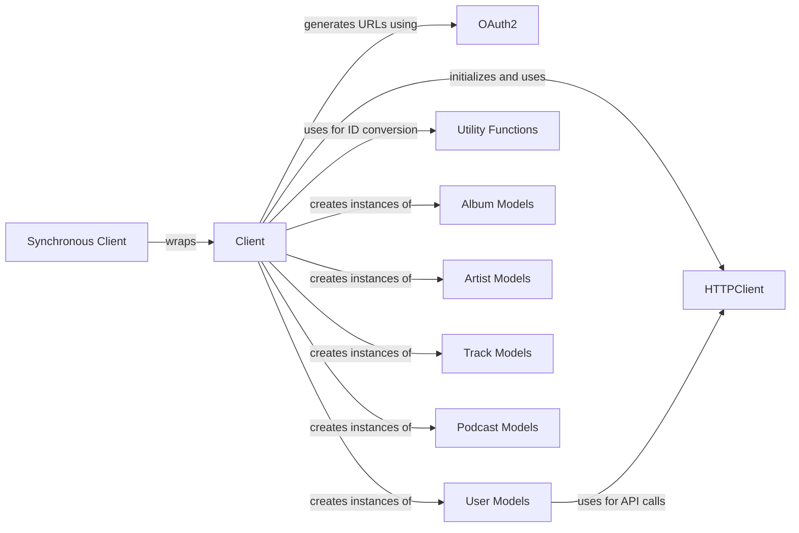

## Component Details

The Client Interface subsystem provides a comprehensive high-level interface for developers to interact with the Spotify API. It abstracts away the complexities of direct HTTP communication, offering a rich set of methods for fetching various Spotify entities such as albums, artists, tracks, users, shows, and episodes. This subsystem supports both asynchronous operations through its core `Client` component and synchronous operations via the `Synchronous Client`, which manages an internal event loop in a separate thread. It handles authentication flows using `OAuth2` and leverages `HTTPClient` for all underlying API requests. Additionally, it utilizes various `Model` components to represent Spotify entities and `Utility Functions` for data manipulation.

### Client
The core asynchronous client for interacting with the Spotify API. It handles authentication, makes requests via HTTPClient, and returns Spotify model objects. It provides methods for fetching various Spotify entities (albums, artists, tracks, users, shows, episodes) and performing searches. It also integrates with OAuth2 for URL generation and uses Utility Functions for ID conversions.

**Related Classes/Methods**:

- <a href="https://github.com/mental32/spotify.py/blob/master/spotify/client.py#L39-L389" target="_blank" rel="noopener noreferrer">`spotify.spotify.client.Client` (39:389)</a>
- <a href="https://github.com/mental32/spotify.py/blob/master/spotify/client.py#L65-L84" target="_blank" rel="noopener noreferrer">`spotify.spotify.client.Client:__init__` (65:84)</a>
- <a href="https://github.com/mental32/spotify.py/blob/master/spotify/client.py#L92-L93" target="_blank" rel="noopener noreferrer">`spotify.spotify.client.Client:__aexit__` (92:93)</a>
- <a href="https://github.com/mental32/spotify.py/blob/master/spotify/client.py#L109-L141" target="_blank" rel="noopener noreferrer">`spotify.spotify.client.Client:oauth2_url` (109:141)</a>
- <a href="https://github.com/mental32/spotify.py/blob/master/spotify/client.py#L143-L145" target="_blank" rel="noopener noreferrer">`spotify.spotify.client.Client:close` (143:145)</a>
- <a href="https://github.com/mental32/spotify.py/blob/master/spotify/client.py#L147-L164" target="_blank" rel="noopener noreferrer">`spotify.spotify.client.Client:user_from_token` (147:164)</a>
- <a href="https://github.com/mental32/spotify.py/blob/master/spotify/client.py#L166-L182" target="_blank" rel="noopener noreferrer">`spotify.spotify.client.Client:get_album` (166:182)</a>
- <a href="https://github.com/mental32/spotify.py/blob/master/spotify/client.py#L184-L198" target="_blank" rel="noopener noreferrer">`spotify.spotify.client.Client:get_artist` (184:198)</a>
- <a href="https://github.com/mental32/spotify.py/blob/master/spotify/client.py#L200-L214" target="_blank" rel="noopener noreferrer">`spotify.spotify.client.Client:get_track` (200:214)</a>
- <a href="https://github.com/mental32/spotify.py/blob/master/spotify/client.py#L216-L230" target="_blank" rel="noopener noreferrer">`spotify.spotify.client.Client:get_user` (216:230)</a>
- <a href="https://github.com/mental32/spotify.py/blob/master/spotify/client.py#L234-L252" target="_blank" rel="noopener noreferrer">`spotify.spotify.client.Client:get_albums` (234:252)</a>
- <a href="https://github.com/mental32/spotify.py/blob/master/spotify/client.py#L254-L268" target="_blank" rel="noopener noreferrer">`spotify.spotify.client.Client:get_artists` (254:268)</a>
- <a href="https://github.com/mental32/spotify.py/blob/master/spotify/client.py#L270-L348" target="_blank" rel="noopener noreferrer">`spotify.spotify.client.Client:search` (270:348)</a>
- <a href="https://github.com/mental32/spotify.py/blob/master/spotify/client.py#L350-L369" target="_blank" rel="noopener noreferrer">`spotify.spotify.client.Client:get_multiple_shows` (350:369)</a>
- <a href="https://github.com/mental32/spotify.py/blob/master/spotify/client.py#L371-L389" target="_blank" rel="noopener noreferrer">`spotify.spotify.client.Client:get_episode` (371:389)</a>

### HTTPClient
Responsible for making raw HTTP requests to the Spotify API. It manages client credentials and provides methods for various API endpoints. It also includes HTTPUserClient for user-specific authenticated requests.

**Related Classes/Methods**:

- `spotify.spotify.http.HTTPClient` (full file reference)
- `spotify.spotify.http.HTTPClient.album` (full file reference)
- `spotify.spotify.http.HTTPClient.artist` (full file reference)
- `spotify.spotify.http.HTTPClient.track` (full file reference)
- `spotify.spotify.http.HTTPClient.user` (full file reference)
- `spotify.spotify.http.HTTPClient.albums` (full file reference)
- `spotify.spotify.http.HTTPClient.artists` (full file reference)
- `spotify.spotify.http.HTTPClient.search` (full file reference)
- `spotify.spotify.http.HTTPClient.get_multiple_shows` (full file reference)
- `spotify.spotify.http.HTTPClient.get_episode` (full file reference)
- `spotify.spotify.http.HTTPClient.current_user` (full file reference)
- `spotify.spotify.http.HTTPClient.close` (full file reference)
- `spotify.spotify.http.HTTPUserClient` (full file reference)

### OAuth2
Provides functionality for generating OAuth2 authorization URLs for user authentication with the Spotify API.

**Related Classes/Methods**:

- <a href="https://github.com/mental32/spotify.py/blob/master/spotify/oauth.py#L71-L202" target="_blank" rel="noopener noreferrer">`spotify.spotify.oauth.OAuth2` (71:202)</a>
- <a href="https://github.com/mental32/spotify.py/blob/master/spotify/oauth.py#L145-L148" target="_blank" rel="noopener noreferrer">`spotify.spotify.oauth.OAuth2.url_only` (145:148)</a>

### User Models
Represents Spotify user objects and provides methods for interacting with user-specific data, including session creation from tokens, retrieving player information, and managing playlists.

**Related Classes/Methods**:

- <a href="https://github.com/mental32/spotify.py/blob/master/spotify/models/user.py#L43-L592" target="_blank" rel="noopener noreferrer">`spotify.spotify.models.user.User` (43:592)</a>
- <a href="https://github.com/mental32/spotify.py/blob/master/spotify/models/user.py#L189-L210" target="_blank" rel="noopener noreferrer">`spotify.spotify.models.user.User:from_token` (189:210)</a>

### Utility Functions
Contains helper functions like to_id for extracting Spotify IDs and filter_items for dictionary cleaning.

**Related Classes/Methods**:

- <a href="https://github.com/mental32/spotify.py/blob/master/spotify/utils.py#L38-L60" target="_blank" rel="noopener noreferrer">`spotify.spotify.utils.to_id` (38:60)</a>

### Synchronous Client
Provides a synchronous interface to the Spotify API by wrapping the asynchronous Client and managing an internal event loop in a separate thread, allowing for blocking API calls.

**Related Classes/Methods**:

- <a href="https://github.com/mental32/spotify.py/blob/master/spotify/sync/models.py#L75-L83" target="_blank" rel="noopener noreferrer">`spotify.spotify.sync.models.Client` (75:83)</a>
- <a href="https://github.com/mental32/spotify.py/blob/master/spotify/sync/models.py#L76-L83" target="_blank" rel="noopener noreferrer">`spotify.spotify.sync.models.Client:__init__` (76:83)</a>
- <a href="https://github.com/mental32/spotify.py/blob/master/spotify/sync/models.py#L52-L72" target="_blank" rel="noopener noreferrer">`spotify.spotify.sync.models.Synchronous` (52:72)</a>
- <a href="https://github.com/mental32/spotify.py/blob/master/spotify/sync/models.py#L12-L27" target="_blank" rel="noopener noreferrer">`spotify.spotify.sync.models._infer_initializer` (12:27)</a>
- <a href="https://github.com/mental32/spotify.py/blob/master/spotify/sync/models.py#L30-L49" target="_blank" rel="noopener noreferrer">`spotify.spotify.sync.models._normalize_coroutine_function` (30:49)</a>
- <a href="https://github.com/mental32/spotify.py/blob/master/spotify/sync/thread.py#L6-L48" target="_blank" rel="noopener noreferrer">`spotify.spotify.sync.thread.EventLoopThread` (6:48)</a>
- <a href="https://github.com/mental32/spotify.py/blob/master/spotify/sync/thread.py#L30-L48" target="_blank" rel="noopener noreferrer">`spotify.spotify.sync.thread.EventLoopThread:run_coroutine_threadsafe` (30:48)</a>

### Album Models
Represents Spotify Album objects and is used for creating Album instances from API responses.

**Related Classes/Methods**:

- <a href="https://github.com/mental32/spotify.py/blob/master/spotify/models/album.py#L8-L125" target="_blank" rel="noopener noreferrer">`spotify.spotify.models.album.Album` (8:125)</a>

### Artist Models
Represents Spotify Artist objects and is used for creating Artist instances from API responses.

**Related Classes/Methods**:

- <a href="https://github.com/mental32/spotify.py/blob/master/spotify/models/artist.py#L11-L186" target="_blank" rel="noopener noreferrer">`spotify.spotify.models.artist.Artist` (11:186)</a>

### Track Models
Represents Spotify Track objects and is used for creating Track instances from API responses.

**Related Classes/Methods**:

- <a href="https://github.com/mental32/spotify.py/blob/master/spotify/models/track.py#L14-L104" target="_blank" rel="noopener noreferrer">`spotify.spotify.models.track.Track` (14:104)</a>

### Podcast Models
Represents Spotify Podcast Show and Episode objects and is used for creating instances from API responses.

**Related Classes/Methods**:

- <a href="https://github.com/mental32/spotify.py/blob/master/spotify/models/podcast.py#L85-L167" target="_blank" rel="noopener noreferrer">`spotify.spotify.models.podcast.Show` (85:167)</a>
- <a href="https://github.com/mental32/spotify.py/blob/master/spotify/models/podcast.py#L9-L82" target="_blank" rel="noopener noreferrer">`spotify.spotify.models.podcast.Episode` (9:82)</a>

### [FAQ](https://github.com/CodeBoarding/GeneratedOnBoardings/tree/main?tab=readme-ov-file#faq)