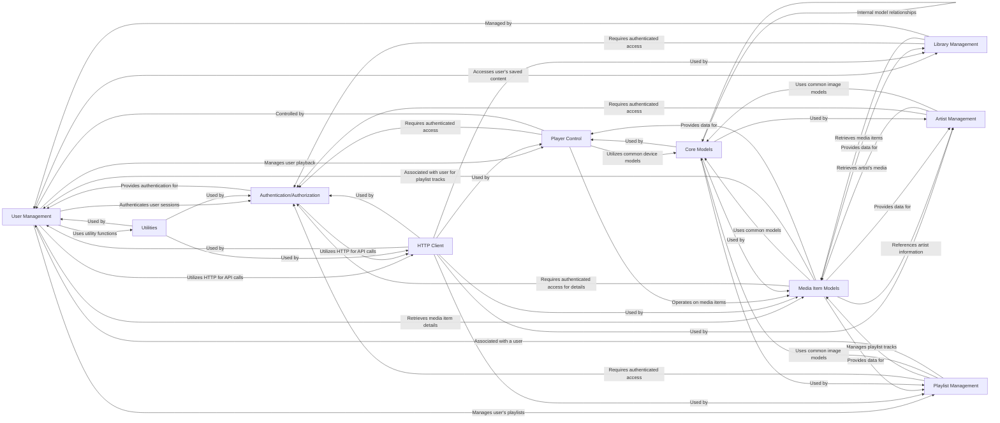

## Component Details

This overview defines the data structures (classes) that represent Spotify entities like Albums, Artists, Tracks, Playlists, Users, and Podcasts. These models often include methods for fetching related data or performing actions specific to that entity, forming the core data representation layer of the system.

### User Management
Manages user profiles, library interactions, playlist creation/modification, and playback control.

**Related Classes/Methods**:

- <a href="https://github.com/mental32/spotify.py/blob/master/spotify/models/user.py#L43-L592" target="_blank" rel="noopener noreferrer">`spotify.spotify.models.user.User` (43:592)</a>
- <a href="https://github.com/mental32/spotify.py/blob/master/spotify/models/user.py#L277-L303" target="_blank" rel="noopener noreferrer">`spotify.spotify.models.user.User:recently_played` (277:303)</a>
- <a href="https://github.com/mental32/spotify.py/blob/master/spotify/models/user.py#L530-L547" target="_blank" rel="noopener noreferrer">`spotify.spotify.models.user.User:top_artists` (530:547)</a>
- <a href="https://github.com/mental32/spotify.py/blob/master/spotify/models/user.py#L550-L567" target="_blank" rel="noopener noreferrer">`spotify.spotify.models.user.User:top_tracks` (550:567)</a>
- <a href="https://github.com/mental32/spotify.py/blob/master/spotify/models/user.py#L133-L143" target="_blank" rel="noopener noreferrer">`spotify.spotify.models.user.User._get_top` (133:143)</a>

### Authentication/Authorization
Handles the OAuth 2.0 authentication and authorization process to secure access to the Spotify API.

**Related Classes/Methods**:

- <a href="https://github.com/mental32/spotify.py/blob/master/spotify/oauth.py#L32-L50" target="_blank" rel="noopener noreferrer">`spotify.spotify.oauth.set_required_scopes` (32:50)</a>
- <a href="https://github.com/mental32/spotify.py/blob/master/spotify/models/user.py#L148-L186" target="_blank" rel="noopener noreferrer">`spotify.spotify.models.user.User:from_code` (148:186)</a>
- <a href="https://github.com/mental32/spotify.py/blob/master/spotify/models/user.py#L189-L210" target="_blank" rel="noopener noreferrer">`spotify.spotify.models.user.User:from_token` (189:210)</a>
- <a href="https://github.com/mental32/spotify.py/blob/master/spotify/models/user.py#L213-L225" target="_blank" rel="noopener noreferrer">`spotify.spotify.models.user.User:from_refresh_token` (213:225)</a>

### HTTP Client
Provides the core functionality for making HTTP requests to the Spotify API endpoints.

**Related Classes/Methods**:

- `spotify.spotify.http.HTTPUserClient` (full file reference)
- `spotify.spotify.http.HTTPClient` (full file reference)

### Player Control
Facilitates control over the user's Spotify playback, including actions like play, pause, skip, and volume adjustment.

**Related Classes/Methods**:

- <a href="https://github.com/mental32/spotify.py/blob/master/spotify/models/player.py#L11-L262" target="_blank" rel="noopener noreferrer">`spotify.spotify.models.player.Player` (11:262)</a>
- <a href="https://github.com/mental32/spotify.py/blob/master/spotify/models/player.py#L47-L57" target="_blank" rel="noopener noreferrer">`spotify.spotify.models.player.Player:pause` (47:57)</a>
- <a href="https://github.com/mental32/spotify.py/blob/master/spotify/models/player.py#L60-L70" target="_blank" rel="noopener noreferrer">`spotify.spotify.models.player.Player:resume` (60:70)</a>
- <a href="https://github.com/mental32/spotify.py/blob/master/spotify/models/player.py#L73-L87" target="_blank" rel="noopener noreferrer">`spotify.spotify.models.player.Player:seek` (73:87)</a>
- <a href="https://github.com/mental32/spotify.py/blob/master/spotify/models/player.py#L90-L102" target="_blank" rel="noopener noreferrer">`spotify.spotify.models.player.Player:set_repeat` (90:102)</a>
- <a href="https://github.com/mental32/spotify.py/blob/master/spotify/models/player.py#L105-L117" target="_blank" rel="noopener noreferrer">`spotify.spotify.models.player.Player:set_volume` (105:117)</a>
- <a href="https://github.com/mental32/spotify.py/blob/master/spotify/models/player.py#L120-L130" target="_blank" rel="noopener noreferrer">`spotify.spotify.models.player.Player:next` (120:130)</a>
- <a href="https://github.com/mental32/spotify.py/blob/master/spotify/models/player.py#L133-L146" target="_blank" rel="noopener noreferrer">`spotify.spotify.models.player.Player:previous` (133:146)</a>
- <a href="https://github.com/mental32/spotify.py/blob/master/spotify/models/player.py#L149-L172" target="_blank" rel="noopener noreferrer">`spotify.spotify.models.player.Player:enqueue` (149:172)</a>
- <a href="https://github.com/mental32/spotify.py/blob/master/spotify/models/player.py#L175-L229" target="_blank" rel="noopener noreferrer">`spotify.spotify.models.player.Player:play` (175:229)</a>
- <a href="https://github.com/mental32/spotify.py/blob/master/spotify/models/player.py#L232-L247" target="_blank" rel="noopener noreferrer">`spotify.spotify.models.player.Player:shuffle` (232:247)</a>
- <a href="https://github.com/mental32/spotify.py/blob/master/spotify/models/player.py#L250-L262" target="_blank" rel="noopener noreferrer">`spotify.spotify.models.player.Player:transfer` (250:262)</a>
- <a href="https://github.com/mental32/spotify.py/blob/master/spotify/models/user.py#L230-L250" target="_blank" rel="noopener noreferrer">`spotify.spotify.models.user.User:currently_playing` (230:250)</a>
- <a href="https://github.com/mental32/spotify.py/blob/master/spotify/models/user.py#L253-L262" target="_blank" rel="noopener noreferrer">`spotify.spotify.models.user.User:get_player` (253:262)</a>
- <a href="https://github.com/mental32/spotify.py/blob/master/spotify/models/user.py#L265-L274" target="_blank" rel="noopener noreferrer">`spotify.spotify.models.user.User:get_devices` (265:274)</a>

### Library Management
Manages the user's saved content, such as tracks, albums, and podcasts, allowing for retrieval and modification of the library.

**Related Classes/Methods**:

- <a href="https://github.com/mental32/spotify.py/blob/master/spotify/models/library.py#L10-L258" target="_blank" rel="noopener noreferrer">`spotify.spotify.models.library.Library` (10:258)</a>
- <a href="https://github.com/mental32/spotify.py/blob/master/spotify/models/library.py#L33-L42" target="_blank" rel="noopener noreferrer">`spotify.spotify.models.library.Library:contains_albums` (33:42)</a>
- <a href="https://github.com/mental32/spotify.py/blob/master/spotify/models/library.py#L45-L54" target="_blank" rel="noopener noreferrer">`spotify.spotify.models.library.Library:contains_tracks` (45:54)</a>
- <a href="https://github.com/mental32/spotify.py/blob/master/spotify/models/library.py#L57-L69" target="_blank" rel="noopener noreferrer">`spotify.spotify.models.library.Library:get_tracks` (57:69)</a>
- <a href="https://github.com/mental32/spotify.py/blob/master/spotify/models/library.py#L72-L98" target="_blank" rel="noopener noreferrer">`spotify.spotify.models.library.Library:get_all_tracks` (72:98)</a>
- <a href="https://github.com/mental32/spotify.py/blob/master/spotify/models/library.py#L101-L113" target="_blank" rel="noopener noreferrer">`spotify.spotify.models.library.Library:get_albums` (101:113)</a>
- <a href="https://github.com/mental32/spotify.py/blob/master/spotify/models/library.py#L116-L142" target="_blank" rel="noopener noreferrer">`spotify.spotify.models.library.Library:get_all_albums` (116:142)</a>
- <a href="https://github.com/mental32/spotify.py/blob/master/spotify/models/library.py#L145-L154" target="_blank" rel="noopener noreferrer">`spotify.spotify.models.library.Library:remove_albums` (145:154)</a>
- <a href="https://github.com/mental32/spotify.py/blob/master/spotify/models/library.py#L157-L166" target="_blank" rel="noopener noreferrer">`spotify.spotify.models.library.Library:remove_tracks` (157:166)</a>
- <a href="https://github.com/mental32/spotify.py/blob/master/spotify/models/library.py#L169-L178" target="_blank" rel="noopener noreferrer">`spotify.spotify.models.library.Library:save_albums` (169:178)</a>
- <a href="https://github.com/mental32/spotify.py/blob/master/spotify/models/library.py#L181-L190" target="_blank" rel="noopener noreferrer">`spotify.spotify.models.library.Library:save_tracks` (181:190)</a>
- <a href="https://github.com/mental32/spotify.py/blob/master/spotify/models/library.py#L193-L220" target="_blank" rel="noopener noreferrer">`spotify.spotify.models.library.Library:get_all_podcasts` (193:220)</a>
- <a href="https://github.com/mental32/spotify.py/blob/master/spotify/models/library.py#L223-L239" target="_blank" rel="noopener noreferrer">`spotify.spotify.models.library.Library:check_saved_shows` (223:239)</a>
- <a href="https://github.com/mental32/spotify.py/blob/master/spotify/models/library.py#L242-L258" target="_blank" rel="noopener noreferrer">`spotify.spotify.models.library.Library:remove_saved_shows` (242:258)</a>
- <a href="https://github.com/mental32/spotify.py/blob/master/spotify/models/user.py#L570-L592" target="_blank" rel="noopener noreferrer">`spotify.spotify.models.user.User:get_podcasts` (570:592)</a>

### Playlist Management
Enables the creation, modification, and retrieval of user-created and public Spotify playlists.

**Related Classes/Methods**:

- <a href="https://github.com/mental32/spotify.py/blob/master/spotify/models/playlist.py#L65-L538" target="_blank" rel="noopener noreferrer">`spotify.spotify.models.playlist.Playlist` (65:538)</a>
- <a href="https://github.com/mental32/spotify.py/blob/master/spotify/models/playlist.py#L195-L215" target="_blank" rel="noopener noreferrer">`spotify.spotify.models.playlist.Playlist:get_tracks` (195:215)</a>
- <a href="https://github.com/mental32/spotify.py/blob/master/spotify/models/playlist.py#L218-L243" target="_blank" rel="noopener noreferrer">`spotify.spotify.models.playlist.Playlist:get_all_tracks` (218:243)</a>
- <a href="https://github.com/mental32/spotify.py/blob/master/spotify/models/playlist.py#L250-L266" target="_blank" rel="noopener noreferrer">`spotify.spotify.models.playlist.Playlist:add_tracks` (250:266)</a>
- <a href="https://github.com/mental32/spotify.py/blob/master/spotify/models/playlist.py#L269-L316" target="_blank" rel="noopener noreferrer">`spotify.spotify.models.playlist.Playlist:remove_tracks` (269:316)</a>
- <a href="https://github.com/mental32/spotify.py/blob/master/spotify/models/playlist.py#L319-L349" target="_blank" rel="noopener noreferrer">`spotify.spotify.models.playlist.Playlist:replace_tracks` (319:349)</a>
- <a href="https://github.com/mental32/spotify.py/blob/master/spotify/models/playlist.py#L352-L381" target="_blank" rel="noopener noreferrer">`spotify.spotify.models.playlist.Playlist:reorder_tracks` (352:381)</a>
- <a href="https://github.com/mental32/spotify.py/blob/master/spotify/models/playlist.py#L386-L398" target="_blank" rel="noopener noreferrer">`spotify.spotify.models.playlist.Playlist:clear` (386:398)</a>
- <a href="https://github.com/mental32/spotify.py/blob/master/spotify/models/playlist.py#L401-L442" target="_blank" rel="noopener noreferrer">`spotify.spotify.models.playlist.Playlist:extend` (401:442)</a>
- <a href="https://github.com/mental32/spotify.py/blob/master/spotify/models/playlist.py#L445-L459" target="_blank" rel="noopener noreferrer">`spotify.spotify.models.playlist.Playlist:insert` (445:459)</a>
- <a href="https://github.com/mental32/spotify.py/blob/master/spotify/models/playlist.py#L462-L481" target="_blank" rel="noopener noreferrer">`spotify.spotify.models.playlist.Playlist:pop` (462:481)</a>
- <a href="https://github.com/mental32/spotify.py/blob/master/spotify/models/playlist.py#L484-L498" target="_blank" rel="noopener noreferrer">`spotify.spotify.models.playlist.Playlist:sort` (484:498)</a>
- <a href="https://github.com/mental32/spotify.py/blob/master/spotify/models/playlist.py#L501-L515" target="_blank" rel="noopener noreferrer">`spotify.spotify.models.playlist.Playlist:remove` (501:515)</a>
- <a href="https://github.com/mental32/spotify.py/blob/master/spotify/models/playlist.py#L518-L526" target="_blank" rel="noopener noreferrer">`spotify.spotify.models.playlist.Playlist:copy` (518:526)</a>
- <a href="https://github.com/mental32/spotify.py/blob/master/spotify/models/playlist.py#L529-L538" target="_blank" rel="noopener noreferrer">`spotify.spotify.models.playlist.Playlist:reverse` (529:538)</a>
- <a href="https://github.com/mental32/spotify.py/blob/master/spotify/models/user.py#L308-L326" target="_blank" rel="noopener noreferrer">`spotify.spotify.models.user.User:add_tracks` (308:326)</a>
- <a href="https://github.com/mental32/spotify.py/blob/master/spotify/models/user.py#L329-L343" target="_blank" rel="noopener noreferrer">`spotify.spotify.models.user.User:replace_tracks` (329:343)</a>
- <a href="https://github.com/mental32/spotify.py/blob/master/spotify/models/user.py#L346-L364" target="_blank" rel="noopener noreferrer">`spotify.spotify.models.user.User:remove_tracks` (346:364)</a>
- <a href="https://github.com/mental32/spotify.py/blob/master/spotify/models/user.py#L367-L393" target="_blank" rel="noopener noreferrer">`spotify.spotify.models.user.User:reorder_tracks` (367:393)</a>
- <a href="https://github.com/mental32/spotify.py/blob/master/spotify/models/user.py#L398-L425" target="_blank" rel="noopener noreferrer">`spotify.spotify.models.user.User:edit_playlist` (398:425)</a>
- <a href="https://github.com/mental32/spotify.py/blob/master/spotify/models/user.py#L428-L456" target="_blank" rel="noopener noreferrer">`spotify.spotify.models.user.User:create_playlist` (428:456)</a>
- <a href="https://github.com/mental32/spotify.py/blob/master/spotify/models/user.py#L459-L472" target="_blank" rel="noopener noreferrer">`spotify.spotify.models.user.User:follow_playlist` (459:472)</a>
- <a href="https://github.com/mental32/spotify.py/blob/master/spotify/models/user.py#L475-L497" target="_blank" rel="noopener noreferrer">`spotify.spotify.models.user.User:get_playlists` (475:497)</a>
- <a href="https://github.com/mental32/spotify.py/blob/master/spotify/models/user.py#L500-L527" target="_blank" rel="noopener noreferrer">`spotify.spotify.models.user.User:get_all_playlists` (500:527)</a>

### Artist Management
Provides access to artist-related information, including their discography, top tracks, and related artists.

**Related Classes/Methods**:

- <a href="https://github.com/mental32/spotify.py/blob/master/spotify/models/artist.py#L11-L186" target="_blank" rel="noopener noreferrer">`spotify.spotify.models.artist.Artist` (11:186)</a>
- <a href="https://github.com/mental32/spotify.py/blob/master/spotify/models/artist.py#L69-L104" target="_blank" rel="noopener noreferrer">`spotify.spotify.models.artist.Artist:get_albums` (69:104)</a>
- <a href="https://github.com/mental32/spotify.py/blob/master/spotify/models/artist.py#L107-L134" target="_blank" rel="noopener noreferrer">`spotify.spotify.models.artist.Artist:get_all_albums` (107:134)</a>
- <a href="https://github.com/mental32/spotify.py/blob/master/spotify/models/artist.py#L137-L153" target="_blank" rel="noopener noreferrer">`spotify.spotify.models.artist.Artist:total_albums` (137:153)</a>
- <a href="https://github.com/mental32/spotify.py/blob/master/spotify/models/artist.py#L156-L172" target="_blank" rel="noopener noreferrer">`spotify.spotify.models.artist.Artist:top_tracks` (156:172)</a>
- <a href="https://github.com/mental32/spotify.py/blob/master/spotify/models/artist.py#L175-L186" target="_blank" rel="noopener noreferrer">`spotify.spotify.models.artist.Artist:related_artists` (175:186)</a>

### Media Item Models
Defines the data structures (classes) that represent Spotify entities like Albums, Artists, Tracks, Playlists, Users, and Podcasts, along with methods for initializing and accessing their direct properties or fetching related data.

**Related Classes/Methods**:

- <a href="https://github.com/mental32/spotify.py/blob/master/spotify/models/album.py#L8-L125" target="_blank" rel="noopener noreferrer">`spotify.spotify.models.album.Album` (8:125)</a>
- <a href="https://github.com/mental32/spotify.py/blob/master/spotify/models/album.py#L44-L79" target="_blank" rel="noopener noreferrer">`spotify.spotify.models.album.Album:__init__` (44:79)</a>
- <a href="https://github.com/mental32/spotify.py/blob/master/spotify/models/album.py#L87-L107" target="_blank" rel="noopener noreferrer">`spotify.spotify.models.album.Album:get_tracks` (87:107)</a>
- <a href="https://github.com/mental32/spotify.py/blob/master/spotify/models/album.py#L110-L125" target="_blank" rel="noopener noreferrer">`spotify.spotify.models.album.Album:get_all_tracks` (110:125)</a>
- <a href="https://github.com/mental32/spotify.py/blob/master/spotify/models/artist.py#L11-L186" target="_blank" rel="noopener noreferrer">`spotify.spotify.models.artist.Artist` (11:186)</a>
- <a href="https://github.com/mental32/spotify.py/blob/master/spotify/models/artist.py#L39-L61" target="_blank" rel="noopener noreferrer">`spotify.spotify.models.artist.Artist:__init__` (39:61)</a>
- <a href="https://github.com/mental32/spotify.py/blob/master/spotify/models/track.py#L14-L104" target="_blank" rel="noopener noreferrer">`spotify.spotify.models.track.Track` (14:104)</a>
- <a href="https://github.com/mental32/spotify.py/blob/master/spotify/models/track.py#L52-L91" target="_blank" rel="noopener noreferrer">`spotify.spotify.models.track.Track:__init__` (52:91)</a>
- <a href="https://github.com/mental32/spotify.py/blob/master/spotify/models/track.py#L97-L99" target="_blank" rel="noopener noreferrer">`spotify.spotify.models.track.Track:audio_analysis` (97:99)</a>
- <a href="https://github.com/mental32/spotify.py/blob/master/spotify/models/track.py#L102-L104" target="_blank" rel="noopener noreferrer">`spotify.spotify.models.track.Track:audio_features` (102:104)</a>
- <a href="https://github.com/mental32/spotify.py/blob/master/spotify/models/track.py#L107-L136" target="_blank" rel="noopener noreferrer">`spotify.spotify.models.track.PlaylistTrack` (107:136)</a>
- <a href="https://github.com/mental32/spotify.py/blob/master/spotify/models/track.py#L124-L133" target="_blank" rel="noopener noreferrer">`spotify.spotify.models.track.PlaylistTrack:__init__` (124:133)</a>
- <a href="https://github.com/mental32/spotify.py/blob/master/spotify/models/user.py#L43-L592" target="_blank" rel="noopener noreferrer">`spotify.spotify.models.user.User` (43:592)</a>
- <a href="https://github.com/mental32/spotify.py/blob/master/spotify/models/user.py#L74-L103" target="_blank" rel="noopener noreferrer">`spotify.spotify.models.user.User:__init__` (74:103)</a>
- <a href="https://github.com/mental32/spotify.py/blob/master/spotify/models/playlist.py#L65-L538" target="_blank" rel="noopener noreferrer">`spotify.spotify.models.playlist.Playlist` (65:538)</a>
- <a href="https://github.com/mental32/spotify.py/blob/master/spotify/models/playlist.py#L125-L153" target="_blank" rel="noopener noreferrer">`spotify.spotify.models.playlist.Playlist:__init__` (125:153)</a>
- <a href="https://github.com/mental32/spotify.py/blob/master/spotify/models/playlist.py#L163-L190" target="_blank" rel="noopener noreferrer">`spotify.spotify.models.playlist.Playlist:__from_raw` (163:190)</a>
- <a href="https://github.com/mental32/spotify.py/blob/master/spotify/models/podcast.py#L9-L82" target="_blank" rel="noopener noreferrer">`spotify.spotify.models.podcast.Episode` (9:82)</a>
- <a href="https://github.com/mental32/spotify.py/blob/master/spotify/models/podcast.py#L50-L76" target="_blank" rel="noopener noreferrer">`spotify.spotify.models.podcast.Episode:__init__` (50:76)</a>
- <a href="https://github.com/mental32/spotify.py/blob/master/spotify/models/podcast.py#L85-L167" target="_blank" rel="noopener noreferrer">`spotify.spotify.models.podcast.Show` (85:167)</a>
- <a href="https://github.com/mental32/spotify.py/blob/master/spotify/models/podcast.py#L132-L161" target="_blank" rel="noopener noreferrer">`spotify.spotify.models.podcast.Show:__init__` (132:161)</a>
- <a href="https://github.com/mental32/spotify.py/blob/master/spotify/models/podcast.py#L170-L230" target="_blank" rel="noopener noreferrer">`spotify.spotify.models.podcast.Podcast` (170:230)</a>
- <a href="https://github.com/mental32/spotify.py/blob/master/spotify/models/podcast.py#L179-L196" target="_blank" rel="noopener noreferrer">`spotify.spotify.models.podcast.Podcast:__init__` (179:196)</a>
- <a href="https://github.com/mental32/spotify.py/blob/master/spotify/models/podcast.py#L205-L230" target="_blank" rel="noopener noreferrer">`spotify.spotify.models.podcast.Podcast:get_all_episodes` (205:230)</a>
- <a href="https://github.com/mental32/spotify.py/blob/master/spotify/models/library.py#L10-L258" target="_blank" rel="noopener noreferrer">`spotify.spotify.models.library.Library` (10:258)</a>
- <a href="https://github.com/mental32/spotify.py/blob/master/spotify/models/library.py#L29-L30" target="_blank" rel="noopener noreferrer">`spotify.spotify.models.library.Library:__ne__` (29:30)</a>
- <a href="https://github.com/mental32/spotify.py/blob/master/spotify/models/player.py#L11-L262" target="_blank" rel="noopener noreferrer">`spotify.spotify.models.player.Player` (11:262)</a>
- <a href="https://github.com/mental32/spotify.py/blob/master/spotify/models/player.py#L26-L33" target="_blank" rel="noopener noreferrer">`spotify.spotify.models.player.Player:__init__` (26:33)</a>
- <a href="https://github.com/mental32/spotify.py/blob/master/spotify/models/playlist.py#L24-L62" target="_blank" rel="noopener noreferrer">`spotify.spotify.models.playlist.MutableTracks` (24:62)</a>

### Core Models
Contains foundational data structures and base classes, such as common image objects, device information, and base URI handling, used across the Spotify API models.

**Related Classes/Methods**:

- <a href="https://github.com/mental32/spotify.py/blob/master/spotify/models/base.py#L6-L74" target="_blank" rel="noopener noreferrer">`spotify.spotify.models.base.SpotifyBase` (6:74)</a>
- <a href="https://github.com/mental32/spotify.py/blob/master/spotify/models/base.py#L32-L74" target="_blank" rel="noopener noreferrer">`spotify.spotify.models.base.SpotifyBase:from_href` (32:74)</a>
- <a href="https://github.com/mental32/spotify.py/blob/master/spotify/models/base.py#L77-L104" target="_blank" rel="noopener noreferrer">`spotify.spotify.models.base.URIBase` (77:104)</a>
- <a href="https://github.com/mental32/spotify.py/blob/master/spotify/models/base.py#L100-L101" target="_blank" rel="noopener noreferrer">`spotify.spotify.models.base.URIBase:__ne__` (100:101)</a>
- <a href="https://github.com/mental32/spotify.py/blob/master/spotify/models/common.py#L1-L25" target="_blank" rel="noopener noreferrer">`spotify.spotify.models.common.Image` (1:25)</a>
- <a href="https://github.com/mental32/spotify.py/blob/master/spotify/models/common.py#L59-L109" target="_blank" rel="noopener noreferrer">`spotify.spotify.models.common.Device` (59:109)</a>
- <a href="https://github.com/mental32/spotify.py/blob/master/spotify/models/common.py#L28-L56" target="_blank" rel="noopener noreferrer">`spotify.spotify.models.common.Context` (28:56)</a>

### Utilities
Offers helper functions for common tasks, such as ID conversions, used by other components for data manipulation.

**Related Classes/Methods**:

- <a href="https://github.com/mental32/spotify.py/blob/master/spotify/utils.py#L38-L60" target="_blank" rel="noopener noreferrer">`spotify.spotify.utils.to_id` (38:60)</a>

### [FAQ](https://github.com/CodeBoarding/GeneratedOnBoardings/tree/main?tab=readme-ov-file#faq)