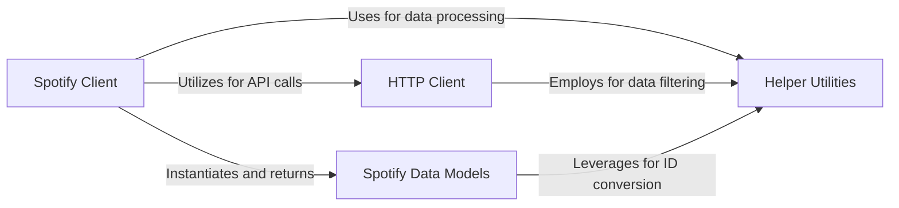

## Component Details

This graph illustrates the core components of the Spotify library, focusing on how they interact to provide a high-level interface for accessing Spotify data. The `Spotify Client` acts as the primary entry point, abstracting API complexities by utilizing the `HTTP Client` for direct API interactions. Data retrieved from the API is then processed and represented by `Spotify Data Models`. Both the `Spotify Client` and `HTTP Client`, as well as the `Spotify Data Models`, rely on `Helper Utilities` for common tasks like ID conversion, data filtering, and caching, ensuring cleaner and more efficient code throughout the system.

### HTTP Client
Manages all direct interactions with the Spotify API by handling HTTP requests, routing, and response processing.

**Related Classes/Methods**:

- `spotify.spotify.http.HTTPClient:change_playlist_details` (full file reference)
- `spotify.spotify.http.HTTPClient.route` (full file reference)
- `spotify.spotify.http.HTTPClient.request` (full file reference)
- `spotify.spotify.http.HTTPClient.album` (full file reference)
- `spotify.spotify.http.HTTPClient.artist` (full file reference)
- `spotify.spotify.http.HTTPClient.track` (full file reference)
- `spotify.spotify.http.HTTPClient.user` (full file reference)
- `spotify.spotify.http.HTTPClient.albums` (full file reference)
- `spotify.spotify.http.HTTPClient.artists` (full file reference)

### Spotify Client
Provides a high-level, user-friendly interface for accessing Spotify data, abstracting the complexities of API calls and data handling.

**Related Classes/Methods**:

- <a href="https://github.com/mental32/spotify.py/blob/master/spotify/client.py#L166-L182" target="_blank" rel="noopener noreferrer">`spotify.spotify.client.Client:get_album` (166:182)</a>
- <a href="https://github.com/mental32/spotify.py/blob/master/spotify/client.py#L184-L198" target="_blank" rel="noopener noreferrer">`spotify.spotify.client.Client:get_artist` (184:198)</a>
- <a href="https://github.com/mental32/spotify.py/blob/master/spotify/client.py#L200-L214" target="_blank" rel="noopener noreferrer">`spotify.spotify.client.Client:get_track` (200:214)</a>
- <a href="https://github.com/mental32/spotify.py/blob/master/spotify/client.py#L216-L230" target="_blank" rel="noopener noreferrer">`spotify.spotify.client.Client:get_user` (216:230)</a>
- <a href="https://github.com/mental32/spotify.py/blob/master/spotify/client.py#L234-L252" target="_blank" rel="noopener noreferrer">`spotify.spotify.client.Client:get_albums` (234:252)</a>
- <a href="https://github.com/mental32/spotify.py/blob/master/spotify/client.py#L254-L268" target="_blank" rel="noopener noreferrer">`spotify.spotify.client.Client:get_artists` (254:268)</a>

### Helper Utilities
Provides various general-purpose helper functions used across the library, such as ID conversion, data filtering, and caching mechanisms, to support cleaner and more efficient code.

**Related Classes/Methods**:

- <a href="https://github.com/mental32/spotify.py/blob/master/spotify/utils.py#L38-L60" target="_blank" rel="noopener noreferrer">`spotify.spotify.utils.to_id` (38:60)</a>
- <a href="https://github.com/mental32/spotify.py/blob/master/spotify/utils.py#L33-L35" target="_blank" rel="noopener noreferrer">`spotify.spotify.utils.filter_items` (33:35)</a>
- <a href="https://github.com/mental32/spotify.py/blob/master/spotify/utils.py#L25-L30" target="_blank" rel="noopener noreferrer">`spotify.spotify.utils._cached_filter_items` (25:30)</a>

### Spotify Data Models
Defines the structure and behavior of various Spotify entities like albums, artists, tracks, and users, providing an object-oriented representation of the API responses.

**Related Classes/Methods**:

- <a href="https://github.com/mental32/spotify.py/blob/master/spotify/models/album.py#L8-L125" target="_blank" rel="noopener noreferrer">`spotify.spotify.models.album.Album` (8:125)</a>
- <a href="https://github.com/mental32/spotify.py/blob/master/spotify/models/artist.py#L11-L186" target="_blank" rel="noopener noreferrer">`spotify.spotify.models.artist.Artist` (11:186)</a>
- <a href="https://github.com/mental32/spotify.py/blob/master/spotify/models/track.py#L14-L104" target="_blank" rel="noopener noreferrer">`spotify.spotify.models.track.Track` (14:104)</a>
- <a href="https://github.com/mental32/spotify.py/blob/master/spotify/models/user.py#L43-L592" target="_blank" rel="noopener noreferrer">`spotify.spotify.models.user.User` (43:592)</a>
- <a href="https://github.com/mental32/spotify.py/blob/master/spotify/models/user.py#L308-L326" target="_blank" rel="noopener noreferrer">`spotify.spotify.models.user.User:add_tracks` (308:326)</a>
- <a href="https://github.com/mental32/spotify.py/blob/master/spotify/models/user.py#L329-L343" target="_blank" rel="noopener noreferrer">`spotify.spotify.models.user.User:replace_tracks` (329:343)</a>
- <a href="https://github.com/mental32/spotify.py/blob/master/spotify/models/user.py#L346-L364" target="_blank" rel="noopener noreferrer">`spotify.spotify.models.user.User:remove_tracks` (346:364)</a>
- <a href="https://github.com/mental32/spotify.py/blob/master/spotify/models/user.py#L367-L393" target="_blank" rel="noopener noreferrer">`spotify.spotify.models.user.User:reorder_tracks` (367:393)</a>
- <a href="https://github.com/mental32/spotify.py/blob/master/spotify/models/user.py#L398-L425" target="_blank" rel="noopener noreferrer">`spotify.spotify.models.user.User:edit_playlist` (398:425)</a>
- <a href="https://github.com/mental32/spotify.py/blob/master/spotify/models/user.py#L459-L472" target="_blank" rel="noopener noreferrer">`spotify.spotify.models.user.User:follow_playlist` (459:472)</a>

### [FAQ](https://github.com/CodeBoarding/GeneratedOnBoardings/tree/main?tab=readme-ov-file#faq)