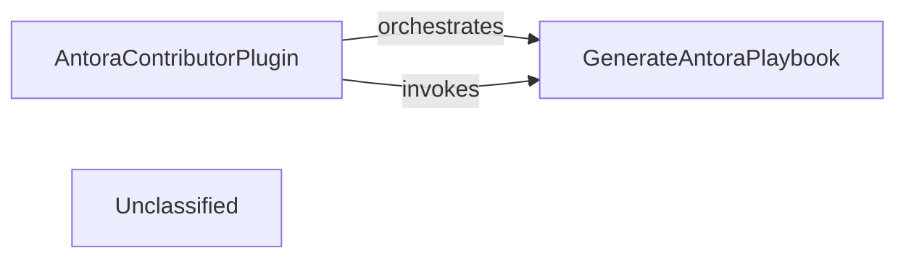

## Details

The Antora documentation subsystem is centered around the `AntoraContributorPlugin` and the `GenerateAntoraPlaybook` task. The `AntoraContributorPlugin` integrates Antora into the Gradle build, setting up the necessary configurations and registering documentation-related tasks. One of its key responsibilities is to ensure the `GenerateAntoraPlaybook` task is available and correctly configured. The `GenerateAntoraPlaybook` task then takes project-specific information, including Antora and Asciidoc extensions and content sources, to dynamically generate the `antora-playbook.yml` file. This playbook is crucial for Antora to understand how to assemble and render the project's documentation.

### AntoraContributorPlugin
This component acts as the primary integration point for Antora within the build system. It configures Antora settings, registers documentation-specific tasks, and orchestrates the overall documentation generation process. It ensures that Antora is properly set up and executed as part of the project's build lifecycle.

**Related Classes/Methods**:

- `org.springframework.boot.build.antora.AntoraContributorPlugin`

### GenerateAntoraPlaybook
This component is a specific task or utility responsible for creating the Antora playbook file. The playbook is a critical configuration file that Antora uses to understand the structure, content sources, and output format for the documentation. This component encapsulates the logic required to generate this file based on the project's documentation needs.

**Related Classes/Methods**:

- `org.springframework.boot.build.antora.GenerateAntoraPlaybook`

### Unclassified
Component for all unclassified files and utility functions (Utility functions/External Libraries/Dependencies)

**Related Classes/Methods**: _None_

### [FAQ](https://github.com/CodeBoarding/GeneratedOnBoardings/tree/main?tab=readme-ov-file#faq)