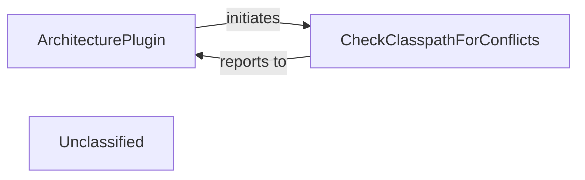

## Details

The architecture of this subsystem revolves around the `ArchitecturePlugin`, which serves as the primary entry point for enforcing architectural integrity within the build. It orchestrates various checks, including the `CheckClasspathForConflicts` component, to ensure that the project adheres to defined structural and dependency guidelines. The `ArchitecturePlugin` initiates these checks and aggregates their results, providing a comprehensive overview of the project's architectural health. The `CheckClasspathForConflicts` component, in turn, focuses specifically on validating the project's classpath, identifying and reporting any conflicts or prohibited dependencies back to the `ArchitecturePlugin`. This clear separation of concerns allows for modular and extensible architectural validation within the build process.

### ArchitecturePlugin
This component acts as the central orchestrator for applying and enforcing architectural rules throughout the build process. It defines the architectural constraints and initiates various validation tasks to ensure that the project's structure and dependencies align with the framework's guidelines.

**Related Classes/Methods**:

- `org.springframework.boot.build.architecture.ArchitecturePlugin`

### CheckClasspathForConflicts
A specialized component dedicated to the rigorous analysis of the project's classpath. Its primary function is to detect and report conflicts arising from incompatible versions of libraries or duplicate classes, and to enforce prohibitions against specific dependencies that are deemed undesirable or problematic for the framework.

**Related Classes/Methods**:

- `org.springframework.boot.build.classpath.CheckClasspathForConflicts`

### Unclassified
Component for all unclassified files and utility functions (Utility functions/External Libraries/Dependencies)

**Related Classes/Methods**: _None_

### [FAQ](https://github.com/CodeBoarding/GeneratedOnBoardings/tree/main?tab=readme-ov-file#faq)