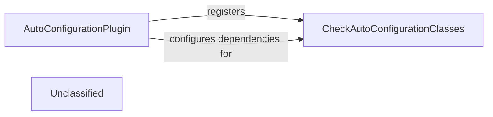

## Details

The auto-configuration validation subsystem is orchestrated by the `AutoConfigurationPlugin`, a Gradle plugin that integrates into the build lifecycle. Its primary role is to set up and initiate the validation process for auto-configuration classes. This involves registering and configuring the `CheckAutoConfigurationClasses` task, which is the core component responsible for performing comprehensive checks on the auto-configuration definitions. The `AutoConfigurationPlugin` ensures that `CheckAutoConfigurationClasses` has the necessary classpath dependencies (both required and optional) to accurately analyze and validate the auto-configuration classes against Spring Boot's conventions, ultimately identifying potential issues and ensuring consistency.

### AutoConfigurationPlugin
This component acts as the entry point and orchestrator for the auto-configuration analysis process. As a build plugin (e.g., Gradle or Maven), it integrates into the build lifecycle to initiate checks and validations on auto-configuration classes. It sets up the necessary tasks and configurations for the analysis.

**Related Classes/Methods**:

- `org.springframework.boot.build.autoconfigure.AutoConfigurationPlugin`

### CheckAutoConfigurationClasses
This component performs the actual validation and checking of auto-configuration classes. It analyzes the structure, imports, and conditions of auto-configuration definitions to ensure they adhere to Spring Boot's conventions and best practices. It identifies potential issues, inconsistencies, or inefficiencies in the auto-configuration setup.

**Related Classes/Methods**:

- `org.springframework.boot.build.autoconfigure.CheckAutoConfigurationClasses`

### Unclassified
Component for all unclassified files and utility functions (Utility functions/External Libraries/Dependencies)

**Related Classes/Methods**: _None_

### [FAQ](https://github.com/CodeBoarding/GeneratedOnBoardings/tree/main?tab=readme-ov-file#faq)