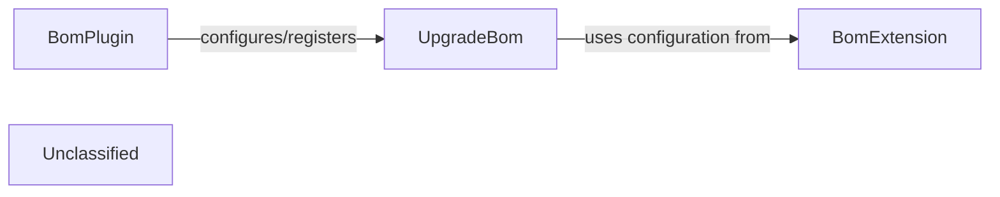

## Details

The BOM management subsystem in Spring Boot is centered around the `BomPlugin`, a Gradle plugin that orchestrates the entire Bill of Materials process. This plugin is responsible for setting up the necessary build environment, including applying other relevant Gradle plugins and creating a `BomExtension` to manage BOM-specific configurations. A key function of the `BomPlugin` is to register various tasks, notably the `UpgradeBom` task, which handles the actual process of updating dependency versions within the BOM. The `UpgradeBom` task, in turn, leverages the configuration provided by the `BomExtension` to perform its operations, such as determining which repositories to use for dependency resolution and generating release notes for upgraded libraries. This architecture ensures a cohesive and automated approach to maintaining the integrity and currency of the project's dependencies.

### BomPlugin
This component serves as the primary integration point for BOM management within the Spring Boot build system. As a Gradle plugin, it applies necessary configurations, registers tasks, and orchestrates the overall process of maintaining the Bill of Materials. It ensures that the framework's dependency management capabilities are available and correctly configured for developers.

**Related Classes/Methods**:

- `org.springframework.boot.build.bom.BomPlugin`

### UpgradeBom
This component represents a concrete operation within the BOM management subsystem, specifically focused on updating dependency versions. It performs checks against defined rules and external sources to identify and apply necessary upgrades, ensuring the Bill of Materials remains current and consistent. This task is crucial for maintaining an up-to-date and secure dependency graph for the framework.

**Related Classes/Methods**:

- `org.springframework.boot.build.bom.bomr.UpgradeBom`

### BomExtension
Holds the configuration for the BOM, used by the BomPlugin and UpgradeBom task.

**Related Classes/Methods**:

- `org.springframework.boot.build.bom.BomExtension`

### Unclassified
Component for all unclassified files and utility functions (Utility functions/External Libraries/Dependencies)

**Related Classes/Methods**: _None_

### [FAQ](https://github.com/CodeBoarding/GeneratedOnBoardings/tree/main?tab=readme-ov-file#faq)