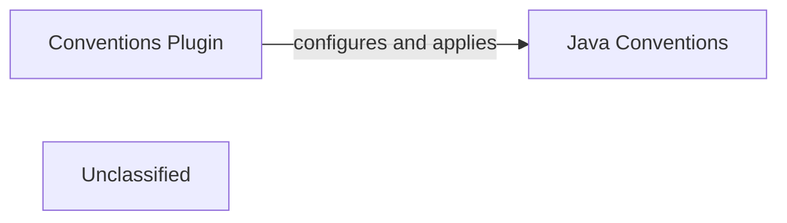

## Details

The Spring Boot build system utilizes a plugin-based architecture to maintain consistent conventions across its projects. The Conventions Plugin serves as the main entry point, coordinating the application of various specialized convention plugins. For Java-based projects, the Java Conventions component is essential, offering opinionated configurations for compilation, testing, and packaging. The Conventions Plugin directly configures and applies the Java Conventions, ensuring uniform enforcement of all Java-specific build policies within the Spring Boot ecosystem. This modular design promotes clear separation of concerns and enhances the maintainability of the build logic.

### Conventions Plugin
Serves as the central orchestrator for applying foundational Gradle plugin conventions across all Spring Boot projects. It is responsible for setting up common build tasks, managing dependencies, and configuring repositories to ensure a standardized and consistent build environment. This component acts as the primary entry point for integrating various build-time policies.

**Related Classes/Methods**:

- `org.springframework.boot.build.ConventionsPlugin`

### Java Conventions
Provides specialized core build logic tailored specifically for Java-based Spring Boot projects. This component configures Java compilation settings, integrates with testing frameworks (e.g., JUnit, TestNG), and defines packaging strategies (e.g., JAR, WAR) to ensure adherence to Spring Boot's opinionated build standards for Java applications.

**Related Classes/Methods**:

- `org.springframework.boot.build.JavaConventions`

### Unclassified
Component for all unclassified files and utility functions (Utility functions/External Libraries/Dependencies)

**Related Classes/Methods**: _None_

### [FAQ](https://github.com/CodeBoarding/GeneratedOnBoardings/tree/main?tab=readme-ov-file#faq)