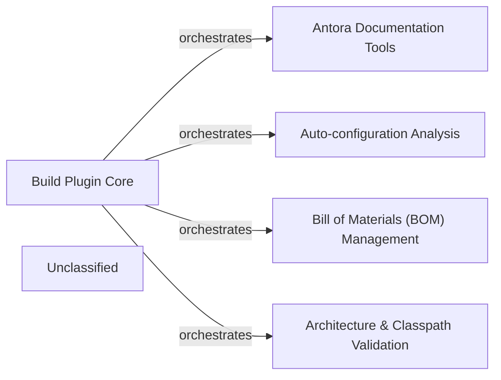

## Details

This project, identified as a Spring Boot build system, is structured around a core set of Gradle plugins and conventions. The Build Plugin Core acts as the central orchestrator, initializing and integrating specialized plugins for various build concerns. These include Antora Documentation Tools for managing documentation generation, Auto-configuration Analysis for processing and validating Spring Boot's auto-configuration metadata, Bill of Materials (BOM) Management for handling dependency versions and upgrades, and Architecture & Classpath Validation for enforcing project standards and detecting conflicts. This modular design ensures a robust and consistent build process across Spring Boot projects.

### Build Plugin Core [[Expand]](./Build_Plugin_Core.md)
Provides the foundational Gradle plugin conventions and core build logic, serving as the central orchestrator for various build tasks and specialized plugins within the Spring Boot build system.

**Related Classes/Methods**:

- `org.springframework.boot.build.ConventionsPlugin`
- `org.springframework.boot.build.JavaConventions`

### Antora Documentation Tools [[Expand]](./Antora_Documentation_Tools.md)
Manages the generation, aggregation, and synchronization of Antora-based documentation, facilitating the creation of comprehensive project documentation.

**Related Classes/Methods**:

- `org.springframework.boot.build.antora.AntoraContributorPlugin`
- `org.springframework.boot.build.antora.GenerateAntoraPlaybook`

### Auto-configuration Analysis [[Expand]](./Auto_configuration_Analysis.md)
Handles the processing, validation, and documentation of Spring Boot auto-configuration classes and their imports, ensuring correct and efficient auto-configuration behavior.

**Related Classes/Methods**:

- `org.springframework.boot.build.autoconfigure.AutoConfigurationPlugin`
- `org.springframework.boot.build.autoconfigure.CheckAutoConfigurationClasses`

### Bill of Materials (BOM) Management [[Expand]](./Bill_of_Materials_BOM_Management.md)
Manages the Spring Boot Bill of Materials, including dependency resolution, version upgrades, and consistency checks to maintain a stable and up-to-date dependency graph.

**Related Classes/Methods**:

- `org.springframework.boot.build.bom.BomPlugin`
- `org.springframework.boot.build.bom.bomr.UpgradeBom`

### Architecture & Classpath Validation [[Expand]](./Architecture_Classpath_Validation.md)
Enforces architectural rules and performs various classpath checks, including conflict detection and prohibition of specific dependencies, to ensure project integrity and adherence to standards.

**Related Classes/Methods**:

- `org.springframework.boot.build.architecture.ArchitecturePlugin`
- `org.springframework.boot.build.classpath.CheckClasspathForConflicts`

### Unclassified
Component for all unclassified files and utility functions (Utility functions/External Libraries/Dependencies)

**Related Classes/Methods**: _None_

### [FAQ](https://github.com/CodeBoarding/GeneratedOnBoardings/tree/main?tab=readme-ov-file#faq)