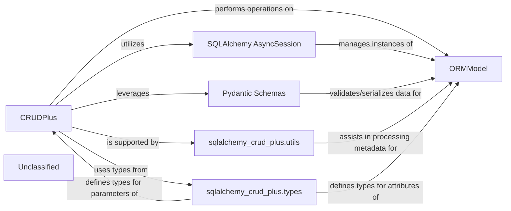

## Details

The `sqlalchemy-crud-plus` subsystem provides a robust framework for asynchronous CRUD operations on SQLAlchemy ORM models. At its core, the `CRUDPlus` component orchestrates all data interactions, leveraging `SQLAlchemy AsyncSession` for managing database transactions and persistence. User-defined `ORMModel`s, which inherit from `DeclarativeBase`, define the database schema and data structure. Data validation and serialization are handled by `Pydantic Schemas`, ensuring data integrity before mapping to ORM models and consistent output formats. Supporting these central components are `sqlalchemy_crud_plus.utils`, which offers essential helper functions for query construction and filter parsing, and `sqlalchemy_crud_plus.types`, which defines critical type hints and data structures, enhancing the overall type safety and clarity of the subsystem. This architecture promotes a clear separation of concerns, making the system maintainable and extensible.

### ORMModel [[Expand]](./ORMModel.md)
Represents the user-defined SQLAlchemy declarative models, defining the database schema, data structure, and providing essential metadata for database operations. These models are the foundation upon which all data interactions are built, inheriting from `DeclarativeBase`.

**Related Classes/Methods**:

- <a href="https://github.com/fastapi-practices/sqlalchemy-crud-plus/blob/mastersqlalchemy_crud_plus/types.py#L8-L12" target="_blank" rel="noopener noreferrer">`sqlalchemy.orm.DeclarativeBase`:8-12</a>

### CRUDPlus
The core service component responsible for abstracting and performing Create, Read, Update, and Delete (CRUD) operations on `ORMModel` instances. It acts as the primary interface for application logic to interact with the database.

**Related Classes/Methods**:

- <a href="https://github.com/fastapi-practices/sqlalchemy-crud-plus/blob/mastersqlalchemy_crud_plus/crud.py#L36-L300" target="_blank" rel="noopener noreferrer">`sqlalchemy_crud_plus.CRUDPlus`:36-300</a>

### SQLAlchemy AsyncSession
Manages the persistence, retrieval, and transaction boundaries for `ORMModel` instances, providing an asynchronous interface to the underlying database. It ensures proper connection handling and transaction isolation.

**Related Classes/Methods**:

- <a href="https://github.com/fastapi-practices/sqlalchemy-crud-plus/blob/mastersqlalchemy_crud_plus/crud.py" target="_blank" rel="noopener noreferrer">`sqlalchemy.ext.asyncio.AsyncSession`</a>

### Pydantic Schemas
Defines data validation and serialization schemas, used for validating incoming data before ORM mapping and for serializing `ORMModel` instances into structured output formats. These schemas are based on `pydantic.BaseModel`.

**Related Classes/Methods**:

- <a href="https://github.com/fastapi-practices/sqlalchemy-crud-plus/blob/mastersqlalchemy_crud_plus/types.py#L7-L14" target="_blank" rel="noopener noreferrer">`pydantic.BaseModel`:7-14</a>

### sqlalchemy_crud_plus.utils
Provides utility functions that support `CRUDPlus` operations, assisting in metadata processing, query construction, and filter parsing related to `ORMModel` instances.

**Related Classes/Methods**:

- <a href="https://github.com/fastapi-practices/sqlalchemy-crud-plus/blob/mastersqlalchemy_crud_plus/utils.py" target="_blank" rel="noopener noreferrer">`sqlalchemy_crud_plus.utils`</a>

### sqlalchemy_crud_plus.types
Defines custom type hints and data structures used within the library, enhancing type safety and clarity for `ORMModel` definitions and `CRUDPlus` parameters, including `Model`, `CreateSchema`, and `UpdateSchema` TypeVars.

**Related Classes/Methods**:

- <a href="https://github.com/fastapi-practices/sqlalchemy-crud-plus/blob/mastersqlalchemy_crud_plus/types.py" target="_blank" rel="noopener noreferrer">`sqlalchemy_crud_plus.types`</a>

### Unclassified
Component for all unclassified files and utility functions (Utility functions/External Libraries/Dependencies)

**Related Classes/Methods**: _None_

### [FAQ](https://github.com/CodeBoarding/GeneratedOnBoardings/tree/main?tab=readme-ov-file#faq)