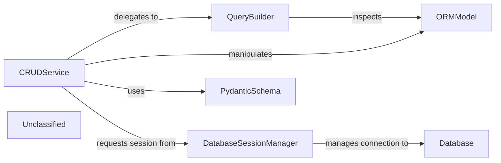

## Details

The `sqlalchemy_crud_plus` project provides a streamlined approach to database interactions by centralizing CRUD operations within the `CRUDService`. This service acts as the primary interface, receiving data often validated by `PydanticSchema` and translating requests into database operations. It intelligently delegates complex query construction to the `QueryBuilder`, which dynamically builds SQLAlchemy expressions by inspecting `ORMModel` definitions. All database interactions are facilitated through `DatabaseSessionManager`, ensuring proper session and transaction handling with the underlying `Database`. This modular design promotes a clear separation of concerns, making the system easy to understand, extend, and maintain, while providing a robust foundation for data management.

### CRUDService
The central component responsible for executing all Create, Read, Update, and Delete operations on ORM models, acting as the primary interface for database interactions.

**Related Classes/Methods**:

- <a href="https://github.com/fastapi-practices/sqlalchemy-crud-plus/blob/mastersqlalchemy_crud_plus/crud.py" target="_blank" rel="noopener noreferrer">`sqlalchemy_crud_plus.crud.CRUDPlus:create_model`</a>
- <a href="https://github.com/fastapi-practices/sqlalchemy-crud-plus/blob/mastersqlalchemy_crud_plus/crud.py" target="_blank" rel="noopener noreferrer">`sqlalchemy_crud_plus.crud.CRUDPlus:select_model`</a>
- <a href="https://github.com/fastapi-practices/sqlalchemy-crud-plus/blob/mastersqlalchemy_crud_plus/crud.py" target="_blank" rel="noopener noreferrer">`sqlalchemy_crud_plus.crud.CRUDPlus:update_model`</a>
- <a href="https://github.com/fastapi-practices/sqlalchemy-crud-plus/blob/mastersqlalchemy_crud_plus/crud.py" target="_blank" rel="noopener noreferrer">`sqlalchemy_crud_plus.crud.CRUDPlus:delete_model`</a>
- <a href="https://github.com/fastapi-practices/sqlalchemy-crud-plus/blob/mastersqlalchemy_crud_plus/crud.py" target="_blank" rel="noopener noreferrer">`sqlalchemy_crud_plus.crud.CRUDPlus:count`</a>

### QueryBuilder
Constructs dynamic SQLAlchemy query components, including filter expressions (AND, OR, arithmetic) and sorting clauses, by translating high-level specifications into database-executable expressions.

**Related Classes/Methods**:

- <a href="https://github.com/fastapi-practices/sqlalchemy-crud-plus/blob/mastersqlalchemy_crud_plus/utils.py" target="_blank" rel="noopener noreferrer">`sqlalchemy_crud_plus.utils:parse_filters`</a>
- <a href="https://github.com/fastapi-practices/sqlalchemy-crud-plus/blob/mastersqlalchemy_crud_plus/utils.py" target="_blank" rel="noopener noreferrer">`sqlalchemy_crud_plus.utils:apply_sorting`</a>
- <a href="https://github.com/fastapi-practices/sqlalchemy-crud-plus/blob/mastersqlalchemy_crud_plus/utils.py" target="_blank" rel="noopener noreferrer">`sqlalchemy_crud_plus.utils:get_column`</a>
- <a href="https://github.com/fastapi-practices/sqlalchemy-crud-plus/blob/mastersqlalchemy_crud_plus/utils.py" target="_blank" rel="noopener noreferrer">`sqlalchemy_crud_plus.utils:get_sqlalchemy_filter`</a>

### DatabaseSessionManager
Provides and manages the SQLAlchemy `AsyncSession` instance, ensuring proper transaction scope and connection handling for all database operations.

**Related Classes/Methods**:

- <a href="https://github.com/fastapi-practices/sqlalchemy-crud-plus/blob/master." target="_blank" rel="noopener noreferrer">`sqlalchemy.ext.asyncio:AsyncSession`</a>

### ORMModel [[Expand]](./ORMModel.md)
Represents the user-defined SQLAlchemy declarative models, defining the database schema, data structure, and providing essential metadata for database operations.

**Related Classes/Methods**:

- <a href="https://github.com/fastapi-practices/sqlalchemy-crud-plus/blob/master." target="_blank" rel="noopener noreferrer">`sqlalchemy.orm:DeclarativeBase`</a>

### PydanticSchema
An external component (Pydantic) used for validating incoming data before processing by CRUD operations and for serializing outgoing ORM model instances into a desired format.

**Related Classes/Methods**:

- <a href="https://github.com/fastapi-practices/sqlalchemy-crud-plus/blob/master." target="_blank" rel="noopener noreferrer">`pydantic:BaseModel`</a>

### Database
The actual persistent data store (e.g., PostgreSQL, SQLite) where application data is stored and retrieved.

**Related Classes/Methods**:

- <a href="https://github.com/fastapi-practices/sqlalchemy-crud-plus/blob/master." target="_blank" rel="noopener noreferrer">`Database`</a>

### Unclassified
Component for all unclassified files and utility functions (Utility functions/External Libraries/Dependencies)

**Related Classes/Methods**: _None_

### [FAQ](https://github.com/CodeBoarding/GeneratedOnBoardings/tree/main?tab=readme-ov-file#faq)