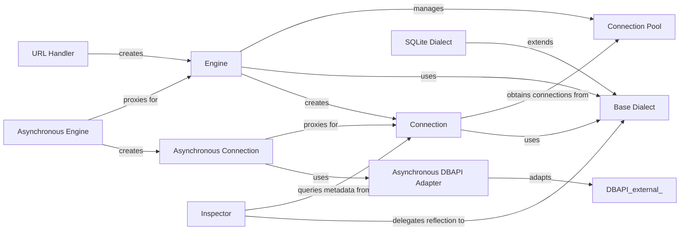

## Component Details

Manages fundamental database connectivity, including creating and managing database connections, handling connection pools, parsing database URLs, and providing asynchronous interfaces for these operations. It also encapsulates dialect-specific implementations for various database systems, handling their unique SQL syntax and data types.

### Engine
The Engine is the primary entry point to SQLAlchemy's database connectivity. It combines a connection pool and a dialect to provide a source of database connections and behavior, managing their lifecycle and high-level transaction control.

**Related Classes/Methods**:

- <a href="https://github.com/sqlalchemy/sqlalchemy/blob/master/lib/sqlalchemy/engine/base.py#L2919-L3302" target="_blank" rel="noopener noreferrer">`sqlalchemy.engine.base.Engine` (2919:3302)</a>
- <a href="https://github.com/sqlalchemy/sqlalchemy/blob/master/lib/sqlalchemy/engine/base.py#L3255-L3278" target="_blank" rel="noopener noreferrer">`sqlalchemy.engine.base.Engine.connect` (3255:3278)</a>
- <a href="https://github.com/sqlalchemy/sqlalchemy/blob/master/lib/sqlalchemy/engine/base.py#L3218-L3244" target="_blank" rel="noopener noreferrer">`sqlalchemy.engine.base.Engine.begin` (3218:3244)</a>
- <a href="https://github.com/sqlalchemy/sqlalchemy/blob/master/lib/sqlalchemy/engine/base.py#L3280-L3302" target="_blank" rel="noopener noreferrer">`sqlalchemy.engine.base.Engine.raw_connection` (3280:3302)</a>
- <a href="https://github.com/sqlalchemy/sqlalchemy/blob/master/lib/sqlalchemy/engine/base.py#L3165-L3205" target="_blank" rel="noopener noreferrer">`sqlalchemy.engine.base.Engine.dispose` (3165:3205)</a>
- <a href="https://github.com/sqlalchemy/sqlalchemy/blob/master/lib/sqlalchemy/engine/base.py#L3039-L3048" target="_blank" rel="noopener noreferrer">`sqlalchemy.engine.base.Engine.execution_options` (3039:3048)</a>

### Connection
The Connection object represents a single DBAPI connection checked out from the connection pool. It provides high-level functionality for executing SQL statements and managing transactions, including commit, rollback, and savepoints.

**Related Classes/Methods**:

- <a href="https://github.com/sqlalchemy/sqlalchemy/blob/master/lib/sqlalchemy/engine/base.py#L88-L2462" target="_blank" rel="noopener noreferrer">`sqlalchemy.engine.base.Connection` (88:2462)</a>
- <a href="https://github.com/sqlalchemy/sqlalchemy/blob/master/lib/sqlalchemy/engine/base.py#L1367-L1373" target="_blank" rel="noopener noreferrer">`sqlalchemy.engine.base.Connection.execute` (1367:1373)</a>
- <a href="https://github.com/sqlalchemy/sqlalchemy/blob/master/lib/sqlalchemy/engine/base.py#L1277-L1283" target="_blank" rel="noopener noreferrer">`sqlalchemy.engine.base.Connection.scalar` (1277:1283)</a>
- <a href="https://github.com/sqlalchemy/sqlalchemy/blob/master/lib/sqlalchemy/engine/base.py#L1324-L1330" target="_blank" rel="noopener noreferrer">`sqlalchemy.engine.base.Connection.scalars` (1324:1330)</a>
- <a href="https://github.com/sqlalchemy/sqlalchemy/blob/master/lib/sqlalchemy/engine/base.py#L806-L879" target="_blank" rel="noopener noreferrer">`sqlalchemy.engine.base.Connection.begin` (806:879)</a>
- <a href="https://github.com/sqlalchemy/sqlalchemy/blob/master/lib/sqlalchemy/engine/base.py#L988-L1011" target="_blank" rel="noopener noreferrer">`sqlalchemy.engine.base.Connection.commit` (988:1011)</a>
- <a href="https://github.com/sqlalchemy/sqlalchemy/blob/master/lib/sqlalchemy/engine/base.py#L1013-L1037" target="_blank" rel="noopener noreferrer">`sqlalchemy.engine.base.Connection.rollback` (1013:1037)</a>
- <a href="https://github.com/sqlalchemy/sqlalchemy/blob/master/lib/sqlalchemy/engine/base.py#L1228-L1274" target="_blank" rel="noopener noreferrer">`sqlalchemy.engine.base.Connection.close` (1228:1274)</a>
- <a href="https://github.com/sqlalchemy/sqlalchemy/blob/master/lib/sqlalchemy/engine/base.py#L707-L764" target="_blank" rel="noopener noreferrer">`sqlalchemy.engine.base.Connection.invalidate` (707:764)</a>
- <a href="https://github.com/sqlalchemy/sqlalchemy/blob/master/lib/sqlalchemy/engine/base.py#L2228-L2371" target="_blank" rel="noopener noreferrer">`sqlalchemy.engine.base.Connection._handle_dbapi_exception` (2228:2371)</a>

### Connection Pool
The Connection Pool manages a collection of DBAPI connections, providing them to Engine and Connection objects as needed. It handles connection recycling, disposal, and ensures efficient reuse of database resources.

**Related Classes/Methods**:

- <a href="https://github.com/sqlalchemy/sqlalchemy/blob/master/lib/sqlalchemy/pool/base.py#L155-L468" target="_blank" rel="noopener noreferrer">`sqlalchemy.pool.base.Pool` (155:468)</a>
- <a href="https://github.com/sqlalchemy/sqlalchemy/blob/master/lib/sqlalchemy/pool/impl.py#L43-L254" target="_blank" rel="noopener noreferrer">`sqlalchemy.pool.impl.QueuePool` (43:254)</a>
- <a href="https://github.com/sqlalchemy/sqlalchemy/blob/master/lib/sqlalchemy/pool/impl.py#L278-L317" target="_blank" rel="noopener noreferrer">`sqlalchemy.pool.impl.NullPool` (278:317)</a>
- <a href="https://github.com/sqlalchemy/sqlalchemy/blob/master/lib/sqlalchemy/pool/impl.py#L320-L439" target="_blank" rel="noopener noreferrer">`sqlalchemy.pool.impl.SingletonThreadPool` (320:439)</a>
- <a href="https://github.com/sqlalchemy/sqlalchemy/blob/master/lib/sqlalchemy/pool/impl.py#L507-L573" target="_blank" rel="noopener noreferrer">`sqlalchemy.pool.impl.AssertionPool` (507:573)</a>
- <a href="https://github.com/sqlalchemy/sqlalchemy/blob/master/lib/sqlalchemy/pool/base.py#L437-L445" target="_blank" rel="noopener noreferrer">`sqlalchemy.pool.base.Pool.connect` (437:445)</a>
- <a href="https://github.com/sqlalchemy/sqlalchemy/blob/master/lib/sqlalchemy/pool/base.py#L383-L386" target="_blank" rel="noopener noreferrer">`sqlalchemy.pool.base.Pool._create_connection` (383:386)</a>
- <a href="https://github.com/sqlalchemy/sqlalchemy/blob/master/lib/sqlalchemy/pool/base.py#L447-L454" target="_blank" rel="noopener noreferrer">`sqlalchemy.pool.base.Pool._return_conn` (447:454)</a>
- <a href="https://github.com/sqlalchemy/sqlalchemy/blob/master/lib/sqlalchemy/pool/base.py#L410-L420" target="_blank" rel="noopener noreferrer">`sqlalchemy.pool.base.Pool.recreate` (410:420)</a>
- <a href="https://github.com/sqlalchemy/sqlalchemy/blob/master/lib/sqlalchemy/pool/base.py#L422-L435" target="_blank" rel="noopener noreferrer">`sqlalchemy.pool.base.Pool.dispose` (422:435)</a>
- <a href="https://github.com/sqlalchemy/sqlalchemy/blob/master/lib/sqlalchemy/pool/base.py#L629-L911" target="_blank" rel="noopener noreferrer">`sqlalchemy.pool.base._ConnectionRecord` (629:911)</a>
- <a href="https://github.com/sqlalchemy/sqlalchemy/blob/master/lib/sqlalchemy/pool/base.py#L1185-L1514" target="_blank" rel="noopener noreferrer">`sqlalchemy.pool.base._ConnectionFairy` (1185:1514)</a>

### Base Dialect
The Base Dialect provides common implementations for SQL compilation, type handling, and database introspection that are shared across different database systems. Specific dialects inherit from this class to implement database-specific behaviors.

**Related Classes/Methods**:

- <a href="https://github.com/sqlalchemy/sqlalchemy/blob/master/lib/sqlalchemy/engine/default.py#L122-L1177" target="_blank" rel="noopener noreferrer">`sqlalchemy.engine.default.DefaultDialect` (122:1177)</a>
- <a href="https://github.com/sqlalchemy/sqlalchemy/blob/master/lib/sqlalchemy/engine/default.py#L298-L378" target="_blank" rel="noopener noreferrer">`sqlalchemy.engine.default.DefaultDialect.__init__` (298:378)</a>
- <a href="https://github.com/sqlalchemy/sqlalchemy/blob/master/lib/sqlalchemy/engine/default.py#L531-L565" target="_blank" rel="noopener noreferrer">`sqlalchemy.engine.default.DefaultDialect.initialize` (531:565)</a>
- <a href="https://github.com/sqlalchemy/sqlalchemy/blob/master/lib/sqlalchemy/engine/default.py#L705-L706" target="_blank" rel="noopener noreferrer">`sqlalchemy.engine.default.DefaultDialect.do_begin` (705:706)</a>
- <a href="https://github.com/sqlalchemy/sqlalchemy/blob/master/lib/sqlalchemy/engine/default.py#L711-L712" target="_blank" rel="noopener noreferrer">`sqlalchemy.engine.default.DefaultDialect.do_commit` (711:712)</a>
- <a href="https://github.com/sqlalchemy/sqlalchemy/blob/master/lib/sqlalchemy/engine/default.py#L708-L709" target="_blank" rel="noopener noreferrer">`sqlalchemy.engine.default.DefaultDialect.do_rollback` (708:709)</a>
- `sqlalchemy.engine.default.DefaultDialect.get_columns` (full file reference)
- `sqlalchemy.engine.default.DefaultDialect.get_pk_constraint` (full file reference)
- `sqlalchemy.engine.default.DefaultDialect.get_foreign_keys` (full file reference)
- `sqlalchemy.engine.default.DefaultDialect.get_indexes` (full file reference)
- `sqlalchemy.engine.default.DefaultDialect.get_unique_constraints` (full file reference)
- `sqlalchemy.engine.default.DefaultDialect.get_check_constraints` (full file reference)
- `sqlalchemy.engine.default.DefaultDialect.get_table_comment` (full file reference)

### SQLite Dialect
The SQLite Dialect is a concrete implementation of the Base Dialect tailored for SQLite databases. It provides SQLite-specific SQL compilation rules, type mappings, and introspection methods, handling the nuances of SQLite's unique characteristics.

**Related Classes/Methods**:

- <a href="https://github.com/sqlalchemy/sqlalchemy/blob/master/lib/sqlalchemy/dialects/sqlite/base.py#L2028-L2917" target="_blank" rel="noopener noreferrer">`sqlalchemy.dialects.sqlite.base.SQLiteDialect` (2028:2917)</a>
- <a href="https://github.com/sqlalchemy/sqlalchemy/blob/master/lib/sqlalchemy/dialects/sqlite/base.py#L2096-L2157" target="_blank" rel="noopener noreferrer">`sqlalchemy.dialects.sqlite.base.SQLiteDialect.__init__` (2096:2157)</a>
- <a href="https://github.com/sqlalchemy/sqlalchemy/blob/master/lib/sqlalchemy/dialects/sqlite/base.py#L2166-L2171" target="_blank" rel="noopener noreferrer">`sqlalchemy.dialects.sqlite.base.SQLiteDialect.set_isolation_level` (2166:2171)</a>
- `sqlalchemy.dialects.sqlite.base.SQLiteDialect.is_disconnect` (full file reference)
- <a href="https://github.com/sqlalchemy/sqlalchemy/blob/master/lib/sqlalchemy/dialects/sqlite/base.py#L2321-L2380" target="_blank" rel="noopener noreferrer">`sqlalchemy.dialects.sqlite.base.SQLiteDialect.get_columns` (2321:2380)</a>
- <a href="https://github.com/sqlalchemy/sqlalchemy/blob/master/lib/sqlalchemy/dialects/sqlite/base.py#L2481-L2499" target="_blank" rel="noopener noreferrer">`sqlalchemy.dialects.sqlite.base.SQLiteDialect.get_pk_constraint` (2481:2499)</a>
- <a href="https://github.com/sqlalchemy/sqlalchemy/blob/master/lib/sqlalchemy/dialects/sqlite/base.py#L2502-L2669" target="_blank" rel="noopener noreferrer">`sqlalchemy.dialects.sqlite.base.SQLiteDialect.get_foreign_keys` (2502:2669)</a>
- <a href="https://github.com/sqlalchemy/sqlalchemy/blob/master/lib/sqlalchemy/dialects/sqlite/base.py#L2676-L2730" target="_blank" rel="noopener noreferrer">`sqlalchemy.dialects.sqlite.base.SQLiteDialect.get_unique_constraints` (2676:2730)</a>
- <a href="https://github.com/sqlalchemy/sqlalchemy/blob/master/lib/sqlalchemy/dialects/sqlite/base.py#L2733-L2763" target="_blank" rel="noopener noreferrer">`sqlalchemy.dialects.sqlite.base.SQLiteDialect.get_check_constraints` (2733:2763)</a>
- <a href="https://github.com/sqlalchemy/sqlalchemy/blob/master/lib/sqlalchemy/dialects/sqlite/base.py#L2766-L2853" target="_blank" rel="noopener noreferrer">`sqlalchemy.dialects.sqlite.base.SQLiteDialect.get_indexes` (2766:2853)</a>

### Asynchronous Engine
The Asynchronous Engine is an asyncio proxy for the synchronous Engine. It enables SQLAlchemy's engine functionality to be used within an asyncio event loop, adapting synchronous operations to asynchronous ones for non-blocking database interactions.

**Related Classes/Methods**:

- <a href="https://github.com/sqlalchemy/sqlalchemy/blob/master/lib/sqlalchemy/ext/asyncio/engine.py#L1001-L1328" target="_blank" rel="noopener noreferrer">`sqlalchemy.ext.asyncio.engine.AsyncEngine` (1001:1328)</a>
- <a href="https://github.com/sqlalchemy/sqlalchemy/blob/master/lib/sqlalchemy/ext/asyncio/engine.py#L73-L124" target="_blank" rel="noopener noreferrer">`sqlalchemy.ext.asyncio.engine.create_async_engine` (73:124)</a>
- <a href="https://github.com/sqlalchemy/sqlalchemy/blob/master/lib/sqlalchemy/ext/asyncio/engine.py#L127-L149" target="_blank" rel="noopener noreferrer">`sqlalchemy.ext.asyncio.engine.async_engine_from_config` (127:149)</a>
- <a href="https://github.com/sqlalchemy/sqlalchemy/blob/master/lib/sqlalchemy/ext/asyncio/engine.py#L152-L164" target="_blank" rel="noopener noreferrer">`sqlalchemy.ext.asyncio.engine.create_async_pool_from_url` (152:164)</a>
- <a href="https://github.com/sqlalchemy/sqlalchemy/blob/master/lib/sqlalchemy/ext/asyncio/engine.py#L1074-L1090" target="_blank" rel="noopener noreferrer">`sqlalchemy.ext.asyncio.engine.AsyncEngine.connect` (1074:1090)</a>
- <a href="https://github.com/sqlalchemy/sqlalchemy/blob/master/lib/sqlalchemy/ext/asyncio/engine.py#L1054-L1072" target="_blank" rel="noopener noreferrer">`sqlalchemy.ext.asyncio.engine.AsyncEngine.begin` (1054:1072)</a>
- <a href="https://github.com/sqlalchemy/sqlalchemy/blob/master/lib/sqlalchemy/ext/asyncio/engine.py#L1129-L1152" target="_blank" rel="noopener noreferrer">`sqlalchemy.ext.asyncio.engine.AsyncEngine.dispose` (1129:1152)</a>
- <a href="https://github.com/sqlalchemy/sqlalchemy/blob/master/lib/sqlalchemy/ext/asyncio/engine.py#L1092-L1100" target="_blank" rel="noopener noreferrer">`sqlalchemy.ext.asyncio.engine.AsyncEngine.raw_connection` (1092:1100)</a>

### Asynchronous Connection
The Asynchronous Connection is an asyncio proxy for the synchronous Connection. It enables asynchronous execution of SQL statements and transaction management within an asyncio environment, providing non-blocking database access.

**Related Classes/Methods**:

- <a href="https://github.com/sqlalchemy/sqlalchemy/blob/master/lib/sqlalchemy/ext/asyncio/engine.py#L192-L984" target="_blank" rel="noopener noreferrer">`sqlalchemy.ext.asyncio.engine.AsyncConnection` (192:984)</a>
- <a href="https://github.com/sqlalchemy/sqlalchemy/blob/master/lib/sqlalchemy/ext/asyncio/engine.py#L607-L613" target="_blank" rel="noopener noreferrer">`sqlalchemy.ext.asyncio.engine.AsyncConnection.execute` (607:613)</a>
- <a href="https://github.com/sqlalchemy/sqlalchemy/blob/master/lib/sqlalchemy/ext/asyncio/engine.py#L672-L678" target="_blank" rel="noopener noreferrer">`sqlalchemy.ext.asyncio.engine.AsyncConnection.scalar` (672:678)</a>
- <a href="https://github.com/sqlalchemy/sqlalchemy/blob/master/lib/sqlalchemy/ext/asyncio/engine.py#L712-L718" target="_blank" rel="noopener noreferrer">`sqlalchemy.ext.asyncio.engine.AsyncConnection.scalars` (712:718)</a>
- <a href="https://github.com/sqlalchemy/sqlalchemy/blob/master/lib/sqlalchemy/ext/asyncio/engine.py#L522-L528" target="_blank" rel="noopener noreferrer">`sqlalchemy.ext.asyncio.engine.AsyncConnection.stream` (522:528)</a>
- <a href="https://github.com/sqlalchemy/sqlalchemy/blob/master/lib/sqlalchemy/ext/asyncio/engine.py#L753-L759" target="_blank" rel="noopener noreferrer">`sqlalchemy.ext.asyncio.engine.AsyncConnection.stream_scalars` (753:759)</a>
- <a href="https://github.com/sqlalchemy/sqlalchemy/blob/master/lib/sqlalchemy/ext/asyncio/engine.py#L332-L335" target="_blank" rel="noopener noreferrer">`sqlalchemy.ext.asyncio.engine.AsyncConnection.begin` (332:335)</a>
- <a href="https://github.com/sqlalchemy/sqlalchemy/blob/master/lib/sqlalchemy/ext/asyncio/engine.py#L449-L461" target="_blank" rel="noopener noreferrer">`sqlalchemy.ext.asyncio.engine.AsyncConnection.commit` (449:461)</a>
- <a href="https://github.com/sqlalchemy/sqlalchemy/blob/master/lib/sqlalchemy/ext/asyncio/engine.py#L463-L477" target="_blank" rel="noopener noreferrer">`sqlalchemy.ext.asyncio.engine.AsyncConnection.rollback` (463:477)</a>
- <a href="https://github.com/sqlalchemy/sqlalchemy/blob/master/lib/sqlalchemy/ext/asyncio/engine.py#L479-L486" target="_blank" rel="noopener noreferrer">`sqlalchemy.ext.asyncio.engine.AsyncConnection.close` (479:486)</a>
- <a href="https://github.com/sqlalchemy/sqlalchemy/blob/master/lib/sqlalchemy/ext/asyncio/engine.py#L488-L498" target="_blank" rel="noopener noreferrer">`sqlalchemy.ext.asyncio.engine.AsyncConnection.aclose` (488:498)</a>
- <a href="https://github.com/sqlalchemy/sqlalchemy/blob/master/lib/sqlalchemy/ext/asyncio/engine.py#L342-L355" target="_blank" rel="noopener noreferrer">`sqlalchemy.ext.asyncio.engine.AsyncConnection.invalidate` (342:355)</a>
- <a href="https://github.com/sqlalchemy/sqlalchemy/blob/master/lib/sqlalchemy/ext/asyncio/engine.py#L823-L893" target="_blank" rel="noopener noreferrer">`sqlalchemy.ext.asyncio.engine.AsyncConnection.run_sync` (823:893)</a>

### Asynchronous DBAPI Adapter
This component acts as a generic adapter for asynchronous DBAPI connections. It wraps an underlying asynchronous DBAPI connection and provides a synchronous-like interface for SQLAlchemy's core components, handling the asynchronous operations internally.

**Related Classes/Methods**:

- <a href="https://github.com/sqlalchemy/sqlalchemy/blob/master/lib/sqlalchemy/connectors/asyncio.py#L293-L340" target="_blank" rel="noopener noreferrer">`sqlalchemy.connectors.asyncio.AsyncAdapt_dbapi_connection` (293:340)</a>
- <a href="https://github.com/sqlalchemy/sqlalchemy/blob/master/lib/sqlalchemy/connectors/asyncio.py#L306-L310" target="_blank" rel="noopener noreferrer">`sqlalchemy.connectors.asyncio.AsyncAdapt_dbapi_connection.cursor` (306:310)</a>
- <a href="https://github.com/sqlalchemy/sqlalchemy/blob/master/lib/sqlalchemy/connectors/asyncio.py#L327-L331" target="_blank" rel="noopener noreferrer">`sqlalchemy.connectors.asyncio.AsyncAdapt_dbapi_connection.rollback` (327:331)</a>
- <a href="https://github.com/sqlalchemy/sqlalchemy/blob/master/lib/sqlalchemy/connectors/asyncio.py#L333-L337" target="_blank" rel="noopener noreferrer">`sqlalchemy.connectors.asyncio.AsyncAdapt_dbapi_connection.commit` (333:337)</a>
- <a href="https://github.com/sqlalchemy/sqlalchemy/blob/master/lib/sqlalchemy/connectors/asyncio.py#L339-L340" target="_blank" rel="noopener noreferrer">`sqlalchemy.connectors.asyncio.AsyncAdapt_dbapi_connection.close` (339:340)</a>

### Inspector
The Inspector provides a high-level interface for database schema introspection. It allows applications to query metadata about tables, columns, primary keys, foreign keys, indexes, and constraints in a database-agnostic way, leveraging the specific dialect's reflection capabilities.

**Related Classes/Methods**:

- <a href="https://github.com/sqlalchemy/sqlalchemy/blob/master/lib/sqlalchemy/engine/reflection.py#L182-L2037" target="_blank" rel="noopener noreferrer">`sqlalchemy.engine.reflection.Inspector` (182:2037)</a>
- <a href="https://github.com/sqlalchemy/sqlalchemy/blob/master/lib/sqlalchemy/engine/reflection.py#L364-L375" target="_blank" rel="noopener noreferrer">`sqlalchemy.engine.reflection.Inspector.get_schema_names` (364:375)</a>
- <a href="https://github.com/sqlalchemy/sqlalchemy/blob/master/lib/sqlalchemy/engine/reflection.py#L377-L408" target="_blank" rel="noopener noreferrer">`sqlalchemy.engine.reflection.Inspector.get_table_names` (377:408)</a>
- <a href="https://github.com/sqlalchemy/sqlalchemy/blob/master/lib/sqlalchemy/engine/reflection.py#L410-L441" target="_blank" rel="noopener noreferrer">`sqlalchemy.engine.reflection.Inspector.has_table` (410:441)</a>
- <a href="https://github.com/sqlalchemy/sqlalchemy/blob/master/lib/sqlalchemy/engine/reflection.py#L842-L874" target="_blank" rel="noopener noreferrer">`sqlalchemy.engine.reflection.Inspector.get_columns` (842:874)</a>
- <a href="https://github.com/sqlalchemy/sqlalchemy/blob/master/lib/sqlalchemy/engine/reflection.py#L945-L972" target="_blank" rel="noopener noreferrer">`sqlalchemy.engine.reflection.Inspector.get_pk_constraint` (945:972)</a>
- <a href="https://github.com/sqlalchemy/sqlalchemy/blob/master/lib/sqlalchemy/engine/reflection.py#L1030-L1059" target="_blank" rel="noopener noreferrer">`sqlalchemy.engine.reflection.Inspector.get_foreign_keys` (1030:1059)</a>
- <a href="https://github.com/sqlalchemy/sqlalchemy/blob/master/lib/sqlalchemy/engine/reflection.py#L1119-L1147" target="_blank" rel="noopener noreferrer">`sqlalchemy.engine.reflection.Inspector.get_indexes` (1119:1147)</a>
- <a href="https://github.com/sqlalchemy/sqlalchemy/blob/master/lib/sqlalchemy/engine/reflection.py#L1206-L1235" target="_blank" rel="noopener noreferrer">`sqlalchemy.engine.reflection.Inspector.get_unique_constraints` (1206:1235)</a>
- <a href="https://github.com/sqlalchemy/sqlalchemy/blob/master/lib/sqlalchemy/engine/reflection.py#L1387-L1416" target="_blank" rel="noopener noreferrer">`sqlalchemy.engine.reflection.Inspector.get_check_constraints` (1387:1416)</a>
- <a href="https://github.com/sqlalchemy/sqlalchemy/blob/master/lib/sqlalchemy/engine/reflection.py#L751-L778" target="_blank" rel="noopener noreferrer">`sqlalchemy.engine.reflection.Inspector.get_view_names` (751:778)</a>
- <a href="https://github.com/sqlalchemy/sqlalchemy/blob/master/lib/sqlalchemy/engine/reflection.py#L780-L802" target="_blank" rel="noopener noreferrer">`sqlalchemy.engine.reflection.Inspector.get_materialized_view_names` (780:802)</a>
- <a href="https://github.com/sqlalchemy/sqlalchemy/blob/master/lib/sqlalchemy/engine/reflection.py#L804-L820" target="_blank" rel="noopener noreferrer">`sqlalchemy.engine.reflection.Inspector.get_sequence_names` (804:820)</a>
- <a href="https://github.com/sqlalchemy/sqlalchemy/blob/master/lib/sqlalchemy/engine/reflection.py#L822-L840" target="_blank" rel="noopener noreferrer">`sqlalchemy.engine.reflection.Inspector.get_view_definition` (822:840)</a>
- <a href="https://github.com/sqlalchemy/sqlalchemy/blob/master/lib/sqlalchemy/engine/reflection.py#L1476-L1625" target="_blank" rel="noopener noreferrer">`sqlalchemy.engine.reflection.Inspector.reflect_table` (1476:1625)</a>

### URL Handler
The URL Handler component is responsible for parsing and managing database connection strings (URLs). It breaks down the URL into its constituent parts, such as dialect name, credentials, host, and database name, which are then used to configure the database connection.

**Related Classes/Methods**:

- <a href="https://github.com/sqlalchemy/sqlalchemy/blob/master/lib/sqlalchemy/engine/url.py#L46-L836" target="_blank" rel="noopener noreferrer">`sqlalchemy.engine.url.URL` (46:836)</a>
- <a href="https://github.com/sqlalchemy/sqlalchemy/blob/master/lib/sqlalchemy/engine/url.py#L153-L216" target="_blank" rel="noopener noreferrer">`sqlalchemy.engine.url.URL.create` (153:216)</a>
- <a href="https://github.com/sqlalchemy/sqlalchemy/blob/master/lib/sqlalchemy/engine/url.py#L839-L864" target="_blank" rel="noopener noreferrer">`sqlalchemy.engine.url.make_url` (839:864)</a>
- <a href="https://github.com/sqlalchemy/sqlalchemy/blob/master/lib/sqlalchemy/engine/url.py#L719-L735" target="_blank" rel="noopener noreferrer">`sqlalchemy.engine.url.URL.get_driver_name` (719:735)</a>
- <a href="https://github.com/sqlalchemy/sqlalchemy/blob/master/lib/sqlalchemy/engine/url.py#L785-L795" target="_blank" rel="noopener noreferrer">`sqlalchemy.engine.url.URL.get_dialect` (785:795)</a>
- <a href="https://github.com/sqlalchemy/sqlalchemy/blob/master/lib/sqlalchemy/engine/url.py#L298-L349" target="_blank" rel="noopener noreferrer">`sqlalchemy.engine.url.URL.set` (298:349)</a>
- <a href="https://github.com/sqlalchemy/sqlalchemy/blob/master/lib/sqlalchemy/engine/create.py#L49-L85" target="_blank" rel="noopener noreferrer">`sqlalchemy.engine.create.create_engine` (49:85)</a>
- <a href="https://github.com/sqlalchemy/sqlalchemy/blob/master/lib/sqlalchemy/engine/create.py#L756-L798" target="_blank" rel="noopener noreferrer">`sqlalchemy.engine.create.engine_from_config` (756:798)</a>
- <a href="https://github.com/sqlalchemy/sqlalchemy/blob/master/lib/sqlalchemy/engine/create.py#L802-L814" target="_blank" rel="noopener noreferrer">`sqlalchemy.engine.create.create_pool_from_url` (802:814)</a>

### [FAQ](https://github.com/CodeBoarding/GeneratedOnBoardings/tree/main?tab=readme-ov-file#faq)