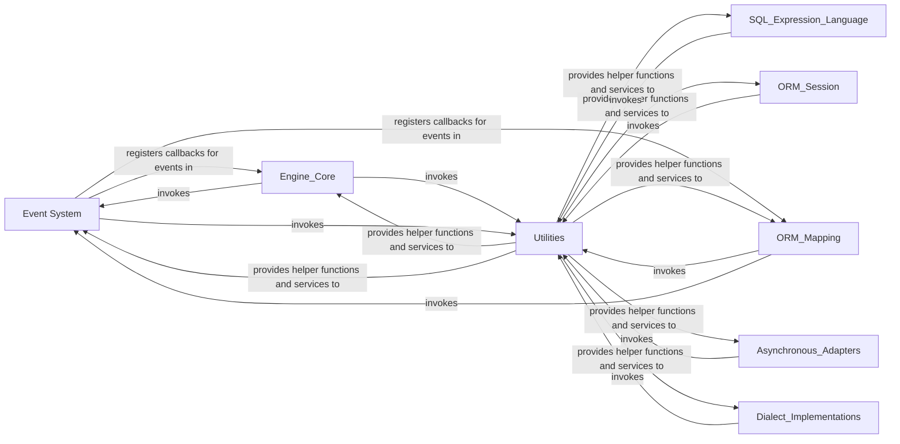

## Component Details

The Event & Utility System in SQLAlchemy is a crucial cross-cutting component that provides a flexible and extensible mechanism for handling events throughout the library's lifecycle. It enables users to inject custom logic at various points, such as connection establishment, SQL execution, and ORM operations, through a publish-subscribe model. Complementing this, the system also encompasses a comprehensive collection of general-purpose helper functions, robust data structures like caches, and compatibility layers, along with introspection tools. These utilities are foundational, supporting and enhancing the functionality of almost all other SQLAlchemy components by providing common services, warning mechanisms for deprecated features, and internal structure examination capabilities.

### Event System
The Event System provides a flexible publish-subscribe mechanism within SQLAlchemy. It allows developers to register custom callback functions that are triggered at various points in SQLAlchemy's execution flow, such as before or after connection establishment, SQL execution, or ORM operations.

**Related Classes/Methods**:

- <a href="https://github.com/sqlalchemy/sqlalchemy/blob/master/lib/sqlalchemy/event/api.py#L39-L121" target="_blank" rel="noopener noreferrer">`sqlalchemy.event.api.listen` (39:121)</a>
- <a href="https://github.com/sqlalchemy/sqlalchemy/blob/master/lib/sqlalchemy/event/api.py#L124-L168" target="_blank" rel="noopener noreferrer">`sqlalchemy.event.api.listens_for` (124:168)</a>
- <a href="https://github.com/sqlalchemy/sqlalchemy/blob/master/lib/sqlalchemy/event/attr.py#L113-L249" target="_blank" rel="noopener noreferrer">`sqlalchemy.event.attr._ClsLevelDispatch` (113:249)</a>
- <a href="https://github.com/sqlalchemy/sqlalchemy/blob/master/lib/sqlalchemy/event/attr.py#L404-L507" target="_blank" rel="noopener noreferrer">`sqlalchemy.event.attr._CompoundListener` (404:507)</a>
- `sqlalchemy.event.legacy` (full file reference)
- <a href="https://github.com/sqlalchemy/sqlalchemy/blob/master/lib/sqlalchemy/event/registry.py#L219-L390" target="_blank" rel="noopener noreferrer">`sqlalchemy.event.registry._EventKey` (219:390)</a>
- <a href="https://github.com/sqlalchemy/sqlalchemy/blob/master/lib/sqlalchemy/event/base.py#L92-L215" target="_blank" rel="noopener noreferrer">`sqlalchemy.event.base._Dispatch` (92:215)</a>

### Utilities
The Utilities component provides a collection of general-purpose helper functions and foundational services used across various SQLAlchemy components. This includes mechanisms for issuing warnings about deprecated features, introspection capabilities for examining SQLAlchemy objects, and common data structures like caches and registries.

**Related Classes/Methods**:

- <a href="https://github.com/sqlalchemy/sqlalchemy/blob/master/lib/sqlalchemy/util/langhelpers.py#L1886-L1896" target="_blank" rel="noopener noreferrer">`sqlalchemy.util.langhelpers.warn` (1886:1896)</a>
- <a href="https://github.com/sqlalchemy/sqlalchemy/blob/master/lib/sqlalchemy/util/deprecations.py#L55-L60" target="_blank" rel="noopener noreferrer">`sqlalchemy.util.deprecations.warn_deprecated` (55:60)</a>
- <a href="https://github.com/sqlalchemy/sqlalchemy/blob/master/lib/sqlalchemy/inspection.py#L90-L92" target="_blank" rel="noopener noreferrer">`sqlalchemy.inspection.inspect` (90:92)</a>
- <a href="https://github.com/sqlalchemy/sqlalchemy/blob/master/lib/sqlalchemy/util/_collections.py#L458-L560" target="_blank" rel="noopener noreferrer">`sqlalchemy.util._collections.LRUCache` (458:560)</a>
- <a href="https://github.com/sqlalchemy/sqlalchemy/blob/master/lib/sqlalchemy/util/langhelpers.py#L421-L461" target="_blank" rel="noopener noreferrer">`sqlalchemy.util.langhelpers.PluginLoader` (421:461)</a>
- `sqlalchemy.util.compat` (full file reference)
- <a href="https://github.com/sqlalchemy/sqlalchemy/blob/master/lib/sqlalchemy/util/concurrency.py#L225-L238" target="_blank" rel="noopener noreferrer">`sqlalchemy.util.concurrency.AsyncAdaptedLock` (225:238)</a>
- <a href="https://github.com/sqlalchemy/sqlalchemy/blob/master/lib/sqlalchemy/util/langhelpers.py#L563-L616" target="_blank" rel="noopener noreferrer">`sqlalchemy.util.langhelpers.get_callable_argspec` (563:616)</a>
- <a href="https://github.com/sqlalchemy/sqlalchemy/blob/master/lib/sqlalchemy/util/langhelpers.py#L2204-L2221" target="_blank" rel="noopener noreferrer">`sqlalchemy.util.langhelpers.inject_docstring_text` (2204:2221)</a>
- <a href="https://github.com/sqlalchemy/sqlalchemy/blob/master/lib/sqlalchemy/util/langhelpers.py#L988-L1052" target="_blank" rel="noopener noreferrer">`sqlalchemy.util.langhelpers.monkeypatch_proxied_specials` (988:1052)</a>
- <a href="https://github.com/sqlalchemy/sqlalchemy/blob/master/lib/sqlalchemy/util/langhelpers.py#L1822-L1832" target="_blank" rel="noopener noreferrer">`sqlalchemy.util.langhelpers.set_creation_order` (1822:1832)</a>
- <a href="https://github.com/sqlalchemy/sqlalchemy/blob/master/lib/sqlalchemy/util/_collections.py#L571-L632" target="_blank" rel="noopener noreferrer">`sqlalchemy.util._collections.ScopedRegistry` (571:632)</a>
- <a href="https://github.com/sqlalchemy/sqlalchemy/blob/master/lib/sqlalchemy/util/langhelpers.py#L1980-L2003" target="_blank" rel="noopener noreferrer">`sqlalchemy.util.langhelpers.only_once` (1980:2003)</a>
- <a href="https://github.com/sqlalchemy/sqlalchemy/blob/master/lib/sqlalchemy/util/langhelpers.py#L826-L901" target="_blank" rel="noopener noreferrer">`sqlalchemy.util.langhelpers.generic_repr` (826:901)</a>
- <a href="https://github.com/sqlalchemy/sqlalchemy/blob/master/lib/sqlalchemy/util/langhelpers.py#L274-L285" target="_blank" rel="noopener noreferrer">`sqlalchemy.util.langhelpers.decode_slice` (274:285)</a>
- <a href="https://github.com/sqlalchemy/sqlalchemy/blob/master/lib/sqlalchemy/util/preloaded.py#L118-L125" target="_blank" rel="noopener noreferrer">`sqlalchemy.util.preloaded._ModuleRegistry.preload_module` (118:125)</a>
- <a href="https://github.com/sqlalchemy/sqlalchemy/blob/master/lib/sqlalchemy/util/_immutabledict_cy.py#L149-L162" target="_blank" rel="noopener noreferrer">`sqlalchemy.util._immutabledict_cy.immutabledict.union` (149:162)</a>
- <a href="https://github.com/sqlalchemy/sqlalchemy/blob/master/lib/sqlalchemy/util/_collections.py#L415-L421" target="_blank" rel="noopener noreferrer">`sqlalchemy.util._collections.to_set` (415:421)</a>

### [FAQ](https://github.com/CodeBoarding/GeneratedOnBoardings/tree/main?tab=readme-ov-file#faq)