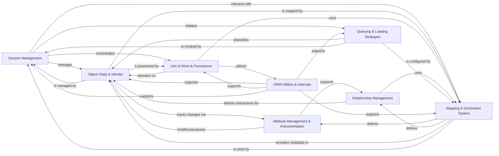

## Component Details

The ORM Core & Unit of Work subsystem in SQLAlchemy is responsible for managing the lifecycle of persistent objects, orchestrating database operations within a transactional unit of work, and maintaining an identity map for loaded objects. It integrates session management, object state tracking, mapping definitions, attribute instrumentation, relationship handling, and query execution to provide a comprehensive object-relational mapping solution, ensuring data integrity and efficient interaction with the database.

### Session Management
Manages database sessions, transactions, and the lifecycle of persistent objects. It provides methods for adding, deleting, querying, and flushing objects.

**Related Classes/Methods**:

- <a href="https://github.com/sqlalchemy/sqlalchemy/blob/master/lib/sqlalchemy/orm/session.py#L1446-L4975" target="_blank" rel="noopener noreferrer">`sqlalchemy.orm.session.Session` (1446:4975)</a>
- <a href="https://github.com/sqlalchemy/sqlalchemy/blob/master/lib/sqlalchemy/orm/session.py#L839-L1437" target="_blank" rel="noopener noreferrer">`sqlalchemy.orm.session.SessionTransaction` (839:1437)</a>
- <a href="https://github.com/sqlalchemy/sqlalchemy/blob/master/lib/sqlalchemy/orm/session.py#L4981-L5210" target="_blank" rel="noopener noreferrer">`sqlalchemy.orm.session.sessionmaker` (4981:5210)</a>
- <a href="https://github.com/sqlalchemy/sqlalchemy/blob/master/lib/sqlalchemy/orm/session.py#L207-L242" target="_blank" rel="noopener noreferrer">`sqlalchemy.orm.session._SessionClassMethods` (207:242)</a>
- <a href="https://github.com/sqlalchemy/sqlalchemy/blob/master/lib/sqlalchemy/orm/session.py#L5333-L5346" target="_blank" rel="noopener noreferrer">`sqlalchemy.orm.session.object_session` (5333:5346)</a>
- <a href="https://github.com/sqlalchemy/sqlalchemy/blob/master/lib/sqlalchemy/orm/session.py#L200-L204" target="_blank" rel="noopener noreferrer">`sqlalchemy.orm.session._state_session` (200:204)</a>
- <a href="https://github.com/sqlalchemy/sqlalchemy/blob/master/lib/sqlalchemy/orm/_orm_constructors.py#L2031-L2066" target="_blank" rel="noopener noreferrer">`sqlalchemy.orm._orm_constructors.create_session` (2031:2066)</a>

### Object State & Identity
Core components responsible for tracking the state of mapped objects (e.g., pending, persistent, deleted, detached) and managing their identity within a session.

**Related Classes/Methods**:

- `sqlalchemy.orm.base.instance_state` (full file reference)
- <a href="https://github.com/sqlalchemy/sqlalchemy/blob/master/lib/sqlalchemy/orm/base.py#L406-L427" target="_blank" rel="noopener noreferrer">`sqlalchemy.orm.base.object_state` (406:427)</a>
- <a href="https://github.com/sqlalchemy/sqlalchemy/blob/master/lib/sqlalchemy/orm/base.py#L387-L403" target="_blank" rel="noopener noreferrer">`sqlalchemy.orm.base.object_mapper` (387:403)</a>
- `sqlalchemy.orm.base.instance_dict` (full file reference)
- <a href="https://github.com/sqlalchemy/sqlalchemy/blob/master/lib/sqlalchemy/orm/base.py#L359-L365" target="_blank" rel="noopener noreferrer">`sqlalchemy.orm.base.state_str` (359:365)</a>
- <a href="https://github.com/sqlalchemy/sqlalchemy/blob/master/lib/sqlalchemy/orm/base.py#L431-L435" target="_blank" rel="noopener noreferrer">`sqlalchemy.orm.base._inspect_mapped_object` (431:435)</a>
- <a href="https://github.com/sqlalchemy/sqlalchemy/blob/master/lib/sqlalchemy/orm/state.py#L105-L1015" target="_blank" rel="noopener noreferrer">`sqlalchemy.orm.state.InstanceState` (105:1015)</a>
- <a href="https://github.com/sqlalchemy/sqlalchemy/blob/master/lib/sqlalchemy/orm/state.py#L1018-L1116" target="_blank" rel="noopener noreferrer">`sqlalchemy.orm.state.AttributeState` (1018:1116)</a>
- <a href="https://github.com/sqlalchemy/sqlalchemy/blob/master/lib/sqlalchemy/orm/state.py#L1119-L1150" target="_blank" rel="noopener noreferrer">`sqlalchemy.orm.state.PendingCollection` (1119:1150)</a>
- <a href="https://github.com/sqlalchemy/sqlalchemy/blob/master/lib/sqlalchemy/orm/identity.py#L37-L123" target="_blank" rel="noopener noreferrer">`sqlalchemy.orm.identity.IdentityMap` (37:123)</a>
- <a href="https://github.com/sqlalchemy/sqlalchemy/blob/master/lib/sqlalchemy/orm/identity.py#L126-L291" target="_blank" rel="noopener noreferrer">`sqlalchemy.orm.identity._WeakInstanceDict` (126:291)</a>

### Unit of Work & Persistence
Implements the Unit of Work pattern, coordinating the saving, updating, and deleting of objects to the database in a single transaction. It also handles bulk operations and manages dependencies between objects.

**Related Classes/Methods**:

- <a href="https://github.com/sqlalchemy/sqlalchemy/blob/master/lib/sqlalchemy/orm/unitofwork.py#L157-L489" target="_blank" rel="noopener noreferrer">`sqlalchemy.orm.unitofwork.UOWTransaction` (157:489)</a>
- <a href="https://github.com/sqlalchemy/sqlalchemy/blob/master/lib/sqlalchemy/orm/unitofwork.py#L634-L668" target="_blank" rel="noopener noreferrer">`sqlalchemy.orm.unitofwork._SaveUpdateAll` (634:668)</a>
- <a href="https://github.com/sqlalchemy/sqlalchemy/blob/master/lib/sqlalchemy/orm/unitofwork.py#L671-L705" target="_blank" rel="noopener noreferrer">`sqlalchemy.orm.unitofwork._DeleteAll` (671:705)</a>
- <a href="https://github.com/sqlalchemy/sqlalchemy/blob/master/lib/sqlalchemy/orm/unitofwork.py#L708-L741" target="_blank" rel="noopener noreferrer">`sqlalchemy.orm.unitofwork._ProcessState` (708:741)</a>
- <a href="https://github.com/sqlalchemy/sqlalchemy/blob/master/lib/sqlalchemy/orm/unitofwork.py#L744-L769" target="_blank" rel="noopener noreferrer">`sqlalchemy.orm.unitofwork._SaveUpdateState` (744:769)</a>
- <a href="https://github.com/sqlalchemy/sqlalchemy/blob/master/lib/sqlalchemy/orm/unitofwork.py#L772-L798" target="_blank" rel="noopener noreferrer">`sqlalchemy.orm.unitofwork._DeleteState` (772:798)</a>
- <a href="https://github.com/sqlalchemy/sqlalchemy/blob/master/lib/sqlalchemy/orm/persistence.py#L40-L120" target="_blank" rel="noopener noreferrer">`sqlalchemy.orm.persistence._save_obj` (40:120)</a>
- <a href="https://github.com/sqlalchemy/sqlalchemy/blob/master/lib/sqlalchemy/orm/persistence.py#L211-L288" target="_blank" rel="noopener noreferrer">`sqlalchemy.orm.persistence._organize_states_for_save` (211:288)</a>
- <a href="https://github.com/sqlalchemy/sqlalchemy/blob/master/lib/sqlalchemy/orm/persistence.py#L967-L1288" target="_blank" rel="noopener noreferrer">`sqlalchemy.orm.persistence._emit_insert_statements` (967:1288)</a>
- <a href="https://github.com/sqlalchemy/sqlalchemy/blob/master/lib/sqlalchemy/orm/persistence.py#L1508-L1580" target="_blank" rel="noopener noreferrer">`sqlalchemy.orm.persistence._finalize_insert_update_commands` (1508:1580)</a>
- <a href="https://github.com/sqlalchemy/sqlalchemy/blob/master/lib/sqlalchemy/orm/persistence.py#L1633-L1736" target="_blank" rel="noopener noreferrer">`sqlalchemy.orm.persistence._postfetch` (1633:1736)</a>
- <a href="https://github.com/sqlalchemy/sqlalchemy/blob/master/lib/sqlalchemy/orm/persistence.py#L1739-L1741" target="_blank" rel="noopener noreferrer">`sqlalchemy.orm.persistence._postfetch_bulk_save` (1739:1741)</a>
- <a href="https://github.com/sqlalchemy/sqlalchemy/blob/master/lib/sqlalchemy/orm/persistence.py#L1744-L1767" target="_blank" rel="noopener noreferrer">`sqlalchemy.orm.persistence._connections_for_states` (1744:1767)</a>
- <a href="https://github.com/sqlalchemy/sqlalchemy/blob/master/lib/sqlalchemy/orm/bulk_persistence.py#L77-L87" target="_blank" rel="noopener noreferrer">`sqlalchemy.orm.bulk_persistence._bulk_insert` (77:87)</a>
- <a href="https://github.com/sqlalchemy/sqlalchemy/blob/master/lib/sqlalchemy/orm/bulk_persistence.py#L257-L266" target="_blank" rel="noopener noreferrer">`sqlalchemy.orm.bulk_persistence._bulk_update` (257:266)</a>
- <a href="https://github.com/sqlalchemy/sqlalchemy/blob/master/lib/sqlalchemy/orm/bulk_persistence.py#L1155-L1411" target="_blank" rel="noopener noreferrer">`sqlalchemy.orm.bulk_persistence._BulkORMInsert` (1155:1411)</a>
- <a href="https://github.com/sqlalchemy/sqlalchemy/blob/master/lib/sqlalchemy/orm/bulk_persistence.py#L1415-L1896" target="_blank" rel="noopener noreferrer">`sqlalchemy.orm.bulk_persistence._BulkORMUpdate` (1415:1896)</a>
- <a href="https://github.com/sqlalchemy/sqlalchemy/blob/master/lib/sqlalchemy/orm/bulk_persistence.py#L1900-L2123" target="_blank" rel="noopener noreferrer">`sqlalchemy.orm.bulk_persistence._BulkORMDelete` (1900:2123)</a>
- <a href="https://github.com/sqlalchemy/sqlalchemy/blob/master/lib/sqlalchemy/orm/dependency.py#L27-L333" target="_blank" rel="noopener noreferrer">`sqlalchemy.orm.dependency._DependencyProcessor` (27:333)</a>
- <a href="https://github.com/sqlalchemy/sqlalchemy/blob/master/lib/sqlalchemy/orm/dependency.py#L336-L642" target="_blank" rel="noopener noreferrer">`sqlalchemy.orm.dependency._OneToManyDP` (336:642)</a>
- <a href="https://github.com/sqlalchemy/sqlalchemy/blob/master/lib/sqlalchemy/orm/dependency.py#L645-L867" target="_blank" rel="noopener noreferrer">`sqlalchemy.orm.dependency._ManyToOneDP` (645:867)</a>
- <a href="https://github.com/sqlalchemy/sqlalchemy/blob/master/lib/sqlalchemy/orm/dependency.py#L870-L984" target="_blank" rel="noopener noreferrer">`sqlalchemy.orm.dependency._DetectKeySwitch` (870:984)</a>
- <a href="https://github.com/sqlalchemy/sqlalchemy/blob/master/lib/sqlalchemy/orm/dependency.py#L987-L1299" target="_blank" rel="noopener noreferrer">`sqlalchemy.orm.dependency._ManyToManyDP` (987:1299)</a>

### Mapping & Declarative System
Provides the core functionality for mapping Python classes to database tables, including handling inheritance, properties (columns and relationships), and the declarative base system for defining ORM models.

**Related Classes/Methods**:

- <a href="https://github.com/sqlalchemy/sqlalchemy/blob/master/lib/sqlalchemy/orm/mapper.py#L166-L4055" target="_blank" rel="noopener noreferrer">`sqlalchemy.orm.mapper.Mapper` (166:4055)</a>
- <a href="https://github.com/sqlalchemy/sqlalchemy/blob/master/lib/sqlalchemy/orm/mapper.py#L4357-L4377" target="_blank" rel="noopener noreferrer">`sqlalchemy.orm.mapper._ColumnMapping` (4357:4377)</a>
- <a href="https://github.com/sqlalchemy/sqlalchemy/blob/master/lib/sqlalchemy/orm/mapper.py#L4062-L4130" target="_blank" rel="noopener noreferrer">`sqlalchemy.orm.mapper.configure_mappers` (4062:4130)</a>
- <a href="https://github.com/sqlalchemy/sqlalchemy/blob/master/lib/sqlalchemy/orm/decl_api.py#L167-L194" target="_blank" rel="noopener noreferrer">`sqlalchemy.orm.decl_api.DeclarativeMeta` (167:194)</a>
- <a href="https://github.com/sqlalchemy/sqlalchemy/blob/master/lib/sqlalchemy/orm/decl_api.py#L629-L839" target="_blank" rel="noopener noreferrer">`sqlalchemy.orm.decl_api.DeclarativeBase` (629:839)</a>
- <a href="https://github.com/sqlalchemy/sqlalchemy/blob/master/lib/sqlalchemy/orm/decl_api.py#L857-L961" target="_blank" rel="noopener noreferrer">`sqlalchemy.orm.decl_api.DeclarativeBaseNoMeta` (857:961)</a>
- <a href="https://github.com/sqlalchemy/sqlalchemy/blob/master/lib/sqlalchemy/orm/decl_api.py#L1106-L1808" target="_blank" rel="noopener noreferrer">`sqlalchemy.orm.decl_api.registry` (1106:1808)</a>
- <a href="https://github.com/sqlalchemy/sqlalchemy/blob/master/lib/sqlalchemy/orm/decl_base.py#L119-L129" target="_blank" rel="noopener noreferrer">`sqlalchemy.orm.decl_base._declared_mapping_info` (119:129)</a>
- <a href="https://github.com/sqlalchemy/sqlalchemy/blob/master/lib/sqlalchemy/orm/decl_base.py#L269-L347" target="_blank" rel="noopener noreferrer">`sqlalchemy.orm.decl_base._MapperConfig` (269:347)</a>
- <a href="https://github.com/sqlalchemy/sqlalchemy/blob/master/lib/sqlalchemy/orm/decl_base.py#L350-L408" target="_blank" rel="noopener noreferrer">`sqlalchemy.orm.decl_base._ImperativeMapperConfig` (350:408)</a>
- <a href="https://github.com/sqlalchemy/sqlalchemy/blob/master/lib/sqlalchemy/orm/decl_base.py#L421-L1971" target="_blank" rel="noopener noreferrer">`sqlalchemy.orm.decl_base._ClassScanMapperConfig` (421:1971)</a>
- <a href="https://github.com/sqlalchemy/sqlalchemy/blob/master/lib/sqlalchemy/orm/decl_base.py#L1989-L2062" target="_blank" rel="noopener noreferrer">`sqlalchemy.orm.decl_base._DeferredMapperConfig` (1989:2062)</a>
- <a href="https://github.com/sqlalchemy/sqlalchemy/blob/master/lib/sqlalchemy/orm/decl_base.py#L2065-L2114" target="_blank" rel="noopener noreferrer">`sqlalchemy.orm.decl_base._add_attribute` (2065:2114)</a>
- <a href="https://github.com/sqlalchemy/sqlalchemy/blob/master/lib/sqlalchemy/orm/properties.py#L99-L492" target="_blank" rel="noopener noreferrer">`sqlalchemy.orm.properties.ColumnProperty` (99:492)</a>
- <a href="https://github.com/sqlalchemy/sqlalchemy/blob/master/lib/sqlalchemy/orm/properties.py#L513-L909" target="_blank" rel="noopener noreferrer">`sqlalchemy.orm.properties.MappedColumn` (513:909)</a>

### Attribute Management & Instrumentation
Manages how attributes of mapped objects are accessed, modified, and tracked for changes. This includes instrumentation of classes and handling of different attribute types, including write-only collections.

**Related Classes/Methods**:

- <a href="https://github.com/sqlalchemy/sqlalchemy/blob/master/lib/sqlalchemy/orm/attributes.py#L136-L493" target="_blank" rel="noopener noreferrer">`sqlalchemy.orm.attributes.QueryableAttribute` (136:493)</a>
- <a href="https://github.com/sqlalchemy/sqlalchemy/blob/master/lib/sqlalchemy/orm/attributes.py#L510-L570" target="_blank" rel="noopener noreferrer">`sqlalchemy.orm.attributes.InstrumentedAttribute` (510:570)</a>
- <a href="https://github.com/sqlalchemy/sqlalchemy/blob/master/lib/sqlalchemy/orm/attributes.py#L829-L1202" target="_blank" rel="noopener noreferrer">`sqlalchemy.orm.attributes._AttributeImpl` (829:1202)</a>
- <a href="https://github.com/sqlalchemy/sqlalchemy/blob/master/lib/sqlalchemy/orm/attributes.py#L1205-L1331" target="_blank" rel="noopener noreferrer">`sqlalchemy.orm.attributes._ScalarAttributeImpl` (1205:1331)</a>
- <a href="https://github.com/sqlalchemy/sqlalchemy/blob/master/lib/sqlalchemy/orm/attributes.py#L1334-L1545" target="_blank" rel="noopener noreferrer">`sqlalchemy.orm.attributes._ScalarObjectAttributeImpl` (1334:1545)</a>
- <a href="https://github.com/sqlalchemy/sqlalchemy/blob/master/lib/sqlalchemy/orm/attributes.py#L1627-L2121" target="_blank" rel="noopener noreferrer">`sqlalchemy.orm.attributes._CollectionAttributeImpl` (1627:2121)</a>
- <a href="https://github.com/sqlalchemy/sqlalchemy/blob/master/lib/sqlalchemy/orm/attributes.py#L2338-L2536" target="_blank" rel="noopener noreferrer">`sqlalchemy.orm.attributes.History` (2338:2536)</a>
- <a href="https://github.com/sqlalchemy/sqlalchemy/blob/master/lib/sqlalchemy/orm/attributes.py#L2542-L2579" target="_blank" rel="noopener noreferrer">`sqlalchemy.orm.attributes.get_history` (2542:2579)</a>
- <a href="https://github.com/sqlalchemy/sqlalchemy/blob/master/lib/sqlalchemy/orm/attributes.py#L2757-L2786" target="_blank" rel="noopener noreferrer">`sqlalchemy.orm.attributes.set_attribute` (2757:2786)</a>
- <a href="https://github.com/sqlalchemy/sqlalchemy/blob/master/lib/sqlalchemy/orm/attributes.py#L2789-L2800" target="_blank" rel="noopener noreferrer">`sqlalchemy.orm.attributes.get_attribute` (2789:2800)</a>
- <a href="https://github.com/sqlalchemy/sqlalchemy/blob/master/lib/sqlalchemy/orm/attributes.py#L2803-L2814" target="_blank" rel="noopener noreferrer">`sqlalchemy.orm.attributes.del_attribute` (2803:2814)</a>
- <a href="https://github.com/sqlalchemy/sqlalchemy/blob/master/lib/sqlalchemy/orm/attributes.py#L2817-L2837" target="_blank" rel="noopener noreferrer">`sqlalchemy.orm.attributes.flag_modified` (2817:2837)</a>
- <a href="https://github.com/sqlalchemy/sqlalchemy/blob/master/lib/sqlalchemy/orm/attributes.py#L2840-L2859" target="_blank" rel="noopener noreferrer">`sqlalchemy.orm.attributes.flag_dirty` (2840:2859)</a>
- <a href="https://github.com/sqlalchemy/sqlalchemy/blob/master/lib/sqlalchemy/orm/instrumentation.py#L88-L562" target="_blank" rel="noopener noreferrer">`sqlalchemy.orm.instrumentation.ClassManager` (88:562)</a>
- <a href="https://github.com/sqlalchemy/sqlalchemy/blob/master/lib/sqlalchemy/orm/instrumentation.py#L599-L638" target="_blank" rel="noopener noreferrer">`sqlalchemy.orm.instrumentation.InstrumentationFactory` (599:638)</a>
- <a href="https://github.com/sqlalchemy/sqlalchemy/blob/master/lib/sqlalchemy/orm/instrumentation.py#L656-L683" target="_blank" rel="noopener noreferrer">`sqlalchemy.orm.instrumentation.register_class` (656:683)</a>
- <a href="https://github.com/sqlalchemy/sqlalchemy/blob/master/lib/sqlalchemy/orm/instrumentation.py#L686-L689" target="_blank" rel="noopener noreferrer">`sqlalchemy.orm.instrumentation.unregister_class` (686:689)</a>
- <a href="https://github.com/sqlalchemy/sqlalchemy/blob/master/lib/sqlalchemy/orm/instrumentation.py#L692-L702" target="_blank" rel="noopener noreferrer">`sqlalchemy.orm.instrumentation.is_instrumented` (692:702)</a>
- <a href="https://github.com/sqlalchemy/sqlalchemy/blob/master/lib/sqlalchemy/orm/writeonly.py#L151-L448" target="_blank" rel="noopener noreferrer">`sqlalchemy.orm.writeonly._WriteOnlyAttributeImpl` (151:448)</a>
- <a href="https://github.com/sqlalchemy/sqlalchemy/blob/master/lib/sqlalchemy/orm/writeonly.py#L565-L688" target="_blank" rel="noopener noreferrer">`sqlalchemy.orm.writeonly.WriteOnlyCollection` (565:688)</a>
- <a href="https://github.com/sqlalchemy/sqlalchemy/blob/master/lib/sqlalchemy/orm/writeonly.py#L78-L148" target="_blank" rel="noopener noreferrer">`sqlalchemy.orm.writeonly.WriteOnlyHistory` (78:148)</a>
- <a href="https://github.com/sqlalchemy/sqlalchemy/blob/master/lib/sqlalchemy/orm/writeonly.py#L500-L562" target="_blank" rel="noopener noreferrer">`sqlalchemy.orm.writeonly._AbstractCollectionWriter` (500:562)</a>

### Relationship Management
Defines and manages relationships between mapped entities, including one-to-many, many-to-one, and many-to-many relationships. It also handles dynamic collections and descriptor properties.

**Related Classes/Methods**:

- <a href="https://github.com/sqlalchemy/sqlalchemy/blob/master/lib/sqlalchemy/orm/relationships.py#L344-L2306" target="_blank" rel="noopener noreferrer">`sqlalchemy.orm.relationships.RelationshipProperty` (344:2306)</a>
- <a href="https://github.com/sqlalchemy/sqlalchemy/blob/master/lib/sqlalchemy/orm/relationships.py#L2322-L3506" target="_blank" rel="noopener noreferrer">`sqlalchemy.orm.relationships._JoinCondition` (2322:3506)</a>
- <a href="https://github.com/sqlalchemy/sqlalchemy/blob/master/lib/sqlalchemy/orm/dynamic.py#L61-L79" target="_blank" rel="noopener noreferrer">`sqlalchemy.orm.dynamic.DynamicCollectionHistory` (61:79)</a>
- <a href="https://github.com/sqlalchemy/sqlalchemy/blob/master/lib/sqlalchemy/orm/dynamic.py#L286-L294" target="_blank" rel="noopener noreferrer">`sqlalchemy.orm.dynamic.AppenderQuery` (286:294)</a>
- <a href="https://github.com/sqlalchemy/sqlalchemy/blob/master/lib/sqlalchemy/orm/dynamic.py#L116-L283" target="_blank" rel="noopener noreferrer">`sqlalchemy.orm.dynamic._AppenderMixin` (116:283)</a>
- <a href="https://github.com/sqlalchemy/sqlalchemy/blob/master/lib/sqlalchemy/orm/descriptor_props.py#L191-L866" target="_blank" rel="noopener noreferrer">`sqlalchemy.orm.descriptor_props.CompositeProperty` (191:866)</a>
- <a href="https://github.com/sqlalchemy/sqlalchemy/blob/master/lib/sqlalchemy/orm/descriptor_props.py#L944-L1112" target="_blank" rel="noopener noreferrer">`sqlalchemy.orm.descriptor_props.SynonymProperty` (944:1112)</a>

### Querying & Loading Strategies
Provides mechanisms for constructing and executing queries, and defines various strategies for loading related objects (e.g., eager loading, lazy loading, subquery loading).

**Related Classes/Methods**:

- <a href="https://github.com/sqlalchemy/sqlalchemy/blob/master/lib/sqlalchemy/orm/query.py#L164-L3411" target="_blank" rel="noopener noreferrer">`sqlalchemy.orm.query.Query` (164:3411)</a>
- <a href="https://github.com/sqlalchemy/sqlalchemy/blob/master/lib/sqlalchemy/orm/loading.py#L449-L484" target="_blank" rel="noopener noreferrer">`sqlalchemy.orm.loading.get_from_identity` (449:484)</a>
- <a href="https://github.com/sqlalchemy/sqlalchemy/blob/master/lib/sqlalchemy/orm/loading.py#L487-L523" target="_blank" rel="noopener noreferrer">`sqlalchemy.orm.loading._load_on_ident` (487:523)</a>
- <a href="https://github.com/sqlalchemy/sqlalchemy/blob/master/lib/sqlalchemy/orm/loading.py#L526-L707" target="_blank" rel="noopener noreferrer">`sqlalchemy.orm.loading._load_on_pk_identity` (526:707)</a>
- <a href="https://github.com/sqlalchemy/sqlalchemy/blob/master/lib/sqlalchemy/orm/loading.py#L811-L1253" target="_blank" rel="noopener noreferrer">`sqlalchemy.orm.loading._instance_processor` (811:1253)</a>
- <a href="https://github.com/sqlalchemy/sqlalchemy/blob/master/lib/sqlalchemy/orm/loading.py#L1419-L1433" target="_blank" rel="noopener noreferrer">`sqlalchemy.orm.loading._validate_version_id` (1419:1433)</a>
- <a href="https://github.com/sqlalchemy/sqlalchemy/blob/master/lib/sqlalchemy/orm/loading.py#L1436-L1522" target="_blank" rel="noopener noreferrer">`sqlalchemy.orm.loading._decorate_polymorphic_switch` (1436:1522)</a>
- <a href="https://github.com/sqlalchemy/sqlalchemy/blob/master/lib/sqlalchemy/orm/loading.py#L1597-L1682" target="_blank" rel="noopener noreferrer">`sqlalchemy.orm.loading._load_scalar_attributes` (1597:1682)</a>
- <a href="https://github.com/sqlalchemy/sqlalchemy/blob/master/lib/sqlalchemy/orm/strategies.py#L386-L559" target="_blank" rel="noopener noreferrer">`sqlalchemy.orm.strategies._DeferredColumnLoader` (386:559)</a>
- <a href="https://github.com/sqlalchemy/sqlalchemy/blob/master/lib/sqlalchemy/orm/strategies.py#L689-L1244" target="_blank" rel="noopener noreferrer">`sqlalchemy.orm.strategies._LazyLoader` (689:1244)</a>
- <a href="https://github.com/sqlalchemy/sqlalchemy/blob/master/lib/sqlalchemy/orm/strategies.py#L1477-L2124" target="_blank" rel="noopener noreferrer">`sqlalchemy.orm.strategies._SubqueryLoader` (1477:2124)</a>
- <a href="https://github.com/sqlalchemy/sqlalchemy/blob/master/lib/sqlalchemy/orm/strategies.py#L2953-L3456" target="_blank" rel="noopener noreferrer">`sqlalchemy.orm.strategies._SelectInLoader` (2953:3456)</a>
- <a href="https://github.com/sqlalchemy/sqlalchemy/blob/master/lib/sqlalchemy/orm/strategies.py#L3459-L3482" target="_blank" rel="noopener noreferrer">`sqlalchemy.orm.strategies._single_parent_validator` (3459:3482)</a>
- <a href="https://github.com/sqlalchemy/sqlalchemy/blob/master/lib/sqlalchemy/orm/strategy_options.py#L88-L962" target="_blank" rel="noopener noreferrer">`sqlalchemy.orm.strategy_options._AbstractLoad` (88:962)</a>
- <a href="https://github.com/sqlalchemy/sqlalchemy/blob/master/lib/sqlalchemy/orm/strategy_options.py#L965-L1328" target="_blank" rel="noopener noreferrer">`sqlalchemy.orm.strategy_options.Load` (965:1328)</a>
- <a href="https://github.com/sqlalchemy/sqlalchemy/blob/master/lib/sqlalchemy/orm/strategy_options.py#L1331-L1520" target="_blank" rel="noopener noreferrer">`sqlalchemy.orm.strategy_options._WildcardLoad` (1331:1520)</a>
- <a href="https://github.com/sqlalchemy/sqlalchemy/blob/master/lib/sqlalchemy/orm/strategy_options.py#L1523-L1869" target="_blank" rel="noopener noreferrer">`sqlalchemy.orm.strategy_options._LoadElement` (1523:1869)</a>
- <a href="https://github.com/sqlalchemy/sqlalchemy/blob/master/lib/sqlalchemy/orm/strategy_options.py#L1872-L2124" target="_blank" rel="noopener noreferrer">`sqlalchemy.orm.strategy_options._AttributeStrategyLoad` (1872:2124)</a>
- <a href="https://github.com/sqlalchemy/sqlalchemy/blob/master/lib/sqlalchemy/orm/strategy_options.py#L2127-L2213" target="_blank" rel="noopener noreferrer">`sqlalchemy.orm.strategy_options._TokenStrategyLoad` (2127:2213)</a>
- <a href="https://github.com/sqlalchemy/sqlalchemy/blob/master/lib/sqlalchemy/orm/strategy_options.py#L2216-L2269" target="_blank" rel="noopener noreferrer">`sqlalchemy.orm.strategy_options._ClassStrategyLoad` (2216:2269)</a>
- <a href="https://github.com/sqlalchemy/sqlalchemy/blob/master/lib/sqlalchemy/orm/strategy_options.py#L2413-L2414" target="_blank" rel="noopener noreferrer">`sqlalchemy.orm.strategy_options.contains_eager` (2413:2414)</a>
- <a href="https://github.com/sqlalchemy/sqlalchemy/blob/master/lib/sqlalchemy/orm/strategy_options.py#L2418-L2423" target="_blank" rel="noopener noreferrer">`sqlalchemy.orm.strategy_options.load_only` (2418:2423)</a>
- <a href="https://github.com/sqlalchemy/sqlalchemy/blob/master/lib/sqlalchemy/orm/strategy_options.py#L2427-L2428" target="_blank" rel="noopener noreferrer">`sqlalchemy.orm.strategy_options.joinedload` (2427:2428)</a>
- <a href="https://github.com/sqlalchemy/sqlalchemy/blob/master/lib/sqlalchemy/orm/strategy_options.py#L2432-L2433" target="_blank" rel="noopener noreferrer">`sqlalchemy.orm.strategy_options.subqueryload` (2432:2433)</a>
- <a href="https://github.com/sqlalchemy/sqlalchemy/blob/master/lib/sqlalchemy/orm/strategy_options.py#L2437-L2442" target="_blank" rel="noopener noreferrer">`sqlalchemy.orm.strategy_options.selectinload` (2437:2442)</a>
- <a href="https://github.com/sqlalchemy/sqlalchemy/blob/master/lib/sqlalchemy/orm/strategy_options.py#L2446-L2447" target="_blank" rel="noopener noreferrer">`sqlalchemy.orm.strategy_options.lazyload` (2446:2447)</a>
- <a href="https://github.com/sqlalchemy/sqlalchemy/blob/master/lib/sqlalchemy/orm/strategy_options.py#L2451-L2456" target="_blank" rel="noopener noreferrer">`sqlalchemy.orm.strategy_options.immediateload` (2451:2456)</a>
- <a href="https://github.com/sqlalchemy/sqlalchemy/blob/master/lib/sqlalchemy/orm/strategy_options.py#L2460-L2461" target="_blank" rel="noopener noreferrer">`sqlalchemy.orm.strategy_options.noload` (2460:2461)</a>
- <a href="https://github.com/sqlalchemy/sqlalchemy/blob/master/lib/sqlalchemy/orm/strategy_options.py#L2465-L2466" target="_blank" rel="noopener noreferrer">`sqlalchemy.orm.strategy_options.raiseload` (2465:2466)</a>
- <a href="https://github.com/sqlalchemy/sqlalchemy/blob/master/lib/sqlalchemy/orm/strategy_options.py#L2470-L2471" target="_blank" rel="noopener noreferrer">`sqlalchemy.orm.strategy_options.defaultload` (2470:2471)</a>
- <a href="https://github.com/sqlalchemy/sqlalchemy/blob/master/lib/sqlalchemy/orm/strategy_options.py#L2475-L2481" target="_blank" rel="noopener noreferrer">`sqlalchemy.orm.strategy_options.defer` (2475:2481)</a>
- <a href="https://github.com/sqlalchemy/sqlalchemy/blob/master/lib/sqlalchemy/orm/strategy_options.py#L2485-L2486" target="_blank" rel="noopener noreferrer">`sqlalchemy.orm.strategy_options.undefer` (2485:2486)</a>
- <a href="https://github.com/sqlalchemy/sqlalchemy/blob/master/lib/sqlalchemy/orm/strategy_options.py#L2490-L2492" target="_blank" rel="noopener noreferrer">`sqlalchemy.orm.strategy_options.undefer_group` (2490:2492)</a>
- <a href="https://github.com/sqlalchemy/sqlalchemy/blob/master/lib/sqlalchemy/orm/strategy_options.py#L2496-L2501" target="_blank" rel="noopener noreferrer">`sqlalchemy.orm.strategy_options.with_expression` (2496:2501)</a>
- <a href="https://github.com/sqlalchemy/sqlalchemy/blob/master/lib/sqlalchemy/orm/strategy_options.py#L2505-L2509" target="_blank" rel="noopener noreferrer">`sqlalchemy.orm.strategy_options.selectin_polymorphic` (2505:2509)</a>

### ORM Utilities & Internals
A collection of various utility functions and internal helper classes used across the ORM, including identity key generation, object synchronization, class registry management, query context, mapped collections, scoping sessions, and ORM interfaces.

**Related Classes/Methods**:

- <a href="https://github.com/sqlalchemy/sqlalchemy/blob/master/lib/sqlalchemy/orm/util.py#L400-L480" target="_blank" rel="noopener noreferrer">`sqlalchemy.orm.util.identity_key` (400:480)</a>
- <a href="https://github.com/sqlalchemy/sqlalchemy/blob/master/lib/sqlalchemy/orm/util.py#L572-L622" target="_blank" rel="noopener noreferrer">`sqlalchemy.orm.util.ORMAdapter` (572:622)</a>
- <a href="https://github.com/sqlalchemy/sqlalchemy/blob/master/lib/sqlalchemy/orm/util.py#L625-L824" target="_blank" rel="noopener noreferrer">`sqlalchemy.orm.util.AliasedClass` (625:824)</a>
- <a href="https://github.com/sqlalchemy/sqlalchemy/blob/master/lib/sqlalchemy/orm/util.py#L828-L1285" target="_blank" rel="noopener noreferrer">`sqlalchemy.orm.util.AliasedInsp` (828:1285)</a>
- <a href="https://github.com/sqlalchemy/sqlalchemy/blob/master/lib/sqlalchemy/orm/util.py#L1316-L1492" target="_blank" rel="noopener noreferrer">`sqlalchemy.orm.util.LoaderCriteriaOption` (1316:1492)</a>
- <a href="https://github.com/sqlalchemy/sqlalchemy/blob/master/lib/sqlalchemy/orm/util.py#L1525-L1742" target="_blank" rel="noopener noreferrer">`sqlalchemy.orm.util.Bundle` (1525:1742)</a>
- <a href="https://github.com/sqlalchemy/sqlalchemy/blob/master/lib/sqlalchemy/orm/util.py#L1773-L1945" target="_blank" rel="noopener noreferrer">`sqlalchemy.orm.util._ORMJoin` (1773:1945)</a>
- <a href="https://github.com/sqlalchemy/sqlalchemy/blob/master/lib/sqlalchemy/orm/util.py#L1948-L2019" target="_blank" rel="noopener noreferrer">`sqlalchemy.orm.util.with_parent` (1948:2019)</a>
- <a href="https://github.com/sqlalchemy/sqlalchemy/blob/master/lib/sqlalchemy/orm/util.py#L2022-L2035" target="_blank" rel="noopener noreferrer">`sqlalchemy.orm.util.has_identity` (2022:2035)</a>
- <a href="https://github.com/sqlalchemy/sqlalchemy/blob/master/lib/sqlalchemy/orm/util.py#L2038-L2052" target="_blank" rel="noopener noreferrer">`sqlalchemy.orm.util.was_deleted` (2038:2052)</a>
- <a href="https://github.com/sqlalchemy/sqlalchemy/blob/master/lib/sqlalchemy/orm/util.py#L2055-L2075" target="_blank" rel="noopener noreferrer">`sqlalchemy.orm.util._entity_corresponds_to` (2055:2075)</a>
- <a href="https://github.com/sqlalchemy/sqlalchemy/blob/master/lib/sqlalchemy/orm/util.py#L2283-L2388" target="_blank" rel="noopener noreferrer">`sqlalchemy.orm.util._extract_mapped_subtype` (2283:2388)</a>
- <a href="https://github.com/sqlalchemy/sqlalchemy/blob/master/lib/sqlalchemy/orm/sync.py#L22-L62" target="_blank" rel="noopener noreferrer">`sqlalchemy.orm.sync._populate` (22:62)</a>
- <a href="https://github.com/sqlalchemy/sqlalchemy/blob/master/lib/sqlalchemy/orm/sync.py#L65-L78" target="_blank" rel="noopener noreferrer">`sqlalchemy.orm.sync._bulk_populate_inherit_keys` (65:78)</a>
- <a href="https://github.com/sqlalchemy/sqlalchemy/blob/master/lib/sqlalchemy/orm/sync.py#L81-L96" target="_blank" rel="noopener noreferrer">`sqlalchemy.orm.sync._clear` (81:96)</a>
- <a href="https://github.com/sqlalchemy/sqlalchemy/blob/master/lib/sqlalchemy/orm/sync.py#L99-L111" target="_blank" rel="noopener noreferrer">`sqlalchemy.orm.sync._update` (99:111)</a>
- <a href="https://github.com/sqlalchemy/sqlalchemy/blob/master/lib/sqlalchemy/orm/sync.py#L114-L123" target="_blank" rel="noopener noreferrer">`sqlalchemy.orm.sync._populate_dict` (114:123)</a>
- <a href="https://github.com/sqlalchemy/sqlalchemy/blob/master/lib/sqlalchemy/orm/sync.py#L126-L142" target="_blank" rel="noopener noreferrer">`sqlalchemy.orm.sync._source_modified` (126:142)</a>
- <a href="https://github.com/sqlalchemy/sqlalchemy/blob/master/lib/sqlalchemy/orm/clsregistry.py#L64-L115" target="_blank" rel="noopener noreferrer">`sqlalchemy.orm.clsregistry._add_class` (64:115)</a>
- <a href="https://github.com/sqlalchemy/sqlalchemy/blob/master/lib/sqlalchemy/orm/clsregistry.py#L189-L255" target="_blank" rel="noopener noreferrer">`sqlalchemy.orm.clsregistry._MultipleClassMarker` (189:255)</a>
- <a href="https://github.com/sqlalchemy/sqlalchemy/blob/master/lib/sqlalchemy/orm/clsregistry.py#L258-L327" target="_blank" rel="noopener noreferrer">`sqlalchemy.orm.clsregistry._ModuleMarker` (258:327)</a>
- <a href="https://github.com/sqlalchemy/sqlalchemy/blob/master/lib/sqlalchemy/orm/clsregistry.py#L356-L385" target="_blank" rel="noopener noreferrer">`sqlalchemy.orm.clsregistry._GetColumns` (356:385)</a>
- <a href="https://github.com/sqlalchemy/sqlalchemy/blob/master/lib/sqlalchemy/orm/clsregistry.py#L413-L551" target="_blank" rel="noopener noreferrer">`sqlalchemy.orm.clsregistry._class_resolver` (413:551)</a>
- <a href="https://github.com/sqlalchemy/sqlalchemy/blob/master/lib/sqlalchemy/orm/clsregistry.py#L557-L582" target="_blank" rel="noopener noreferrer">`sqlalchemy.orm.clsregistry._resolver` (557:582)</a>
- <a href="https://github.com/sqlalchemy/sqlalchemy/blob/master/lib/sqlalchemy/orm/context.py#L385-L687" target="_blank" rel="noopener noreferrer">`sqlalchemy.orm.context._ORMCompileState` (385:687)</a>
- <a href="https://github.com/sqlalchemy/sqlalchemy/blob/master/lib/sqlalchemy/orm/context.py#L107-L224" target="_blank" rel="noopener noreferrer">`sqlalchemy.orm.context.QueryContext` (107:224)</a>
- <a href="https://github.com/sqlalchemy/sqlalchemy/blob/master/lib/sqlalchemy/orm/context.py#L2753-L2922" target="_blank" rel="noopener noreferrer">`sqlalchemy.orm.context._MapperEntity` (2753:2922)</a>
- <a href="https://github.com/sqlalchemy/sqlalchemy/blob/master/lib/sqlalchemy/orm/mapped_collection.py#L46-L88" target="_blank" rel="noopener noreferrer">`sqlalchemy.orm.mapped_collection._PlainColumnGetter` (46:88)</a>
- <a href="https://github.com/sqlalchemy/sqlalchemy/blob/master/lib/sqlalchemy/orm/mapped_collection.py#L201-L224" target="_blank" rel="noopener noreferrer">`sqlalchemy.orm.mapped_collection._AttrGetter` (201:224)</a>
- <a href="https://github.com/sqlalchemy/sqlalchemy/blob/master/lib/sqlalchemy/orm/mapped_collection.py#L325-L510" target="_blank" rel="noopener noreferrer">`sqlalchemy.orm.mapped_collection.KeyFuncDict` (325:510)</a>
- <a href="https://github.com/sqlalchemy/sqlalchemy/blob/master/lib/sqlalchemy/orm/scoping.py#L153-L2206" target="_blank" rel="noopener noreferrer">`sqlalchemy.orm.scoping.scoped_session` (153:2206)</a>
- <a href="https://github.com/sqlalchemy/sqlalchemy/blob/master/lib/sqlalchemy/orm/interfaces.py#L443-L730" target="_blank" rel="noopener noreferrer">`sqlalchemy.orm.interfaces.MapperProperty` (443:730)</a>
- <a href="https://github.com/sqlalchemy/sqlalchemy/blob/master/lib/sqlalchemy/orm/interfaces.py#L1043-L1228" target="_blank" rel="noopener noreferrer">`sqlalchemy.orm.interfaces.StrategizedProperty` (1043:1228)</a>
- <a href="https://github.com/sqlalchemy/sqlalchemy/blob/master/lib/sqlalchemy/orm/state_changes.py#L41-L196" target="_blank" rel="noopener noreferrer">`sqlalchemy.orm.state_changes._StateChange` (41:196)</a>
- <a href="https://github.com/sqlalchemy/sqlalchemy/blob/master/lib/sqlalchemy/orm/path_registry.py#L88-L351" target="_blank" rel="noopener noreferrer">`sqlalchemy.orm.path_registry.PathRegistry` (88:351)</a>
- <a href="https://github.com/sqlalchemy/sqlalchemy/blob/master/lib/sqlalchemy/orm/path_registry.py#L354-L366" target="_blank" rel="noopener noreferrer">`sqlalchemy.orm.path_registry._CreatesToken` (354:366)</a>
- <a href="https://github.com/sqlalchemy/sqlalchemy/blob/master/lib/sqlalchemy/orm/path_registry.py#L369-L404" target="_blank" rel="noopener noreferrer">`sqlalchemy.orm.path_registry.RootRegistry` (369:404)</a>
- <a href="https://github.com/sqlalchemy/sqlalchemy/blob/master/lib/sqlalchemy/orm/path_registry.py#L433-L518" target="_blank" rel="noopener noreferrer">`sqlalchemy.orm.path_registry._TokenRegistry` (433:518)</a>
- <a href="https://github.com/sqlalchemy/sqlalchemy/blob/master/lib/sqlalchemy/orm/path_registry.py#L521-L657" target="_blank" rel="noopener noreferrer">`sqlalchemy.orm.path_registry._PropRegistry` (521:657)</a>
- <a href="https://github.com/sqlalchemy/sqlalchemy/blob/master/lib/sqlalchemy/orm/path_registry.py#L660-L753" target="_blank" rel="noopener noreferrer">`sqlalchemy.orm.path_registry._AbstractEntityRegistry` (660:753)</a>
- <a href="https://github.com/sqlalchemy/sqlalchemy/blob/master/lib/sqlalchemy/orm/path_registry.py#L772-L800" target="_blank" rel="noopener noreferrer">`sqlalchemy.orm.path_registry._CachingEntityRegistry` (772:800)</a>

### [FAQ](https://github.com/CodeBoarding/GeneratedOnBoardings/tree/main?tab=readme-ov-file#faq)