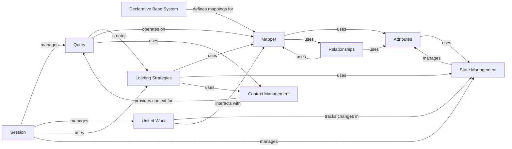

## Component Details

The ORM Mapping & Querying subsystem in SQLAlchemy defines how Python classes are mapped to database tables, including inheritance strategies and the declarative base system for model definition. It provides the object-oriented interface for constructing and executing database queries, translating them into SQL statements and loading results into mapped objects, and manages object attributes and relationships. This subsystem is central to SQLAlchemy's Object Relational Mapper, enabling developers to interact with databases using Python objects rather than raw SQL.

### Mapper
The core of the ORM, responsible for mapping Python classes to database tables and defining how data is loaded and persisted between them. It manages the relationship between object attributes and table columns, handles inheritance, and provides methods for identity key generation.

**Related Classes/Methods**:

- <a href="https://github.com/sqlalchemy/sqlalchemy/blob/master/lib/sqlalchemy/orm/mapper.py#L166-L4055" target="_blank" rel="noopener noreferrer">`sqlalchemy.orm.mapper.Mapper` (166:4055)</a>
- <a href="https://github.com/sqlalchemy/sqlalchemy/blob/master/lib/sqlalchemy/orm/mapper.py#L193-L847" target="_blank" rel="noopener noreferrer">`sqlalchemy.orm.mapper.Mapper.__init__` (193:847)</a>
- <a href="https://github.com/sqlalchemy/sqlalchemy/blob/master/lib/sqlalchemy/orm/mapper.py#L1159-L1340" target="_blank" rel="noopener noreferrer">`sqlalchemy.orm.mapper.Mapper._configure_inheritance` (1159:1340)</a>
- <a href="https://github.com/sqlalchemy/sqlalchemy/blob/master/lib/sqlalchemy/orm/mapper.py#L1655-L1769" target="_blank" rel="noopener noreferrer">`sqlalchemy.orm.mapper.Mapper._configure_properties` (1655:1769)</a>
- <a href="https://github.com/sqlalchemy/sqlalchemy/blob/master/lib/sqlalchemy/orm/mapper.py#L1528-L1653" target="_blank" rel="noopener noreferrer">`sqlalchemy.orm.mapper.Mapper._configure_pks` (1528:1653)</a>
- <a href="https://github.com/sqlalchemy/sqlalchemy/blob/master/lib/sqlalchemy/orm/mapper.py#L2369-L2384" target="_blank" rel="noopener noreferrer">`sqlalchemy.orm.mapper.Mapper.add_property` (2369:2384)</a>
- <a href="https://github.com/sqlalchemy/sqlalchemy/blob/master/lib/sqlalchemy/orm/mapper.py#L2446-L2461" target="_blank" rel="noopener noreferrer">`sqlalchemy.orm.mapper.Mapper.get_property` (2446:2461)</a>
- <a href="https://github.com/sqlalchemy/sqlalchemy/blob/master/lib/sqlalchemy/orm/mapper.py#L3438-L3452" target="_blank" rel="noopener noreferrer">`sqlalchemy.orm.mapper.Mapper.identity_key_from_instance` (3438:3452)</a>

### Declarative Base System
Provides a way to define ORM models declaratively using Python classes, simplifying the mapping process. It includes the `DeclarativeBase` class for defining base classes and the `registry` for managing mapped classes and their metadata.

**Related Classes/Methods**:

- <a href="https://github.com/sqlalchemy/sqlalchemy/blob/master/lib/sqlalchemy/orm/decl_api.py#L629-L839" target="_blank" rel="noopener noreferrer">`sqlalchemy.orm.decl_api.DeclarativeBase` (629:839)</a>
- <a href="https://github.com/sqlalchemy/sqlalchemy/blob/master/lib/sqlalchemy/orm/decl_api.py#L833-L839" target="_blank" rel="noopener noreferrer">`sqlalchemy.orm.decl_api.DeclarativeBase.__init_subclass__` (833:839)</a>
- <a href="https://github.com/sqlalchemy/sqlalchemy/blob/master/lib/sqlalchemy/orm/decl_api.py#L1106-L1808" target="_blank" rel="noopener noreferrer">`sqlalchemy.orm.decl_api.registry` (1106:1808)</a>
- <a href="https://github.com/sqlalchemy/sqlalchemy/blob/master/lib/sqlalchemy/orm/decl_api.py#L1148-L1213" target="_blank" rel="noopener noreferrer">`sqlalchemy.orm.decl_api.registry.__init__` (1148:1213)</a>
- <a href="https://github.com/sqlalchemy/sqlalchemy/blob/master/lib/sqlalchemy/orm/decl_api.py#L1435-L1538" target="_blank" rel="noopener noreferrer">`sqlalchemy.orm.decl_api.registry.generate_base` (1435:1538)</a>
- <a href="https://github.com/sqlalchemy/sqlalchemy/blob/master/lib/sqlalchemy/orm/decl_api.py#L1624-L1663" target="_blank" rel="noopener noreferrer">`sqlalchemy.orm.decl_api.registry.mapped` (1624:1663)</a>

### Query
The primary interface for constructing and executing database queries in an object-oriented manner. It allows filtering, ordering, and joining mapped objects, and translates these operations into SQL statements.

**Related Classes/Methods**:

- <a href="https://github.com/sqlalchemy/sqlalchemy/blob/master/lib/sqlalchemy/orm/query.py#L164-L3411" target="_blank" rel="noopener noreferrer">`sqlalchemy.orm.query.Query` (164:3411)</a>
- <a href="https://github.com/sqlalchemy/sqlalchemy/blob/master/lib/sqlalchemy/orm/query.py#L244-L284" target="_blank" rel="noopener noreferrer">`sqlalchemy.orm.query.Query.__init__` (244:284)</a>
- <a href="https://github.com/sqlalchemy/sqlalchemy/blob/master/lib/sqlalchemy/orm/query.py#L1897-L1929" target="_blank" rel="noopener noreferrer">`sqlalchemy.orm.query.Query.filter` (1897:1929)</a>
- <a href="https://github.com/sqlalchemy/sqlalchemy/blob/master/lib/sqlalchemy/orm/query.py#L2018-L2067" target="_blank" rel="noopener noreferrer">`sqlalchemy.orm.query.Query.order_by` (2018:2067)</a>
- <a href="https://github.com/sqlalchemy/sqlalchemy/blob/master/lib/sqlalchemy/orm/query.py#L2263-L2496" target="_blank" rel="noopener noreferrer">`sqlalchemy.orm.query.Query.join` (2263:2496)</a>
- <a href="https://github.com/sqlalchemy/sqlalchemy/blob/master/lib/sqlalchemy/orm/query.py#L2731-L2753" target="_blank" rel="noopener noreferrer">`sqlalchemy.orm.query.Query.all` (2731:2753)</a>
- <a href="https://github.com/sqlalchemy/sqlalchemy/blob/master/lib/sqlalchemy/orm/query.py#L511-L551" target="_blank" rel="noopener noreferrer">`sqlalchemy.orm.query.Query.statement` (511:551)</a>
- <a href="https://github.com/sqlalchemy/sqlalchemy/blob/master/lib/sqlalchemy/orm/query.py#L1481-L1481" target="_blank" rel="noopener noreferrer">`sqlalchemy.orm.query.Query.with_entities` (1481:1481)</a>

### Attributes
Manages the attributes of mapped objects, including their state (e.g., pending, persistent, detached, deleted) and how changes to these attributes are tracked and synchronized with the database. This includes `InstrumentedAttribute` for mapped columns and relationships.

**Related Classes/Methods**:

- <a href="https://github.com/sqlalchemy/sqlalchemy/blob/master/lib/sqlalchemy/orm/attributes.py#L510-L570" target="_blank" rel="noopener noreferrer">`sqlalchemy.orm.attributes.InstrumentedAttribute` (510:570)</a>
- <a href="https://github.com/sqlalchemy/sqlalchemy/blob/master/lib/sqlalchemy/orm/attributes.py#L549-L551" target="_blank" rel="noopener noreferrer">`sqlalchemy.orm.attributes.InstrumentedAttribute.__get__` (549:551)</a>
- <a href="https://github.com/sqlalchemy/sqlalchemy/blob/master/lib/sqlalchemy/orm/attributes.py#L540-L543" target="_blank" rel="noopener noreferrer">`sqlalchemy.orm.attributes.InstrumentedAttribute.__set__` (540:543)</a>
- <a href="https://github.com/sqlalchemy/sqlalchemy/blob/master/lib/sqlalchemy/orm/attributes.py#L829-L1202" target="_blank" rel="noopener noreferrer">`sqlalchemy.orm.attributes._AttributeImpl` (829:1202)</a>
- <a href="https://github.com/sqlalchemy/sqlalchemy/blob/master/lib/sqlalchemy/orm/attributes.py#L1205-L1331" target="_blank" rel="noopener noreferrer">`sqlalchemy.orm.attributes._ScalarAttributeImpl` (1205:1331)</a>
- <a href="https://github.com/sqlalchemy/sqlalchemy/blob/master/lib/sqlalchemy/orm/attributes.py#L1627-L2121" target="_blank" rel="noopener noreferrer">`sqlalchemy.orm.attributes._CollectionAttributeImpl` (1627:2121)</a>

### Relationships
Defines and manages relationships between mapped objects (e.g., one-to-many, many-to-one, many-to-many). It handles the loading of related objects and the propagation of changes across relationships, including join conditions and back-references.

**Related Classes/Methods**:

- <a href="https://github.com/sqlalchemy/sqlalchemy/blob/master/lib/sqlalchemy/orm/relationships.py#L344-L2306" target="_blank" rel="noopener noreferrer">`sqlalchemy.orm.relationships.RelationshipProperty` (344:2306)</a>
- <a href="https://github.com/sqlalchemy/sqlalchemy/blob/master/lib/sqlalchemy/orm/relationships.py#L403-L546" target="_blank" rel="noopener noreferrer">`sqlalchemy.orm.relationships.RelationshipProperty.__init__` (403:546)</a>
- <a href="https://github.com/sqlalchemy/sqlalchemy/blob/master/lib/sqlalchemy/orm/relationships.py#L1947-L1975" target="_blank" rel="noopener noreferrer">`sqlalchemy.orm.relationships.RelationshipProperty._setup_join_conditions` (1947:1975)</a>
- <a href="https://github.com/sqlalchemy/sqlalchemy/blob/master/lib/sqlalchemy/orm/relationships.py#L2225-L2306" target="_blank" rel="noopener noreferrer">`sqlalchemy.orm.relationships.RelationshipProperty._create_joins` (2225:2306)</a>
- <a href="https://github.com/sqlalchemy/sqlalchemy/blob/master/lib/sqlalchemy/orm/relationships.py#L583-L1215" target="_blank" rel="noopener noreferrer">`sqlalchemy.orm.relationships.RelationshipProperty.Comparator` (583:1215)</a>

### Loading Strategies
Determines how related objects and collections are loaded from the database, offering various strategies like eager loading (joined, subquery, selectin), lazy loading, and immediate loading to optimize data retrieval and manage object graph traversal.

**Related Classes/Methods**:

- <a href="https://github.com/sqlalchemy/sqlalchemy/blob/master/lib/sqlalchemy/orm/loading.py#L80-L300" target="_blank" rel="noopener noreferrer">`sqlalchemy.orm.loading.instances` (80:300)</a>
- <a href="https://github.com/sqlalchemy/sqlalchemy/blob/master/lib/sqlalchemy/orm/loading.py#L811-L1253" target="_blank" rel="noopener noreferrer">`sqlalchemy.orm.loading._instance_processor` (811:1253)</a>
- <a href="https://github.com/sqlalchemy/sqlalchemy/blob/master/lib/sqlalchemy/orm/strategy_options.py#L965-L1328" target="_blank" rel="noopener noreferrer">`sqlalchemy.orm.strategy_options.Load` (965:1328)</a>
- <a href="https://github.com/sqlalchemy/sqlalchemy/blob/master/lib/sqlalchemy/orm/strategy_options.py#L2427-L2428" target="_blank" rel="noopener noreferrer">`sqlalchemy.orm.strategy_options.Load.joinedload` (2427:2428)</a>
- <a href="https://github.com/sqlalchemy/sqlalchemy/blob/master/lib/sqlalchemy/orm/strategy_options.py#L2432-L2433" target="_blank" rel="noopener noreferrer">`sqlalchemy.orm.strategy_options.Load.subqueryload` (2432:2433)</a>
- <a href="https://github.com/sqlalchemy/sqlalchemy/blob/master/lib/sqlalchemy/orm/strategy_options.py#L2437-L2442" target="_blank" rel="noopener noreferrer">`sqlalchemy.orm.strategy_options.Load.selectinload` (2437:2442)</a>
- <a href="https://github.com/sqlalchemy/sqlalchemy/blob/master/lib/sqlalchemy/orm/strategy_options.py#L2446-L2447" target="_blank" rel="noopener noreferrer">`sqlalchemy.orm.strategy_options.Load.lazyload` (2446:2447)</a>

### Session
The primary interface for interacting with the database in an ORM context. It manages the lifecycle of mapped objects, tracks changes, and provides methods for persisting, querying, and deleting objects. It acts as a 'unit of work' for database operations.

**Related Classes/Methods**:

- <a href="https://github.com/sqlalchemy/sqlalchemy/blob/master/lib/sqlalchemy/orm/session.py#L1446-L4975" target="_blank" rel="noopener noreferrer">`sqlalchemy.orm.session.Session` (1446:4975)</a>
- <a href="https://github.com/sqlalchemy/sqlalchemy/blob/master/lib/sqlalchemy/orm/session.py#L1492-L1791" target="_blank" rel="noopener noreferrer">`sqlalchemy.orm.session.Session.__init__` (1492:1791)</a>
- <a href="https://github.com/sqlalchemy/sqlalchemy/blob/master/lib/sqlalchemy/orm/session.py#L1885-L1938" target="_blank" rel="noopener noreferrer">`sqlalchemy.orm.session.Session.begin` (1885:1938)</a>
- <a href="https://github.com/sqlalchemy/sqlalchemy/blob/master/lib/sqlalchemy/orm/session.py#L1987-L2023" target="_blank" rel="noopener noreferrer">`sqlalchemy.orm.session.Session.commit` (1987:2023)</a>
- <a href="https://github.com/sqlalchemy/sqlalchemy/blob/master/lib/sqlalchemy/orm/session.py#L4362-L4396" target="_blank" rel="noopener noreferrer">`sqlalchemy.orm.session.Session.flush` (4362:4396)</a>
- <a href="https://github.com/sqlalchemy/sqlalchemy/blob/master/lib/sqlalchemy/orm/session.py#L3451-L3484" target="_blank" rel="noopener noreferrer">`sqlalchemy.orm.session.Session.add` (3451:3484)</a>
- <a href="https://github.com/sqlalchemy/sqlalchemy/blob/master/lib/sqlalchemy/orm/session.py#L3516-L3542" target="_blank" rel="noopener noreferrer">`sqlalchemy.orm.session.Session.delete` (3516:3542)</a>
- <a href="https://github.com/sqlalchemy/sqlalchemy/blob/master/lib/sqlalchemy/orm/session.py#L2846-L2846" target="_blank" rel="noopener noreferrer">`sqlalchemy.orm.session.Session.query` (2846:2846)</a>
- <a href="https://github.com/sqlalchemy/sqlalchemy/blob/master/lib/sqlalchemy/orm/session.py#L2265-L2274" target="_blank" rel="noopener noreferrer">`sqlalchemy.orm.session.Session.execute` (2265:2274)</a>
- <a href="https://github.com/sqlalchemy/sqlalchemy/blob/master/lib/sqlalchemy/orm/session.py#L3600-L3721" target="_blank" rel="noopener noreferrer">`sqlalchemy.orm.session.Session.get` (3600:3721)</a>

### Unit of Work
An internal component that coordinates the persistence of changes to mapped objects within a session. It tracks object state, determines the order of SQL operations (inserts, updates, deletes), and ensures data integrity by managing dependencies between objects.

**Related Classes/Methods**:

- <a href="https://github.com/sqlalchemy/sqlalchemy/blob/master/lib/sqlalchemy/orm/unitofwork.py#L157-L489" target="_blank" rel="noopener noreferrer">`sqlalchemy.orm.unitofwork.UOWTransaction` (157:489)</a>
- <a href="https://github.com/sqlalchemy/sqlalchemy/blob/master/lib/sqlalchemy/orm/unitofwork.py#L443-L468" target="_blank" rel="noopener noreferrer">`sqlalchemy.orm.unitofwork.UOWTransaction.execute` (443:468)</a>
- <a href="https://github.com/sqlalchemy/sqlalchemy/blob/master/lib/sqlalchemy/orm/unitofwork.py#L470-L489" target="_blank" rel="noopener noreferrer">`sqlalchemy.orm.unitofwork.UOWTransaction.finalize_flush_changes` (470:489)</a>
- <a href="https://github.com/sqlalchemy/sqlalchemy/blob/master/lib/sqlalchemy/orm/unitofwork.py#L308-L340" target="_blank" rel="noopener noreferrer">`sqlalchemy.orm.unitofwork.UOWTransaction.register_object` (308:340)</a>
- <a href="https://github.com/sqlalchemy/sqlalchemy/blob/master/lib/sqlalchemy/orm/unitofwork.py#L43-L154" target="_blank" rel="noopener noreferrer">`sqlalchemy.orm.unitofwork._track_cascade_events` (43:154)</a>

### State Management
Manages the lifecycle and state of individual mapped objects, including their identity, attributes, and changes. This is crucial for the Unit of Work to correctly track and persist modifications, and for features like lazy loading and expiration.

**Related Classes/Methods**:

- <a href="https://github.com/sqlalchemy/sqlalchemy/blob/master/lib/sqlalchemy/orm/state.py#L105-L1015" target="_blank" rel="noopener noreferrer">`sqlalchemy.orm.state.InstanceState` (105:1015)</a>
- <a href="https://github.com/sqlalchemy/sqlalchemy/blob/master/lib/sqlalchemy/orm/state.py#L301-L313" target="_blank" rel="noopener noreferrer">`sqlalchemy.orm.state.InstanceState.persistent` (301:313)</a>
- <a href="https://github.com/sqlalchemy/sqlalchemy/blob/master/lib/sqlalchemy/orm/state.py#L241-L249" target="_blank" rel="noopener noreferrer">`sqlalchemy.orm.state.InstanceState.pending` (241:249)</a>
- <a href="https://github.com/sqlalchemy/sqlalchemy/blob/master/lib/sqlalchemy/orm/state.py#L252-L277" target="_blank" rel="noopener noreferrer">`sqlalchemy.orm.state.InstanceState.deleted` (252:277)</a>
- <a href="https://github.com/sqlalchemy/sqlalchemy/blob/master/lib/sqlalchemy/orm/state.py#L316-L324" target="_blank" rel="noopener noreferrer">`sqlalchemy.orm.state.InstanceState.detached` (316:324)</a>
- <a href="https://github.com/sqlalchemy/sqlalchemy/blob/master/lib/sqlalchemy/orm/state.py#L347-L368" target="_blank" rel="noopener noreferrer">`sqlalchemy.orm.state.InstanceState.session` (347:368)</a>
- <a href="https://github.com/sqlalchemy/sqlalchemy/blob/master/lib/sqlalchemy/orm/state.py#L575-L576" target="_blank" rel="noopener noreferrer">`sqlalchemy.orm.state.InstanceState.get_history` (575:576)</a>
- <a href="https://github.com/sqlalchemy/sqlalchemy/blob/master/lib/sqlalchemy/orm/state.py#L870-L940" target="_blank" rel="noopener noreferrer">`sqlalchemy.orm.state.InstanceState._modified_event` (870:940)</a>
- <a href="https://github.com/sqlalchemy/sqlalchemy/blob/master/lib/sqlalchemy/orm/state.py#L706-L754" target="_blank" rel="noopener noreferrer">`sqlalchemy.orm.state.InstanceState._expire` (706:754)</a>

### Context Management
Provides context for ORM operations, such as query compilation and execution. It holds information about the current query, its entities, and options, facilitating the translation of ORM constructs into SQL and managing the flow of data.

**Related Classes/Methods**:

- <a href="https://github.com/sqlalchemy/sqlalchemy/blob/master/lib/sqlalchemy/orm/context.py#L107-L224" target="_blank" rel="noopener noreferrer">`sqlalchemy.orm.context.QueryContext` (107:224)</a>
- <a href="https://github.com/sqlalchemy/sqlalchemy/blob/master/lib/sqlalchemy/orm/context.py#L1087-L2573" target="_blank" rel="noopener noreferrer">`sqlalchemy.orm.context._ORMSelectCompileState` (1087:2573)</a>
- <a href="https://github.com/sqlalchemy/sqlalchemy/blob/master/lib/sqlalchemy/orm/context.py#L773-L956" target="_blank" rel="noopener noreferrer">`sqlalchemy.orm.context._ORMFromStatementCompileState` (773:956)</a>
- <a href="https://github.com/sqlalchemy/sqlalchemy/blob/master/lib/sqlalchemy/orm/context.py#L2658-L2750" target="_blank" rel="noopener noreferrer">`sqlalchemy.orm.context._QueryEntity` (2658:2750)</a>

### [FAQ](https://github.com/CodeBoarding/GeneratedOnBoardings/tree/main?tab=readme-ov-file#faq)