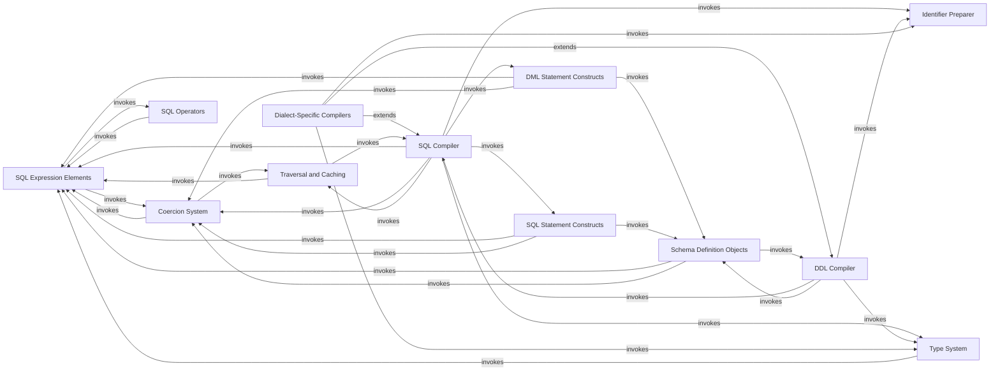

## Component Details

The SQL Expression & Statement Layer in SQLAlchemy provides the fundamental components for building and compiling SQL expressions and statements. It encompasses abstract SQL elements like columns, literals, and operators, as well as higher-level constructs such as SELECT, INSERT, UPDATE, and DELETE statements, including complex features like joins and subqueries. This layer is also responsible for translating these abstract representations into concrete, dialect-specific SQL strings for execution and managing SQLAlchemy's internal representation of SQL data types. The core flow involves defining SQL constructs using the expression elements, which are then processed by various compilers (SQL, DDL, Type) to generate executable SQL. The system also handles parameter binding, identifier quoting, and type coercion to ensure correct and efficient interaction with different database dialects. Caching mechanisms are employed to optimize performance for frequently used queries.

### SQL Expression Elements
These are the fundamental building blocks for constructing abstract SQL expressions, such as columns, literals, binary operations, and unary operations. They form the atomic units that can be combined to create more complex SQL constructs.

**Related Classes/Methods**:

- <a href="https://github.com/sqlalchemy/sqlalchemy/blob/master/lib/sqlalchemy/sql/elements.py#L1244-L1869" target="_blank" rel="noopener noreferrer">`sqlalchemy.sql.elements.ColumnElement` (1244:1869)</a>
- <a href="https://github.com/sqlalchemy/sqlalchemy/blob/master/lib/sqlalchemy/sql/elements.py#L3890-L4039" target="_blank" rel="noopener noreferrer">`sqlalchemy.sql.elements.BinaryExpression` (3890:4039)</a>
- <a href="https://github.com/sqlalchemy/sqlalchemy/blob/master/lib/sqlalchemy/sql/elements.py#L2257-L2637" target="_blank" rel="noopener noreferrer">`sqlalchemy.sql.elements.TextClause` (2257:2637)</a>
- <a href="https://github.com/sqlalchemy/sqlalchemy/blob/master/lib/sqlalchemy/sql/elements.py#L1946-L2236" target="_blank" rel="noopener noreferrer">`sqlalchemy.sql.elements.BindParameter` (1946:2236)</a>
- <a href="https://github.com/sqlalchemy/sqlalchemy/blob/master/lib/sqlalchemy/sql/elements.py#L2762-L2867" target="_blank" rel="noopener noreferrer">`sqlalchemy.sql.elements.ClauseList` (2762:2867)</a>
- <a href="https://github.com/sqlalchemy/sqlalchemy/blob/master/lib/sqlalchemy/sql/elements.py#L3265-L3339" target="_blank" rel="noopener noreferrer">`sqlalchemy.sql.elements.Tuple` (3265:3339)</a>
- <a href="https://github.com/sqlalchemy/sqlalchemy/blob/master/lib/sqlalchemy/sql/elements.py#L3342-L3436" target="_blank" rel="noopener noreferrer">`sqlalchemy.sql.elements.Case` (3342:3436)</a>
- <a href="https://github.com/sqlalchemy/sqlalchemy/blob/master/lib/sqlalchemy/sql/elements.py#L3439-L3496" target="_blank" rel="noopener noreferrer">`sqlalchemy.sql.elements.Cast` (3439:3496)</a>
- <a href="https://github.com/sqlalchemy/sqlalchemy/blob/master/lib/sqlalchemy/sql/elements.py#L3579-L3599" target="_blank" rel="noopener noreferrer">`sqlalchemy.sql.elements.Extract` (3579:3599)</a>
- <a href="https://github.com/sqlalchemy/sqlalchemy/blob/master/lib/sqlalchemy/sql/elements.py#L3647-L3793" target="_blank" rel="noopener noreferrer">`sqlalchemy.sql.elements.UnaryExpression` (3647:3793)</a>
- <a href="https://github.com/sqlalchemy/sqlalchemy/blob/master/lib/sqlalchemy/sql/elements.py#L4745-L4939" target="_blank" rel="noopener noreferrer">`sqlalchemy.sql.elements.Label` (4745:4939)</a>
- <a href="https://github.com/sqlalchemy/sqlalchemy/blob/master/lib/sqlalchemy/sql/elements.py#L4105-L4166" target="_blank" rel="noopener noreferrer">`sqlalchemy.sql.elements.Grouping` (4105:4166)</a>
- <a href="https://github.com/sqlalchemy/sqlalchemy/blob/master/lib/sqlalchemy/sql/elements.py#L2640-L2663" target="_blank" rel="noopener noreferrer">`sqlalchemy.sql.elements.Null` (2640:2663)</a>
- <a href="https://github.com/sqlalchemy/sqlalchemy/blob/master/lib/sqlalchemy/sql/elements.py#L2700-L2733" target="_blank" rel="noopener noreferrer">`sqlalchemy.sql.elements.True_` (2700:2733)</a>
- <a href="https://github.com/sqlalchemy/sqlalchemy/blob/master/lib/sqlalchemy/sql/elements.py#L2669-L2694" target="_blank" rel="noopener noreferrer">`sqlalchemy.sql.elements.False_` (2669:2694)</a>
- <a href="https://github.com/sqlalchemy/sqlalchemy/blob/master/lib/sqlalchemy/sql/elements.py#L4220-L4297" target="_blank" rel="noopener noreferrer">`sqlalchemy.sql.elements.Over` (4220:4297)</a>
- <a href="https://github.com/sqlalchemy/sqlalchemy/blob/master/lib/sqlalchemy/sql/elements.py#L4384-L4489" target="_blank" rel="noopener noreferrer">`sqlalchemy.sql.elements.WithinGroup` (4384:4489)</a>
- <a href="https://github.com/sqlalchemy/sqlalchemy/blob/master/lib/sqlalchemy/sql/elements.py#L4492-L4632" target="_blank" rel="noopener noreferrer">`sqlalchemy.sql.elements.FunctionFilter` (4492:4632)</a>
- <a href="https://github.com/sqlalchemy/sqlalchemy/blob/master/lib/sqlalchemy/sql/elements.py#L5281-L5371" target="_blank" rel="noopener noreferrer">`sqlalchemy.sql.elements.quoted_name` (5281:5371)</a>

### SQL Statement Constructs
Provides high-level SQL statements for querying and data retrieval, including complex constructs like joins, subqueries, and common table expressions (CTEs). These constructs define the structure of a SQL query.

**Related Classes/Methods**:

- <a href="https://github.com/sqlalchemy/sqlalchemy/blob/master/lib/sqlalchemy/sql/selectable.py#L5223-L6777" target="_blank" rel="noopener noreferrer">`sqlalchemy.sql.selectable.Select` (5223:6777)</a>
- <a href="https://github.com/sqlalchemy/sqlalchemy/blob/master/lib/sqlalchemy/sql/selectable.py#L3071-L3227" target="_blank" rel="noopener noreferrer">`sqlalchemy.sql.selectable.TableClause` (3071:3227)</a>
- <a href="https://github.com/sqlalchemy/sqlalchemy/blob/master/lib/sqlalchemy/sql/selectable.py#L1230-L1661" target="_blank" rel="noopener noreferrer">`sqlalchemy.sql.selectable.Join` (1230:1661)</a>
- <a href="https://github.com/sqlalchemy/sqlalchemy/blob/master/lib/sqlalchemy/sql/selectable.py#L2107-L2301" target="_blank" rel="noopener noreferrer">`sqlalchemy.sql.selectable.CTE` (2107:2301)</a>
- <a href="https://github.com/sqlalchemy/sqlalchemy/blob/master/lib/sqlalchemy/sql/selectable.py#L2932-L2990" target="_blank" rel="noopener noreferrer">`sqlalchemy.sql.selectable.Subquery` (2932:2990)</a>
- <a href="https://github.com/sqlalchemy/sqlalchemy/blob/master/lib/sqlalchemy/sql/selectable.py#L1796-L1829" target="_blank" rel="noopener noreferrer">`sqlalchemy.sql.selectable.Alias` (1796:1829)</a>
- <a href="https://github.com/sqlalchemy/sqlalchemy/blob/master/lib/sqlalchemy/sql/selectable.py#L606-L1055" target="_blank" rel="noopener noreferrer">`sqlalchemy.sql.selectable.FromClause` (606:1055)</a>
- <a href="https://github.com/sqlalchemy/sqlalchemy/blob/master/lib/sqlalchemy/sql/selectable.py#L4426-L4638" target="_blank" rel="noopener noreferrer">`sqlalchemy.sql.selectable.CompoundSelect` (4426:4638)</a>

### DML Statement Constructs
These classes represent the core Data Manipulation Language (DML) statements (INSERT, UPDATE, DELETE). They provide methods for specifying target tables, values to insert/update, WHERE clauses for filtering, and RETURNING clauses for fetching results. They manage the state and parameters for DML operations.

**Related Classes/Methods**:

- <a href="https://github.com/sqlalchemy/sqlalchemy/blob/master/lib/sqlalchemy/sql/dml.py#L1194-L1462" target="_blank" rel="noopener noreferrer">`sqlalchemy.sql.dml.Insert` (1194:1462)</a>
- <a href="https://github.com/sqlalchemy/sqlalchemy/blob/master/lib/sqlalchemy/sql/dml.py#L1568-L1762" target="_blank" rel="noopener noreferrer">`sqlalchemy.sql.dml.Update` (1568:1762)</a>
- <a href="https://github.com/sqlalchemy/sqlalchemy/blob/master/lib/sqlalchemy/sql/dml.py#L1777-L1914" target="_blank" rel="noopener noreferrer">`sqlalchemy.sql.dml.Delete` (1777:1914)</a>
- <a href="https://github.com/sqlalchemy/sqlalchemy/blob/master/lib/sqlalchemy/sql/dml.py#L979-L1191" target="_blank" rel="noopener noreferrer">`sqlalchemy.sql.dml.ValuesBase` (979:1191)</a>
- <a href="https://github.com/sqlalchemy/sqlalchemy/blob/master/lib/sqlalchemy/sql/dml.py#L1479-L1565" target="_blank" rel="noopener noreferrer">`sqlalchemy.sql.dml.DMLWhereBase` (1479:1565)</a>
- <a href="https://github.com/sqlalchemy/sqlalchemy/blob/master/lib/sqlalchemy/sql/dml.py#L393-L976" target="_blank" rel="noopener noreferrer">`sqlalchemy.sql.dml.UpdateBase` (393:976)</a>
- <a href="https://github.com/sqlalchemy/sqlalchemy/blob/master/lib/sqlalchemy/sql/dml.py#L121-L266" target="_blank" rel="noopener noreferrer">`sqlalchemy.sql.dml.DMLState` (121:266)</a>

### SQL Compiler
The core component responsible for translating SQLAlchemy expression objects into executable SQL strings. It manages the overall compilation process, including handling bind parameters, result column mapping, and applying dialect-specific rules. It acts as a central dispatcher for visiting various SQL expression elements.

**Related Classes/Methods**:

- <a href="https://github.com/sqlalchemy/sqlalchemy/blob/master/lib/sqlalchemy/sql/compiler.py#L1053-L6533" target="_blank" rel="noopener noreferrer">`sqlalchemy.sql.compiler.SQLCompiler` (1053:6533)</a>
- <a href="https://github.com/sqlalchemy/sqlalchemy/blob/master/lib/sqlalchemy/sql/compiler.py#L6536-L6644" target="_blank" rel="noopener noreferrer">`sqlalchemy.sql.compiler.StrSQLCompiler` (6536:6644)</a>

### DDL Compiler
Specializes in generating Data Definition Language (DDL) statements such as CREATE TABLE, ALTER TABLE, DROP INDEX, etc. It works closely with schema objects and uses the SQL Compiler for compiling embedded SQL expressions.

**Related Classes/Methods**:

- <a href="https://github.com/sqlalchemy/sqlalchemy/blob/master/lib/sqlalchemy/sql/compiler.py#L6647-L7204" target="_blank" rel="noopener noreferrer">`sqlalchemy.sql.compiler.DDLCompiler` (6647:7204)</a>

### Identifier Preparer
Provides services for quoting and escaping SQL identifiers (table names, column names, schema names, constraint names) according to the rules of the specific database dialect. It ensures that identifiers are correctly formatted for the target database.

**Related Classes/Methods**:

- <a href="https://github.com/sqlalchemy/sqlalchemy/blob/master/lib/sqlalchemy/sql/compiler.py#L7437-L7920" target="_blank" rel="noopener noreferrer">`sqlalchemy.sql.compiler.IdentifierPreparer` (7437:7920)</a>

### Type System
The type system defines how Python data types map to SQL data types and how values are processed between Python and the database. TypeEngine is the base for all SQL data types, and GenericTypeCompiler provides generic DDL compilation for types.

**Related Classes/Methods**:

- <a href="https://github.com/sqlalchemy/sqlalchemy/blob/master/lib/sqlalchemy/sql/type_api.py#L118-L1098" target="_blank" rel="noopener noreferrer">`sqlalchemy.sql.type_api.TypeEngine` (118:1098)</a>
- <a href="https://github.com/sqlalchemy/sqlalchemy/blob/master/lib/sqlalchemy/sql/type_api.py#L1508-L2294" target="_blank" rel="noopener noreferrer">`sqlalchemy.sql.type_api.TypeDecorator` (1508:2294)</a>
- <a href="https://github.com/sqlalchemy/sqlalchemy/blob/master/lib/sqlalchemy/sql/sqltypes.py#L177-L269" target="_blank" rel="noopener noreferrer">`sqlalchemy.sql.sqltypes.String` (177:269)</a>
- <a href="https://github.com/sqlalchemy/sqlalchemy/blob/master/lib/sqlalchemy/sql/sqltypes.py#L511-L642" target="_blank" rel="noopener noreferrer">`sqlalchemy.sql.sqltypes.Numeric` (511:642)</a>
- <a href="https://github.com/sqlalchemy/sqlalchemy/blob/master/lib/sqlalchemy/sql/sqltypes.py#L791-L853" target="_blank" rel="noopener noreferrer">`sqlalchemy.sql.sqltypes.DateTime` (791:853)</a>
- <a href="https://github.com/sqlalchemy/sqlalchemy/blob/master/lib/sqlalchemy/sql/compiler.py#L7207-L7393" target="_blank" rel="noopener noreferrer">`sqlalchemy.sql.compiler.GenericTypeCompiler` (7207:7393)</a>
- <a href="https://github.com/sqlalchemy/sqlalchemy/blob/master/lib/sqlalchemy/sql/compiler.py#L966-L985" target="_blank" rel="noopener noreferrer">`sqlalchemy.sql.compiler.TypeCompiler` (966:985)</a>

### Coercion System
This system is responsible for converting various Python objects and SQLAlchemy constructs into the appropriate SQL expression roles. It ensures that arguments passed to SQL functions and operators conform to the expected types and structures.

**Related Classes/Methods**:

- <a href="https://github.com/sqlalchemy/sqlalchemy/blob/master/lib/sqlalchemy/sql/coercions.py#L164-L168" target="_blank" rel="noopener noreferrer">`sqlalchemy.sql.coercions.expect` (164:168)</a>
- <a href="https://github.com/sqlalchemy/sqlalchemy/blob/master/lib/sqlalchemy/sql/coercions.py#L475-L527" target="_blank" rel="noopener noreferrer">`sqlalchemy.sql.coercions.RoleImpl` (475:527)</a>

### SQL Operators
This component defines the behavior of SQL operators (e.g., ==, +, LIKE) when applied to column expressions. It provides methods for performing operations and generating the corresponding SQL constructs.

**Related Classes/Methods**:

- <a href="https://github.com/sqlalchemy/sqlalchemy/blob/master/lib/sqlalchemy/sql/operators.py#L502-L2002" target="_blank" rel="noopener noreferrer">`sqlalchemy.sql.operators.ColumnOperators` (502:2002)</a>
- <a href="https://github.com/sqlalchemy/sqlalchemy/blob/master/lib/sqlalchemy/sql/operators.py#L126-L383" target="_blank" rel="noopener noreferrer">`sqlalchemy.sql.operators.Operators` (126:383)</a>

### Traversal and Caching
The visitors module provides a generic mechanism for traversing SQL expression trees, allowing compilers and other components to process elements recursively. The cache_key module provides functionality for generating cache keys for compiled SQL statements, enabling efficient caching of frequently used queries.

**Related Classes/Methods**:

- <a href="https://github.com/sqlalchemy/sqlalchemy/blob/master/lib/sqlalchemy/sql/visitors.py#L897-L901" target="_blank" rel="noopener noreferrer">`sqlalchemy.sql.visitors.traverse` (897:901)</a>
- <a href="https://github.com/sqlalchemy/sqlalchemy/blob/master/lib/sqlalchemy/sql/cache_key.py#L92-L401" target="_blank" rel="noopener noreferrer">`sqlalchemy.sql.cache_key.HasCacheKey` (92:401)</a>

### Schema Definition Objects
These classes define the structure of the database schema. Table represents a database table, Column represents a column within a table, and Constraint is the base for various constraints (Primary Key, Foreign Key, Unique, Check). They manage relationships between schema elements and provide methods for DDL generation.

**Related Classes/Methods**:

- <a href="https://github.com/sqlalchemy/sqlalchemy/blob/master/lib/sqlalchemy/sql/schema.py#L317-L1488" target="_blank" rel="noopener noreferrer">`sqlalchemy.sql.schema.Table` (317:1488)</a>
- <a href="https://github.com/sqlalchemy/sqlalchemy/blob/master/lib/sqlalchemy/sql/schema.py#L1491-L2702" target="_blank" rel="noopener noreferrer">`sqlalchemy.sql.schema.Column` (1491:2702)</a>
- <a href="https://github.com/sqlalchemy/sqlalchemy/blob/master/lib/sqlalchemy/sql/schema.py#L2755-L3351" target="_blank" rel="noopener noreferrer">`sqlalchemy.sql.schema.ForeignKey` (2755:3351)</a>
- <a href="https://github.com/sqlalchemy/sqlalchemy/blob/master/lib/sqlalchemy/sql/schema.py#L4968-L5210" target="_blank" rel="noopener noreferrer">`sqlalchemy.sql.schema.PrimaryKeyConstraint` (4968:5210)</a>
- <a href="https://github.com/sqlalchemy/sqlalchemy/blob/master/lib/sqlalchemy/sql/schema.py#L5213-L5222" target="_blank" rel="noopener noreferrer">`sqlalchemy.sql.schema.UniqueConstraint` (5213:5222)</a>
- <a href="https://github.com/sqlalchemy/sqlalchemy/blob/master/lib/sqlalchemy/sql/schema.py#L4544-L4652" target="_blank" rel="noopener noreferrer">`sqlalchemy.sql.schema.CheckConstraint` (4544:4652)</a>
- <a href="https://github.com/sqlalchemy/sqlalchemy/blob/master/lib/sqlalchemy/sql/schema.py#L3763-L4049" target="_blank" rel="noopener noreferrer">`sqlalchemy.sql.schema.Sequence` (3763:4049)</a>
- <a href="https://github.com/sqlalchemy/sqlalchemy/blob/master/lib/sqlalchemy/sql/schema.py#L4053-L4110" target="_blank" rel="noopener noreferrer">`sqlalchemy.sql.schema.FetchedValue` (4053:4110)</a>
- <a href="https://github.com/sqlalchemy/sqlalchemy/blob/master/lib/sqlalchemy/sql/schema.py#L4113-L4154" target="_blank" rel="noopener noreferrer">`sqlalchemy.sql.schema.DefaultClause` (4113:4154)</a>
- <a href="https://github.com/sqlalchemy/sqlalchemy/blob/master/lib/sqlalchemy/sql/schema.py#L6022-L6125" target="_blank" rel="noopener noreferrer">`sqlalchemy.sql.schema.Computed` (6022:6125)</a>
- <a href="https://github.com/sqlalchemy/sqlalchemy/blob/master/lib/sqlalchemy/sql/schema.py#L6128-L6307" target="_blank" rel="noopener noreferrer">`sqlalchemy.sql.schema.Identity` (6128:6307)</a>

### Dialect-Specific Compilers
These classes extend SQLCompiler and DDLCompiler to provide database-specific SQL generation rules and behaviors for different database systems (e.g., SQLite, PostgreSQL, MSSQL, Oracle, MySQL). They handle variations in syntax, data types, and features.

**Related Classes/Methods**:

- <a href="https://github.com/sqlalchemy/sqlalchemy/blob/master/lib/sqlalchemy/dialects/sqlite/base.py#L1407-L1653" target="_blank" rel="noopener noreferrer">`sqlalchemy.dialects.sqlite.base.SQLiteCompiler` (1407:1653)</a>
- <a href="https://github.com/sqlalchemy/sqlalchemy/blob/master/lib/sqlalchemy/dialects/postgresql/base.py#L1800-L2249" target="_blank" rel="noopener noreferrer">`sqlalchemy.dialects.postgresql.base.PGCompiler` (1800:2249)</a>
- <a href="https://github.com/sqlalchemy/sqlalchemy/blob/master/lib/sqlalchemy/dialects/mssql/base.py#L1994-L2508" target="_blank" rel="noopener noreferrer">`sqlalchemy.dialects.mssql.base.MSSQLCompiler` (1994:2508)</a>
- <a href="https://github.com/sqlalchemy/sqlalchemy/blob/master/lib/sqlalchemy/dialects/oracle/base.py#L1178-L1685" target="_blank" rel="noopener noreferrer">`sqlalchemy.dialects.oracle.base.OracleCompiler` (1178:1685)</a>
- <a href="https://github.com/sqlalchemy/sqlalchemy/blob/master/lib/sqlalchemy/dialects/mysql/base.py#L1330-L2019" target="_blank" rel="noopener noreferrer">`sqlalchemy.dialects.mysql.base.MySQLCompiler` (1330:2019)</a>
- <a href="https://github.com/sqlalchemy/sqlalchemy/blob/master/lib/sqlalchemy/dialects/sqlite/base.py#L1656-L1843" target="_blank" rel="noopener noreferrer">`sqlalchemy.dialects.sqlite.base.SQLiteDDLCompiler` (1656:1843)</a>
- <a href="https://github.com/sqlalchemy/sqlalchemy/blob/master/lib/sqlalchemy/dialects/postgresql/base.py#L2252-L2652" target="_blank" rel="noopener noreferrer">`sqlalchemy.dialects.postgresql.base.PGDDLCompiler` (2252:2652)</a>
- <a href="https://github.com/sqlalchemy/sqlalchemy/blob/master/lib/sqlalchemy/dialects/mssql/base.py#L2555-L2810" target="_blank" rel="noopener noreferrer">`sqlalchemy.dialects.mssql.base.MSDDLCompiler` (2555:2810)</a>
- <a href="https://github.com/sqlalchemy/sqlalchemy/blob/master/lib/sqlalchemy/dialects/oracle/base.py#L1688-L1845" target="_blank" rel="noopener noreferrer">`sqlalchemy.dialects.oracle.base.OracleDDLCompiler` (1688:1845)</a>
- <a href="https://github.com/sqlalchemy/sqlalchemy/blob/master/lib/sqlalchemy/dialects/mysql/base.py#L2022-L2344" target="_blank" rel="noopener noreferrer">`sqlalchemy.dialects.mysql.base.MySQLDDLCompiler` (2022:2344)</a>
- <a href="https://github.com/sqlalchemy/sqlalchemy/blob/master/lib/sqlalchemy/dialects/sqlite/base.py#L1846-L1881" target="_blank" rel="noopener noreferrer">`sqlalchemy.dialects.sqlite.base.SQLiteTypeCompiler` (1846:1881)</a>
- <a href="https://github.com/sqlalchemy/sqlalchemy/blob/master/lib/sqlalchemy/dialects/postgresql/base.py#L2655-L2842" target="_blank" rel="noopener noreferrer">`sqlalchemy.dialects.postgresql.base.PGTypeCompiler` (2655:2842)</a>
- <a href="https://github.com/sqlalchemy/sqlalchemy/blob/master/lib/sqlalchemy/dialects/mssql/base.py#L1672-L1834" target="_blank" rel="noopener noreferrer">`sqlalchemy.dialects.mssql.base.MSTypeCompiler` (1672:1834)</a>
- <a href="https://github.com/sqlalchemy/sqlalchemy/blob/master/lib/sqlalchemy/dialects/oracle/base.py#L1013-L1175" target="_blank" rel="noopener noreferrer">`sqlalchemy.dialects.oracle.base.OracleTypeCompiler` (1013:1175)</a>
- <a href="https://github.com/sqlalchemy/sqlalchemy/blob/master/lib/sqlalchemy/dialects/mysql/base.py#L2347-L2656" target="_blank" rel="noopener noreferrer">`sqlalchemy.dialects.mysql.base.MySQLTypeCompiler` (2347:2656)</a>

### [FAQ](https://github.com/CodeBoarding/GeneratedOnBoardings/tree/main?tab=readme-ov-file#faq)