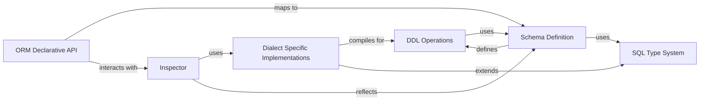

## Component Details

This overview describes the 'Schema & Metadata Management' subsystem in SQLAlchemy, which is responsible for defining, managing, and introspecting database schemas. The core flow involves defining schema objects programmatically using the Schema Definition component, which can then be used by the DDL Operations component to generate and execute DDL statements. The Inspector component allows for introspection of existing database schemas, often leveraging Dialect Specific Implementations for database-specific details. The SQL Type System ensures proper handling of data types across different dialects, and the ORM Declarative API integrates schema definition with object-relational mapping.

### Inspector
The Inspector component provides a high-level interface for database schema introspection. It acts as a proxy to the reflection methods of the underlying dialect, offering a consistent API for querying database metadata such as table names, column details, primary keys, foreign keys, indexes, and constraints. It also includes caching mechanisms to optimize repeated metadata fetches.

**Related Classes/Methods**:

- <a href="https://github.com/sqlalchemy/sqlalchemy/blob/master/lib/sqlalchemy/engine/reflection.py#L182-L2037" target="_blank" rel="noopener noreferrer">`sqlalchemy.engine.reflection.Inspector` (182:2037)</a>
- <a href="https://github.com/sqlalchemy/sqlalchemy/blob/master/lib/sqlalchemy/engine/reflection.py#L224-L236" target="_blank" rel="noopener noreferrer">`sqlalchemy.engine.reflection.Inspector:__init__` (224:236)</a>
- <a href="https://github.com/sqlalchemy/sqlalchemy/blob/master/lib/sqlalchemy/engine/reflection.py#L249-L253" target="_blank" rel="noopener noreferrer">`sqlalchemy.engine.reflection.Inspector:_init_legacy` (249:253)</a>
- <a href="https://github.com/sqlalchemy/sqlalchemy/blob/master/lib/sqlalchemy/engine/reflection.py#L292-L309" target="_blank" rel="noopener noreferrer">`sqlalchemy.engine.reflection.Inspector:from_engine` (292:309)</a>
- <a href="https://github.com/sqlalchemy/sqlalchemy/blob/master/lib/sqlalchemy/engine/reflection.py#L312-L313" target="_blank" rel="noopener noreferrer">`sqlalchemy.engine.reflection.Inspector:_engine_insp` (312:313)</a>
- <a href="https://github.com/sqlalchemy/sqlalchemy/blob/master/lib/sqlalchemy/engine/reflection.py#L316-L317" target="_blank" rel="noopener noreferrer">`sqlalchemy.engine.reflection.Inspector:_connection_insp` (316:317)</a>
- <a href="https://github.com/sqlalchemy/sqlalchemy/blob/master/lib/sqlalchemy/engine/reflection.py#L341-L351" target="_blank" rel="noopener noreferrer">`sqlalchemy.engine.reflection.Inspector:_inspection_context` (341:351)</a>
- <a href="https://github.com/sqlalchemy/sqlalchemy/blob/master/lib/sqlalchemy/engine/reflection.py#L364-L375" target="_blank" rel="noopener noreferrer">`sqlalchemy.engine.reflection.Inspector:get_schema_names` (364:375)</a>
- <a href="https://github.com/sqlalchemy/sqlalchemy/blob/master/lib/sqlalchemy/engine/reflection.py#L377-L408" target="_blank" rel="noopener noreferrer">`sqlalchemy.engine.reflection.Inspector:get_table_names` (377:408)</a>
- <a href="https://github.com/sqlalchemy/sqlalchemy/blob/master/lib/sqlalchemy/engine/reflection.py#L410-L441" target="_blank" rel="noopener noreferrer">`sqlalchemy.engine.reflection.Inspector:has_table` (410:441)</a>
- <a href="https://github.com/sqlalchemy/sqlalchemy/blob/master/lib/sqlalchemy/engine/reflection.py#L443-L460" target="_blank" rel="noopener noreferrer">`sqlalchemy.engine.reflection.Inspector:has_sequence` (443:460)</a>
- <a href="https://github.com/sqlalchemy/sqlalchemy/blob/master/lib/sqlalchemy/engine/reflection.py#L462-L489" target="_blank" rel="noopener noreferrer">`sqlalchemy.engine.reflection.Inspector:has_index` (462:489)</a>
- <a href="https://github.com/sqlalchemy/sqlalchemy/blob/master/lib/sqlalchemy/engine/reflection.py#L491-L505" target="_blank" rel="noopener noreferrer">`sqlalchemy.engine.reflection.Inspector:has_schema` (491:505)</a>
- <a href="https://github.com/sqlalchemy/sqlalchemy/blob/master/lib/sqlalchemy/engine/reflection.py#L507-L550" target="_blank" rel="noopener noreferrer">`sqlalchemy.engine.reflection.Inspector:get_sorted_table_and_fkc_names` (507:550)</a>
- <a href="https://github.com/sqlalchemy/sqlalchemy/blob/master/lib/sqlalchemy/engine/reflection.py#L552-L628" target="_blank" rel="noopener noreferrer">`sqlalchemy.engine.reflection.Inspector:sort_tables_on_foreign_key_dependency` (552:628)</a>
- <a href="https://github.com/sqlalchemy/sqlalchemy/blob/master/lib/sqlalchemy/engine/reflection.py#L630-L645" target="_blank" rel="noopener noreferrer">`sqlalchemy.engine.reflection.Inspector:get_temp_table_names` (630:645)</a>
- <a href="https://github.com/sqlalchemy/sqlalchemy/blob/master/lib/sqlalchemy/engine/reflection.py#L647-L661" target="_blank" rel="noopener noreferrer">`sqlalchemy.engine.reflection.Inspector:get_temp_view_names` (647:661)</a>
- <a href="https://github.com/sqlalchemy/sqlalchemy/blob/master/lib/sqlalchemy/engine/reflection.py#L663-L692" target="_blank" rel="noopener noreferrer">`sqlalchemy.engine.reflection.Inspector:get_table_options` (663:692)</a>
- <a href="https://github.com/sqlalchemy/sqlalchemy/blob/master/lib/sqlalchemy/engine/reflection.py#L694-L749" target="_blank" rel="noopener noreferrer">`sqlalchemy.engine.reflection.Inspector:get_multi_table_options` (694:749)</a>
- <a href="https://github.com/sqlalchemy/sqlalchemy/blob/master/lib/sqlalchemy/engine/reflection.py#L751-L778" target="_blank" rel="noopener noreferrer">`sqlalchemy.engine.reflection.Inspector:get_view_names` (751:778)</a>
- <a href="https://github.com/sqlalchemy/sqlalchemy/blob/master/lib/sqlalchemy/engine/reflection.py#L780-L802" target="_blank" rel="noopener noreferrer">`sqlalchemy.engine.reflection.Inspector:get_materialized_view_names` (780:802)</a>
- <a href="https://github.com/sqlalchemy/sqlalchemy/blob/master/lib/sqlalchemy/engine/reflection.py#L804-L820" target="_blank" rel="noopener noreferrer">`sqlalchemy.engine.reflection.Inspector:get_sequence_names` (804:820)</a>
- <a href="https://github.com/sqlalchemy/sqlalchemy/blob/master/lib/sqlalchemy/engine/reflection.py#L822-L840" target="_blank" rel="noopener noreferrer">`sqlalchemy.engine.reflection.Inspector:get_view_definition` (822:840)</a>
- <a href="https://github.com/sqlalchemy/sqlalchemy/blob/master/lib/sqlalchemy/engine/reflection.py#L842-L874" target="_blank" rel="noopener noreferrer">`sqlalchemy.engine.reflection.Inspector:get_columns` (842:874)</a>
- <a href="https://github.com/sqlalchemy/sqlalchemy/blob/master/lib/sqlalchemy/engine/reflection.py#L886-L943" target="_blank" rel="noopener noreferrer">`sqlalchemy.engine.reflection.Inspector:get_multi_columns` (886:943)</a>
- <a href="https://github.com/sqlalchemy/sqlalchemy/blob/master/lib/sqlalchemy/engine/reflection.py#L945-L972" target="_blank" rel="noopener noreferrer">`sqlalchemy.engine.reflection.Inspector:get_pk_constraint` (945:972)</a>
- <a href="https://github.com/sqlalchemy/sqlalchemy/blob/master/lib/sqlalchemy/engine/reflection.py#L974-L1028" target="_blank" rel="noopener noreferrer">`sqlalchemy.engine.reflection.Inspector:get_multi_pk_constraint` (974:1028)</a>
- <a href="https://github.com/sqlalchemy/sqlalchemy/blob/master/lib/sqlalchemy/engine/reflection.py#L1030-L1059" target="_blank" rel="noopener noreferrer">`sqlalchemy.engine.reflection.Inspector:get_foreign_keys` (1030:1059)</a>
- <a href="https://github.com/sqlalchemy/sqlalchemy/blob/master/lib/sqlalchemy/engine/reflection.py#L1061-L1117" target="_blank" rel="noopener noreferrer">`sqlalchemy.engine.reflection.Inspector:get_multi_foreign_keys` (1061:1117)</a>
- <a href="https://github.com/sqlalchemy/sqlalchemy/blob/master/lib/sqlalchemy/engine/reflection.py#L1119-L1147" target="_blank" rel="noopener noreferrer">`sqlalchemy.engine.reflection.Inspector:get_indexes` (1119:1147)</a>
- <a href="https://github.com/sqlalchemy/sqlalchemy/blob/master/lib/sqlalchemy/engine/reflection.py#L1149-L1204" target="_blank" rel="noopener noreferrer">`sqlalchemy.engine.reflection.Inspector:get_multi_indexes` (1149:1204)</a>
- <a href="https://github.com/sqlalchemy/sqlalchemy/blob/master/lib/sqlalchemy/engine/reflection.py#L1206-L1235" target="_blank" rel="noopener noreferrer">`sqlalchemy.engine.reflection.Inspector:get_unique_constraints` (1206:1235)</a>
- <a href="https://github.com/sqlalchemy/sqlalchemy/blob/master/lib/sqlalchemy/engine/reflection.py#L1237-L1293" target="_blank" rel="noopener noreferrer">`sqlalchemy.engine.reflection.Inspector:get_multi_unique_constraints` (1237:1293)</a>
- <a href="https://github.com/sqlalchemy/sqlalchemy/blob/master/lib/sqlalchemy/engine/reflection.py#L1295-L1325" target="_blank" rel="noopener noreferrer">`sqlalchemy.engine.reflection.Inspector:get_table_comment` (1295:1325)</a>
- <a href="https://github.com/sqlalchemy/sqlalchemy/blob/master/lib/sqlalchemy/engine/reflection.py#L1327-L1385" target="_blank" rel="noopener noreferrer">`sqlalchemy.engine.reflection.Inspector:get_multi_table_comment` (1327:1385)</a>
- <a href="https://github.com/sqlalchemy/sqlalchemy/blob/master/lib/sqlalchemy/engine/reflection.py#L1387-L1416" target="_blank" rel="noopener noreferrer">`sqlalchemy.engine.reflection.Inspector:get_check_constraints` (1387:1416)</a>
- <a href="https://github.com/sqlalchemy/sqlalchemy/blob/master/lib/sqlalchemy/engine/reflection.py#L1418-L1474" target="_blank" rel="noopener noreferrer">`sqlalchemy.engine.reflection.Inspector:get_multi_check_constraints` (1418:1474)</a>
- <a href="https://github.com/sqlalchemy/sqlalchemy/blob/master/lib/sqlalchemy/engine/reflection.py#L1476-L1625" target="_blank" rel="noopener noreferrer">`sqlalchemy.engine.reflection.Inspector:reflect_table` (1476:1625)</a>
- <a href="https://github.com/sqlalchemy/sqlalchemy/blob/master/lib/sqlalchemy/engine/reflection.py#L1627-L1697" target="_blank" rel="noopener noreferrer">`sqlalchemy.engine.reflection.Inspector:_reflect_column` (1627:1697)</a>
- <a href="https://github.com/sqlalchemy/sqlalchemy/blob/master/lib/sqlalchemy/engine/reflection.py#L1699-L1724" target="_blank" rel="noopener noreferrer">`sqlalchemy.engine.reflection.Inspector:_reflect_pk` (1699:1724)</a>
- <a href="https://github.com/sqlalchemy/sqlalchemy/blob/master/lib/sqlalchemy/engine/reflection.py#L1726-L1813" target="_blank" rel="noopener noreferrer">`sqlalchemy.engine.reflection.Inspector:_reflect_fk` (1726:1813)</a>
- <a href="https://github.com/sqlalchemy/sqlalchemy/blob/master/lib/sqlalchemy/engine/reflection.py#L1822-L1886" target="_blank" rel="noopener noreferrer">`sqlalchemy.engine.reflection.Inspector:_reflect_indexes` (1822:1886)</a>
- <a href="https://github.com/sqlalchemy/sqlalchemy/blob/master/lib/sqlalchemy/engine/reflection.py#L1888-L1934" target="_blank" rel="noopener noreferrer">`sqlalchemy.engine.reflection.Inspector:_reflect_unique_constraints` (1888:1934)</a>
- <a href="https://github.com/sqlalchemy/sqlalchemy/blob/master/lib/sqlalchemy/engine/reflection.py#L1936-L1948" target="_blank" rel="noopener noreferrer">`sqlalchemy.engine.reflection.Inspector:_reflect_check_constraints` (1936:1948)</a>
- <a href="https://github.com/sqlalchemy/sqlalchemy/blob/master/lib/sqlalchemy/engine/reflection.py#L1961-L2037" target="_blank" rel="noopener noreferrer">`sqlalchemy.engine.reflection.Inspector:_get_reflection_info` (1961:2037)</a>

### Schema Definition
This component encompasses the core classes for defining database schema elements in an object-oriented manner. It includes classes like Table, Column, MetaData, and various constraint types (PrimaryKeyConstraint, ForeignKeyConstraint, UniqueConstraint, CheckConstraint, Index). These classes allow users to programmatically describe the structure of their database, which can then be used for DDL generation, ORM mapping, and reflection.

**Related Classes/Methods**:

- <a href="https://github.com/sqlalchemy/sqlalchemy/blob/master/lib/sqlalchemy/sql/schema.py#L317-L1488" target="_blank" rel="noopener noreferrer">`sqlalchemy.sql.schema.Table` (317:1488)</a>
- <a href="https://github.com/sqlalchemy/sqlalchemy/blob/master/lib/sqlalchemy/sql/schema.py#L433-L485" target="_blank" rel="noopener noreferrer">`sqlalchemy.sql.schema.Table:_new` (433:485)</a>
- <a href="https://github.com/sqlalchemy/sqlalchemy/blob/master/lib/sqlalchemy/sql/schema.py#L487-L874" target="_blank" rel="noopener noreferrer">`sqlalchemy.sql.schema.Table:__init__` (487:874)</a>
- <a href="https://github.com/sqlalchemy/sqlalchemy/blob/master/lib/sqlalchemy/sql/schema.py#L876-L895" target="_blank" rel="noopener noreferrer">`sqlalchemy.sql.schema.Table:_autoload` (876:895)</a>
- <a href="https://github.com/sqlalchemy/sqlalchemy/blob/master/lib/sqlalchemy/sql/schema.py#L931-L995" target="_blank" rel="noopener noreferrer">`sqlalchemy.sql.schema.Table:_init_existing` (931:995)</a>
- <a href="https://github.com/sqlalchemy/sqlalchemy/blob/master/lib/sqlalchemy/sql/schema.py#L1011-L1140" target="_blank" rel="noopener noreferrer">`sqlalchemy.sql.schema.Table:_sentinel_column_characteristics` (1011:1140)</a>
- <a href="https://github.com/sqlalchemy/sqlalchemy/blob/master/lib/sqlalchemy/sql/schema.py#L1165-L1176" target="_blank" rel="noopener noreferrer">`sqlalchemy.sql.schema.Table:key` (1165:1176)</a>
- <a href="https://github.com/sqlalchemy/sqlalchemy/blob/master/lib/sqlalchemy/sql/schema.py#L1186-L1187" target="_blank" rel="noopener noreferrer">`sqlalchemy.sql.schema.Table:__str__` (1186:1187)</a>
- <a href="https://github.com/sqlalchemy/sqlalchemy/blob/master/lib/sqlalchemy/sql/schema.py#L1203-L1242" target="_blank" rel="noopener noreferrer">`sqlalchemy.sql.schema.Table:append_column` (1203:1242)</a>
- <a href="https://github.com/sqlalchemy/sqlalchemy/blob/master/lib/sqlalchemy/sql/schema.py#L1302-L1326" target="_blank" rel="noopener noreferrer">`sqlalchemy.sql.schema.Table:tometadata` (1302:1326)</a>
- <a href="https://github.com/sqlalchemy/sqlalchemy/blob/master/lib/sqlalchemy/sql/schema.py#L1328-L1488" target="_blank" rel="noopener noreferrer">`sqlalchemy.sql.schema.Table:to_metadata` (1328:1488)</a>
- <a href="https://github.com/sqlalchemy/sqlalchemy/blob/master/lib/sqlalchemy/sql/schema.py#L1491-L2702" target="_blank" rel="noopener noreferrer">`sqlalchemy.sql.schema.Column` (1491:2702)</a>
- <a href="https://github.com/sqlalchemy/sqlalchemy/blob/master/lib/sqlalchemy/sql/schema.py#L1501-L2171" target="_blank" rel="noopener noreferrer">`sqlalchemy.sql.schema.Column:__init__` (1501:2171)</a>
- <a href="https://github.com/sqlalchemy/sqlalchemy/blob/master/lib/sqlalchemy/sql/schema.py#L2231-L2234" target="_blank" rel="noopener noreferrer">`sqlalchemy.sql.schema.Column:_default_description_tuple` (2231:2234)</a>
- <a href="https://github.com/sqlalchemy/sqlalchemy/blob/master/lib/sqlalchemy/sql/schema.py#L2237-L2239" target="_blank" rel="noopener noreferrer">`sqlalchemy.sql.schema.Column:_onupdate_description_tuple` (2237:2239)</a>
- <a href="https://github.com/sqlalchemy/sqlalchemy/blob/master/lib/sqlalchemy/sql/schema.py#L2310-L2433" target="_blank" rel="noopener noreferrer">`sqlalchemy.sql.schema.Column:_set_parent` (2310:2433)</a>
- <a href="https://github.com/sqlalchemy/sqlalchemy/blob/master/lib/sqlalchemy/sql/schema.py#L2446-L2450" target="_blank" rel="noopener noreferrer">`sqlalchemy.sql.schema.Column:_on_table_attach` (2446:2450)</a>
- <a href="https://github.com/sqlalchemy/sqlalchemy/blob/master/lib/sqlalchemy/sql/schema.py#L2457-L2458" target="_blank" rel="noopener noreferrer">`sqlalchemy.sql.schema.Column:copy` (2457:2458)</a>
- <a href="https://github.com/sqlalchemy/sqlalchemy/blob/master/lib/sqlalchemy/sql/schema.py#L2621-L2702" target="_blank" rel="noopener noreferrer">`sqlalchemy.sql.schema.Column:_make_proxy` (2621:2702)</a>
- <a href="https://github.com/sqlalchemy/sqlalchemy/blob/master/lib/sqlalchemy/sql/schema.py#L2705-L2752" target="_blank" rel="noopener noreferrer">`sqlalchemy.sql.schema:insert_sentinel` (2705:2752)</a>
- <a href="https://github.com/sqlalchemy/sqlalchemy/blob/master/lib/sqlalchemy/sql/schema.py#L2755-L3351" target="_blank" rel="noopener noreferrer">`sqlalchemy.sql.schema.ForeignKey` (2755:3351)</a>
- <a href="https://github.com/sqlalchemy/sqlalchemy/blob/master/lib/sqlalchemy/sql/schema.py#L2805-L2929" target="_blank" rel="noopener noreferrer">`sqlalchemy.sql.schema.ForeignKey:__init__` (2805:2929)</a>
- <a href="https://github.com/sqlalchemy/sqlalchemy/blob/master/lib/sqlalchemy/sql/schema.py#L2931-L2939" target="_blank" rel="noopener noreferrer">`sqlalchemy.sql.schema.ForeignKey:_resolve_colspec_argument` (2931:2939)</a>
- <a href="https://github.com/sqlalchemy/sqlalchemy/blob/master/lib/sqlalchemy/sql/schema.py#L2941-L2962" target="_blank" rel="noopener noreferrer">`sqlalchemy.sql.schema.ForeignKey:_parse_colspec_argument` (2941:2962)</a>
- <a href="https://github.com/sqlalchemy/sqlalchemy/blob/master/lib/sqlalchemy/sql/schema.py#L2964-L2965" target="_blank" rel="noopener noreferrer">`sqlalchemy.sql.schema.ForeignKey:__repr__` (2964:2965)</a>
- <a href="https://github.com/sqlalchemy/sqlalchemy/blob/master/lib/sqlalchemy/sql/schema.py#L2972-L2973" target="_blank" rel="noopener noreferrer">`sqlalchemy.sql.schema.ForeignKey:copy` (2972:2973)</a>
- <a href="https://github.com/sqlalchemy/sqlalchemy/blob/master/lib/sqlalchemy/sql/schema.py#L2975-L3003" target="_blank" rel="noopener noreferrer">`sqlalchemy.sql.schema.ForeignKey:_copy` (2975:3003)</a>
- <a href="https://github.com/sqlalchemy/sqlalchemy/blob/master/lib/sqlalchemy/sql/schema.py#L3005-L3055" target="_blank" rel="noopener noreferrer">`sqlalchemy.sql.schema.ForeignKey:_get_colspec` (3005:3055)</a>
- <a href="https://github.com/sqlalchemy/sqlalchemy/blob/master/lib/sqlalchemy/sql/schema.py#L3061-L3071" target="_blank" rel="noopener noreferrer">`sqlalchemy.sql.schema.ForeignKey:_table_key_within_construction` (3061:3071)</a>
- <a href="https://github.com/sqlalchemy/sqlalchemy/blob/master/lib/sqlalchemy/sql/schema.py#L3098-L3122" target="_blank" rel="noopener noreferrer">`sqlalchemy.sql.schema.ForeignKey:_column_tokens` (3098:3122)</a>
- <a href="https://github.com/sqlalchemy/sqlalchemy/blob/master/lib/sqlalchemy/sql/schema.py#L3124-L3162" target="_blank" rel="noopener noreferrer">`sqlalchemy.sql.schema.ForeignKey:_resolve_col_tokens` (3124:3162)</a>
- <a href="https://github.com/sqlalchemy/sqlalchemy/blob/master/lib/sqlalchemy/sql/schema.py#L3164-L3198" target="_blank" rel="noopener noreferrer">`sqlalchemy.sql.schema.ForeignKey:_link_to_col_by_colstring` (3164:3198)</a>
- <a href="https://github.com/sqlalchemy/sqlalchemy/blob/master/lib/sqlalchemy/sql/schema.py#L3219-L3227" target="_blank" rel="noopener noreferrer">`sqlalchemy.sql.schema.ForeignKey:column` (3219:3227)</a>
- <a href="https://github.com/sqlalchemy/sqlalchemy/blob/master/lib/sqlalchemy/sql/schema.py#L3230-L3232" target="_blank" rel="noopener noreferrer">`sqlalchemy.sql.schema.ForeignKey:_resolve_column` (3230:3232)</a>
- <a href="https://github.com/sqlalchemy/sqlalchemy/blob/master/lib/sqlalchemy/sql/schema.py#L3280-L3289" target="_blank" rel="noopener noreferrer">`sqlalchemy.sql.schema.ForeignKey:_set_parent` (3280:3289)</a>
- <a href="https://github.com/sqlalchemy/sqlalchemy/blob/master/lib/sqlalchemy/sql/schema.py#L3291-L3296" target="_blank" rel="noopener noreferrer">`sqlalchemy.sql.schema.ForeignKey:_set_remote_table` (3291:3296)</a>
- <a href="https://github.com/sqlalchemy/sqlalchemy/blob/master/lib/sqlalchemy/sql/schema.py#L3298-L3304" target="_blank" rel="noopener noreferrer">`sqlalchemy.sql.schema.ForeignKey:_remove_from_metadata` (3298:3304)</a>
- <a href="https://github.com/sqlalchemy/sqlalchemy/blob/master/lib/sqlalchemy/sql/schema.py#L3306-L3351" target="_blank" rel="noopener noreferrer">`sqlalchemy.sql.schema.ForeignKey:_set_table` (3306:3351)</a>
- <a href="https://github.com/sqlalchemy/sqlalchemy/blob/master/lib/sqlalchemy/sql/schema.py#L4968-L5210" target="_blank" rel="noopener noreferrer">`sqlalchemy.sql.schema.PrimaryKeyConstraint` (4968:5210)</a>
- <a href="https://github.com/sqlalchemy/sqlalchemy/blob/master/lib/sqlalchemy/sql/schema.py#L5034-L5052" target="_blank" rel="noopener noreferrer">`sqlalchemy.sql.schema.PrimaryKeyConstraint:__init__` (5034:5052)</a>
- <a href="https://github.com/sqlalchemy/sqlalchemy/blob/master/lib/sqlalchemy/sql/schema.py#L5054-L5092" target="_blank" rel="noopener noreferrer">`sqlalchemy.sql.schema.PrimaryKeyConstraint:_set_parent` (5054:5092)</a>
- <a href="https://github.com/sqlalchemy/sqlalchemy/blob/master/lib/sqlalchemy/sql/schema.py#L5094-L5121" target="_blank" rel="noopener noreferrer">`sqlalchemy.sql.schema.PrimaryKeyConstraint:_reload` (5094:5121)</a>
- <a href="https://github.com/sqlalchemy/sqlalchemy/blob/master/lib/sqlalchemy/sql/schema.py#L5123-L5127" target="_blank" rel="noopener noreferrer">`sqlalchemy.sql.schema.PrimaryKeyConstraint:_replace` (5123:5127)</a>
- <a href="https://github.com/sqlalchemy/sqlalchemy/blob/master/lib/sqlalchemy/sql/schema.py#L5139-L5210" target="_blank" rel="noopener noreferrer">`sqlalchemy.sql.schema.PrimaryKeyConstraint:_autoincrement_column` (5139:5210)</a>
- <a href="https://github.com/sqlalchemy/sqlalchemy/blob/master/lib/sqlalchemy/sql/schema.py#L5213-L5222" target="_blank" rel="noopener noreferrer">`sqlalchemy.sql.schema.UniqueConstraint` (5213:5222)</a>
- <a href="https://github.com/sqlalchemy/sqlalchemy/blob/master/lib/sqlalchemy/sql/schema.py#L4544-L4652" target="_blank" rel="noopener noreferrer">`sqlalchemy.sql.schema.CheckConstraint` (4544:4652)</a>
- <a href="https://github.com/sqlalchemy/sqlalchemy/blob/master/lib/sqlalchemy/sql/schema.py#L4559-L4615" target="_blank" rel="noopener noreferrer">`sqlalchemy.sql.schema.CheckConstraint:__init__` (4559:4615)</a>
- <a href="https://github.com/sqlalchemy/sqlalchemy/blob/master/lib/sqlalchemy/sql/schema.py#L4626-L4629" target="_blank" rel="noopener noreferrer">`sqlalchemy.sql.schema.CheckConstraint:copy` (4626:4629)</a>
- <a href="https://github.com/sqlalchemy/sqlalchemy/blob/master/lib/sqlalchemy/sql/schema.py#L4631-L4652" target="_blank" rel="noopener noreferrer">`sqlalchemy.sql.schema.CheckConstraint:_copy` (4631:4652)</a>
- <a href="https://github.com/sqlalchemy/sqlalchemy/blob/master/lib/sqlalchemy/sql/schema.py#L5225-L5436" target="_blank" rel="noopener noreferrer">`sqlalchemy.sql.schema.Index` (5225:5436)</a>
- <a href="https://github.com/sqlalchemy/sqlalchemy/blob/master/lib/sqlalchemy/sql/schema.py#L5309-L5373" target="_blank" rel="noopener noreferrer">`sqlalchemy.sql.schema.Index:__init__` (5309:5373)</a>
- <a href="https://github.com/sqlalchemy/sqlalchemy/blob/master/lib/sqlalchemy/sql/schema.py#L5375-L5401" target="_blank" rel="noopener noreferrer">`sqlalchemy.sql.schema.Index:_set_parent` (5375:5401)</a>
- <a href="https://github.com/sqlalchemy/sqlalchemy/blob/master/lib/sqlalchemy/sql/schema.py#L5467-L6019" target="_blank" rel="noopener noreferrer">`sqlalchemy.sql.schema.MetaData` (5467:6019)</a>
- <a href="https://github.com/sqlalchemy/sqlalchemy/blob/master/lib/sqlalchemy/sql/schema.py#L5494-L5628" target="_blank" rel="noopener noreferrer">`sqlalchemy.sql.schema.MetaData:__init__` (5494:5628)</a>
- <a href="https://github.com/sqlalchemy/sqlalchemy/blob/master/lib/sqlalchemy/sql/schema.py#L5656-L5662" target="_blank" rel="noopener noreferrer">`sqlalchemy.sql.schema.MetaData:_add_table` (5656:5662)</a>
- <a href="https://github.com/sqlalchemy/sqlalchemy/blob/master/lib/sqlalchemy/sql/schema.py#L5664-L5673" target="_blank" rel="noopener noreferrer">`sqlalchemy.sql.schema.MetaData:_remove_table` (5664:5673)</a>
- <a href="https://github.com/sqlalchemy/sqlalchemy/blob/master/lib/sqlalchemy/sql/schema.py#L5700-L5703" target="_blank" rel="noopener noreferrer">`sqlalchemy.sql.schema.MetaData:remove` (5700:5703)</a>
- <a href="https://github.com/sqlalchemy/sqlalchemy/blob/master/lib/sqlalchemy/sql/schema.py#L5706-L5751" target="_blank" rel="noopener noreferrer">`sqlalchemy.sql.schema.MetaData:sorted_tables` (5706:5751)</a>
- <a href="https://github.com/sqlalchemy/sqlalchemy/blob/master/lib/sqlalchemy/sql/schema.py#L5756-L5768" target="_blank" rel="noopener noreferrer">`sqlalchemy.sql.schema.MetaData:reflect` (5756:5768)</a>
- <a href="https://github.com/sqlalchemy/sqlalchemy/blob/master/lib/sqlalchemy/sql/schema.py#L3563-L3576" target="_blank" rel="noopener noreferrer">`sqlalchemy.sql.schema._InsertSentinelColumnDefault:_set_parent` (3563:3576)</a>
- <a href="https://github.com/sqlalchemy/sqlalchemy/blob/master/lib/sqlalchemy/sql/schema.py#L3682-L3731" target="_blank" rel="noopener noreferrer">`sqlalchemy.sql.schema.IdentityOptions:__init__` (3682:3731)</a>
- <a href="https://github.com/sqlalchemy/sqlalchemy/blob/master/lib/sqlalchemy/sql/schema.py#L3815-L3997" target="_blank" rel="noopener noreferrer">`sqlalchemy.sql.schema.Sequence:__init__` (3815:3997)</a>
- <a href="https://github.com/sqlalchemy/sqlalchemy/blob/master/lib/sqlalchemy/sql/schema.py#L4008-L4012" target="_blank" rel="noopener noreferrer">`sqlalchemy.sql.schema.Sequence:_set_parent` (4008:4012)</a>
- <a href="https://github.com/sqlalchemy/sqlalchemy/blob/master/lib/sqlalchemy/sql/schema.py#L4026-L4027" target="_blank" rel="noopener noreferrer">`sqlalchemy.sql.schema.Sequence:_set_table` (4026:4027)</a>
- <a href="https://github.com/sqlalchemy/sqlalchemy/blob/master/lib/sqlalchemy/sql/schema.py#L4043-L4049" target="_blank" rel="noopener noreferrer">`sqlalchemy.sql.schema.Sequence:_not_a_column_expr` (4043:4049)</a>
- <a href="https://github.com/sqlalchemy/sqlalchemy/blob/master/lib/sqlalchemy/sql/schema.py#L4231-L4241" target="_blank" rel="noopener noreferrer">`sqlalchemy.sql.schema.Constraint:_should_create_for_compiler` (4231:4241)</a>
- <a href="https://github.com/sqlalchemy/sqlalchemy/blob/master/lib/sqlalchemy/sql/schema.py#L4244-L4253" target="_blank" rel="noopener noreferrer">`sqlalchemy.sql.schema.Constraint:table` (4244:4253)</a>
- <a href="https://github.com/sqlalchemy/sqlalchemy/blob/master/lib/sqlalchemy/sql/schema.py#L4265-L4266" target="_blank" rel="noopener noreferrer">`sqlalchemy.sql.schema.Constraint:copy` (4265:4266)</a>
- <a href="https://github.com/sqlalchemy/sqlalchemy/blob/master/lib/sqlalchemy/sql/schema.py#L4293-L4332" target="_blank" rel="noopener noreferrer">`sqlalchemy.sql.schema.ColumnCollectionMixin:__init__` (4293:4332)</a>
- <a href="https://github.com/sqlalchemy/sqlalchemy/blob/master/lib/sqlalchemy/sql/schema.py#L4334-L4380" target="_blank" rel="noopener noreferrer">`sqlalchemy.sql.schema.ColumnCollectionMixin:_check_attach` (4334:4380)</a>
- <a href="https://github.com/sqlalchemy/sqlalchemy/blob/master/lib/sqlalchemy/sql/schema.py#L4383-L4384" target="_blank" rel="noopener noreferrer">`sqlalchemy.sql.schema.ColumnCollectionMixin:columns` (4383:4384)</a>
- <a href="https://github.com/sqlalchemy/sqlalchemy/blob/master/lib/sqlalchemy/sql/schema.py#L4387-L4388" target="_blank" rel="noopener noreferrer">`sqlalchemy.sql.schema.ColumnCollectionMixin:c` (4387:4388)</a>
- <a href="https://github.com/sqlalchemy/sqlalchemy/blob/master/lib/sqlalchemy/sql/schema.py#L4390-L4410" target="_blank" rel="noopener noreferrer">`sqlalchemy.sql.schema.ColumnCollectionMixin:_col_expressions` (4390:4410)</a>
- <a href="https://github.com/sqlalchemy/sqlalchemy/blob/master/lib/sqlalchemy/sql/schema.py#L4412-L4417" target="_blank" rel="noopener noreferrer">`sqlalchemy.sql.schema.ColumnCollectionMixin:_set_parent` (4412:4417)</a>
- <a href="https://github.com/sqlalchemy/sqlalchemy/blob/master/lib/sqlalchemy/sql/schema.py#L4423-L4465" target="_blank" rel="noopener noreferrer">`sqlalchemy.sql.schema.ColumnCollectionConstraint:__init__` (4423:4465)</a>
- <a href="https://github.com/sqlalchemy/sqlalchemy/blob/master/lib/sqlalchemy/sql/schema.py#L4473-L4476" target="_blank" rel="noopener noreferrer">`sqlalchemy.sql.schema.ColumnCollectionConstraint:_set_parent` (4473:4476)</a>
- <a href="https://github.com/sqlalchemy/sqlalchemy/blob/master/lib/sqlalchemy/sql/schema.py#L4486-L4492" target="_blank" rel="noopener noreferrer">`sqlalchemy.sql.schema.ColumnCollectionConstraint:copy` (4486:4492)</a>
- <a href="https://github.com/sqlalchemy/sqlalchemy/blob/master/lib/sqlalchemy/sql/schema.py#L4494-L4524" target="_blank" rel="noopener noreferrer">`sqlalchemy.sql.schema.ColumnCollectionConstraint:_copy` (4494:4524)</a>
- <a href="https://github.com/sqlalchemy/sqlalchemy/blob/master/lib/sqlalchemy/sql/schema.py#L4526-L4535" target="_blank" rel="noopener noreferrer">`sqlalchemy.sql.schema.ColumnCollectionConstraint:contains_column` (4526:4535)</a>
- <a href="https://github.com/sqlalchemy/sqlalchemy/blob/master/lib/sqlalchemy/sql/schema.py#L4671-L4821" target="_blank" rel="noopener noreferrer">`sqlalchemy.sql.schema.ForeignKeyConstraint:__init__` (4671:4821)</a>
- <a href="https://github.com/sqlalchemy/sqlalchemy/blob/master/lib/sqlalchemy/sql/schema.py#L4823-L4825" target="_blank" rel="noopener noreferrer">`sqlalchemy.sql.schema.ForeignKeyConstraint:_append_element` (4823:4825)</a>
- <a href="https://github.com/sqlalchemy/sqlalchemy/blob/master/lib/sqlalchemy/sql/schema.py#L4868-L4878" target="_blank" rel="noopener noreferrer">`sqlalchemy.sql.schema.ForeignKeyConstraint:_validate_dest_table` (4868:4878)</a>
- <a href="https://github.com/sqlalchemy/sqlalchemy/blob/master/lib/sqlalchemy/sql/schema.py#L4881-L4897" target="_blank" rel="noopener noreferrer">`sqlalchemy.sql.schema.ForeignKeyConstraint:column_keys` (4881:4897)</a>
- <a href="https://github.com/sqlalchemy/sqlalchemy/blob/master/lib/sqlalchemy/sql/schema.py#L4903-L4914" target="_blank" rel="noopener noreferrer">`sqlalchemy.sql.schema.ForeignKeyConstraint:_set_parent` (4903:4914)</a>
- <a href="https://github.com/sqlalchemy/sqlalchemy/blob/master/lib/sqlalchemy/sql/schema.py#L4921-L4928" target="_blank" rel="noopener noreferrer">`sqlalchemy.sql.schema.ForeignKeyConstraint:copy` (4921:4928)</a>
- <a href="https://github.com/sqlalchemy/sqlalchemy/blob/master/lib/sqlalchemy/sql/schema.py#L4930-L4965" target="_blank" rel="noopener noreferrer">`sqlalchemy.sql.schema.ForeignKeyConstraint:_copy` (4930:4965)</a>
- <a href="https://github.com/sqlalchemy/sqlalchemy/blob/master/lib/sqlalchemy/sql/schema.py#L6052-L6085" target="_blank" rel="noopener noreferrer">`sqlalchemy.sql.schema.Computed:__init__` (6052:6085)</a>
- <a href="https://github.com/sqlalchemy/sqlalchemy/blob/master/lib/sqlalchemy/sql/schema.py#L6087-L6100" target="_blank" rel="noopener noreferrer">`sqlalchemy.sql.schema.Computed:_set_parent` (6087:6100)</a>
- <a href="https://github.com/sqlalchemy/sqlalchemy/blob/master/lib/sqlalchemy/sql/schema.py#L6110-L6113" target="_blank" rel="noopener noreferrer">`sqlalchemy.sql.schema.Computed:copy` (6110:6113)</a>
- <a href="https://github.com/sqlalchemy/sqlalchemy/blob/master/lib/sqlalchemy/sql/schema.py#L6115-L6125" target="_blank" rel="noopener noreferrer">`sqlalchemy.sql.schema.Computed:_copy` (6115:6125)</a>
- <a href="https://github.com/sqlalchemy/sqlalchemy/blob/master/lib/sqlalchemy/sql/schema.py#L6170-L6253" target="_blank" rel="noopener noreferrer">`sqlalchemy.sql.schema.Identity:__init__` (6170:6253)</a>
- <a href="https://github.com/sqlalchemy/sqlalchemy/blob/master/lib/sqlalchemy/sql/schema.py#L6264-L6284" target="_blank" rel="noopener noreferrer">`sqlalchemy.sql.schema.Identity:_set_parent` (6264:6284)</a>
- <a href="https://github.com/sqlalchemy/sqlalchemy/blob/master/lib/sqlalchemy/sql/schema.py#L6294-L6295" target="_blank" rel="noopener noreferrer">`sqlalchemy.sql.schema.Identity:copy` (6294:6295)</a>
- <a href="https://github.com/sqlalchemy/sqlalchemy/blob/master/lib/sqlalchemy/sql/schema.py#L6297-L6300" target="_blank" rel="noopener noreferrer">`sqlalchemy.sql.schema.Identity:_copy` (6297:6300)</a>
- <a href="https://github.com/sqlalchemy/sqlalchemy/blob/master/lib/sqlalchemy/sql/schema.py#L6302-L6307" target="_blank" rel="noopener noreferrer">`sqlalchemy.sql.schema.Identity:_as_dict` (6302:6307)</a>

### DDL Operations
This component is responsible for generating and executing Data Definition Language (DDL) statements, such as CREATE TABLE, DROP TABLE, CREATE INDEX, and DROP INDEX. It includes classes like SchemaGenerator and SchemaDropper, which traverse schema metadata to produce the necessary DDL commands. It also interacts with dialect-specific DDL compilers to ensure correct syntax for different database systems.

**Related Classes/Methods**:

- <a href="https://github.com/sqlalchemy/sqlalchemy/blob/master/lib/sqlalchemy/sql/ddl.py#L518-L544" target="_blank" rel="noopener noreferrer">`sqlalchemy.sql.ddl.CreateTable:__init__` (518:544)</a>
- <a href="https://github.com/sqlalchemy/sqlalchemy/blob/master/lib/sqlalchemy/sql/ddl.py#L689-L701" target="_blank" rel="noopener noreferrer">`sqlalchemy.sql.ddl.DropTable:__init__` (689:701)</a>
- <a href="https://github.com/sqlalchemy/sqlalchemy/blob/master/lib/sqlalchemy/sql/ddl.py#L721-L732" target="_blank" rel="noopener noreferrer">`sqlalchemy.sql.ddl.CreateIndex:__init__` (721:732)</a>
- <a href="https://github.com/sqlalchemy/sqlalchemy/blob/master/lib/sqlalchemy/sql/ddl.py#L740-L751" target="_blank" rel="noopener noreferrer">`sqlalchemy.sql.ddl.DropIndex:__init__` (740:751)</a>
- <a href="https://github.com/sqlalchemy/sqlalchemy/blob/master/lib/sqlalchemy/sql/ddl.py#L759-L785" target="_blank" rel="noopener noreferrer">`sqlalchemy.sql.ddl.AddConstraint:__init__` (759:785)</a>
- <a href="https://github.com/sqlalchemy/sqlalchemy/blob/master/lib/sqlalchemy/sql/ddl.py#L793-L826" target="_blank" rel="noopener noreferrer">`sqlalchemy.sql.ddl.DropConstraint:__init__` (793:826)</a>
- <a href="https://github.com/sqlalchemy/sqlalchemy/blob/master/lib/sqlalchemy/sql/ddl.py#L912-L1063" target="_blank" rel="noopener noreferrer">`sqlalchemy.sql.ddl.SchemaGenerator` (912:1063)</a>
- <a href="https://github.com/sqlalchemy/sqlalchemy/blob/master/lib/sqlalchemy/sql/ddl.py#L913-L921" target="_blank" rel="noopener noreferrer">`sqlalchemy.sql.ddl.SchemaGenerator:__init__` (913:921)</a>
- <a href="https://github.com/sqlalchemy/sqlalchemy/blob/master/lib/sqlalchemy/sql/ddl.py#L956-L992" target="_blank" rel="noopener noreferrer">`sqlalchemy.sql.ddl.SchemaGenerator:visit_metadata` (956:992)</a>
- <a href="https://github.com/sqlalchemy/sqlalchemy/blob/master/lib/sqlalchemy/sql/ddl.py#L994-L1044" target="_blank" rel="noopener noreferrer">`sqlalchemy.sql.ddl.SchemaGenerator:visit_table` (994:1044)</a>
- <a href="https://github.com/sqlalchemy/sqlalchemy/blob/master/lib/sqlalchemy/sql/ddl.py#L1046-L1051" target="_blank" rel="noopener noreferrer">`sqlalchemy.sql.ddl.SchemaGenerator:visit_foreign_key_constraint` (1046:1051)</a>
- <a href="https://github.com/sqlalchemy/sqlalchemy/blob/master/lib/sqlalchemy/sql/ddl.py#L1053-L1057" target="_blank" rel="noopener noreferrer">`sqlalchemy.sql.ddl.SchemaGenerator:visit_sequence` (1053:1057)</a>
- <a href="https://github.com/sqlalchemy/sqlalchemy/blob/master/lib/sqlalchemy/sql/ddl.py#L1059-L1063" target="_blank" rel="noopener noreferrer">`sqlalchemy.sql.ddl.SchemaGenerator:visit_index` (1059:1063)</a>
- <a href="https://github.com/sqlalchemy/sqlalchemy/blob/master/lib/sqlalchemy/sql/ddl.py#L1066-L1235" target="_blank" rel="noopener noreferrer">`sqlalchemy.sql.ddl.SchemaDropper` (1066:1235)</a>
- <a href="https://github.com/sqlalchemy/sqlalchemy/blob/master/lib/sqlalchemy/sql/ddl.py#L1067-L1075" target="_blank" rel="noopener noreferrer">`sqlalchemy.sql.ddl.SchemaDropper:__init__` (1067:1075)</a>
- <a href="https://github.com/sqlalchemy/sqlalchemy/blob/master/lib/sqlalchemy/sql/ddl.py#L1077-L1153" target="_blank" rel="noopener noreferrer">`sqlalchemy.sql.ddl.SchemaDropper:visit_metadata` (1077:1153)</a>
- <a href="https://github.com/sqlalchemy/sqlalchemy/blob/master/lib/sqlalchemy/sql/ddl.py#L1187-L1192" target="_blank" rel="noopener noreferrer">`sqlalchemy.sql.ddl.SchemaDropper:visit_index` (1187:1192)</a>
- <a href="https://github.com/sqlalchemy/sqlalchemy/blob/master/lib/sqlalchemy/sql/ddl.py#L1194-L1223" target="_blank" rel="noopener noreferrer">`sqlalchemy.sql.ddl.SchemaDropper:visit_table` (1194:1223)</a>
- <a href="https://github.com/sqlalchemy/sqlalchemy/blob/master/lib/sqlalchemy/sql/ddl.py#L1225-L1229" target="_blank" rel="noopener noreferrer">`sqlalchemy.sql.ddl.SchemaDropper:visit_foreign_key_constraint` (1225:1229)</a>
- <a href="https://github.com/sqlalchemy/sqlalchemy/blob/master/lib/sqlalchemy/sql/ddl.py#L1231-L1235" target="_blank" rel="noopener noreferrer">`sqlalchemy.sql.ddl.SchemaDropper:visit_sequence` (1231:1235)</a>
- <a href="https://github.com/sqlalchemy/sqlalchemy/blob/master/lib/sqlalchemy/sql/ddl.py#L1238-L1318" target="_blank" rel="noopener noreferrer">`sqlalchemy.sql.ddl:sort_tables` (1238:1318)</a>
- <a href="https://github.com/sqlalchemy/sqlalchemy/blob/master/lib/sqlalchemy/sql/ddl.py#L1321-L1437" target="_blank" rel="noopener noreferrer">`sqlalchemy.sql.ddl:sort_tables_and_constraints` (1321:1437)</a>

### Dialect Specific Implementations
This component provides database-specific implementations for various DDL and reflection operations. Each dialect (e.g., MSSQL, Oracle, MySQL) extends base classes to provide tailored logic for interacting with its respective database system. This includes methods for retrieving schema information (tables, columns, constraints, indexes) and compiling DDL statements according to the database's syntax and features.

**Related Classes/Methods**:

- <a href="https://github.com/sqlalchemy/sqlalchemy/blob/master/lib/sqlalchemy/dialects/mssql/provision.py#L136-L155" target="_blank" rel="noopener noreferrer">`sqlalchemy.dialects.mssql.provision:drop_all_schema_objects_pre_tables` (136:155)</a>
- <a href="https://github.com/sqlalchemy/sqlalchemy/blob/master/lib/sqlalchemy/dialects/mssql/base.py#L2556-L2617" target="_blank" rel="noopener noreferrer">`sqlalchemy.dialects.mssql.base.MSDDLCompiler:get_column_specification` (2556:2617)</a>
- <a href="https://github.com/sqlalchemy/sqlalchemy/blob/master/lib/sqlalchemy/dialects/mssql/base.py#L2619-L2677" target="_blank" rel="noopener noreferrer">`sqlalchemy.dialects.mssql.base.MSDDLCompiler:visit_create_index` (2619:2677)</a>
- <a href="https://github.com/sqlalchemy/sqlalchemy/blob/master/lib/sqlalchemy/dialects/mssql/base.py#L2679-L2683" target="_blank" rel="noopener noreferrer">`sqlalchemy.dialects.mssql.base.MSDDLCompiler:visit_drop_index` (2679:2683)</a>
- <a href="https://github.com/sqlalchemy/sqlalchemy/blob/master/lib/sqlalchemy/dialects/mssql/base.py#L2685-L2706" target="_blank" rel="noopener noreferrer">`sqlalchemy.dialects.mssql.base.MSDDLCompiler:visit_primary_key_constraint` (2685:2706)</a>
- <a href="https://github.com/sqlalchemy/sqlalchemy/blob/master/lib/sqlalchemy/dialects/mssql/base.py#L2708-L2730" target="_blank" rel="noopener noreferrer">`sqlalchemy.dialects.mssql.base.MSDDLCompiler:visit_unique_constraint` (2708:2730)</a>
- <a href="https://github.com/sqlalchemy/sqlalchemy/blob/master/lib/sqlalchemy/dialects/mssql/base.py#L3274-L3277" target="_blank" rel="noopener noreferrer">`sqlalchemy.dialects.mssql.base.MSDialect:has_table` (3274:3277)</a>
- <a href="https://github.com/sqlalchemy/sqlalchemy/blob/master/lib/sqlalchemy/dialects/mssql/base.py#L3393-L3503" target="_blank" rel="noopener noreferrer">`sqlalchemy.dialects.mssql.base.MSDialect:get_indexes` (3393:3503)</a>
- <a href="https://github.com/sqlalchemy/sqlalchemy/blob/master/lib/sqlalchemy/dialects/mssql/base.py#L3596-L3772" target="_blank" rel="noopener noreferrer">`sqlalchemy.dialects.mssql.base.MSDialect:get_columns` (3596:3772)</a>
- <a href="https://github.com/sqlalchemy/sqlalchemy/blob/master/lib/sqlalchemy/dialects/mssql/base.py#L3776-L3829" target="_blank" rel="noopener noreferrer">`sqlalchemy.dialects.mssql.base.MSDialect:get_pk_constraint` (3776:3829)</a>
- <a href="https://github.com/sqlalchemy/sqlalchemy/blob/master/lib/sqlalchemy/dialects/mssql/base.py#L3833-L4017" target="_blank" rel="noopener noreferrer">`sqlalchemy.dialects.mssql.base.MSDialect:get_foreign_keys` (3833:4017)</a>
- <a href="https://github.com/sqlalchemy/sqlalchemy/blob/master/lib/sqlalchemy/dialects/oracle/provision.py#L70-L83" target="_blank" rel="noopener noreferrer">`sqlalchemy.dialects.oracle.provision:_ora_drop_all_schema_objects_post_tables` (70:83)</a>
- <a href="https://github.com/sqlalchemy/sqlalchemy/blob/master/lib/sqlalchemy/dialects/oracle/base.py#L1754-L1788" target="_blank" rel="noopener noreferrer">`sqlalchemy.dialects.oracle.base.OracleDDLCompiler:visit_create_index` (1754:1788)</a>
- <a href="https://github.com/sqlalchemy/sqlalchemy/blob/master/lib/sqlalchemy/dialects/oracle/base.py#L2125-L2145" target="_blank" rel="noopener noreferrer">`sqlalchemy.dialects.oracle.base.OracleDialect:has_table` (2125:2145)</a>
- <a href="https://github.com/sqlalchemy/sqlalchemy/blob/master/lib/sqlalchemy/dialects/oracle/base.py#L2668-L2681" target="_blank" rel="noopener noreferrer">`sqlalchemy.dialects.oracle.base.OracleDialect:get_columns` (2668:2681)</a>
- <a href="https://github.com/sqlalchemy/sqlalchemy/blob/master/lib/sqlalchemy/dialects/oracle/base.py#L3240-L3252" target="_blank" rel="noopener noreferrer">`sqlalchemy.dialects.oracle.base.OracleDialect:get_pk_constraint` (3240:3252)</a>
- <a href="https://github.com/sqlalchemy/sqlalchemy/blob/master/lib/sqlalchemy/dialects/oracle/base.py#L3378-L3396" target="_blank" rel="noopener noreferrer">`sqlalchemy.dialects.oracle.base.OracleDialect:get_foreign_keys` (3378:3396)</a>
- <a href="https://github.com/sqlalchemy/sqlalchemy/blob/master/lib/sqlalchemy/dialects/oracle/base.py#L3058-L3070" target="_blank" rel="noopener noreferrer">`sqlalchemy.dialects.oracle.base.OracleDialect:get_indexes` (3058:3070)</a>
- <a href="https://github.com/sqlalchemy/sqlalchemy/blob/master/lib/sqlalchemy/dialects/oracle/base.py#L3533-L3547" target="_blank" rel="noopener noreferrer">`sqlalchemy.dialects.oracle.base.OracleDialect:get_unique_constraints` (3533:3547)</a>
- <a href="https://github.com/sqlalchemy/sqlalchemy/blob/master/lib/sqlalchemy/dialects/oracle/base.py#L3674-L3689" target="_blank" rel="noopener noreferrer">`sqlalchemy.dialects.oracle.base.OracleDialect:get_check_constraints` (3674:3689)</a>
- <a href="https://github.com/sqlalchemy/sqlalchemy/blob/master/lib/sqlalchemy/dialects/mysql/base.py#L2025-L2096" target="_blank" rel="noopener noreferrer">`sqlalchemy.dialects.mysql.base.MySQLDDLCompiler:get_column_specification` (2025:2096)</a>
- <a href="https://github.com/sqlalchemy/sqlalchemy/blob/master/lib/sqlalchemy/dialects/mysql/base.py#L2182-L2260" target="_blank" rel="noopener noreferrer">`sqlalchemy.dialects.mysql.base.MySQLDDLCompiler:visit_create_index` (2182:2260)</a>
- <a href="https://github.com/sqlalchemy/sqlalchemy/blob/master/lib/sqlalchemy/dialects/mysql/base.py#L2271-L2280" target="_blank" rel="noopener noreferrer">`sqlalchemy.dialects.mysql.base.MySQLDDLCompiler:visit_drop_index` (2271:2280)</a>
- <a href="https://github.com/sqlalchemy/sqlalchemy/blob/master/lib/sqlalchemy/dialects/mysql/base.py#L2262-L2269" target="_blank" rel="noopener noreferrer">`sqlalchemy.dialects.mysql.base.MySQLDDLCompiler:visit_primary_key_constraint` (2262:2269)</a>
- <a href="https://github.com/sqlalchemy/sqlalchemy/blob/master/lib/sqlalchemy/dialects/mysql/base.py#L2337-L2344" target="_blank" rel="noopener noreferrer">`sqlalchemy.dialects.mysql.base.MySQLDDLCompiler:visit_set_column_comment` (2337:2344)</a>
- <a href="https://github.com/sqlalchemy/sqlalchemy/blob/master/lib/sqlalchemy/dialects/mysql/base.py#L3041-L3090" target="_blank" rel="noopener noreferrer">`sqlalchemy.dialects.mysql.base.MySQLDialect:has_table` (3041:3090)</a>
- <a href="https://github.com/sqlalchemy/sqlalchemy/blob/master/lib/sqlalchemy/dialects/mysql/base.py#L3300-L3313" target="_blank" rel="noopener noreferrer">`sqlalchemy.dialects.mysql.base.MySQLDialect:get_table_options` (3300:3313)</a>
- <a href="https://github.com/sqlalchemy/sqlalchemy/blob/master/lib/sqlalchemy/dialects/mysql/base.py#L3316-L3329" target="_blank" rel="noopener noreferrer">`sqlalchemy.dialects.mysql.base.MySQLDialect:get_columns` (3316:3329)</a>
- <a href="https://github.com/sqlalchemy/sqlalchemy/blob/master/lib/sqlalchemy/dialects/mysql/base.py#L3332-L3347" target="_blank" rel="noopener noreferrer">`sqlalchemy.dialects.mysql.base.MySQLDialect:get_pk_constraint` (3332:3347)</a>
- <a href="https://github.com/sqlalchemy/sqlalchemy/blob/master/lib/sqlalchemy/dialects/mysql/base.py#L3350-L3395" target="_blank" rel="noopener noreferrer">`sqlalchemy.dialects.mysql.base.MySQLDialect:get_foreign_keys` (3350:3395)</a>
- <a href="https://github.com/sqlalchemy/sqlalchemy/blob/master/lib/sqlalchemy/dialects/mysql/base.py#L3506-L3522" target="_blank" rel="noopener noreferrer">`sqlalchemy.dialects.mysql.base.MySQLDialect:get_check_constraints` (3506:3522)</a>
- <a href="https://github.com/sqlalchemy/sqlalchemy/blob/master/lib/sqlalchemy/dialects/mysql/base.py#L3525-L3539" target="_blank" rel="noopener noreferrer">`sqlalchemy.dialects.mysql.base.MySQLDialect:get_table_comment` (3525:3539)</a>
- <a href="https://github.com/sqlalchemy/sqlalchemy/blob/master/lib/sqlalchemy/dialects/mysql/base.py#L3542-L3590" target="_blank" rel="noopener noreferrer">`sqlalchemy.dialects.mysql.base.MySQLDialect:get_indexes` (3542:3590)</a>
- <a href="https://github.com/sqlalchemy/sqlalchemy/blob/master/lib/sqlalchemy/dialects/mysql/base.py#L3593-L3617" target="_blank" rel="noopener noreferrer">`sqlalchemy.dialects.mysql.base.MySQLDialect:get_unique_constraints` (3593:3617)</a>

### SQL Type System
This component defines the base classes and mechanisms for SQLAlchemy's SQL type system. It includes SchemaType, which is a base for types that can participate in schema-level DDL events (like ENUM or BOOLEAN types that might create CHECK constraints). It handles the adaptation of types for different dialects and their interaction with schema creation and dropping events.

**Related Classes/Methods**:

- <a href="https://github.com/sqlalchemy/sqlalchemy/blob/master/lib/sqlalchemy/sql/sqltypes.py#L1053-L1096" target="_blank" rel="noopener noreferrer">`sqlalchemy.sql.sqltypes.SchemaType:__init__` (1053:1096)</a>
- <a href="https://github.com/sqlalchemy/sqlalchemy/blob/master/lib/sqlalchemy/sql/sqltypes.py#L1098-L1112" target="_blank" rel="noopener noreferrer">`sqlalchemy.sql.sqltypes.SchemaType:_set_parent` (1098:1112)</a>
- <a href="https://github.com/sqlalchemy/sqlalchemy/blob/master/lib/sqlalchemy/sql/sqltypes.py#L1122-L1169" target="_blank" rel="noopener noreferrer">`sqlalchemy.sql.sqltypes.SchemaType:_set_table` (1122:1169)</a>
- <a href="https://github.com/sqlalchemy/sqlalchemy/blob/master/lib/sqlalchemy/sql/sqltypes.py#L1171-L1180" target="_blank" rel="noopener noreferrer">`sqlalchemy.sql.sqltypes.SchemaType:copy` (1171:1180)</a>
- <a href="https://github.com/sqlalchemy/sqlalchemy/blob/master/lib/sqlalchemy/sql/sqltypes.py#L1183-L1183" target="_blank" rel="noopener noreferrer">`sqlalchemy.sql.sqltypes.SchemaType:adapt` (1183:1183)</a>
- <a href="https://github.com/sqlalchemy/sqlalchemy/blob/master/lib/sqlalchemy/sql/sqltypes.py#L1197-L1202" target="_blank" rel="noopener noreferrer">`sqlalchemy.sql.sqltypes.SchemaType:create` (1197:1202)</a>
- <a href="https://github.com/sqlalchemy/sqlalchemy/blob/master/lib/sqlalchemy/sql/sqltypes.py#L1204-L1209" target="_blank" rel="noopener noreferrer">`sqlalchemy.sql.sqltypes.SchemaType:drop` (1204:1209)</a>
- <a href="https://github.com/sqlalchemy/sqlalchemy/blob/master/lib/sqlalchemy/sql/sqltypes.py#L1211-L1219" target="_blank" rel="noopener noreferrer">`sqlalchemy.sql.sqltypes.SchemaType:_on_table_create` (1211:1219)</a>
- <a href="https://github.com/sqlalchemy/sqlalchemy/blob/master/lib/sqlalchemy/sql/sqltypes.py#L1221-L1229" target="_blank" rel="noopener noreferrer">`sqlalchemy.sql.sqltypes.SchemaType:_on_table_drop` (1221:1229)</a>
- <a href="https://github.com/sqlalchemy/sqlalchemy/blob/master/lib/sqlalchemy/sql/sqltypes.py#L1231-L1239" target="_blank" rel="noopener noreferrer">`sqlalchemy.sql.sqltypes.SchemaType:_on_metadata_create` (1231:1239)</a>
- <a href="https://github.com/sqlalchemy/sqlalchemy/blob/master/lib/sqlalchemy/sql/sqltypes.py#L1241-L1249" target="_blank" rel="noopener noreferrer">`sqlalchemy.sql.sqltypes.SchemaType:_on_metadata_drop` (1241:1249)</a>
- <a href="https://github.com/sqlalchemy/sqlalchemy/blob/master/lib/sqlalchemy/sql/sqltypes.py#L1372-L1372" target="_blank" rel="noopener noreferrer">`sqlalchemy.sql.sqltypes.Enum:__init__` (1372:1372)</a>
- <a href="https://github.com/sqlalchemy/sqlalchemy/blob/master/lib/sqlalchemy/sql/sqltypes.py#L1521-L1579" target="_blank" rel="noopener noreferrer">`sqlalchemy.sql.sqltypes.Enum:_enum_init` (1521:1579)</a>
- <a href="https://github.com/sqlalchemy/sqlalchemy/blob/master/lib/sqlalchemy/sql/sqltypes.py#L1818-L1821" target="_blank" rel="noopener noreferrer">`sqlalchemy.sql.sqltypes.Enum:adapt` (1818:1821)</a>
- <a href="https://github.com/sqlalchemy/sqlalchemy/blob/master/lib/sqlalchemy/sql/sqltypes.py#L1823-L1828" target="_blank" rel="noopener noreferrer">`sqlalchemy.sql.sqltypes.Enum:_should_create_constraint` (1823:1828)</a>
- <a href="https://github.com/sqlalchemy/sqlalchemy/blob/master/lib/sqlalchemy/sql/sqltypes.py#L1831-L1849" target="_blank" rel="noopener noreferrer">`sqlalchemy.sql.sqltypes.Enum:_set_table` (1831:1849)</a>
- <a href="https://github.com/sqlalchemy/sqlalchemy/blob/master/lib/sqlalchemy/sql/sqltypes.py#L1885-L1886" target="_blank" rel="noopener noreferrer">`sqlalchemy.sql.sqltypes.Enum:copy` (1885:1886)</a>
- <a href="https://github.com/sqlalchemy/sqlalchemy/blob/master/lib/sqlalchemy/sql/sqltypes.py#L2053-L2058" target="_blank" rel="noopener noreferrer">`sqlalchemy.sql.sqltypes.Boolean:copy` (2053:2058)</a>
- <a href="https://github.com/sqlalchemy/sqlalchemy/blob/master/lib/sqlalchemy/sql/sqltypes.py#L2060-L2066" target="_blank" rel="noopener noreferrer">`sqlalchemy.sql.sqltypes.Boolean:_should_create_constraint` (2060:2066)</a>
- <a href="https://github.com/sqlalchemy/sqlalchemy/blob/master/lib/sqlalchemy/sql/sqltypes.py#L2069-L2085" target="_blank" rel="noopener noreferrer">`sqlalchemy.sql.sqltypes.Boolean:_set_table` (2069:2085)</a>
- <a href="https://github.com/sqlalchemy/sqlalchemy/blob/master/lib/sqlalchemy/sql/sqltypes.py#L3208-L3216" target="_blank" rel="noopener noreferrer">`sqlalchemy.sql.sqltypes.ARRAY:_set_parent_with_dispatch` (3208:3216)</a>

### ORM Declarative API
This component provides the declarative base for defining ORM models, allowing Python classes to be mapped to database tables. It handles the scanning of declared columns and the setup of table metadata for ORM-mapped classes, facilitating the integration between Python objects and relational database schema.

**Related Classes/Methods**:

- <a href="https://github.com/sqlalchemy/sqlalchemy/blob/master/lib/sqlalchemy/orm/decl_api.py#L1148-L1213" target="_blank" rel="noopener noreferrer">`sqlalchemy.orm.decl_api.registry:__init__` (1148:1213)</a>
- <a href="https://github.com/sqlalchemy/sqlalchemy/blob/master/lib/sqlalchemy/orm/decl_base.py#L1626-L1683" target="_blank" rel="noopener noreferrer">`sqlalchemy.orm.decl_base._ClassScanMapperConfig:_extract_declared_columns` (1626:1683)</a>
- <a href="https://github.com/sqlalchemy/sqlalchemy/blob/master/lib/sqlalchemy/orm/decl_base.py#L1685-L1761" target="_blank" rel="noopener noreferrer">`sqlalchemy.orm.decl_base._ClassScanMapperConfig:_setup_table` (1685:1761)</a>
- <a href="https://github.com/sqlalchemy/sqlalchemy/blob/master/lib/sqlalchemy/orm/decl_base.py#L1803-L1873" target="_blank" rel="noopener noreferrer">`sqlalchemy.orm.decl_base._ClassScanMapperConfig:_setup_inheriting_columns` (1803:1873)</a>
- <a href="https://github.com/sqlalchemy/sqlalchemy/blob/master/lib/sqlalchemy/orm/properties.py#L558-L600" target="_blank" rel="noopener noreferrer">`sqlalchemy.orm.properties.MappedColumn:__init__` (558:600)</a>
- <a href="https://github.com/sqlalchemy/sqlalchemy/blob/master/lib/sqlalchemy/orm/properties.py#L736-L749" target="_blank" rel="noopener noreferrer">`sqlalchemy.orm.properties.MappedColumn:declarative_scan_for_composite` (736:749)</a>

### [FAQ](https://github.com/CodeBoarding/GeneratedOnBoardings/tree/main?tab=readme-ov-file#faq)