```mermaid
graph LR
    Database_Connectivity_Dialects["Database Connectivity & Dialects"]
    SQL_Expression_Statement_Layer["SQL Expression & Statement Layer"]
    Schema_Metadata_Management["Schema & Metadata Management"]
    ORM_Core_Unit_of_Work["ORM Core & Unit of Work"]
    ORM_Mapping_Querying["ORM Mapping & Querying"]
    Event_Utility_System["Event & Utility System"]
    Database_Connectivity_Dialects -- "manages connections for" --> ORM_Core_Unit_of_Work
    Database_Connectivity_Dialects -- "provides dialect support to" --> SQL_Expression_Statement_Layer
    SQL_Expression_Statement_Layer -- "compiles for" --> Database_Connectivity_Dialects
    SQL_Expression_Statement_Layer -- "is built upon" --> Schema_Metadata_Management
    SQL_Expression_Statement_Layer -- "generates queries for" --> ORM_Mapping_Querying
    Schema_Metadata_Management -- "defines structures for" --> SQL_Expression_Statement_Layer
    Schema_Metadata_Management -- "is used by" --> ORM_Mapping_Querying
    ORM_Core_Unit_of_Work -- "orchestrates persistence via" --> Database_Connectivity_Dialects
    ORM_Core_Unit_of_Work -- "leverages" --> ORM_Mapping_Querying
    ORM_Mapping_Querying -- "translates to" --> SQL_Expression_Statement_Layer
    Event_Utility_System -- "provides cross-cutting services to" --> Database_Connectivity_Dialects
    Event_Utility_System -- "provides cross-cutting services to" --> SQL_Expression_Statement_Layer
    Event_Utility_System -- "provides cross-cutting services to" --> Schema_Metadata_Management
    Event_Utility_System -- "provides cross-cutting services to" --> ORM_Core_Unit_of_Work
    Event_Utility_System -- "provides cross-cutting services to" --> ORM_Mapping_Querying
    click Database_Connectivity_Dialects href "https://github.com/CodeBoarding/GeneratedOnBoardings/blob/main/sqlalchemy/Database Connectivity & Dialects.md" "Details"
    click SQL_Expression_Statement_Layer href "https://github.com/CodeBoarding/GeneratedOnBoardings/blob/main/sqlalchemy/SQL Expression & Statement Layer.md" "Details"
    click Schema_Metadata_Management href "https://github.com/CodeBoarding/GeneratedOnBoardings/blob/main/sqlalchemy/Schema & Metadata Management.md" "Details"
    click ORM_Core_Unit_of_Work href "https://github.com/CodeBoarding/GeneratedOnBoardings/blob/main/sqlalchemy/ORM Core & Unit of Work.md" "Details"
    click ORM_Mapping_Querying href "https://github.com/CodeBoarding/GeneratedOnBoardings/blob/main/sqlalchemy/ORM Mapping & Querying.md" "Details"
    click Event_Utility_System href "https://github.com/CodeBoarding/GeneratedOnBoardings/blob/main/sqlalchemy/Event & Utility System.md" "Details"
```

## Component Details

The SQLAlchemy architecture is designed to provide a comprehensive and flexible toolkit for interacting with relational databases, offering both a low-level SQL Expression Language and a high-level Object Relational Mapper (ORM). The main flow involves establishing database connections, constructing SQL statements (either directly or via ORM objects), compiling these statements for specific database dialects, executing them, and then processing the results, often mapping them back to Python objects. The system is highly modular, allowing components to be used independently or together, and includes an extensible event system for custom logic injection.

### Database Connectivity & Dialects
Manages fundamental database connectivity, including creating and managing database connections, handling connection pools, parsing database URLs, and providing asynchronous interfaces for these operations. It also encapsulates dialect-specific implementations for various database systems, handling their unique SQL syntax and data types.

**Related Classes/Methods**:

- <a href="https://github.com/sqlalchemy/sqlalchemy/blob/master/lib/sqlalchemy/engine/base.py#L2919-L3302" target="_blank" rel="noopener noreferrer">`sqlalchemy.engine.base.Engine` (2919:3302)</a>
- <a href="https://github.com/sqlalchemy/sqlalchemy/blob/master/lib/sqlalchemy/engine/base.py#L88-L2462" target="_blank" rel="noopener noreferrer">`sqlalchemy.engine.base.Connection` (88:2462)</a>
- <a href="https://github.com/sqlalchemy/sqlalchemy/blob/master/lib/sqlalchemy/engine/create.py#L49-L85" target="_blank" rel="noopener noreferrer">`sqlalchemy.engine.create.create_engine` (49:85)</a>
- <a href="https://github.com/sqlalchemy/sqlalchemy/blob/master/lib/sqlalchemy/engine/url.py#L46-L836" target="_blank" rel="noopener noreferrer">`sqlalchemy.engine.url.URL` (46:836)</a>
- <a href="https://github.com/sqlalchemy/sqlalchemy/blob/master/lib/sqlalchemy/pool/base.py#L155-L468" target="_blank" rel="noopener noreferrer">`sqlalchemy.pool.base.Pool` (155:468)</a>
- <a href="https://github.com/sqlalchemy/sqlalchemy/blob/master/lib/sqlalchemy/ext/asyncio/engine.py#L1001-L1328" target="_blank" rel="noopener noreferrer">`sqlalchemy.ext.asyncio.engine.AsyncEngine` (1001:1328)</a>
- <a href="https://github.com/sqlalchemy/sqlalchemy/blob/master/lib/sqlalchemy/ext/asyncio/engine.py#L192-L984" target="_blank" rel="noopener noreferrer">`sqlalchemy.ext.asyncio.engine.AsyncConnection` (192:984)</a>
- <a href="https://github.com/sqlalchemy/sqlalchemy/blob/master/lib/sqlalchemy/dialects/sqlite/base.py#L2028-L2917" target="_blank" rel="noopener noreferrer">`sqlalchemy.dialects.sqlite.base.SQLiteDialect` (2028:2917)</a>
- <a href="https://github.com/sqlalchemy/sqlalchemy/blob/master/lib/sqlalchemy/engine/default.py#L122-L1177" target="_blank" rel="noopener noreferrer">`sqlalchemy.engine.default.DefaultDialect` (122:1177)</a>

### SQL Expression & Statement Layer
Provides the foundational building blocks for constructing abstract SQL expressions (e.g., columns, literals, operators) and high-level SQL statements (SELECT, INSERT, UPDATE, DELETE), including complex constructs like joins and subqueries. It also handles the translation of these abstract constructs into concrete, dialect-specific SQL strings for execution, and manages SQLAlchemy's internal representation of SQL data types.

**Related Classes/Methods**:

- <a href="https://github.com/sqlalchemy/sqlalchemy/blob/master/lib/sqlalchemy/sql/elements.py#L1244-L1869" target="_blank" rel="noopener noreferrer">`sqlalchemy.sql.elements.ColumnElement` (1244:1869)</a>
- <a href="https://github.com/sqlalchemy/sqlalchemy/blob/master/lib/sqlalchemy/sql/elements.py#L3890-L4039" target="_blank" rel="noopener noreferrer">`sqlalchemy.sql.elements.BinaryExpression` (3890:4039)</a>
- <a href="https://github.com/sqlalchemy/sqlalchemy/blob/master/lib/sqlalchemy/sql/elements.py#L2257-L2637" target="_blank" rel="noopener noreferrer">`sqlalchemy.sql.elements.TextClause` (2257:2637)</a>
- <a href="https://github.com/sqlalchemy/sqlalchemy/blob/master/lib/sqlalchemy/sql/elements.py#L1946-L2236" target="_blank" rel="noopener noreferrer">`sqlalchemy.sql.elements.BindParameter` (1946:2236)</a>
- <a href="https://github.com/sqlalchemy/sqlalchemy/blob/master/lib/sqlalchemy/sql/elements.py#L2762-L2867" target="_blank" rel="noopener noreferrer">`sqlalchemy.sql.elements.ClauseList` (2762:2867)</a>
- <a href="https://github.com/sqlalchemy/sqlalchemy/blob/master/lib/sqlalchemy/sql/selectable.py#L5223-L6777" target="_blank" rel="noopener noreferrer">`sqlalchemy.sql.selectable.Select` (5223:6777)</a>
- <a href="https://github.com/sqlalchemy/sqlalchemy/blob/master/lib/sqlalchemy/sql/selectable.py#L3071-L3227" target="_blank" rel="noopener noreferrer">`sqlalchemy.sql.selectable.TableClause` (3071:3227)</a>
- <a href="https://github.com/sqlalchemy/sqlalchemy/blob/master/lib/sqlalchemy/sql/selectable.py#L1230-L1661" target="_blank" rel="noopener noreferrer">`sqlalchemy.sql.selectable.Join` (1230:1661)</a>
- <a href="https://github.com/sqlalchemy/sqlalchemy/blob/master/lib/sqlalchemy/sql/dml.py#L1194-L1462" target="_blank" rel="noopener noreferrer">`sqlalchemy.sql.dml.Insert` (1194:1462)</a>
- <a href="https://github.com/sqlalchemy/sqlalchemy/blob/master/lib/sqlalchemy/sql/dml.py#L1568-L1762" target="_blank" rel="noopener noreferrer">`sqlalchemy.sql.dml.Update` (1568:1762)</a>
- <a href="https://github.com/sqlalchemy/sqlalchemy/blob/master/lib/sqlalchemy/sql/dml.py#L1777-L1914" target="_blank" rel="noopener noreferrer">`sqlalchemy.sql.dml.Delete` (1777:1914)</a>
- <a href="https://github.com/sqlalchemy/sqlalchemy/blob/master/lib/sqlalchemy/sql/selectable.py#L2107-L2301" target="_blank" rel="noopener noreferrer">`sqlalchemy.sql.selectable.CTE` (2107:2301)</a>
- <a href="https://github.com/sqlalchemy/sqlalchemy/blob/master/lib/sqlalchemy/sql/compiler.py#L1053-L6533" target="_blank" rel="noopener noreferrer">`sqlalchemy.sql.compiler.SQLCompiler` (1053:6533)</a>
- <a href="https://github.com/sqlalchemy/sqlalchemy/blob/master/lib/sqlalchemy/sql/compiler.py#L6647-L7204" target="_blank" rel="noopener noreferrer">`sqlalchemy.sql.compiler.DDLCompiler` (6647:7204)</a>
- <a href="https://github.com/sqlalchemy/sqlalchemy/blob/master/lib/sqlalchemy/sql/compiler.py#L966-L985" target="_blank" rel="noopener noreferrer">`sqlalchemy.sql.compiler.TypeCompiler` (966:985)</a>
- <a href="https://github.com/sqlalchemy/sqlalchemy/blob/master/lib/sqlalchemy/sql/compiler.py#L7437-L7920" target="_blank" rel="noopener noreferrer">`sqlalchemy.sql.compiler.IdentifierPreparer` (7437:7920)</a>
- <a href="https://github.com/sqlalchemy/sqlalchemy/blob/master/lib/sqlalchemy/sql/type_api.py#L118-L1098" target="_blank" rel="noopener noreferrer">`sqlalchemy.sql.type_api.TypeEngine` (118:1098)</a>
- <a href="https://github.com/sqlalchemy/sqlalchemy/blob/master/lib/sqlalchemy/sql/type_api.py#L1508-L2294" target="_blank" rel="noopener noreferrer">`sqlalchemy.sql.type_api.TypeDecorator` (1508:2294)</a>
- <a href="https://github.com/sqlalchemy/sqlalchemy/blob/master/lib/sqlalchemy/sql/sqltypes.py#L177-L269" target="_blank" rel="noopener noreferrer">`sqlalchemy.sql.sqltypes.String` (177:269)</a>
- <a href="https://github.com/sqlalchemy/sqlalchemy/blob/master/lib/sqlalchemy/sql/sqltypes.py#L511-L642" target="_blank" rel="noopener noreferrer">`sqlalchemy.sql.sqltypes.Numeric` (511:642)</a>
- <a href="https://github.com/sqlalchemy/sqlalchemy/blob/master/lib/sqlalchemy/sql/sqltypes.py#L791-L853" target="_blank" rel="noopener noreferrer">`sqlalchemy.sql.sqltypes.DateTime` (791:853)</a>

### Schema & Metadata Management
Defines and manages database schema objects such as tables, columns, and constraints. It provides functionality for generating and executing Data Definition Language (DDL) statements (CREATE, ALTER, DROP), and includes tools for introspecting existing database schemas.

**Related Classes/Methods**:

- <a href="https://github.com/sqlalchemy/sqlalchemy/blob/master/lib/sqlalchemy/sql/schema.py#L317-L1488" target="_blank" rel="noopener noreferrer">`sqlalchemy.sql.schema.Table` (317:1488)</a>
- <a href="https://github.com/sqlalchemy/sqlalchemy/blob/master/lib/sqlalchemy/sql/schema.py#L1491-L2702" target="_blank" rel="noopener noreferrer">`sqlalchemy.sql.schema.Column` (1491:2702)</a>
- <a href="https://github.com/sqlalchemy/sqlalchemy/blob/master/lib/sqlalchemy/sql/schema.py#L5467-L6019" target="_blank" rel="noopener noreferrer">`sqlalchemy.sql.schema.MetaData` (5467:6019)</a>
- <a href="https://github.com/sqlalchemy/sqlalchemy/blob/master/lib/sqlalchemy/sql/schema.py#L2755-L3351" target="_blank" rel="noopener noreferrer">`sqlalchemy.sql.schema.ForeignKey` (2755:3351)</a>
- <a href="https://github.com/sqlalchemy/sqlalchemy/blob/master/lib/sqlalchemy/sql/schema.py#L4968-L5210" target="_blank" rel="noopener noreferrer">`sqlalchemy.sql.schema.PrimaryKeyConstraint` (4968:5210)</a>
- <a href="https://github.com/sqlalchemy/sqlalchemy/blob/master/lib/sqlalchemy/sql/schema.py#L5213-L5222" target="_blank" rel="noopener noreferrer">`sqlalchemy.sql.schema.UniqueConstraint` (5213:5222)</a>
- <a href="https://github.com/sqlalchemy/sqlalchemy/blob/master/lib/sqlalchemy/sql/schema.py#L4544-L4652" target="_blank" rel="noopener noreferrer">`sqlalchemy.sql.schema.CheckConstraint` (4544:4652)</a>
- <a href="https://github.com/sqlalchemy/sqlalchemy/blob/master/lib/sqlalchemy/sql/schema.py#L5225-L5436" target="_blank" rel="noopener noreferrer">`sqlalchemy.sql.schema.Index` (5225:5436)</a>
- <a href="https://github.com/sqlalchemy/sqlalchemy/blob/master/lib/sqlalchemy/sql/ddl.py#L912-L1063" target="_blank" rel="noopener noreferrer">`sqlalchemy.sql.ddl.SchemaGenerator` (912:1063)</a>
- <a href="https://github.com/sqlalchemy/sqlalchemy/blob/master/lib/sqlalchemy/sql/ddl.py#L1066-L1235" target="_blank" rel="noopener noreferrer">`sqlalchemy.sql.ddl.SchemaDropper` (1066:1235)</a>
- <a href="https://github.com/sqlalchemy/sqlalchemy/blob/master/lib/sqlalchemy/engine/reflection.py#L182-L2037" target="_blank" rel="noopener noreferrer">`sqlalchemy.engine.reflection.Inspector` (182:2037)</a>

### ORM Core & Unit of Work
The central component for Object Relational Mapping, managing the lifecycle of persistent objects, providing a unit of work for database operations, and maintaining an identity map for loaded objects. It orchestrates the process of saving, updating, and deleting ORM objects to the database, ensuring transactional integrity and dependency ordering.

**Related Classes/Methods**:

- <a href="https://github.com/sqlalchemy/sqlalchemy/blob/master/lib/sqlalchemy/orm/session.py#L1446-L4975" target="_blank" rel="noopener noreferrer">`sqlalchemy.orm.session.Session` (1446:4975)</a>
- <a href="https://github.com/sqlalchemy/sqlalchemy/blob/master/lib/sqlalchemy/orm/session.py#L839-L1437" target="_blank" rel="noopener noreferrer">`sqlalchemy.orm.session.SessionTransaction` (839:1437)</a>
- <a href="https://github.com/sqlalchemy/sqlalchemy/blob/master/lib/sqlalchemy/orm/session.py#L4981-L5210" target="_blank" rel="noopener noreferrer">`sqlalchemy.orm.session.sessionmaker` (4981:5210)</a>
- <a href="https://github.com/sqlalchemy/sqlalchemy/blob/master/lib/sqlalchemy/orm/identity.py#L37-L123" target="_blank" rel="noopener noreferrer">`sqlalchemy.orm.identity.IdentityMap` (37:123)</a>
- <a href="https://github.com/sqlalchemy/sqlalchemy/blob/master/lib/sqlalchemy/orm/state.py#L105-L1015" target="_blank" rel="noopener noreferrer">`sqlalchemy.orm.state.InstanceState` (105:1015)</a>
- <a href="https://github.com/sqlalchemy/sqlalchemy/blob/master/lib/sqlalchemy/orm/unitofwork.py#L157-L489" target="_blank" rel="noopener noreferrer">`sqlalchemy.orm.unitofwork.UOWTransaction` (157:489)</a>
- <a href="https://github.com/sqlalchemy/sqlalchemy/blob/master/lib/sqlalchemy/orm/persistence.py#L40-L120" target="_blank" rel="noopener noreferrer">`sqlalchemy.orm.persistence._save_obj` (40:120)</a>
- <a href="https://github.com/sqlalchemy/sqlalchemy/blob/master/lib/sqlalchemy/orm/bulk_persistence.py#L77-L87" target="_blank" rel="noopener noreferrer">`sqlalchemy.orm.bulk_persistence._bulk_insert` (77:87)</a>

### ORM Mapping & Querying
Defines how Python classes are mapped to database tables, including inheritance strategies and the declarative base system for model definition. It provides the object-oriented interface for constructing and executing database queries, translating them into SQL statements and loading results into mapped objects, and manages object attributes and relationships.

**Related Classes/Methods**:

- <a href="https://github.com/sqlalchemy/sqlalchemy/blob/master/lib/sqlalchemy/orm/mapper.py#L166-L4055" target="_blank" rel="noopener noreferrer">`sqlalchemy.orm.mapper.Mapper` (166:4055)</a>
- <a href="https://github.com/sqlalchemy/sqlalchemy/blob/master/lib/sqlalchemy/orm/decl_api.py#L629-L839" target="_blank" rel="noopener noreferrer">`sqlalchemy.orm.decl_api.DeclarativeBase` (629:839)</a>
- <a href="https://github.com/sqlalchemy/sqlalchemy/blob/master/lib/sqlalchemy/orm/decl_api.py#L1106-L1808" target="_blank" rel="noopener noreferrer">`sqlalchemy.orm.decl_api.registry` (1106:1808)</a>
- <a href="https://github.com/sqlalchemy/sqlalchemy/blob/master/lib/sqlalchemy/orm/query.py#L164-L3411" target="_blank" rel="noopener noreferrer">`sqlalchemy.orm.query.Query` (164:3411)</a>
- <a href="https://github.com/sqlalchemy/sqlalchemy/blob/master/lib/sqlalchemy/orm/attributes.py#L510-L570" target="_blank" rel="noopener noreferrer">`sqlalchemy.orm.attributes.InstrumentedAttribute` (510:570)</a>
- <a href="https://github.com/sqlalchemy/sqlalchemy/blob/master/lib/sqlalchemy/orm/relationships.py#L344-L2306" target="_blank" rel="noopener noreferrer">`sqlalchemy.orm.relationships.RelationshipProperty` (344:2306)</a>
- <a href="https://github.com/sqlalchemy/sqlalchemy/blob/master/lib/sqlalchemy/orm/loading.py#L80-L300" target="_blank" rel="noopener noreferrer">`sqlalchemy.orm.loading.instances` (80:300)</a>
- <a href="https://github.com/sqlalchemy/sqlalchemy/blob/master/lib/sqlalchemy/orm/strategy_options.py#L965-L1328" target="_blank" rel="noopener noreferrer">`sqlalchemy.orm.strategy_options.Load` (965:1328)</a>

### Event & Utility System
A cross-cutting component providing a flexible mechanism for registering and dispatching events throughout SQLAlchemy's lifecycle, allowing users to inject custom logic. It also includes a collection of general-purpose helper functions, data structures, and compatibility layers used across the entire library, as well as introspection tools for examining internal structures.

**Related Classes/Methods**:

- <a href="https://github.com/sqlalchemy/sqlalchemy/blob/master/lib/sqlalchemy/event/api.py#L39-L121" target="_blank" rel="noopener noreferrer">`sqlalchemy.event.api.listen` (39:121)</a>
- <a href="https://github.com/sqlalchemy/sqlalchemy/blob/master/lib/sqlalchemy/event/registry.py#L219-L390" target="_blank" rel="noopener noreferrer">`sqlalchemy.event.registry._EventKey` (219:390)</a>
- <a href="https://github.com/sqlalchemy/sqlalchemy/blob/master/lib/sqlalchemy/event/base.py#L92-L215" target="_blank" rel="noopener noreferrer">`sqlalchemy.event.base._Dispatch` (92:215)</a>
- <a href="https://github.com/sqlalchemy/sqlalchemy/blob/master/lib/sqlalchemy/util/langhelpers.py#L1886-L1896" target="_blank" rel="noopener noreferrer">`sqlalchemy.util.langhelpers.warn` (1886:1896)</a>
- <a href="https://github.com/sqlalchemy/sqlalchemy/blob/master/lib/sqlalchemy/util/_collections.py#L458-L560" target="_blank" rel="noopener noreferrer">`sqlalchemy.util._collections.LRUCache` (458:560)</a>
- <a href="https://github.com/sqlalchemy/sqlalchemy/blob/master/lib/sqlalchemy/util/concurrency.py#L145-L169" target="_blank" rel="noopener noreferrer">`sqlalchemy.util.concurrency.await_` (145:169)</a>
- <a href="https://github.com/sqlalchemy/sqlalchemy/blob/master/lib/sqlalchemy/util/deprecations.py#L55-L60" target="_blank" rel="noopener noreferrer">`sqlalchemy.util.deprecations.warn_deprecated` (55:60)</a>
- <a href="https://github.com/sqlalchemy/sqlalchemy/blob/master/lib/sqlalchemy/inspection.py#L90-L92" target="_blank" rel="noopener noreferrer">`sqlalchemy.inspection.inspect` (90:92)</a>

### [FAQ](https://github.com/CodeBoarding/GeneratedOnBoardings/tree/main?tab=readme-ov-file#faq)