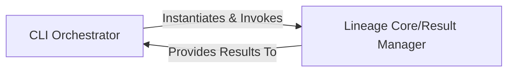

## Details

The CLI Application subsystem operates as a pipeline where the CLI Orchestrator acts as the front-end, receiving user input and directing the flow. It delegates the heavy lifting of lineage computation to the Lineage Core/Result Manager. Once the core analysis is complete, the results are passed back to the CLI Orchestrator for final presentation to the user. This establishes a clear separation of concerns between input/output handling and core business logic.

### CLI Orchestrator
This component serves as the entry point for the command-line interface. It is responsible for parsing command-line arguments (e.g., SQL query, options for column lineage, verbose output), validating inputs, and setting up the environment for lineage analysis. It orchestrates the overall workflow by invoking the core lineage logic. It is fundamental as it handles user interaction and initiates the entire lineage process, acting as the "Command" part of the CQRS pattern for the CLI tool.

**Related Classes/Methods**:

- <a href="https://github.com/reata/sqllineage/blob/master/sqllineage/cli.py" target="_blank" rel="noopener noreferrer">`sqllineage.cli`</a>

### Lineage Core/Result Manager
This component encapsulates the core logic for performing SQL lineage analysis. It manages the lifecycle of lineage data, including intermediate tables, source tables, target tables, and column-level lineage. It also provides methods for formatting and presenting these lineage results, making it central to the "Data Processing Library" aspect of the project. This is the core processing engine, essential for transforming raw SQL into structured lineage information and managing the output.

**Related Classes/Methods**:

- <a href="https://github.com/reata/sqllineage/blob/master/sqllineage/runner.py#L36-L237" target="_blank" rel="noopener noreferrer">`sqllineage.runner.LineageRunner`:36-237</a>

### [FAQ](https://github.com/CodeBoarding/GeneratedOnBoardings/tree/main?tab=readme-ov-file#faq)