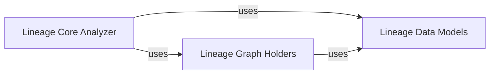

## Details

The sqllineage.core subsystem is designed around three central components: Lineage Core Analyzer, Lineage Graph Holders, and Lineage Data Models. The Lineage Core Analyzer acts as the central processing unit, responsible for parsing SQL and orchestrating the lineage extraction. It interacts with Lineage Graph Holders to manage the in-memory representation of the lineage graph, including adding and manipulating lineage information. Both Lineage Core Analyzer and Lineage Graph Holders rely heavily on Lineage Data Models, which provides the foundational data structures (like Table and Column) that define how lineage information is structured and stored. This clear separation of concerns ensures a robust and maintainable architecture for SQL lineage analysis.

### Lineage Core Analyzer
The primary orchestrator of the lineage extraction process. It consumes parsed SQL, identifies source/target tables and columns, resolves dependencies, and directs the construction of the lineage graph. It embodies the core logic for transforming SQL statements into lineage relationships.

**Related Classes/Methods**:

### Lineage Graph Holders
Manages the in-memory representation and manipulation of the SQL lineage graph. It acts as a repository for all lineage information, including read/write operations, Common Table Expressions (CTEs), drop statements, and column-level lineage. It provides the necessary methods for adding, retrieving, and manipulating the graph data model.

**Related Classes/Methods**:

### Lineage Data Models
Defines the fundamental data structures and entities (e.g., Table, Column, Schema) that represent SQL components within the lineage graph. It provides the canonical blueprint for how lineage information is structured and stored, ensuring consistency across the core engine.

**Related Classes/Methods**:

### [FAQ](https://github.com/CodeBoarding/GeneratedOnBoardings/tree/main?tab=readme-ov-file#faq)