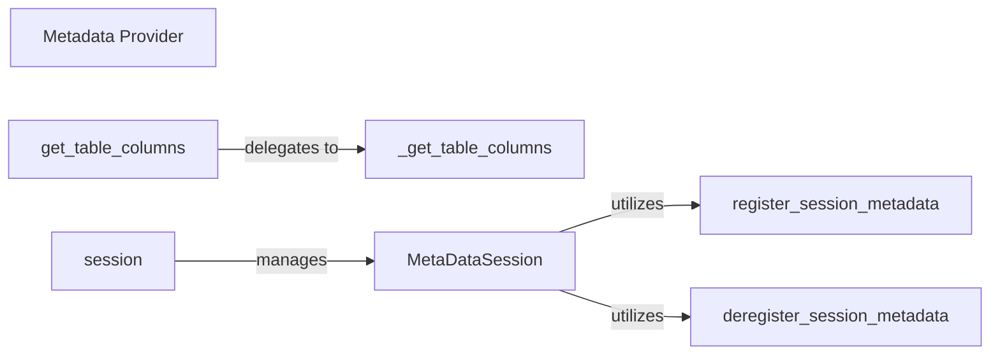

## Details

The Metadata Provider subsystem is a critical part of sqllineage.core, specifically implemented within the sqllineage/core/metadata_provider.py file. It serves as an extensible component responsible for fetching and managing external metadata about tables and columns, which is vital for resolving ambiguous references and expanding wildcards in SQL queries.

### Metadata Provider [[Expand]](./Metadata_Provider.md)
The overarching component providing external metadata about tables and columns, crucial for resolving ambiguous references and expanding wildcards by fetching schema information from external sources. It acts as a key extension point for integrating various metadata backends.

**Related Classes/Methods**:

- <a href="https://github.com/reata/sqllineage/blob/master/sqllineage/core/metadata_provider.py" target="_blank" rel="noopener noreferrer">`sqllineage.core.metadata_provider`</a>

### get_table_columns
This is the public API for the Metadata Provider. It offers a standardized interface for other parts of the system (e.g., the Lineage Analyzer) to retrieve column details for a given table, abstracting the underlying metadata fetching mechanism.

**Related Classes/Methods**:

- <a href="https://github.com/reata/sqllineage/blob/master/sqllineage/core/metadata_provider.py#L27-L40" target="_blank" rel="noopener noreferrer">`sqllineage.core.metadata_provider.get_table_columns`:27-40</a>

### _get_table_columns
An internal helper method that encapsulates the core logic for fetching table columns from external sources. This separation of concerns allows for potential pluggability of different metadata backends, aligning with the Plugin/Extension architectural pattern.

**Related Classes/Methods**:

- <a href="https://github.com/reata/sqllineage/blob/master/sqllineage/core/metadata_provider.py#L42-L44" target="_blank" rel="noopener noreferrer">`sqllineage.core.metadata_provider._get_table_columns`:42-44</a>

### MetaDataSession
Central to managing contextual and temporary metadata. It enables the system to handle session-specific overrides or additions to metadata, which is vital for extensibility and dynamic query analysis, supporting the CQRS pattern by managing query-specific metadata context.

**Related Classes/Methods**:

- <a href="https://github.com/reata/sqllineage/blob/master/sqllineage/core/metadata_provider.py#L64-L81" target="_blank" rel="noopener noreferrer">`sqllineage.core.metadata_provider.MetaDataSession`:64-81</a>

### session
Acts as a context manager or factory for `MetaDataSession` instances. It ensures proper setup and teardown of metadata contexts, providing a clean interface for managing the lifecycle of metadata sessions.

**Related Classes/Methods**:

- <a href="https://github.com/reata/sqllineage/blob/master/sqllineage/core/metadata_provider.py#L54-L55" target="_blank" rel="noopener noreferrer">`sqllineage.core.metadata_provider.session`:54-55</a>

### register_session_metadata
Responsible for adding or overriding session-specific metadata onto a stack. This mechanism enables dynamic and contextual metadata management, allowing the system to adapt to different query environments or user-defined schemas.

**Related Classes/Methods**:

- <a href="https://github.com/reata/sqllineage/blob/master/sqllineage/core/metadata_provider.py#L80-L81" target="_blank" rel="noopener noreferrer">`sqllineage.core.metadata_provider.register_session_metadata`:80-81</a>

### deregister_session_metadata
Handles the removal of session-specific metadata from the stack. This is typically used for cleanup when a session concludes, ensuring that temporary metadata does not persist beyond its scope.

**Related Classes/Methods**:

- <a href="https://github.com/reata/sqllineage/blob/master/sqllineage/core/metadata_provider.py#L50-L52" target="_blank" rel="noopener noreferrer">`sqllineage.core.metadata_provider.deregister_session_metadata`:50-52</a>

### [FAQ](https://github.com/CodeBoarding/GeneratedOnBoardings/tree/main?tab=readme-ov-file#faq)