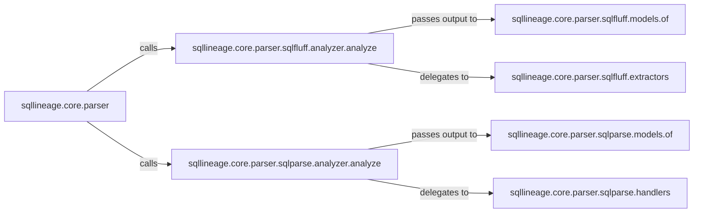

## Details

The `SQL Parser` subsystem is primarily encapsulated within the `sqllineage.core.parser` package. This package serves as the entry entry point and abstraction layer for all SQL parsing functionalities, adhering to the "Plugin/Extension" architectural pattern by allowing different parser backends to be integrated.

### sqllineage.core.parser
The core abstraction and entry point for SQL parsing. It defines the contract for parsing and acts as a dispatcher, selecting and delegating to specific parser implementations (e.g., `sqlfluff` or `sqlparse`) based on configuration or SQL dialect. This aligns with the "Plugin/Extension" pattern, allowing for interchangeable parser backends.

**Related Classes/Methods**:

- <a href="https://github.com/reata/sqllineage/blob/master/sqllineage/core/parser" target="_blank" rel="noopener noreferrer">`sqllineage.core.parser`</a>

### sqllineage.core.parser.sqlfluff.analyzer.analyze
The primary orchestrator for analyzing SQL queries using the `sqlfluff` library. It initiates the `sqlfluff`-specific parsing process and coordinates subsequent steps for lineage extraction.

**Related Classes/Methods**:

- <a href="https://github.com/reata/sqllineage/blob/master/sqllineage/core/parser/sqlfluff/analyzer.py#L47-L78" target="_blank" rel="noopener noreferrer">`sqllineage.core.parser.sqlfluff.analyzer.analyze`:47-78</a>

### sqllineage.core.parser.sqlfluff.models.of
Responsible for transforming the raw parsed segments from `sqlfluff` into structured lineage model objects. This component extracts key information like columns and aliases from the `sqlfluff` parse tree.

**Related Classes/Methods**:

- <a href="https://github.com/reata/sqllineage/blob/master/sqllineage/core/parser/sqlfluff/models.py#L98-L145" target="_blank" rel="noopener noreferrer">`sqllineage.core.parser.sqlfluff.models.of`:98-145</a>

### sqllineage.core.parser.sqlfluff.extractors
Handles the extraction of lineage information from specific types of SQL statements (e.g., `CREATE`, `INSERT`, `SELECT`) within the `sqlfluff` context. It applies rules to identify source and target entities.

**Related Classes/Methods**:

- <a href="https://github.com/reata/sqllineage/blob/master/sqllineage/core/parser/sqlfluff/extractors" target="_blank" rel="noopener noreferrer">`sqllineage.core.parser.sqlfluff.extractors`</a>

### sqllineage.core.parser.sqlparse.analyzer.analyze
The primary orchestrator for analyzing SQL queries using the `sqlparse` library. Similar to its `sqlfluff` counterpart, it initiates the `sqlparse`-specific parsing and dispatches to handlers.

**Related Classes/Methods**:

- <a href="https://github.com/reata/sqllineage/blob/master/sqllineage/core/parser/sqlparse/analyzer.py#L43-L71" target="_blank" rel="noopener noreferrer">`sqllineage.core.parser.sqlparse.analyzer.analyze`:43-71</a>

### sqllineage.core.parser.sqlparse.models.of
Transforms `sqlparse` tokens into structured lineage model objects, specifically focusing on extracting source column information.

**Related Classes/Methods**:

- <a href="https://github.com/reata/sqllineage/blob/master/sqllineage/core/parser/sqlparse/models.py#L61-L92" target="_blank" rel="noopener noreferrer">`sqllineage.core.parser.sqlparse.models.of`:61-92</a>

### sqllineage.core.parser.sqlparse.handlers
Manages the processing of source-related SQL constructs, identifying and processing columns and tables within the `sqlparse` context. These handlers are specialized for different SQL statement types.

**Related Classes/Methods**:

- <a href="https://github.com/reata/sqllineage/blob/master/sqllineage/core/parser/sqlparse/handlers" target="_blank" rel="noopener noreferrer">`sqllineage.core.parser.sqlparse.handlers`</a>

### [FAQ](https://github.com/CodeBoarding/GeneratedOnBoardings/tree/main?tab=readme-ov-file#faq)