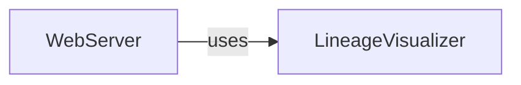

## Details

Initial analysis of sqllineagejs components and their relations with placeholder code references.

### WebServer
Web server entry point and request handling.

**Related Classes/Methods**:

### LineageVisualizer
Component responsible for visualizing SQL lineage.

**Related Classes/Methods**:

### [FAQ](https://github.com/CodeBoarding/GeneratedOnBoardings/tree/main?tab=readme-ov-file#faq)